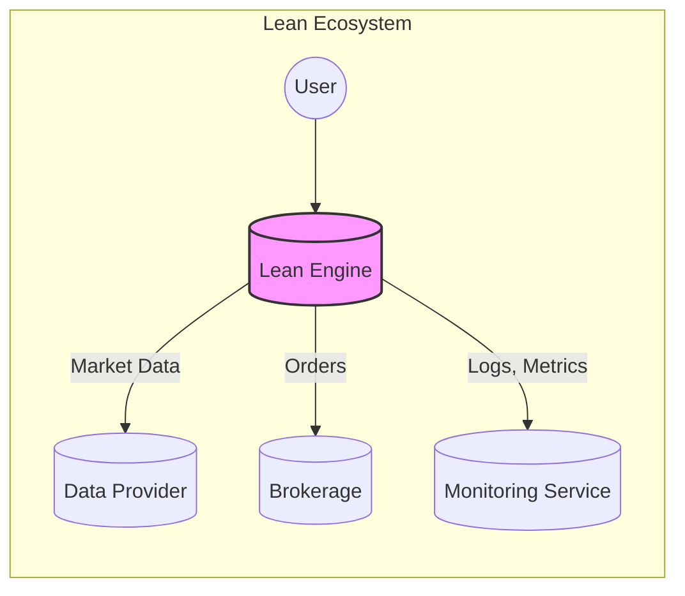
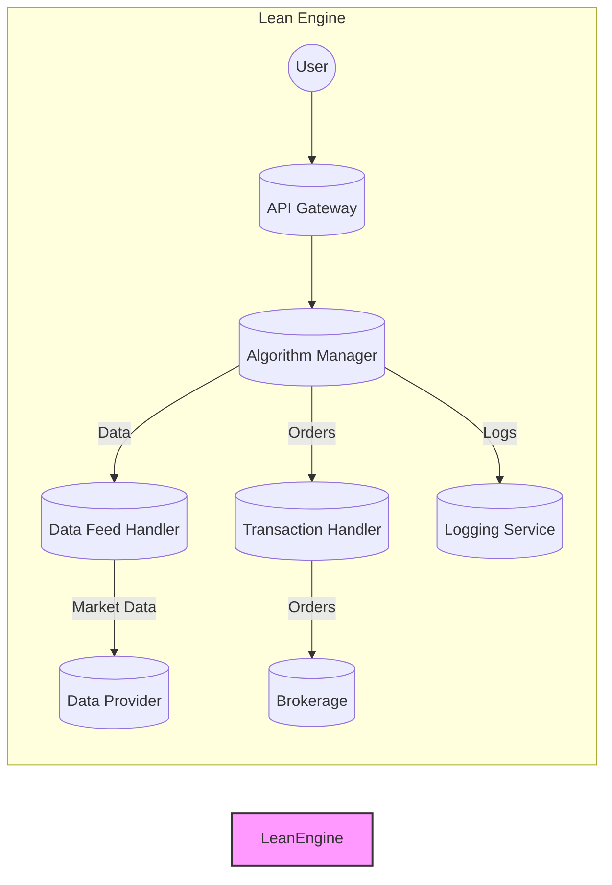
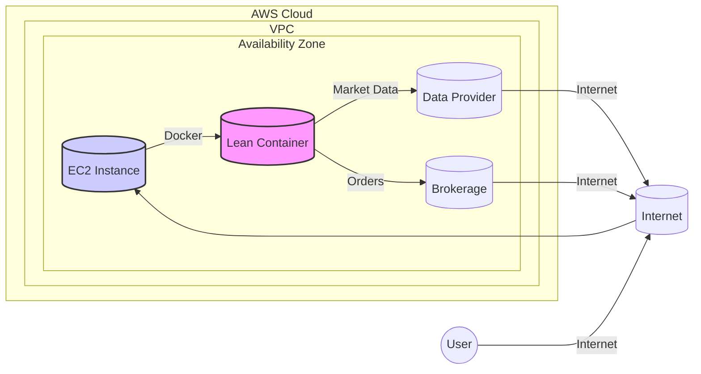
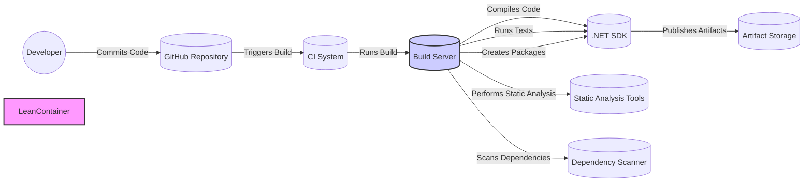

Okay, let's create a design document for the QuantConnect Lean project.

# BUSINESS POSTURE

QuantConnect Lean is an open-source algorithmic trading engine.  The primary business goal is to provide a robust, reliable, and flexible platform for quantitative analysts (quants) and developers to research, backtest, and deploy algorithmic trading strategies.  The platform supports multiple asset classes, markets, and data providers.  Success is measured by community adoption, contribution, and the successful deployment of profitable trading strategies by its users.  Given its open-source nature and focus on financial markets, several key business risks emerge:

*   Data Integrity and Confidentiality:  Incorrect or manipulated market data could lead to significant financial losses for users.  Leakage of proprietary trading strategies or user data would severely damage trust and reputation.
*   System Reliability and Availability:  The engine must be highly reliable and available, especially during live trading.  Downtime or errors during market hours can have direct financial consequences.
*   Regulatory Compliance:  Depending on how users deploy Lean, they may be subject to various financial regulations.  The platform itself needs to be designed in a way that facilitates compliance, though ultimate responsibility rests with the user.
*   Malicious Use:  The platform could be used for illegal activities like market manipulation or insider trading. While Lean itself is a tool, QuantConnect needs to consider its potential for misuse.
*   Open Source Security:  Vulnerabilities in the codebase, particularly those introduced by third-party dependencies, could be exploited to compromise user strategies or data.
*   Operational Risk: Reliance on third-party data providers and brokerage APIs introduces dependencies that could impact the platform's functionality.

# SECURITY POSTURE

The following security controls and accepted risks are based on the provided GitHub repository and general knowledge of similar platforms.

*   security control: Input Validation: The project appears to have input validation for user-provided parameters, particularly in areas dealing with data feeds and order processing. This is evident in various parts of the codebase where data is ingested and processed.
*   security control: Data Sanitization: Data from external sources (e.g., data providers) is likely sanitized to prevent injection attacks or data corruption. This is a standard practice in financial applications.
*   security control: Modular Design: The architecture is modular, promoting separation of concerns and reducing the impact of vulnerabilities in specific components. This is visible in the project's directory structure and class organization.
*   security control: Extensive Testing: The project includes a comprehensive suite of unit and integration tests, which helps to identify and prevent regressions and security flaws. The presence of a dedicated testing framework and numerous test cases indicates this.
*   security control: Community Review: As an open-source project, Lean benefits from community scrutiny, which can help identify and address security vulnerabilities. The public nature of the GitHub repository and the active community contribute to this.
*   security control: API Security: Interactions with external brokerage APIs likely involve authentication and authorization mechanisms, such as API keys and OAuth. This is implied by the need to connect to live trading environments.
*   security control: Logging and Monitoring: The system includes logging capabilities to track events and potentially detect anomalies. This is evident from logging statements within the code.
*   accepted risk: User-Managed Security: The ultimate responsibility for the security of deployed trading strategies and the protection of API keys rests with the user. This is inherent in the nature of the platform, which provides tools but doesn't manage user deployments.
*   accepted risk: Third-Party Dependency Risk: Lean relies on numerous third-party libraries. While this is common practice, it introduces the risk of vulnerabilities in these dependencies.
*   accepted risk: Limited Direct Control over Execution Environment: Users can deploy Lean in various environments (local machines, cloud servers), which limits QuantConnect's direct control over the security of these environments.
*   accepted risk: No Formal Security Audits (Assumed): Based on the publicly available information, it's unclear if regular, formal security audits are conducted. This is a common accepted risk for open-source projects without dedicated funding for security.

Recommended Security Controls (High Priority):

*   Implement a robust dependency management process, including regular scanning for known vulnerabilities and timely updates.
*   Develop and publish a clear security policy, including guidelines for users on securely deploying and managing their strategies.
*   Consider establishing a bug bounty program to incentivize security researchers to identify and report vulnerabilities.
*   Implement more comprehensive input validation and sanitization, particularly for user-defined strategies and custom data feeds.
*   Enhance logging and monitoring to include security-relevant events, such as failed login attempts and unusual API usage.

Security Requirements:

*   Authentication:
    *   User authentication is primarily handled through brokerage APIs. Lean itself does not manage user accounts directly, but it needs to securely handle API keys and other credentials.
    *   Strong password policies and multi-factor authentication should be encouraged (though ultimately controlled by the brokerage).
*   Authorization:
    *   Access control is crucial to prevent unauthorized access to user data, strategies, and trading accounts.
    *   Lean needs to ensure that users can only access and modify their own resources.
    *   Role-based access control (RBAC) might be relevant for teams collaborating on strategies.
*   Input Validation:
    *   All user-provided inputs, including strategy parameters, data feed configurations, and order details, must be rigorously validated to prevent injection attacks and other vulnerabilities.
    *   Validation should include type checking, range checking, and format validation.
*   Cryptography:
    *   Secure communication with brokerage APIs and data providers should use TLS/SSL.
    *   Sensitive data, such as API keys, should be stored securely, potentially using encryption at rest.
    *   Cryptographic libraries should be kept up-to-date and used according to best practices.
*   Data Handling
    *   Data received from external sources should be treated as untrusted until validated and sanitized.
    *   Data integrity checks should be implemented to detect and prevent data corruption.

# DESIGN

## C4 CONTEXT

C4 Context Element Descriptions:

*   Element:
    *   Name: User
    *   Type: Person
    *   Description: A quantitative analyst or developer who uses Lean to research, backtest, and deploy algorithmic trading strategies.
    *   Responsibilities: Develops trading algorithms, configures Lean, manages API keys, monitors performance, and makes trading decisions.
    *   Security controls: Strong passwords, multi-factor authentication (managed by brokerage), secure handling of API keys.

*   Element:
    *   Name: Lean Engine
    *   Type: Software System
    *   Description: The core algorithmic trading engine that processes market data, executes trading strategies, and interacts with brokerages.
    *   Responsibilities: Executes trading algorithms, manages orders, handles market data, provides backtesting capabilities, and generates reports.
    *   Security controls: Input validation, data sanitization, modular design, extensive testing, community review, API security, logging and monitoring.

*   Element:
    *   Name: Data Provider
    *   Type: Software System
    *   Description: An external service that provides market data (e.g., prices, volumes, news) to Lean.
    *   Responsibilities: Provides real-time and historical market data.
    *   Security controls: Secure communication (TLS/SSL), data integrity checks.

*   Element:
    *   Name: Brokerage
    *   Type: Software System
    *   Description: An external service that executes trades on behalf of the user.
    *   Responsibilities: Executes orders, manages accounts, provides account balances and positions.
    *   Security controls: Secure communication (TLS/SSL), authentication and authorization (API keys, OAuth), fraud detection.

*   Element:
    *   Name: Monitoring Service
    *   Type: Software System
    *   Description: A system for collecting and visualizing logs, metrics, and performance data from Lean.
    *   Responsibilities: Collects logs and metrics, provides dashboards and alerts.
    *   Security controls: Secure communication, access control.

## C4 CONTAINER

C4 Container Element Descriptions:

*   Element:
    *   Name: API Gateway
    *   Type: API
    *   Description: Entry point for user interaction with the Lean Engine, potentially for remote control or configuration.
    *   Responsibilities: Handles API requests, authenticates users (likely via API keys), routes requests to the appropriate components.
    *   Security controls: Authentication, authorization, rate limiting, input validation.

*   Element:
    *   Name: Algorithm Manager
    *   Type: Container (e.g., .NET Core Application)
    *   Description: The core component that manages the execution of trading algorithms.
    *   Responsibilities: Loads and executes algorithms, manages algorithm state, provides access to data and transaction handlers.
    *   Security controls: Input validation, sandboxing (potentially), resource limits.

*   Element:
    *   Name: Data Feed Handler
    *   Type: Container (e.g., .NET Core Application)
    *   Description: Handles the ingestion and processing of market data from various data providers.
    *   Responsibilities: Connects to data providers, retrieves data, normalizes data, provides data to algorithms.
    *   Security controls: Input validation, data sanitization, secure communication (TLS/SSL).

*   Element:
    *   Name: Transaction Handler
    *   Type: Container (e.g., .NET Core Application)
    *   Description: Manages the interaction with brokerages for order placement and execution.
    *   Responsibilities: Connects to brokerages, places orders, monitors order status, handles order events.
    *   Security controls: Secure communication (TLS/SSL), authentication and authorization (API keys, OAuth), transaction logging.

*   Element:
    *   Name: Logging Service
    *   Type: Container (e.g., .NET Core Application)
    *   Description: Provides logging capabilities for the entire system.
    *   Responsibilities: Collects logs, stores logs, provides access to logs.
    *   Security controls: Secure storage, access control.

*   Element:
    *   Name: Data Provider
    *   Type: External System
    *   Description: An external service that provides market data.
    *   Responsibilities: Provides real-time and historical market data.
    *   Security controls: Secure communication (TLS/SSL), data integrity checks.

*   Element:
    *   Name: Brokerage
    *   Type: External System
    *   Description: An external service that executes trades.
    *   Responsibilities: Executes orders, manages accounts.
    *   Security controls: Secure communication (TLS/SSL), authentication and authorization, fraud detection.

## DEPLOYMENT

Lean is highly flexible and can be deployed in various environments. Here are some possible deployment solutions:

1.  Local Machine: For research and backtesting, users often run Lean directly on their local machines.
2.  Cloud Server (e.g., AWS EC2, Azure VM): For live trading or more resource-intensive backtesting, users can deploy Lean on a cloud server.
3.  Containerized (e.g., Docker): Lean can be containerized using Docker, making it easier to deploy and manage across different environments.
4.  Cloud Platforms (e.g., QuantConnect Cloud): QuantConnect offers a cloud-based platform for running Lean, which simplifies deployment and management.

Chosen Deployment Solution: Cloud Server (AWS EC2) with Docker

Deployment Element Descriptions:

*   Element:
    *   Name: User
    *   Type: Person
    *   Description: The user who deploys and manages the Lean instance.
    *   Responsibilities: Configures the EC2 instance, deploys the Docker container, manages API keys, monitors performance.
    *   Security controls: Strong passwords, multi-factor authentication (for AWS access), secure handling of API keys.

*   Element:
    *   Name: AWS Cloud
    *   Type: Cloud Provider
    *   Description: The Amazon Web Services cloud environment.
    *   Responsibilities: Provides infrastructure for hosting the Lean instance.
    *   Security controls: AWS security best practices, IAM roles and permissions, VPC security groups.

*   Element:
    *   Name: VPC
    *   Type: Virtual Network
    *   Description: A virtual private cloud within AWS.
    *   Responsibilities: Provides network isolation for the Lean instance.
    *   Security controls: Network ACLs, security groups.

*   Element:
    *   Name: Availability Zone
    *   Type: Data Center
    *   Description: A physically isolated data center within an AWS region.
    *   Responsibilities: Provides high availability and fault tolerance.
    *   Security controls: Physical security, redundancy.

*   Element:
    *   Name: EC2 Instance
    *   Type: Virtual Machine
    *   Description: A virtual machine running on AWS EC2.
    *   Responsibilities: Hosts the Docker container running Lean.
    *   Security controls: Operating system security hardening, SSH key management, firewall configuration.

*   Element:
    *   Name: Lean Container
    *   Type: Docker Container
    *   Description: A Docker container running the Lean engine.
    *   Responsibilities: Executes trading algorithms, manages orders, handles market data.
    *   Security controls: Container security best practices, minimal base image, regular updates.

*   Element:
    *   Name: Data Provider
    *   Type: External System
    *   Description: An external service that provides market data.
    *   Responsibilities: Provides real-time and historical market data.
    *   Security controls: Secure communication (TLS/SSL), data integrity checks.

*   Element:
    *   Name: Brokerage
    *   Type: External System
    *   Description: An external service that executes trades.
    *   Responsibilities: Executes orders, manages accounts.
    *   Security controls: Secure communication (TLS/SSL), authentication and authorization, fraud detection.
* Element:
    *   Name: Internet
    *   Type: Network
    *   Description: Public network.
    *   Responsibilities: Connect user, data providers and brokerage with EC2 instance.
    *   Security controls: -

## BUILD

Lean uses a combination of .NET build tools and potentially scripting for packaging and deployment.  A typical build process would involve:

1.  Developer:  Writes code and commits changes to the GitHub repository.
2.  Continuous Integration (CI) System (e.g., GitHub Actions, Travis CI, AppVeyor):  The CI system detects changes and triggers a build.
3.  Build Server:  The CI system uses a build server (potentially a virtual machine or container) to execute the build steps.
4.  .NET Build Tools:  The build server uses the .NET SDK (e.g., `dotnet build`, `dotnet test`, `dotnet pack`) to compile the code, run tests, and create NuGet packages.
5.  Static Analysis:  Static analysis tools (e.g., linters, code analyzers) are run to identify potential code quality and security issues.  Examples include Roslyn Analyzers, SonarQube.
6.  Dependency Scanning:  Tools like `dotnet list package --vulnerable` or OWASP Dependency-Check are used to scan for known vulnerabilities in third-party dependencies.
7.  Artifact Storage:  The resulting NuGet packages (and potentially other artifacts like Docker images) are stored in a repository (e.g., NuGet.org, a private NuGet feed, a container registry).

Security Controls in Build Process:

*   security control: Code Review:  Pull requests are reviewed by other developers before being merged into the main branch.
*   security control: Static Analysis:  Automated tools scan the code for potential vulnerabilities and code quality issues.
*   security control: Dependency Scanning:  Automated tools scan for known vulnerabilities in third-party dependencies.
*   security control: Automated Testing:  Unit and integration tests are run automatically as part of the build process.
*   security control: Build Automation: The entire build process is automated, reducing the risk of manual errors and ensuring consistency.
*   security control: Least Privilege: Build servers should run with the minimum necessary privileges.

# RISK ASSESSMENT

*   Critical Business Processes:
    *   Backtesting:  Accurate and reliable backtesting is crucial for users to evaluate the performance of their strategies.
    *   Live Trading:  Real-time execution of trading strategies with minimal latency and high reliability.
    *   Data Acquisition:  Obtaining accurate and timely market data from various providers.
    *   Strategy Development: Providing a flexible and powerful environment for developing and testing trading algorithms.

*   Data Sensitivity:
    *   Market Data (Low to Medium Sensitivity):  Publicly available market data is generally low sensitivity, but high-frequency data or data from specialized providers could be considered medium sensitivity.
    *   User Account Data (High Sensitivity):  Account balances, positions, and trading history are highly sensitive and must be protected from unauthorized access.
    *   API Keys (High Sensitivity):  API keys used to access brokerage accounts and data providers are extremely sensitive and must be protected with the utmost care.
    *   Trading Strategies (Variable Sensitivity):  The sensitivity of trading strategies depends on their proprietary nature and potential profitability.  Some strategies may be highly confidential, while others may be publicly shared.

# QUESTIONS & ASSUMPTIONS

*   Questions:
    *   Are there any specific compliance requirements (e.g., SEC, FINRA) that Lean users are typically subject to?
    *   What is the current process for handling security vulnerabilities reported by the community or discovered internally?
    *   Are there any plans to conduct formal security audits or penetration testing?
    *   What level of support is provided to users for security-related issues?
    *   What are the specific data retention policies for user data and logs?
    *   How are database connection strings and other secrets managed within the Lean codebase and during deployment?
    *   What mechanisms are in place to prevent or detect algorithmic manipulation of the market?

*   Assumptions:
    *   Users are responsible for securing their own deployment environments.
    *   Users are responsible for managing their own API keys and other credentials.
    *   The primary threat actors are external attackers attempting to exploit vulnerabilities for financial gain or to steal proprietary trading strategies.
    *   QuantConnect has internal processes for managing security incidents, even if they are not publicly documented.
    *   The project follows secure coding practices, even if they are not explicitly documented in a formal security policy.
    *   There is no intentionally malicious code within the Lean codebase.
    *   Regular updates are performed to address security vulnerabilities in the .NET framework and other core dependencies.
    *   Database interactions are handled securely, preventing SQL injection vulnerabilities.
    *   The project uses appropriate logging levels to capture security-relevant events without exposing sensitive data.