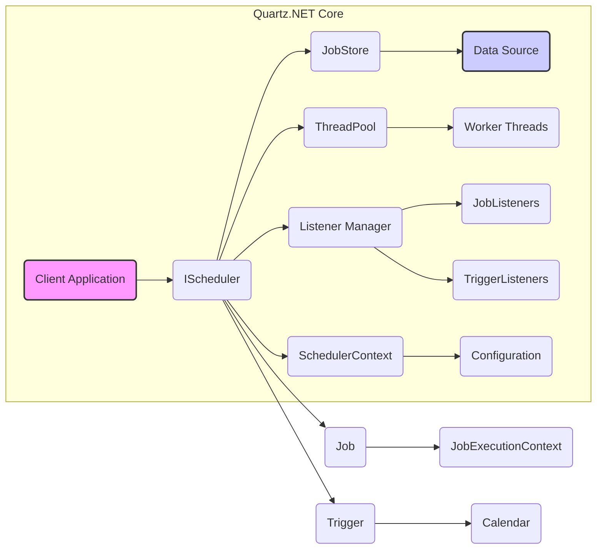

# Project Design Document: Quartz.NET

**Version:** 1.1
**Date:** October 26, 2023
**Author:** AI Software Architect

## 1. Introduction

This document provides a detailed design overview of the Quartz.NET project, an open-source job scheduling library for .NET applications. This document aims to clearly articulate the architecture, components, and interactions within Quartz.NET to facilitate effective threat modeling. Understanding the system's design is crucial for identifying potential vulnerabilities and attack vectors.

## 2. Goals and Objectives

The primary goal of Quartz.NET is to provide a robust and flexible mechanism for scheduling and executing jobs within .NET applications. Key objectives include:

*   Reliable job execution at specified times or intervals.
*   Persistence of scheduling information across application restarts and failures.
*   Support for a variety of trigger types (e.g., simple, cron, calendar-based).
*   Extensibility through listeners, plugins, and custom job and trigger implementations.
*   Integration with different data storage mechanisms for persistence.
*   Efficient thread management for concurrent and parallel job execution.

## 3. High-Level Architecture

Quartz.NET employs a central scheduler coordinating various components to manage job execution.

*   **Client Application:** The external application or system that integrates and utilizes the Quartz.NET library to define, schedule, and manage jobs.
*   **IScheduler:** The central interface and orchestrator of the scheduling process. It provides methods for scheduling jobs, managing triggers, and controlling the scheduler's lifecycle.
*   **Job:** Represents the unit of work to be executed. It implements the `IJob` interface, requiring an `Execute` method containing the job's logic.
*   **Trigger:** Defines the schedule or conditions under which a specific job should be executed. Different trigger types offer various scheduling options.
*   **JobStore:** Responsible for the persistent storage and retrieval of scheduling data, including jobs, triggers, and calendars. Supports different implementations for various persistence needs.
*   **ThreadPool:** Manages a pool of threads used for the concurrent execution of jobs. This allows multiple jobs to run in parallel.
*   **Listener Manager:** Manages the registration and notification of listeners that are interested in specific scheduler events.
*   **JobListeners:** Implement the `IJobListener` interface and are notified of events related to the lifecycle of job execution (e.g., before execution, after execution, job vetoed).
*   **TriggerListeners:** Implement the `ITriggerListener` interface and are notified of events related to the lifecycle of trigger firing (e.g., trigger firing, misfired, completed).
*   **SchedulerContext:** A context object associated with the scheduler instance, allowing for the sharing of data and resources across different components.
*   **Configuration:**  Settings used to configure the behavior of the scheduler, including thread pool size, job store type, data source connection details, and plugin configurations.
*   **Data Source:** The underlying data storage mechanism used by persistent `JobStore` implementations like `AdoJobStore` (e.g., relational database systems).
*   **Worker Threads:** The actual threads from the `ThreadPool` that execute the `Job.Execute()` method when a trigger fires.
*   **JobExecutionContext:** Provides runtime context information to the `Job` instance during its execution, including trigger details, job data, and scheduler context.
*   **Calendar:** Defines sets of time intervals that exclude certain times from being valid firing times for triggers.

## 4. Detailed Design

### 4.1. Core Components

*   **Scheduler:**
    *   **Responsibilities:**  The core orchestrator responsible for managing the lifecycle of jobs and triggers. It interacts with the `JobStore` to persist and retrieve scheduling information and utilizes the `ThreadPool` to execute jobs.
    *   **Key Interfaces/Classes:** `IScheduler`, `StdSchedulerFactory` (for creating scheduler instances), `QuartzScheduler`.
    *   **Interaction Points:** Interacts with the `Client Application` for scheduling and management operations, the `JobStore` for persistence, the `ThreadPool` for job execution, and the `Listener Manager` for event notifications.

*   **Job:**
    *   **Responsibilities:**  Encapsulates the specific task or business logic to be executed by the scheduler.
    *   **Key Interfaces/Classes:** `IJob`, concrete implementations of `IJob` containing the application-specific logic.
    *   **Interaction Points:** Executed by a `Worker Thread` obtained from the `ThreadPool`. Receives runtime information and context through the `JobExecutionContext`.

*   **Trigger:**
    *   **Responsibilities:** Defines the schedule or conditions that determine when a job should be executed.
    *   **Key Interfaces/Classes:** `ITrigger`, and concrete implementations like `SimpleTrigger`, `CronTrigger`, `CalendarIntervalTrigger`, `DailyTimeIntervalTrigger`.
    *   **Interaction Points:** Evaluated by the `Scheduler` to determine the next fire time for an associated job. Stored and retrieved by the `JobStore`.

*   **JobStore:**
    *   **Responsibilities:**  Provides the mechanism for persisting scheduling data, ensuring that jobs and triggers are not lost if the scheduler or application restarts.
    *   **Key Interfaces/Classes:** `IJobStore`, with concrete implementations like `RAMJobStore` (in-memory, non-persistent) and `AdoJobStore` (database-backed persistence).
    *   **Interaction Points:**  Used extensively by the `Scheduler` to store, retrieve, update, and delete jobs, triggers, and calendars. `AdoJobStore` interacts with a configured `Data Source`.

*   **ThreadPool:**
    *   **Responsibilities:** Manages a pool of threads that are used to execute jobs concurrently, improving performance and responsiveness.
    *   **Key Interfaces/Classes:** `IThreadPool`, with implementations like `SimpleThreadPool`.
    *   **Interaction Points:**  The `Scheduler` obtains available `Worker Threads` from the `ThreadPool` to execute jobs when their triggers fire.

*   **Listener Manager:**
    *   **Responsibilities:**  Manages the registration and notification of `JobListeners` and `TriggerListeners`, allowing external components to react to scheduling events.
    *   **Key Interfaces/Classes:** `ListenerManagerImpl`.
    *   **Interaction Points:**  The `Scheduler` informs the `Listener Manager` about relevant events (e.g., job about to run, trigger fired), and the `Listener Manager` then notifies the registered listeners.

*   **Listeners:**
    *   **Responsibilities:**  Provide a hook for external code to be executed in response to specific scheduling events.
    *   **Key Interfaces/Classes:** `IJobListener`, `ITriggerListener`, and custom implementations of these interfaces.
    *   **Interaction Points:** Receive event notifications from the `Listener Manager`. Can interact with other parts of the application or external systems based on these events.

### 4.2. Data Flow

1. The **Client Application** interacts with the `IScheduler` to schedule a new `Job`, associating it with a specific `Trigger` and optional `JobDataMap`.
2. The `IScheduler` persists the `Job` and `Trigger` details, along with any associated `Calendar` information, in the **JobStore**.
3. The `IScheduler` continuously monitors the configured `Trigger`s and their next fire times.
4. When a `Trigger`'s scheduled fire time is reached, the `IScheduler` retrieves the corresponding `Job` details from the **JobStore**.
5. The `IScheduler` requests an available `Worker Thread` from the **ThreadPool**.
6. A `Worker Thread` is assigned and executes the `Job`'s `Execute` method, passing in a **JobExecutionContext** which contains relevant runtime information.
7. During execution, the `Job` might access data from the `JobDataMap` within the `JobExecutionContext` or interact with external systems and resources.
8. The `Scheduler` notifies registered **JobListeners** and **TriggerListeners** at various stages of the job execution lifecycle (e.g., before job execution, after job execution, trigger fired).
9. The **JobStore** is updated with the `Trigger`'s next scheduled fire time (if the trigger is recurring).

### 4.3. Configuration

Quartz.NET can be configured either programmatically or declaratively using a configuration file (typically `quartz.config`). Configuration options include:

*   **Scheduler Instance Properties:**  A unique name for the scheduler instance, whether it's a remote or local instance.
*   **Thread Pool Configuration:**  The number of threads in the pool, thread priority settings.
*   **JobStore Configuration:**  The type of job store to use (`RAMJobStore` or `AdoJobStore`), and specific settings for the chosen store (e.g., data source name, table prefix for `AdoJobStore`).
*   **Data Source Configuration:**  Connection string and provider information for database connections used by `AdoJobStore`.
*   **Plugin Configuration:**  Settings for optional plugins that extend Quartz.NET functionality.
*   **Listener Registration:**  Declarative registration of custom `JobListeners` and `TriggerListeners`.
*   **Scheduler Context Properties:**  Key-value pairs that can be accessed within jobs.

## 5. Security Considerations

This section outlines potential security considerations relevant for threat modeling and secure deployment of applications using Quartz.NET.

*   **Data Storage Security (JobStore):**
    *   When using `AdoJobStore`, the security of the underlying database is paramount. This includes implementing strong authentication and authorization for database access, encrypting sensitive data stored in the database (e.g., job data, connection strings if stored), and protecting against SQL injection vulnerabilities in any custom queries or configurations.
    *   Even with `RAMJobStore`, if the application's memory space is compromised, scheduling data, including potentially sensitive job details, could be exposed. Consider the overall security of the environment where the application is running.
*   **Authentication and Authorization for Job Management:**
    *   Quartz.NET itself does not provide built-in authentication or authorization mechanisms for managing jobs and triggers. The application integrating Quartz.NET is responsible for implementing these controls to ensure only authorized users or systems can schedule, modify, or delete jobs.
    *   Consider the risk of unauthorized job scheduling or modification leading to unintended actions or denial of service.
*   **Job Data Security:**
    *   The `JobDataMap` associated with jobs can contain sensitive information required for job execution (e.g., API keys, credentials). Ensure this data is handled securely, potentially encrypted before being stored in the `JobStore`, and accessed securely within the job execution context.
*   **Communication Security (Remote Scheduling - if implemented):**
    *   If remote management or scheduling of Quartz.NET is implemented (e.g., through custom remoting or web service interfaces), secure communication protocols like HTTPS with proper authentication and authorization are crucial to prevent unauthorized access and data breaches.
*   **Denial of Service (DoS) Attacks:**
    *   Malicious actors could attempt to overload the scheduler by scheduling a large number of resource-intensive jobs, potentially leading to performance degradation or service disruption. Implement mechanisms to limit scheduling rates, enforce resource quotas for jobs, and monitor scheduler performance.
*   **Code Injection Vulnerabilities (Job Implementation):**
    *   If job implementations are loaded dynamically based on external input or untrusted sources, there's a risk of code injection. Ensure that job implementations are loaded from trusted sources and that input used to determine which job to execute is properly validated.
*   **Listener Security:**
    *   Ensure that custom `JobListeners` and `TriggerListeners` do not introduce security vulnerabilities. Carefully review the code of these listeners to prevent unintended side effects or exposure of sensitive information when they receive event notifications.
*   **Configuration Security:**
    *   The `quartz.config` file or programmatic configuration settings can contain sensitive information, such as database connection strings. Protect these configuration sources from unauthorized access or modification. Consider using environment variables or secure configuration management tools for sensitive settings.
*   **Logging and Auditing:**
    *   Implement comprehensive logging and auditing of scheduling events, including job scheduling, execution, and failures. This can aid in security monitoring, incident response, and identifying potential malicious activity. Ensure logs are stored securely and access is restricted.

## 6. Deployment Considerations

The deployment architecture of Quartz.NET can significantly impact its security profile. Common deployment scenarios include:

*   **Embedded within an application:** The Quartz.NET scheduler runs within the same process as the application. This simplifies deployment but shares the security context of the application.
*   **As a standalone service:** The Quartz.NET scheduler runs as a separate process, potentially allowing multiple applications to share the same scheduler instance. This requires careful consideration of inter-process communication security and access control to the scheduler service. Using a shared `JobStore` (like `AdoJobStore`) requires securing the database.

## 7. Future Considerations

*   Exploring integration with existing security frameworks for centralized authentication and authorization of job management operations.
*   Enhancing encryption options for sensitive data within the `JobStore`, potentially allowing for pluggable encryption providers.
*   Investigating features for more granular role-based access control for managing jobs and triggers.
*   Consideration of security best practices for handling secrets and credentials within job configurations and data.

This document provides a detailed design overview of Quartz.NET, emphasizing aspects relevant for threat modeling. Understanding the architecture, components, and data flow is crucial for identifying and mitigating potential security vulnerabilities in applications utilizing this library.