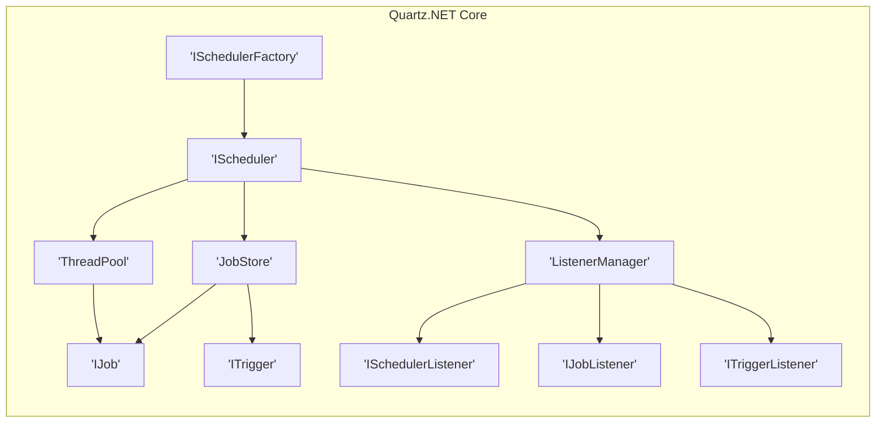
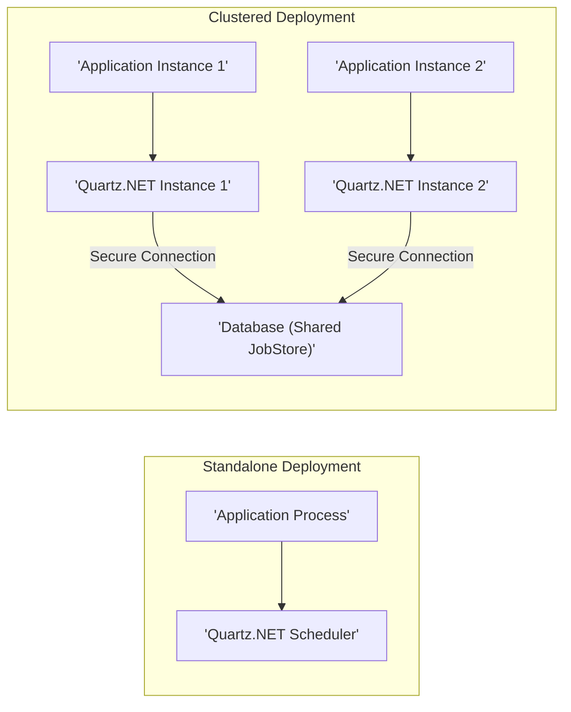

# Project Design Document: Quartz.NET

**Version:** 1.1
**Date:** October 26, 2023
**Prepared By:** AI Software Architecture Expert

## 1. Introduction

This document provides an enhanced design overview of the Quartz.NET scheduling library, focusing on aspects relevant to threat modeling. It details the system's architecture, key components, data flow, deployment considerations, and preliminary security aspects. This document serves as a foundation for identifying potential security vulnerabilities and designing appropriate mitigations.

## 2. Goals and Objectives

The primary goal of Quartz.NET is to offer a reliable and extensible job scheduling framework for .NET applications. Key objectives include:

*   Dependable and persistent scheduling of jobs.
*   Support for diverse trigger mechanisms (e.g., simple intervals, cron expressions, calendar-based triggers).
*   Extensibility through interfaces for custom job, trigger, and listener implementations.
*   Integration with various data persistence options, ranging from in-memory to robust database solutions.
*   Facilitation of clustered deployments for high availability and scalability.
*   Provision of mechanisms for monitoring and managing scheduled jobs.

## 3. System Architecture

Quartz.NET employs a modular design where a central scheduler orchestrates the execution of jobs based on defined triggers.



**Key Architectural Components (Detailed):**

*   **ISchedulerFactory:** The initial point of interaction for client applications to obtain an `IScheduler` instance. Implementations handle the creation and configuration of the scheduler.
*   **IScheduler:** The central orchestrator responsible for managing the lifecycle of jobs and triggers. It interacts with the `JobStore` for persistence, the `ThreadPool` for execution, and the `ListenerManager` for event notifications. It provides methods for scheduling, unscheduling, pausing, and resuming jobs and triggers.
*   **JobStore:**  The component dedicated to persisting job and trigger data, along with scheduler state information. Different implementations cater to various needs:
    *   **RAMJobStore:**  Stores data in memory, suitable for non-persistent or testing scenarios. Data is lost upon application restart.
    *   **AdoJobStore:** Persists data in a relational database using ADO.NET. Supports various database systems and offers durability. Requires careful configuration of database connection and schema.
*   **ThreadPool:** Manages a pool of threads used to execute the `Execute()` method of `IJob` instances. Configuration options include the number of threads and thread priority.
*   **ListenerManager:**  A registry for listeners that are notified of events occurring within the scheduler. This allows for decoupled event handling and monitoring.
*   **IJob:** An interface that must be implemented by classes representing the actual units of work to be performed. The `Execute()` method contains the job's logic. `JobDataMap` can be used to pass data to job instances.
*   **ITrigger:** An interface defining the schedule upon which a job should be executed. Concrete implementations include:
    *   **SimpleTrigger:** For executing a job at a specific time or repeatedly with a fixed interval.
    *   **CronTrigger:** For defining complex, calendar-like schedules using cron expressions.
    *   **CalendarIntervalTrigger:** For firing at specific intervals, optionally considering calendar exclusions.
    *   **DailyTimeIntervalTrigger:** For firing within a daily time range.
*   **ISchedulerListener:** An interface for listeners that receive notifications about scheduler-level events, such as scheduler starting, shutdown, or errors.
*   **IJobListener:** An interface for listeners that are notified of events related to specific job executions, such as before a job executes, after a job executes (with success or exception details), and when a job is vetoed.
*   **ITriggerListener:** An interface for listeners that receive notifications about trigger-related events, such as when a trigger fires, misfires, or completes.

## 4. Key Components and Interactions

This section elaborates on the interactions between core components during the scheduling and execution of a job, highlighting potential security touchpoints.

**4.1. Job and Trigger Definition and Scheduling:**

*   A developer implements the `IJob` interface to define the task logic. The implementation might involve accessing external resources or sensitive data.
*   An `IJobDetail` instance is created, encapsulating the `IJob` implementation, along with properties like `JobDataMap`. The `JobDataMap` might contain sensitive configuration data.
*   An `ITrigger` instance is created, defining the execution schedule. Cron expressions, if used, can become complex and might introduce unexpected behavior if not carefully constructed.
*   The `IScheduler.ScheduleJob()` method is invoked, associating the `IJobDetail` and `ITrigger`. This action persists the job and trigger information in the `JobStore`.

**4.2. Job Scheduling and Execution Flow (Enhanced):**

```mermaid
graph LR
    A["'Client Application'"] --> B{"'Scheduler.ScheduleJob()'"};
    B --> C{"'JobStore.StoreJobAndTrigger()'"};
    C --> D["'Persistence (e.g., Database)'"];
    B --> E{"'Scheduler.Start()'"};
    E --> F{"'JobStore.GetTimeToFireNextTrigger()'"};
    F --> D;
    F --> G{"'SchedulerThread'"};
    G --> H{"'JobStore.AcquireNextTriggers()'"};
    H --> D;
    H --> I{"'ThreadPool.GetThread()'"};
    I --> J{"'JobExecutionContext'"];
    J --> K{"'Job.Execute()'"};
    K --> L{"'JobStore.Triggered()'"};
    L --> D;
    K --> M{"'JobStore.ReleaseAcquiredTrigger()'"};
    M --> D;
    K --> N{"'ListenerManager Notifications'"];
    subgraph "Security Boundaries"
        direction LR
        D
        K
    end
```

**Detailed Flow with Security Considerations:**

1. **Client Application:**  The application interacts with the `IScheduler`. **Security Consideration:** Access control at this level is crucial to prevent unauthorized scheduling of potentially harmful jobs.
2. **Scheduler.ScheduleJob():** The `IScheduler` receives the job and trigger details. **Security Consideration:** Input validation of job and trigger parameters is necessary to prevent injection attacks or unexpected behavior.
3. **JobStore.StoreJobAndTrigger():**  Job and trigger details are persisted. **Security Consideration:** The security of the `JobStore` is paramount. For database-backed stores, proper database security measures (authentication, authorization, encryption) are essential. For `RAMJobStore`, data is vulnerable as it's in memory.
4. **Persistence:** The `JobStore` interacts with the underlying persistence mechanism. **Security Consideration:** Secure connection strings and appropriate permissions for the Quartz.NET application to access the persistence layer are vital.
5. **Scheduler.Start():** The scheduler begins its operational cycle.
6. **JobStore.GetTimeToFireNextTrigger():** The scheduler queries for the next eligible trigger.
7. **SchedulerThread:** A dedicated thread monitors triggers.
8. **JobStore.AcquireNextTriggers():** The scheduler retrieves triggers ready to fire.
9. **ThreadPool.GetThread():** A thread is allocated for job execution.
10. **JobExecutionContext:**  A context object is created, containing details for the job execution. This might include the `JobDataMap`. **Security Consideration:** Sensitive information in the `JobDataMap` should be handled securely and potentially encrypted.
11. **Job.Execute():** The `Execute()` method of the `IJob` is invoked. **Security Consideration:** The security of the `IJob` implementation is critical. It should follow secure coding practices and properly handle any sensitive data or external resource access.
12. **JobStore.Triggered():** The `JobStore` is updated to reflect the trigger firing.
13. **JobStore.ReleaseAcquiredTrigger():** The trigger is released.
14. **ListenerManager Notifications:** Listeners are notified of the job execution status. **Security Consideration:** Information exposed through listeners should be carefully considered to avoid leaking sensitive details.

## 5. Data Flow (Detailed)

Quartz.NET manages several categories of data, each with its own security implications:

*   **Job Definitions (IJobDetail):**  Contains the fully qualified name of the `IJob` implementation class, `JobDataMap`, description, and durability settings. **Security Consideration:** The `JobDataMap` can hold sensitive configuration parameters, API keys, or connection strings. This data requires protection at rest and in transit. Deserialization of `JobDataMap` contents can also introduce vulnerabilities.
*   **Trigger Definitions (ITrigger):**  Includes trigger type, start and end times, cron expressions (if applicable), priority, and associated `JobKey`. **Security Consideration:** Maliciously crafted cron expressions could lead to unexpected job executions or resource exhaustion.
*   **Scheduler State:**  Information about the scheduler's operational status (e.g., running, paused), misfire thresholds, and cluster information (if applicable). **Security Consideration:**  Unauthorized modification of scheduler state could disrupt operations.
*   **Fired Triggers:** Records of past trigger executions, including fire times, scheduled fire times, and execution status. This data can be used for auditing and monitoring. **Security Consideration:** Access to this data should be controlled to prevent unauthorized access to historical job execution information.
*   **Calendar Information (ICalendar):** Definitions of time periods to exclude or include in scheduling. **Security Consideration:** Improperly configured calendars could lead to jobs not running as expected, potentially impacting business processes.

Data primarily flows between the `IScheduler` and the `JobStore`. For database-backed `JobStore` implementations, data flows between the application server and the database server.

## 6. Deployment Architecture (with Security Implications)

Quartz.NET can be deployed in various ways, each presenting different security challenges:

*   **Standalone within an Application:** The Quartz.NET library is integrated directly into an application process. **Security Implications:**  Security relies heavily on the security of the application process itself. If the application is compromised, the scheduler and its data are also at risk. Careful consideration should be given to the permissions under which the application process runs.
*   **Clustered Environment:** Multiple instances of Quartz.NET operate in a coordinated manner, typically relying on a shared database `JobStore`. **Security Implications:**  The shared database becomes a critical security point. All instances must have secure access to the database. Network communication between cluster members should also be secured. Synchronization mechanisms need to be robust to prevent race conditions or data corruption.
*   **As a Separate Service:** Quartz.NET could potentially be hosted as a dedicated service, with other applications interacting with it remotely. **Security Implications:** This introduces the need for secure communication channels (e.g., TLS/SSL) and authentication/authorization mechanisms to control access to the scheduling service. API security becomes a primary concern.



## 7. Security Considerations (Detailed)

This section expands on potential security vulnerabilities and threats.

*   **Data at Rest:**
    *   **Threat:** Unauthorized access to the `JobStore` could expose sensitive job definitions, trigger configurations, and potentially sensitive data within `JobDataMap`.
    *   **Mitigation:**  Encrypt sensitive data within the `JobDataMap`. For database-backed stores, use database encryption features (Transparent Data Encryption, etc.) and ensure proper access controls are in place. Secure file system permissions for file-based `JobStore` implementations.
*   **Data in Transit:**
    *   **Threat:** Interception of communication between the Quartz.NET application and the `JobStore` (especially a remote database) could expose sensitive data.
    *   **Mitigation:** Use secure communication protocols (TLS/SSL) for database connections. If Quartz.NET is exposed as a service, enforce secure communication protocols for API interactions.
*   **Authentication and Authorization:**
    *   **Threat:** Unauthorized users could schedule, delete, or modify jobs, potentially disrupting operations or executing malicious code.
    *   **Mitigation:**  Implement authentication and authorization mechanisms at the application level that interacts with the Quartz.NET scheduler. Restrict access to scheduler management functions based on user roles and permissions.
*   **Deserialization Vulnerabilities:**
    *   **Threat:** If `JobDataMap` or other serialized data is not handled carefully, malicious payloads could be injected, leading to remote code execution or other vulnerabilities upon deserialization.
    *   **Mitigation:** Avoid storing serialized objects in `JobDataMap` if possible. If necessary, use secure serialization practices and consider using allow-lists for expected object types. Regularly update serialization libraries.
*   **Denial of Service (DoS):**
    *   **Threat:** An attacker could schedule a large number of resource-intensive jobs to overwhelm the scheduler or the underlying system.
    *   **Mitigation:** Implement rate limiting or quotas on job scheduling. Monitor resource usage and implement alerts for unusual activity.
*   **Information Disclosure:**
    *   **Threat:** Error messages, logging, or exposed management interfaces could reveal sensitive information about job configurations or internal system details.
    *   **Mitigation:**  Implement secure logging practices, avoiding the logging of sensitive data. Ensure error messages are generic and do not expose internal details. Secure access to any management interfaces.
*   **Access Control to Scheduler Management:**
    *   **Threat:**  Unauthorized access to scheduler management functions (e.g., pausing, resuming, triggering jobs manually) could lead to operational disruptions.
    *   **Mitigation:**  Restrict access to scheduler management APIs or interfaces to authorized users or services. Implement proper authentication and authorization for these functions.

## 8. Technologies Used

*   **Programming Language:** C#
*   **.NET Framework/.NET:**  The target runtime environment.
*   **ADO.NET:**  Used for database interactions in `AdoJobStore`.
*   **Serialization:**  Used for persisting job and trigger data, particularly in `JobDataMap`.

## 9. External Dependencies

*   **Database System (for AdoJobStore):**  Quartz.NET relies on an external database system (e.g., SQL Server, MySQL, PostgreSQL) when using `AdoJobStore`. **Security Consideration:** The security of the chosen database system is critical.
*   **Logging Framework (Optional):** Quartz.NET can integrate with various logging frameworks (e.g., log4net, NLog). **Security Consideration:** The logging framework's configuration and security settings need to be considered to prevent information disclosure.

## 10. Assumptions and Constraints

*   This document assumes a general understanding of scheduling concepts and security principles.
*   The security considerations are not exhaustive but highlight key areas of concern. A thorough threat modeling exercise is recommended.
*   The deployment scenarios described are common examples, and other configurations are possible.
*   The security of custom `IJob` implementations is the responsibility of the developers implementing them.

This enhanced design document provides a more detailed and security-focused overview of Quartz.NET, intended to facilitate a comprehensive threat modeling process. The added details on data flow, deployment implications, and specific threats should enable a more thorough analysis of potential vulnerabilities.