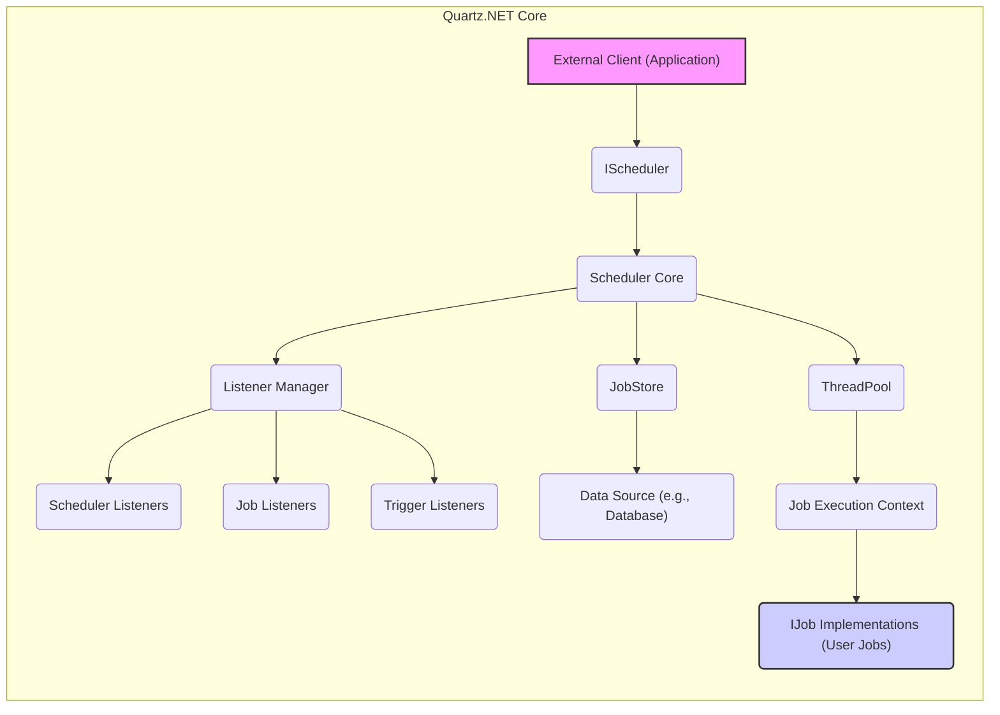

# Project Design Document: Quartz.NET (Improved)

**Project Name:** Quartz.NET Job Scheduling Library

**Project Repository:** [https://github.com/quartznet/quartznet](https://github.com/quartznet/quartznet)

**Version:** Based on current main branch as of October 26, 2023

**Document Version:** 1.1

**Author:** Gemini (AI Assistant)

**Date:** October 27, 2023

## 1. Introduction

This document provides an enhanced design overview of the Quartz.NET job scheduling library, specifically tailored for threat modeling and security analysis. Building upon the initial design document, this version provides more detailed descriptions, clarifies security considerations, and explicitly links functionalities to potential threats. This document aims to provide a robust foundation for identifying vulnerabilities and developing mitigation strategies for systems utilizing Quartz.NET.

## 2. Project Overview

Quartz.NET is a powerful, open-source job scheduling system for .NET environments. It enables developers to implement sophisticated scheduling logic for a wide range of tasks, from simple recurring jobs to complex workflows.  It is a crucial component in applications requiring background processing, automation, and time-based event management.

**Example Use Cases:**

*   **Batch Processing:** Scheduling nightly batch jobs for data processing, report generation, or system maintenance.
*   **Workflow Automation:** Automating multi-step business processes that involve time-dependent tasks and dependencies.
*   **System Monitoring:** Scheduling regular checks for system health, performance metrics, and alerts.
*   **Data Synchronization:** Periodically synchronizing data between different systems or databases.
*   **Scheduled Notifications:** Sending email or SMS notifications based on predefined schedules or events.

**Key Features (Reiterated for Clarity):**

*   **Flexible Scheduling:** Cron-like expressions, calendar-based scheduling, interval-based scheduling.
*   **Job Persistence:** Database-backed persistence for reliability and fault tolerance.
*   **Clustering Support:** Horizontal scalability and high availability through clustered scheduler instances.
*   **Event Listeners:** Monitoring and custom logic execution based on scheduler, job, and trigger events.
*   **Data Handling:**  Passing data to jobs and triggers for context-aware execution.
*   **.NET Integration:** Seamless integration with .NET applications and frameworks.

## 3. System Architecture

Quartz.NET's architecture is designed for modularity and extensibility. The `IScheduler` acts as the central orchestrator, managing the lifecycle of jobs and triggers.

**Component Interactions and Detailed Descriptions:**

*   **`External Client (Application)`**:  Initiates interactions with Quartz.NET by obtaining an `IScheduler` instance. It defines jobs and triggers and instructs the `IScheduler` to schedule them.
*   **`IScheduler`**:  The primary interface. Receives scheduling requests from the client application. Delegates core scheduling logic to the `Scheduler Core`.
*   **`Scheduler Core`**:  The heart of Quartz.NET.
    *   **Trigger Management:**  Manages triggers, determines when triggers should fire based on their schedules.
    *   **Job Retrieval:** Retrieves `JobDetails` from the `JobStore` when a trigger fires.
    *   **Job Execution Delegation:**  Obtains a thread from the `ThreadPool` and delegates job execution.
    *   **Transaction Management (for `AdoJobStore`):** Manages transactions for database operations within `AdoJobStore`.
*   **`JobStore`**:  Persists scheduling data.
    *   **`RAMJobStore`**:  Fast, in-memory storage. Volatile - data is lost on application shutdown. Suitable for development, testing, and non-critical scheduling.
    *   **`AdoJobStore`**:  Persistent storage using a relational database. Supports various databases. Provides durability and clustering capabilities. Uses database transactions for data consistency.
*   **`ThreadPool`**:  Manages a pool of worker threads.
    *   Executes `IJob` implementations concurrently.
    *   Configurable size to control concurrency levels.
    *   Manages thread lifecycle and resource allocation for job execution.
*   **`Listener Manager`**:  Manages registration and notification of listeners.
    *   Maintains lists of registered `SchedulerListeners`, `JobListeners`, and `TriggerListeners`.
    *   Dispatches events to registered listeners at appropriate points in the scheduling lifecycle.
*   **`Scheduler Listeners`**:  Implement `ISchedulerListener` to receive notifications about scheduler-level events (start, shutdown, errors, etc.). Useful for logging, monitoring, and custom scheduler lifecycle management.
*   **`Job Listeners`**: Implement `IJobListener` to receive notifications about job-related events (before/after execution, vetoing). Useful for auditing, logging job execution status, and implementing cross-cutting concerns around job execution.
*   **`Trigger Listeners`**: Implement `ITriggerListener` to receive notifications about trigger-related events (trigger fired, misfired, completed). Useful for monitoring trigger behavior, implementing custom trigger logic, and handling trigger lifecycle events.
*   **`Data Source (e.g., Database)`**:  External database used by `AdoJobStore`.  Security of this data source is paramount for persistent and clustered Quartz.NET deployments.
*   **`Job Execution Context`**:  Provides runtime context to `IJob.Execute` method. Contains:
    *   `JobDetail`: Information about the job being executed.
    *   `Trigger`: The trigger that fired the job.
    *   `SchedulerContext`:  Scheduler-level data.
*   **`IJob Implementations (User Jobs)`**:  Custom code implementing the business logic to be executed.  Security vulnerabilities in user job code can directly impact the application.

## 4. Data Flow and Security Implications

Understanding data flow is crucial for identifying potential data breaches and manipulation points.

1.  **Job and Trigger Definition (Client -> IScheduler):**
    *   **Data:** Job details (class name, description, `JobDataMap`), trigger details (type, schedule, `TriggerDataMap`).
    *   **Security Implications:**  **Integrity:** Malicious clients could attempt to inject malicious job definitions or manipulate trigger schedules to disrupt operations or execute unauthorized code. **Authorization:** Lack of proper authorization could allow unauthorized users to schedule jobs.

2.  **Scheduling (IScheduler -> Scheduler Core -> JobStore):**
    *   **Data:** Serialized `JobDetail` and `Trigger` objects, `JobDataMap`, `TriggerDataMap`.
    *   **Security Implications:** **Confidentiality & Integrity:** If `AdoJobStore` is used, sensitive data within `JobDataMap` and `TriggerDataMap` is persisted in the database. Database security is critical. **Integrity:**  Tampering with data in the `JobStore` could lead to unpredictable job execution or denial of service.

3.  **Trigger Firing (Scheduler Core -> JobStore -> ThreadPool):**
    *   **Data:** Retrieval of `JobDetail` from `JobStore` based on fired trigger.
    *   **Security Implications:** **Availability:** If the `JobStore` is unavailable or compromised, trigger firing and job execution will be disrupted.

4.  **Job Execution (ThreadPool -> IJob.Execute):**
    *   **Data:** `JobExecutionContext` passed to `IJob.Execute`, including `JobDataMap`, `TriggerDataMap`.
    *   **Security Implications:** **Confidentiality, Integrity, Availability:**  **Malicious Jobs:**  If user-defined `IJob` implementations are vulnerable or malicious, they can compromise the application's security. They can access sensitive data in `JobDataMap`, interact with external systems insecurely, or cause denial of service. **Data Exposure:**  Improper handling of data within `IJob.Execute` could lead to data leaks or corruption.

5.  **Job Completion and Trigger Update (Scheduler Core -> JobStore):**
    *   **Data:** Trigger state updates persisted in `JobStore`.
    *   **Security Implications:** **Integrity:**  Tampering with trigger state could lead to jobs not being executed as scheduled or being executed multiple times.

6.  **Listeners Notification (Various Components -> Listener Manager -> Listeners):**
    *   **Data:** Event data passed to listeners (e.g., `JobExecutionContext`, `SchedulerException`).
    *   **Security Implications:** **Confidentiality:** Listeners could inadvertently log or transmit sensitive information contained in event data. **Availability:**  Malicious or poorly implemented listeners could cause performance issues or exceptions, impacting scheduler stability.

**Data Elements of Security Relevance (Expanded):**

*   **`JobDataMap` & `TriggerDataMap`**:  **Confidentiality, Integrity:**  Can contain sensitive configuration parameters, API keys, database credentials, business data.  Must be treated as potentially sensitive and handled securely (encryption, access control).
*   **Database Connection Strings (for `AdoJobStore`):** **Confidentiality:**  Credentials for database access. Must be securely stored and managed (secrets management, not hardcoded).
*   **Serialized `JobDetail` and `Trigger` objects in `JobStore`**: **Integrity, Availability:**  If corrupted or tampered with, can disrupt scheduling. Integrity checks and backups are important.
*   **Logs generated by Quartz.NET and Listeners**: **Confidentiality:**  Logs might contain sensitive information if not properly configured. Secure logging practices are essential.

## 5. Key Functionalities and Security Considerations (Threat-Focused)

This section maps key functionalities to potential threats and vulnerabilities, providing a threat-centric view.

*   **Job Scheduling and Execution:**
    *   **Functionality:** Defining and executing jobs based on schedules.
    *   **Potential Threats:**
        *   **Malicious Job Injection (Threat: Code Injection, Privilege Escalation):**  Unauthorized users schedule malicious jobs to execute arbitrary code within the application's context.
        *   **Resource Exhaustion (Threat: Denial of Service):**  Malicious or poorly designed jobs consume excessive resources (CPU, memory, threads), leading to system slowdown or crash.
        *   **Data Exfiltration via Jobs (Threat: Data Breach):**  Malicious jobs access and exfiltrate sensitive data from the application or connected systems.
        *   **Job Data Manipulation (Threat: Data Integrity):**  Jobs maliciously modify application data or external system data.
    *   **Security Considerations:**
        *   **Input Validation & Sanitization:** Rigorously validate job definitions and data.
        *   **Authorization:** Implement strong access control for job scheduling and management.
        *   **Sandboxing/Isolation (Advanced):** Consider mechanisms to isolate job execution environments (if feasible and necessary for high-risk scenarios).
        *   **Resource Quotas & Monitoring:**  Implement resource limits for jobs and monitor resource consumption.
        *   **Secure Data Handling in Jobs:**  Educate developers on secure coding practices for `IJob` implementations, especially regarding sensitive data.

*   **Job Persistence (using `AdoJobStore`):**
    *   **Functionality:** Persisting scheduling data in a database.
    *   **Potential Threats:**
        *   **SQL Injection (Threat: Code Injection, Data Breach, Data Manipulation):** Vulnerabilities in `AdoJobStore` implementation or database interaction could lead to SQL injection attacks.
        *   **Database Compromise (Threat: Data Breach, Data Integrity, Availability):**  Compromise of the underlying database hosting the `JobStore` data.
        *   **Connection String Exposure (Threat: Credential Theft, Unauthorized Access):**  Exposure of database connection strings containing credentials.
        *   **Data Tampering in Database (Threat: Data Integrity, Availability):**  Malicious modification or deletion of scheduling data in the database.
    *   **Security Considerations:**
        *   **Database Hardening:** Securely configure and harden the database server.
        *   **Principle of Least Privilege (Database Access):** Grant minimal necessary database permissions to the Quartz.NET application.
        *   **Secure Connection Strings Management:** Use secure configuration mechanisms (key vaults, environment variables) for connection strings.
        *   **Regular Security Audits & Penetration Testing:**  Include database and `AdoJobStore` in security assessments.
        *   **Database Encryption (at rest and in transit):** Encrypt sensitive data in the database and during communication.

*   **Clustering:**
    *   **Functionality:**  Running multiple Quartz.NET instances in a cluster.
    *   **Potential Threats:**
        *   **Shared JobStore Vulnerability Amplification (Threat: Widespread Impact):**  A vulnerability in the shared `JobStore` (database) affects all cluster nodes.
        *   **Cluster Node Impersonation (Threat: Unauthorized Access, Data Manipulation):**  Unauthorized node joining the cluster or impersonating a legitimate node (less relevant for database-centric clustering, but consider network security if other clustering mechanisms are used).
        *   **Denial of Service against Cluster (Threat: Availability):**  Attacks targeting the shared `JobStore` or cluster communication to disrupt the entire cluster.
    *   **Security Considerations:**
        *   **Secure Shared JobStore:**  Prioritize security of the shared `JobStore` (database).
        *   **Authentication and Authorization for Cluster Management (if applicable):**  If cluster management interfaces are exposed, secure them.
        *   **Network Segmentation (if applicable):**  Isolate cluster nodes within a secure network segment.

*   **Listeners:**
    *   **Functionality:**  Event-driven monitoring and custom logic execution.
    *   **Potential Threats:**
        *   **Listener Code Vulnerabilities (Threat: Code Injection, Privilege Escalation):**  Vulnerabilities in custom listener implementations.
        *   **Information Disclosure via Listeners (Threat: Data Breach):**  Listeners logging or transmitting sensitive information.
        *   **Listener-Induced Denial of Service (Threat: Availability):**  Poorly performing or malicious listeners impacting scheduler performance.
    *   **Security Considerations:**
        *   **Secure Listener Development Practices:**  Educate developers on secure coding for listeners.
        *   **Code Review for Listeners:**  Review custom listener implementations for security vulnerabilities.
        *   **Minimize Information Logging in Listeners:**  Avoid logging sensitive data in listeners.
        *   **Performance Testing for Listeners:**  Ensure listeners do not introduce performance bottlenecks.

*   **Management and Configuration:**
    *   **Functionality:**  Configuring and managing Quartz.NET.
    *   **Potential Threats:**
        *   **Unauthorized Configuration Changes (Threat: Data Integrity, Availability):**  Unauthorized modification of Quartz.NET configuration leading to misconfiguration or security vulnerabilities.
        *   **Exposure of Management Interfaces (Threat: Unauthorized Access, Control):**  If management interfaces are exposed without proper security, attackers could gain control of the scheduler.
    *   **Security Considerations:**
        *   **Secure Configuration Storage:**  Use secure configuration mechanisms and access control for configuration files.
        *   **Restrict Access to Configuration Management:**  Limit who can modify Quartz.NET configuration.
        *   **Secure Management Interfaces (if exposed):**  Implement strong authentication and authorization for any management interfaces.

## 6. Deployment Scenarios and Security Implications (Detailed)

*   **Standalone Application:**
    *   **Security Focus:** Application-level security, Quartz.NET configuration within the application, securing the chosen `JobStore` (RAM or local database).
    *   **Security Implications:**  Attack surface is primarily the application itself. If `RAMJobStore` is used, persistence is not a concern, but data loss on application restart is a risk. If `AdoJobStore` with a local database is used, securing that local database is crucial.

*   **Clustered Environment:**
    *   **Security Focus:**  Shared `JobStore` (database) security becomes paramount. Secure configuration across all cluster nodes. Network security if inter-node communication is involved (though less direct in typical Quartz.NET clustering).
    *   **Security Implications:**  Compromise of the shared `JobStore` impacts the entire cluster. Security misconfigurations in one node can affect the cluster. Increased complexity in managing security across multiple instances.

*   **Cloud Deployment:**
    *   **Security Focus:** Leveraging cloud provider security services (managed databases, key vaults, IAM), securing cloud infrastructure (network security groups, firewalls), adhering to cloud security best practices.
    *   **Security Implications:**  Reliance on cloud provider's security. Misconfiguration of cloud resources can lead to vulnerabilities. Need to understand the shared responsibility model in cloud security. Securely managing cloud credentials and access keys is critical.

## 7. Security Considerations for Threat Modeling (Categorized)

For threat modeling, consider these security aspects, categorized by common security concerns:

**A. Confidentiality:**

*   **Threats:** Data breaches, information disclosure, credential theft.
*   **Considerations:**
    *   Secure handling of `JobDataMap` and `TriggerDataMap` (encryption if necessary).
    *   Secure storage of database connection strings (secrets management).
    *   Secure logging practices (avoid logging sensitive data).
    *   Listener implementations should not leak sensitive information.
    *   Database encryption at rest and in transit.

**B. Integrity:**

*   **Threats:** Data manipulation, unauthorized configuration changes, malicious job injection.
*   **Considerations:**
    *   Input validation and sanitization for job and trigger definitions.
    *   Authorization and access control for scheduling and management operations.
    *   Integrity checks for data in `JobStore` (database).
    *   Secure configuration management and access control.
    *   Protection against SQL injection vulnerabilities in `AdoJobStore`.

**C. Availability:**

*   **Threats:** Denial of service, resource exhaustion, system disruption.
*   **Considerations:**
    *   Resource limits and monitoring for jobs.
    *   Robust error handling and exception management.
    *   Database availability and resilience (for `AdoJobStore`).
    *   Protection against denial-of-service attacks targeting Quartz.NET or its dependencies.
    *   Proper thread pool configuration to prevent thread starvation.

**D. Authorization & Authentication:**

*   **Threats:** Unauthorized access, privilege escalation.
*   **Considerations:**
    *   Implement authentication and authorization for job scheduling and management operations.
    *   Principle of least privilege for database access.
    *   Secure management interfaces (if exposed).
    *   Access control for configuration files.

**E. Auditing & Logging:**

*   **Threats:** Lack of visibility into security events, difficulty in incident response.
*   **Considerations:**
    *   Comprehensive logging of scheduler events, job executions, and configuration changes.
    *   Secure storage and monitoring of logs.
    *   Auditing of security-relevant events.

## 8. Conclusion

This improved design document provides a more detailed and threat-focused analysis of Quartz.NET. By explicitly outlining potential threats, vulnerabilities, and security considerations for each component and functionality, this document serves as a more effective foundation for conducting a comprehensive threat modeling exercise.  It emphasizes the importance of security throughout the Quartz.NET lifecycle, from configuration and deployment to job implementation and monitoring. This enhanced document will enable security professionals to more effectively identify and mitigate security risks associated with Quartz.NET deployments, leading to more secure and resilient applications.