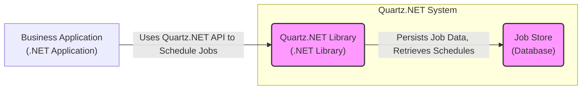
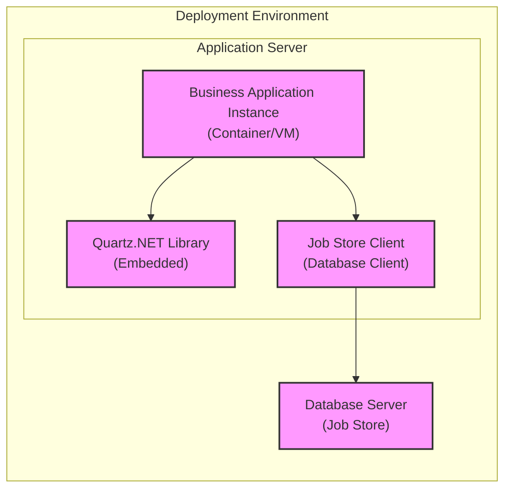
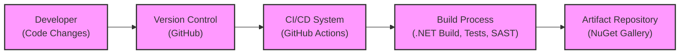

# BUSINESS POSTURE

- Business Priorities and Goals:
  - Quartz.NET is a job scheduling library. The primary business goal for organizations using Quartz.NET is to reliably automate tasks and processes. This automation can lead to increased efficiency, reduced manual errors, and improved operational consistency. For businesses, this translates to cost savings, better service delivery, and the ability to scale operations effectively.
  - Priorities include:
    - Reliability: Ensuring scheduled jobs execute as expected, without failures or missed schedules.
    - Maintainability:  Ease of configuration, monitoring, and updates to the scheduling system.
    - Scalability: Ability to handle increasing numbers of jobs and complexity of schedules as business needs grow.
    - Integration: Seamless integration with existing business applications and infrastructure.
- Business Risks:
  - Failure of critical scheduled jobs: If Quartz.NET fails to execute jobs, it can disrupt business operations, leading to financial losses, service outages, and reputational damage.
  - Data integrity issues: Incorrectly scheduled or executed jobs could lead to data corruption or inconsistencies.
  - Security vulnerabilities: Security flaws in Quartz.NET or its configuration could be exploited to gain unauthorized access to systems or data.
  - Operational complexity: Poorly designed or configured scheduling systems can become complex to manage and troubleshoot, increasing operational overhead.

# SECURITY POSTURE

- Existing Security Controls:
  - security control: Access control to the Quartz.NET configuration files and database (if used). Implemented by operating system file permissions and database access controls.
  - security control: Secure coding practices within the Quartz.NET codebase. Implemented by the Quartz.NET development team.
  - security control: Dependency management to ensure known vulnerable dependencies are not included. Implemented by the Quartz.NET development team and build process.
- Accepted Risks:
  - accepted risk: Open source nature of the project implies reliance on community contributions for security vulnerability identification and patching.
  - accepted risk:  Default configurations might not be hardened and require manual security configuration.
  - accepted risk:  Security of the underlying infrastructure (operating system, .NET runtime, database) is assumed to be managed separately.
- Recommended Security Controls:
  - security control: Regular security audits and penetration testing of systems using Quartz.NET.
  - security control: Implementation of a vulnerability management process to track and remediate security vulnerabilities in Quartz.NET and its dependencies.
  - security control: Secure configuration guidelines for Quartz.NET deployments, including database connection security, access control, and logging.
  - security control: Monitoring and alerting for suspicious activity related to Quartz.NET, such as unauthorized job modifications or execution failures.
- Security Requirements:
  - Authentication:
    - Requirement: If a management interface is exposed, it must require strong authentication to prevent unauthorized access.
    - Requirement: When Quartz.NET interacts with other systems (e.g., databases, APIs) for job execution, it should authenticate securely using appropriate credentials management practices.
  - Authorization:
    - Requirement: Access to manage and configure Quartz.NET should be restricted to authorized personnel. Role-based access control should be implemented if a management interface is used.
    - Requirement: Jobs should be executed with the minimum necessary privileges to access required resources.
  - Input Validation:
    - Requirement: Input validation should be performed on job configurations and parameters to prevent injection attacks (e.g., SQL injection if using a database job store, command injection if executing shell commands).
    - Requirement: Input validation should be applied to any external data sources used in job execution.
  - Cryptography:
    - Requirement: Sensitive data stored by Quartz.NET (e.g., database connection strings, job parameters containing secrets) should be encrypted at rest and in transit.
    - Requirement: If Quartz.NET is used to manage or distribute cryptographic keys, these keys must be handled securely.

# DESIGN

## C4 CONTEXT

```mermaid
flowchart LR
    subgraph "Organization System"
        A("Quartz.NET\nJob Scheduling Library")
    end
    B["Business Applications\n(Internal Users)"] --> |Schedules Jobs, Receives Job Status| A
    C["System Administrators\n(Operators)"] --> |Configures and Monitors Quartz.NET| A
    D["Databases\n(Data Storage)"] <-- |Stores Job Details, Schedules, History| A
    E["Logging and Monitoring\nSystems"] <-- |Sends Logs and Metrics| A
    style A fill:#f9f,stroke:#333,stroke-width:2px
```

- Context Diagram Elements:
  - - Name: Quartz.NET Job Scheduling Library
    - Type: Software System
    - Description: Quartz.NET is a .NET library used to create, schedule, and execute jobs within applications. It manages job persistence, triggers, and execution lifecycle.
    - Responsibilities:
      - Scheduling jobs based on defined triggers (cron expressions, simple triggers).
      - Persisting job and trigger details.
      - Executing jobs reliably and managing job execution lifecycle (start, completion, failure, retry).
      - Providing APIs for applications to interact with the scheduler.
    - Security controls:
      - Security controls are primarily focused on secure configuration and integration with the surrounding environment, as Quartz.NET itself is a library embedded within applications.
      - Input validation on job configurations provided by applications.
      - Secure storage of job data, including sensitive information.
      - Logging of security-relevant events.
  - - Name: Business Applications
    - Type: Software System
    - Description: Internal applications within the organization that require job scheduling capabilities. These applications use Quartz.NET to automate background tasks, batch processing, and other scheduled operations.
    - Responsibilities:
      - Defining and scheduling jobs using the Quartz.NET API.
      - Handling job execution logic.
      - Providing necessary data and resources for job execution.
      - Receiving job status updates and handling job outcomes.
    - Security controls:
      - Authentication and authorization of applications accessing Quartz.NET.
      - Secure communication channels between applications and Quartz.NET if they are deployed separately.
      - Input validation and sanitization of data provided to Quartz.NET.
  - - Name: System Administrators
    - Type: Person
    - Description: IT personnel responsible for configuring, deploying, and maintaining the infrastructure and applications, including Quartz.NET.
    - Responsibilities:
      - Installing and configuring Quartz.NET.
      - Managing Quartz.NET server infrastructure (if deployed as a standalone service).
      - Monitoring Quartz.NET performance and health.
      - Troubleshooting issues related to job scheduling and execution.
      - Implementing security configurations and access controls for Quartz.NET.
    - Security controls:
      - Secure access to Quartz.NET configuration and management interfaces.
      - Following secure configuration guidelines for Quartz.NET deployments.
      - Monitoring security logs and alerts related to Quartz.NET.
  - - Name: Databases
    - Type: Software System
    - Description: Databases used by Quartz.NET to persist job details, schedules, triggers, and execution history. This could be relational databases (e.g., SQL Server, PostgreSQL, MySQL) or other persistent storage solutions.
    - Responsibilities:
      - Storing and retrieving job-related data for Quartz.NET.
      - Ensuring data integrity and availability.
      - Providing transactional support for Quartz.NET operations.
    - Security controls:
      - Database access controls (authentication and authorization).
      - Encryption of data at rest and in transit.
      - Regular database backups and security patching.
      - Database activity monitoring and auditing.
  - - Name: Logging and Monitoring Systems
    - Type: Software System
    - Description: Centralized logging and monitoring systems used to collect logs and metrics from Quartz.NET and related applications for operational monitoring, troubleshooting, and security analysis.
    - Responsibilities:
      - Aggregating logs and metrics from Quartz.NET instances.
      - Providing dashboards and alerts for monitoring Quartz.NET health and performance.
      - Enabling security monitoring and incident response.
    - Security controls:
      - Secure collection and storage of logs and metrics.
      - Access controls to logging and monitoring data.
      - Anomaly detection and alerting for security events.

## C4 CONTAINER



- Container Diagram Elements:
  - - Name: Quartz.NET Library
    - Type: Library
    - Description: The core Quartz.NET library, providing the scheduling engine, job and trigger management, and API for applications to interact with the scheduler. It is typically embedded within business applications.
    - Responsibilities:
      - Core scheduling logic and engine.
      - Job and trigger management (creation, modification, deletion).
      - Job execution management and lifecycle.
      - API for applications to schedule and manage jobs.
    - Security controls:
      - Secure coding practices within the library.
      - Input validation on job configurations and parameters received from applications.
      - Secure handling of sensitive data within the library (e.g., encryption if necessary).
  - - Name: Job Store
    - Type: Database
    - Description: A persistent storage mechanism for Quartz.NET to store job details, schedules, triggers, and execution history. This is typically a relational database but can be configured to use other storage options.
    - Responsibilities:
      - Persistent storage of Quartz.NET data.
      - Data retrieval for scheduling and job execution.
      - Transactional integrity of data operations.
    - Security controls:
      - Database access controls (authentication and authorization).
      - Encryption of data at rest and in transit.
      - Regular database backups and security patching.
      - Database activity monitoring and auditing.
  - - Name: Business Application
    - Type: Application
    - Description: The .NET application that embeds and utilizes the Quartz.NET library to schedule and execute jobs.
    - Responsibilities:
      - Defining job logic and implementation.
      - Using the Quartz.NET API to schedule jobs.
      - Providing necessary resources and data for job execution.
      - Handling job outcomes and errors.
    - Security controls:
      - Secure coding practices within the application.
      - Secure configuration of Quartz.NET within the application.
      - Proper handling of sensitive data used in jobs.
      - Application-level authentication and authorization.

## DEPLOYMENT

Deployment Solution: Embedded within Business Application (Common Scenario)



- Deployment Diagram Elements:
  - - Name: Business Application Instance
    - Type: Container/VM
    - Description: An instance of the business application, deployed as a container or virtual machine, which embeds the Quartz.NET library and runs scheduled jobs.
    - Responsibilities:
      - Hosting and running the business application.
      - Executing scheduled jobs using the embedded Quartz.NET library.
      - Managing application resources and dependencies.
    - Security controls:
      - Operating system and container/VM hardening.
      - Application-level security controls (authentication, authorization).
      - Network security controls (firewall, network segmentation).
      - Regular security patching and updates.
  - - Name: Quartz.NET Library (Embedded)
    - Type: Library
    - Description: The Quartz.NET library is embedded directly within the business application instance, running within the same process.
    - Responsibilities:
      - Scheduling and executing jobs within the application instance.
      - Managing job data and interactions with the Job Store.
    - Security controls:
      - Inherits security controls from the application instance.
      - Secure configuration within the application.
  - - Name: Job Store Client
    - Type: Library
    - Description: Database client library used by the Business Application Instance to connect to the Job Store database server.
    - Responsibilities:
      - Establishing connection to the Job Store database.
      - Sending and receiving data to/from the database.
    - Security controls:
      - Secure configuration of database connection parameters (e.g., connection strings, credentials).
      - Secure communication protocols (e.g., TLS/SSL for database connections).
  - - Name: Database Server (Job Store)
    - Type: Server
    - Description: The database server hosting the Job Store database, which persists Quartz.NET job data.
    - Responsibilities:
      - Storing and managing Quartz.NET job data.
      - Ensuring data availability and integrity.
      - Handling database client connections.
    - Security controls:
      - Database server hardening.
      - Database access controls (authentication and authorization).
      - Encryption of data at rest and in transit.
      - Regular database backups and security patching.
      - Database activity monitoring and auditing.

## BUILD



- Build Process Elements:
  - - Name: Developer
    - Type: Person
    - Description: Software developers who contribute code changes to the Quartz.NET project.
    - Responsibilities:
      - Writing and testing code.
      - Committing code changes to the version control system.
      - Participating in code reviews.
    - Security controls:
      - Secure development practices.
      - Code review process to identify potential security vulnerabilities.
      - Authentication and authorization for accessing version control system.
  - - Name: Version Control (GitHub)
    - Type: Software System
    - Description: GitHub repository hosting the Quartz.NET source code and managing version history.
    - Responsibilities:
      - Storing and managing source code.
      - Tracking code changes and versions.
      - Facilitating collaboration among developers.
    - Security controls:
      - Access controls to the repository (authentication and authorization).
      - Branch protection rules to prevent unauthorized code changes.
      - Audit logging of repository activities.
  - - Name: CI/CD System (GitHub Actions)
    - Type: Software System
    - Description: GitHub Actions is used as the CI/CD system to automate the build, test, and release process for Quartz.NET.
    - Responsibilities:
      - Automating the build process.
      - Running automated tests.
      - Performing static analysis security testing (SAST).
      - Publishing build artifacts.
    - Security controls:
      - Secure configuration of CI/CD pipelines.
      - Access controls to CI/CD system and workflows.
      - Secrets management for storing and accessing sensitive credentials.
      - Security scanning of build artifacts and dependencies.
  - - Name: Build Process
    - Type: Process
    - Description: Automated build process defined in GitHub Actions workflows. This includes compiling the .NET code, running unit tests, performing SAST scans, and packaging the library.
    - Responsibilities:
      - Compiling source code.
      - Running unit tests to ensure code quality.
      - Performing SAST scans to identify potential security vulnerabilities.
      - Packaging the library into NuGet packages.
    - Security controls:
      - SAST scanners to detect code vulnerabilities.
      - Dependency scanning to identify vulnerable dependencies.
      - Build process isolation to prevent tampering.
      - Signing of build artifacts to ensure integrity.
  - - Name: Artifact Repository (NuGet Gallery)
    - Type: Software System
    - Description: NuGet Gallery is used as the artifact repository to publish and distribute Quartz.NET NuGet packages.
    - Responsibilities:
      - Storing and managing build artifacts (NuGet packages).
      - Distributing NuGet packages to users.
      - Providing versioning and package management.
    - Security controls:
      - Access controls to the artifact repository.
      - Package signing to ensure integrity and authenticity.
      - Vulnerability scanning of published packages.

# RISK ASSESSMENT

- Critical Business Processes:
  - Automation of batch processing jobs (e.g., data processing, report generation).
  - Scheduled maintenance tasks (e.g., database backups, system cleanup).
  - Time-sensitive operations (e.g., sending notifications, triggering alerts).
  - Workflow automation and orchestration.
- Data Sensitivity:
  - Job configurations: May contain sensitive information such as database connection strings, API keys, or credentials for accessing other systems. Sensitivity: High if secrets are not properly managed and encrypted.
  - Job data: Data processed by jobs can vary in sensitivity depending on the business process. Could range from low (public data) to high (personal identifiable information, financial data). Sensitivity: Variable, depends on the specific jobs.
  - Job execution history and logs: May contain operational details and potentially sensitive information depending on the jobs executed. Sensitivity: Medium to High if logs are not properly secured and audited.

# QUESTIONS & ASSUMPTIONS

- Questions:
  - What type of data will be processed by jobs scheduled using Quartz.NET?
  - What are the specific security requirements and compliance standards that need to be met?
  - Is there a dedicated management interface for Quartz.NET, or is it managed programmatically through the API?
  - What is the expected scale and performance requirements for the scheduling system?
  - What are the disaster recovery and business continuity requirements for scheduled jobs?
- Assumptions:
  - BUSINESS POSTURE: The primary business goal is reliable automation of tasks to improve efficiency and operational consistency. Security is a significant concern to prevent disruption of critical automated processes and data breaches.
  - SECURITY POSTURE:  Standard security practices for software development and deployment are expected. Secure configuration and integration are crucial for Quartz.NET security.  The organization using Quartz.NET is responsible for securing the environment where it is deployed and configured.
  - DESIGN: Quartz.NET is primarily used as a library embedded within business applications. The job store is typically a relational database. Deployment is assumed to be within standard application server environments (containers or VMs). Build process leverages standard CI/CD practices and tooling like GitHub Actions and NuGet.