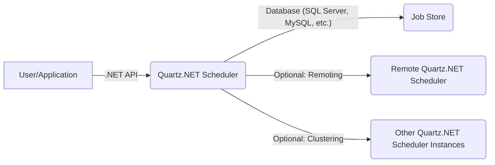
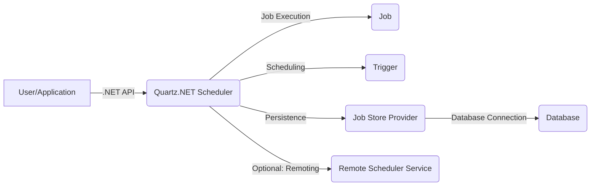
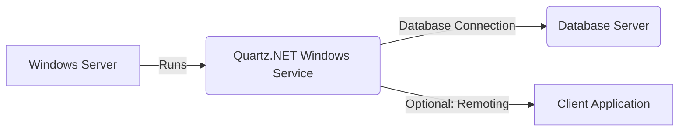
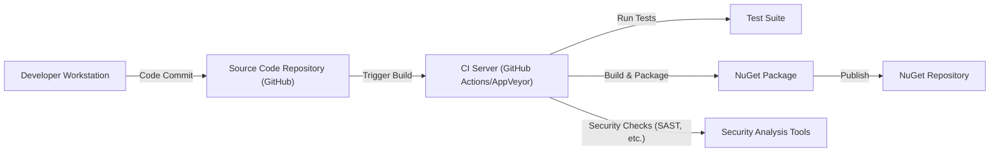

# BUSINESS POSTURE

Business Priorities and Goals:

*   Provide a reliable and feature-rich job scheduling system for .NET applications.
*   Offer an open-source alternative to commercial scheduling solutions.
*   Maintain a high level of compatibility with various .NET versions and environments.
*   Foster a community-driven development model with active contributions.
*   Ensure the library is easy to integrate and use within .NET projects.

Business Risks:

*   Data breaches or corruption due to vulnerabilities in the scheduling system.
*   Denial of service attacks targeting the scheduler, disrupting application functionality.
*   Unauthorized execution of jobs, leading to potential data breaches or system compromise.
*   Incompatibility with specific .NET environments or configurations, limiting adoption.
*   Lack of community support or contributions, hindering long-term maintenance and development.
*   Reputational damage due to security incidents or unreliable performance.

# SECURITY POSTURE

Existing Security Controls:

*   security control: Input validation for job data and trigger parameters (partially implemented in various parts of the codebase, needs comprehensive review).
*   security control: Use of parameterized SQL queries to prevent SQL injection vulnerabilities (observed in database persistence providers).
*   security control: Support for encrypted database connections (configurable in connection strings).
*   security control: Logging of scheduler events and errors (implemented throughout the codebase).
*   security control: XML schema validation for configuration files (present in the codebase).

Accepted Risks:

*   accepted risk: Potential for denial-of-service attacks by overwhelming the scheduler with a large number of jobs or triggers. Mitigation strategies (e.g., resource limits, throttling) are partially implemented but may require further refinement.
*   accepted risk: Reliance on third-party libraries (e.g., database drivers, logging frameworks) that may introduce their own vulnerabilities.
*   accepted risk: The project is open source, so the source code is available for review, but this also means potential attackers have access to it.

Recommended Security Controls:

*   security control: Implement comprehensive input validation for all user-provided data, including job names, group names, trigger parameters, and job data.
*   security control: Introduce role-based access control (RBAC) to restrict access to scheduler operations based on user roles and permissions.
*   security control: Implement robust exception handling and error reporting to prevent sensitive information leakage.
*   security control: Provide options for encrypting sensitive data stored in the job store (e.g., job data, credentials).
*   security control: Regularly conduct security audits and penetration testing to identify and address potential vulnerabilities.
*   security control: Implement a secure build and release process, including code signing and vulnerability scanning.
*   security control: Provide security documentation and guidelines for users and developers.
*   security control: Implement mechanisms to prevent or mitigate common web application vulnerabilities if the scheduler is exposed through a web interface (e.g., cross-site scripting, cross-site request forgery).

Security Requirements:

*   Authentication:
    *   The scheduler itself does not typically handle user authentication directly. Authentication is usually managed by the application that integrates Quartz.NET. However, if Quartz.NET is exposed via a remote interface (e.g., a web UI or API), then authentication mechanisms (e.g., API keys, OAuth, JWT) should be implemented to secure access.
*   Authorization:
    *   Implement authorization mechanisms to control access to scheduler operations (e.g., creating, deleting, scheduling jobs). This could involve RBAC or a more granular permission system.
*   Input Validation:
    *   All input data, including job names, group names, trigger parameters, and job data, must be rigorously validated to prevent injection attacks and other vulnerabilities.
*   Cryptography:
    *   Sensitive data stored in the job store (e.g., passwords, API keys) should be encrypted at rest.
    *   Secure communication channels (e.g., TLS/SSL) should be used for remote access to the scheduler.
    *   Cryptographically secure random number generators should be used when generating unique identifiers.

# DESIGN

## C4 CONTEXT

Element Descriptions:

*   Element:
    *   Name: User/Application
    *   Type: User/External System
    *   Description: The .NET application or user that interacts with the Quartz.NET scheduler.
    *   Responsibilities: Creating, scheduling, managing, and triggering jobs.
    *   Security controls: Authentication and authorization are typically handled at the application level.
*   Element:
    *   Name: Quartz.NET Scheduler
    *   Type: System
    *   Description: The core Quartz.NET scheduling library.
    *   Responsibilities: Managing job execution, persistence, and scheduling.
    *   Security controls: Input validation, parameterized SQL queries, logging.
*   Element:
    *   Name: Job Store
    *   Type: Data Store
    *   Description: The persistent storage for job and trigger data (e.g., a database).
    *   Responsibilities: Storing and retrieving job and trigger information.
    *   Security controls: Database security measures (e.g., access controls, encryption).
*   Element:
    *   Name: Remote Quartz.NET Scheduler
    *   Type: External System
    *   Description: An optional remote instance of the Quartz.NET scheduler, accessed via remoting.
    *   Responsibilities: Same as the local Quartz.NET Scheduler.
    *   Security controls: Secure communication channels (e.g., TLS/SSL), authentication, and authorization.
*   Element:
    *   Name: Other Quartz.NET Scheduler Instances
    *   Type: External System
    *   Description: Other instances of the Quartz.NET scheduler in a clustered environment.
    *   Responsibilities: Coordinating job execution and ensuring high availability.
    *   Security controls: Secure communication, consistent configuration, and data synchronization.

## C4 CONTAINER

Element Descriptions:

*   Element:
    *   Name: User/Application
    *   Type: User/External System
    *   Description: The .NET application or user interacting with Quartz.NET.
    *   Responsibilities: Initiating scheduling operations.
    *   Security controls: Application-level security controls.
*   Element:
    *   Name: Quartz.NET Scheduler
    *   Type: Container
    *   Description: The main scheduler component.
    *   Responsibilities: Managing job execution, scheduling, and persistence.
    *   Security controls: Input validation, logging.
*   Element:
    *   Name: Job
    *   Type: Component
    *   Description: A unit of work to be executed.
    *   Responsibilities: Performing the defined task.
    *   Security controls: Input validation (if job data is used).
*   Element:
    *   Name: Trigger
    *   Type: Component
    *   Description: Defines when a job should be executed.
    *   Responsibilities: Triggering job execution at specified times or intervals.
    *   Security controls: Input validation (if trigger parameters are used).
*   Element:
    *   Name: Job Store Provider
    *   Type: Component
    *   Description: An abstraction for persistent storage.
    *   Responsibilities: Storing and retrieving job and trigger data.
    *   Security controls: Parameterized SQL queries (for database providers).
*   Element:
    *   Name: Database
    *   Type: Container
    *   Description: The database used for persistent storage.
    *   Responsibilities: Storing and retrieving data.
    *   Security controls: Database security measures.
*   Element:
    *   Name: Remote Scheduler Service
    *   Type: Container
    *   Description: An optional service for remote access to the scheduler.
    *   Responsibilities: Exposing scheduler functionality remotely.
    *   Security controls: Secure communication, authentication, authorization.

## DEPLOYMENT

Deployment Options:

1.  **In-Process:** Quartz.NET runs within the same process as the host application. This is the simplest deployment model.
2.  **Out-of-Process (Windows Service/Linux Daemon):** Quartz.NET runs as a separate Windows service or Linux daemon. This provides better isolation and resilience.
3.  **Clustered:** Multiple instances of Quartz.NET run in a cluster, sharing the same job store. This provides high availability and scalability.
4.  **Remote:** Quartz.NET scheduler can be accessed remotely using .NET Remoting or other communication protocols.

Chosen Deployment Model (Out-of-Process - Windows Service):

Element Descriptions:

*   Element:
    *   Name: Windows Server
    *   Type: Infrastructure Node
    *   Description: The server hosting the Quartz.NET Windows service.
    *   Responsibilities: Providing the operating environment.
    *   Security controls: Operating system security measures (e.g., firewalls, updates).
*   Element:
    *   Name: Quartz.NET Windows Service
    *   Type: Software System Instance
    *   Description: The Quartz.NET scheduler running as a Windows service.
    *   Responsibilities: Managing job execution, scheduling, and persistence.
    *   Security controls: Service account security, access controls.
*   Element:
    *   Name: Database Server
    *   Type: Infrastructure Node
    *   Description: The server hosting the database.
    *   Responsibilities: Providing database services.
    *   Security controls: Database server security measures.
*   Element:
    *   Name: Client Application
    *   Type: Software System
    *   Description: An application that interacts with the Quartz.NET scheduler remotely.
    *   Responsibilities: Communicating with the scheduler.
    *   Security controls: Secure communication, authentication, authorization.

## BUILD

Build Process Description:

1.  Developers commit code to the GitHub repository.
2.  A CI server (GitHub Actions or AppVeyor) is triggered by the commit.
3.  The CI server runs the test suite to ensure code quality.
4.  The CI server builds the Quartz.NET library and creates NuGet packages.
5.  Security checks, such as SAST (Static Application Security Testing) using tools like SonarQube or similar, are performed during the build process.
6.  The NuGet packages are published to the NuGet repository.

Security Controls in Build Process:

*   security control: Automated builds triggered by code commits ensure consistency and repeatability.
*   security control: Automated testing helps identify bugs and vulnerabilities early in the development lifecycle.
*   security control: SAST tools scan the codebase for potential security vulnerabilities.
*   security control: Dependency scanning can identify vulnerable third-party libraries.
*   security control: Code signing can ensure the integrity of the released packages.

# RISK ASSESSMENT

Critical Business Processes:

*   Reliable and timely execution of scheduled jobs.
*   Maintaining the integrity and confidentiality of job data.
*   Ensuring the availability and scalability of the scheduling service.

Data Sensitivity:

*   Job Data: Sensitivity varies depending on the specific application. It may contain sensitive information such as credentials, API keys, or personal data.
*   Trigger Parameters: May contain sensitive information depending on how triggers are configured.
*   Scheduler Configuration: May contain database connection strings or other sensitive settings.

# QUESTIONS & ASSUMPTIONS

Questions:

*   What specific types of jobs will be executed by Quartz.NET in different use cases? This will help determine the potential impact of job failures or vulnerabilities.
*   What are the specific security requirements of the applications that will use Quartz.NET? This will help tailor the security controls to the specific needs.
*   What is the expected load and scale of the scheduler? This will influence the choice of deployment model and the need for clustering.
*   Are there any specific compliance requirements (e.g., GDPR, HIPAA) that need to be considered?
*   Will the scheduler be exposed through a web interface or API? If so, what are the security requirements for that interface?
*   What level of logging and auditing is required?

Assumptions:

*   BUSINESS POSTURE: The primary goal is to provide a reliable and functional job scheduling library. Security is a high priority, but not at the expense of usability or performance.
*   SECURITY POSTURE: The existing security controls are a good starting point, but a comprehensive security review and implementation of additional controls are necessary.
*   DESIGN: The out-of-process deployment model is suitable for most use cases, providing a balance between isolation and ease of management. Clustering may be required for high-availability or high-load scenarios. The build process is automated and includes some security checks, but further enhancements (e.g., dependency scanning, code signing) are recommended.