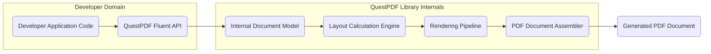

# Project Design Document: QuestPDF Library

**Version:** 1.1
**Date:** October 26, 2023
**Author:** AI Software Architect

## 1. Project Overview

This document details the design of the QuestPDF library, an open-source .NET library enabling programmatic generation of PDF documents using a fluent C# API. This document aims to provide a clear and comprehensive understanding of the library's architecture, core components, and data flow, specifically for the purpose of informing subsequent threat modeling activities.

## 2. Goals

* To provide a well-defined description of the QuestPDF library's architecture and its constituent parts.
* To elucidate the flow of data within the library during the PDF generation process.
* To highlight potential areas within the library that warrant careful security consideration during threat modeling.
* To serve as a reliable reference for developers and security professionals seeking to understand the internal workings of QuestPDF.

## 3. Scope

This document focuses on the internal architecture and data processing mechanisms of the core QuestPDF library responsible for generating PDF documents. The scope encompasses:

* The fluent API exposed to developers for defining PDF content.
* The internal processes involved in laying out and rendering PDF elements.
* The steps involved in generating the final PDF document file.

This document explicitly excludes:

* Specific examples of how to use the QuestPDF library in application code.
* Details regarding the library's build process, testing procedures, or contribution guidelines.
* In-depth analysis of external dependencies (though their roles will be acknowledged).
* Identification of specific security vulnerabilities (this will be the focus of dedicated threat modeling).

## 4. Architecture Overview

QuestPDF employs a layered architecture centered around a fluent API that developers use to describe the desired PDF content. Internally, the library transforms this description into a structured document model, which is then processed by layout and rendering engines to produce the final PDF output.

**Key Architectural Layers:**

* **Fluent API Layer:** The developer-facing interface, providing a declarative syntax for defining PDF elements and their properties.
* **Internal Document Model:** An in-memory representation of the PDF document structure, capturing the elements and their relationships as defined through the Fluent API.
* **Layout Calculation Engine:** Responsible for determining the precise positioning and sizing of elements within the document based on layout rules and constraints.
* **Rendering Pipeline:**  Transforms the layouted elements into the graphical instructions and data streams required by the PDF format.
* **PDF Document Assembler:**  Constructs the final PDF file by organizing the rendered content, metadata, and cross-reference tables according to the PDF specification.

## 5. Key Components

This section provides a more detailed look at the major components within the QuestPDF library.

* **Fluent API:**
    * Provides a rich set of extension methods and classes in C# for building PDF documents programmatically.
    * Enables developers to define elements such as `"Text"`, `"Images"`, `"Shapes"`, `"Tables"`, and `"Lists"`.
    * Abstracts away the low-level complexities of PDF syntax and structure.
    * Serves as the primary point of interaction and input for the library.

* **Internal Document Model:**
    * Represents the PDF document as a hierarchical structure in memory.
    * Stores objects representing `"Pages"`, `"Elements"`, `"Styles"`, and other document attributes.
    * Is built based on the developer's usage of the Fluent API.
    * Acts as an intermediary representation before layout and rendering.

* **Layout Calculation Engine:**
    * Takes the `"Internal Document Model"` as input.
    * Implements algorithms for calculating the bounding boxes and positions of elements.
    * Handles complex layout scenarios like text wrapping, page breaking for `"Tables"`, and managing element stacking.
    * Relies on factors like font metrics, element dimensions, and specified layout constraints.

* **Rendering Pipeline:**
    * Consists of multiple stages responsible for converting layout information into PDF-specific data.
    * Includes components for rendering `"Text"` (handling font selection and glyph rendering), `"Images"` (encoding and embedding), and vector graphics.
    * May involve interactions with external libraries for tasks like image decoding or font file parsing.

* **PDF Document Assembler:**
    * Takes the rendered content and associated metadata.
    * Organizes the data into a valid PDF structure according to the ISO 32000 standard.
    * Handles object numbering, cross-reference table generation, and metadata embedding (e.g., author, title).
    * Outputs the final binary PDF file.

## 6. Data Flow

The process of generating a PDF document using QuestPDF involves the following sequence of data transformations:

1. **Developer defines the PDF structure using the Fluent API within their application code.**  This involves writing C# code that utilizes the library's methods to specify the content and layout.
2. **The Fluent API translates the developer's instructions into the Internal Document Model.** As the developer uses the API, an in-memory representation of the document is constructed.
3. **The Layout Calculation Engine processes the Internal Document Model to determine element positions and sizes.** This stage applies layout rules and algorithms to calculate the precise layout of each element on the pages.
4. **The Rendering Pipeline receives the layout information and renders the individual elements into PDF-compatible data streams.**  This involves converting abstract elements into concrete drawing instructions and data.
5. **The PDF Document Assembler takes the rendered content and metadata and constructs the final PDF file according to the PDF specification.** This involves organizing the data, creating necessary PDF objects, and generating the cross-reference table.
6. **The output is the generated PDF document file.** This is the final binary file that can be viewed by PDF readers.

## 7. Security Considerations (Pre-Threat Modeling)

While a comprehensive threat model is the next step, it's crucial to pre-emptively identify areas that might be susceptible to security issues:

* **Input Validation at the Fluent API:**
    * Developers provide data like text content, image paths, and styling information.
    * Insufficient validation of this input could lead to unexpected behavior or potential vulnerabilities if this data is directly used in rendering commands without sanitization.
    * Consider risks associated with overly long strings, invalid file paths, or potentially malicious content embedded within text.

* **Resource Management within the Library:**
    * Generating complex PDFs can consume significant memory and processing time.
    * Potential for resource exhaustion attacks if a developer can craft input that causes excessive resource consumption within the `"Layout Calculation Engine"` or `"Rendering Pipeline"`.
    * Consider memory leaks or inefficient algorithms that could be exploited.

* **External Dependency Vulnerabilities:**
    * QuestPDF likely relies on other .NET libraries for tasks like image processing or font handling.
    * Vulnerabilities in these external dependencies could indirectly affect QuestPDF's security.
    * Careful management and monitoring of dependencies are essential.

* **Complexity of the PDF Specification:**
    * The PDF specification is intricate, and subtle errors in the `"PDF Document Assembler"` could lead to the generation of malformed PDFs.
    * Malformed PDFs might be exploited by vulnerable PDF viewers.

* **Font Handling Security:**
    * Rendering text involves processing font files.
    * Maliciously crafted font files could potentially be used to exploit vulnerabilities within the font rendering components.

* **Image Handling Security:**
    * Processing images (decoding, resizing, embedding) introduces potential risks.
    * Vulnerabilities in image decoding libraries could be exploited through specially crafted image files.

## 8. Deployment Considerations

QuestPDF is typically deployed as a library integrated into a .NET application. The security posture of the generated PDFs is heavily influenced by the security context of the application utilizing QuestPDF.

* **Server-Side PDF Generation:**
    * If PDFs are generated on a web server, the server's security measures are paramount.
    * Ensure proper input validation and sanitization within the application before passing data to QuestPDF.
    * Protect the storage location of generated PDFs if they contain sensitive information.

* **Desktop Application PDF Generation:**
    * If used in desktop applications, consider the security context of the user's machine.
    * Be mindful of where the application sources data for PDF generation.

## 9. Assumptions and Constraints

* It is assumed that developers using the QuestPDF library are generally acting in good faith and not intentionally trying to create malicious PDFs. However, the library should be resilient against accidental misuse or unexpected input.
* The primary focus of QuestPDF is on functionality and ease of use for document generation. Security considerations should be addressed without significantly compromising these core goals.
* This document describes the general architecture and data flow. Specific implementation details and optimizations are not covered.

## 10. Future Considerations

* As QuestPDF evolves, new features and components may be introduced, necessitating updates to this design document and further threat modeling.
* Performance enhancements or changes in underlying rendering technologies could introduce new security implications.
* Integration with new data sources or output formats might expand the potential attack surface.
* Consideration of secure defaults and security-focused API design in future development.

This document provides a more detailed and refined understanding of the QuestPDF library's internal workings, serving as a stronger foundation for subsequent security analysis and threat modeling efforts.
