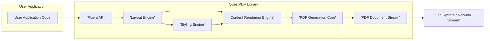
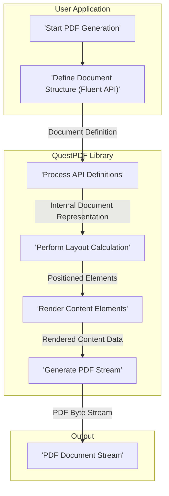

# Project Design Document: QuestPDF Library

**Version:** 1.1
**Date:** October 26, 2023
**Author:** AI Software Architect

## 1. Introduction

This document provides an enhanced and detailed design overview of the QuestPDF library, an open-source .NET library for generating PDF documents. This revised document aims to provide a clearer and more comprehensive articulation of the architecture, components, and data flow within QuestPDF, specifically tailored for effective threat modeling. It will serve as a robust foundation for identifying potential security vulnerabilities and designing appropriate mitigations.

## 2. Goals

*   Provide a comprehensive and refined architectural overview of the QuestPDF library.
*   Clearly identify key components, their responsibilities, and potential security implications.
*   Describe the data flow within the library during PDF generation with greater detail.
*   Highlight specific potential areas of security concern for subsequent threat modeling, categorized for clarity.

## 3. Scope

This document covers the core functionalities of the QuestPDF library as understood from its public repository. It focuses on the logical architecture, data processing, and potential security considerations involved in generating PDF documents. It does not delve into the specific implementation details of individual classes or methods unless they are crucial for understanding the overall architecture and potential security implications. External dependencies are considered at a high level.

## 4. System Overview

QuestPDF is a .NET library that empowers developers to programmatically create PDF documents using a fluent API. The library abstracts the complexities of PDF generation, allowing developers to concentrate on the content and layout of their documents.

### 4.1. High-Level Architecture

*   **User Application Code:** The .NET application that integrates and utilizes the QuestPDF library to generate PDF documents. This is the entry point and consumer of the library.
*   **QuestPDF Library:** The central library responsible for all aspects of PDF generation.
    *   **Fluent API:**  The developer-facing interface, providing a declarative and user-friendly way to define the structure and content of PDF documents.
    *   **Layout Engine:**  The component responsible for arranging elements on the page based on defined constraints, styling rules, and available space. It determines the position and size of each content element.
    *   **Content Rendering Engine:**  Handles the actual drawing and rendering of various content types (text, images, shapes, vector graphics, etc.) onto the PDF document. This involves interpreting content instructions and converting them into visual representations.
    *   **Styling Engine:**  Manages the application of styles (fonts, colors, sizes, margins, padding, etc.) to the content elements. It interprets style definitions and provides rendering hints.
    *   **PDF Generation Core:**  The underlying component that takes the rendered content and metadata and generates the final PDF document stream according to the PDF specification. This includes object creation, compression, and structure definition.
*   **File System / Network Stream:** The destination where the finalized PDF document is persisted or transmitted. This could be a local file system, a network share, or a stream sent over a network.

### 4.2. Key Components

*   **Fluent API:**
    *   Purpose: To provide a high-level, intuitive, and type-safe interface for developers to define the structure and content of their PDF documents programmatically.
    *   Functionality: Offers methods for adding pages, setting page properties, defining headers and footers, adding various content elements (text, images, shapes, lists, tables, barcodes), and applying styling.
    *   Inputs: User-defined document structure, content specifications, and styling instructions expressed through the API.
    *   Outputs: An internal, structured representation of the document, ready for processing by subsequent components.
    *   Dependencies:  Relies on the other components within the QuestPDF library to process the defined document structure.
    *   Security Considerations:
        *   **Input Validation:**  Insufficient validation of user-provided data through the API could lead to unexpected document structures, resource exhaustion, or the injection of potentially harmful content if not handled carefully by downstream components.
        *   **API Misuse:**  Incorrect usage of the API by developers could lead to unintended consequences or vulnerabilities if the underlying components do not handle edge cases gracefully.

*   **Layout Engine:**
    *   Purpose: To determine the precise positioning and sizing of content elements on each page based on the defined layout rules, available space, and styling.
    *   Functionality: Implements algorithms for box layout, text wrapping, page breaking, and handling element interactions (e.g., overlapping elements). It interprets constraints and attempts to satisfy them.
    *   Inputs: The internal document structure from the Fluent API, styling information for each element, and page dimensions.
    *   Outputs:  A collection of positioned and sized content elements, ready for rendering by the Content Rendering Engine.
    *   Dependencies:  Relies on the Styling Engine for style information and provides input to the Content Rendering Engine.
    *   Security Considerations:
        *   **Resource Exhaustion:**  Complex or deeply nested layouts, especially with dynamically sized elements, could potentially lead to excessive computation or memory usage, resulting in denial-of-service.
        *   **Unexpected Behavior:**  Bugs in the layout algorithms could lead to unexpected rendering behavior or even crashes if invalid layout states are encountered.

*   **Content Rendering Engine:**
    *   Purpose: To translate the positioned content elements into actual visual representations within the PDF document.
    *   Functionality: Handles the rendering of various content types, including:
        *   **Text Rendering:**  Font selection, glyph rendering, text shaping, and handling of different text encodings.
        *   **Image Rendering:**  Decoding various image formats (JPEG, PNG, etc.), applying transformations, and embedding images into the PDF.
        *   **Shape Rendering:**  Drawing vector graphics (lines, rectangles, paths, etc.) with specified colors and styles.
        *   **Barcode Rendering:** Generating and rendering barcode images.
    *   Inputs: Positioned content elements from the Layout Engine, styling information, and raw content data (e.g., text strings, image byte streams).
    *   Outputs:  Rendered content ready to be incorporated into the PDF stream by the PDF Generation Core.
    *   Dependencies: May rely on external libraries for image decoding or font handling.
    *   Security Considerations:
        *   **Image Processing Vulnerabilities:**  Vulnerabilities in image decoding libraries could be exploited by providing maliciously crafted images, potentially leading to crashes, information disclosure, or even remote code execution.
        *   **Font Handling Vulnerabilities:**  Issues with font parsing or rendering could lead to similar vulnerabilities.
        *   **Cross-Site Scripting (Indirect):** While not a direct web application, if user-provided data is used to generate text content without proper sanitization, it could potentially lead to issues if the generated PDF is later processed by a vulnerable PDF viewer.
        *   **Resource Consumption:**  Processing very large or complex images could lead to excessive memory usage.

*   **Styling Engine:**
    *   Purpose: To manage and apply styling rules to content elements, controlling their visual appearance.
    *   Functionality: Parses and interprets style definitions provided through the Fluent API (e.g., font family, font size, colors, margins, borders). It provides styling information to the Layout and Content Rendering Engines.
    *   Inputs: Style definitions provided through the Fluent API.
    *   Outputs:  Styling information associated with each content element.
    *   Dependencies:  None directly, but its output is crucial for the Layout and Content Rendering Engines.
    *   Security Considerations:
        *   **Parsing Vulnerabilities:**  Bugs in the style parsing logic could potentially be exploited with specially crafted style definitions, although this is less likely to have severe security implications compared to other components.
        *   **Unexpected Behavior:**  Incorrectly applied styles could lead to unexpected rendering, although this is more of a functional issue than a direct security vulnerability.

*   **PDF Generation Core:**
    *   Purpose: To construct the final PDF document stream according to the PDF specification, incorporating the rendered content and metadata.
    *   Functionality: Handles the creation of PDF objects (pages, content streams, fonts, images), compresses data, applies encryption (if configured), and generates the PDF file structure.
    *   Inputs: Rendered content from the Content Rendering Engine, document metadata (author, title, etc.), and security settings (encryption parameters).
    *   Outputs:  The complete and valid PDF document stream.
    *   Dependencies:  Relies on the output of other components and potentially external libraries for compression or encryption.
    *   Security Considerations:
        *   **Encryption Weaknesses:**  If encryption is used, vulnerabilities in the encryption implementation or the use of weak encryption algorithms could compromise the confidentiality of the document.
        *   **Metadata Security:**  Sensitive information might be inadvertently included in the PDF metadata, which is often easily accessible.
        *   **Malformed PDF Generation:**  Errors in the PDF generation logic could lead to the creation of malformed PDFs that could potentially exploit vulnerabilities in PDF viewers.
        *   **Object Stream Manipulation:**  Vulnerabilities could potentially allow for the injection or manipulation of PDF objects, leading to malicious behavior when the PDF is opened.
        *   **Resource Embedding:**  The process of embedding fonts and images could potentially be exploited if not handled securely.

## 5. Data Flow

The process of generating a PDF document using QuestPDF involves the following sequence of data transformations:

1. **User Application defines the desired document structure and content using the Fluent API.** This involves method chaining and object creation to specify pages, layouts, and content elements. The data at this stage is a high-level representation of the document.
2. **The Fluent API processes these definitions and translates them into an internal, structured representation of the document.** This internal representation is a more concrete form suitable for processing by the layout engine.
3. **The Layout Engine receives this internal representation and, using styling information from the Styling Engine, calculates the position and size of each element on the page.** This involves complex calculations based on layout rules and available space. The output is a set of positioned and sized boxes.
4. **The Content Rendering Engine takes these positioned elements, along with their associated styling and raw content data, and renders the actual visual content.** This involves tasks like font rendering, image decoding, and drawing shapes. The output is a series of drawing commands or pre-rendered bitmaps.
5. **The PDF Generation Core receives the rendered content and metadata and constructs the final PDF document stream.** This involves creating PDF objects, compressing data streams, embedding resources, and structuring the PDF file according to the PDF specification.
6. **The generated PDF document stream is then outputted to the specified destination (file system, network stream, etc.).**

## 6. Security Considerations (Detailed for Threat Modeling)

This section outlines potential security concerns, categorized for clarity during threat modeling:

*   **Input Validation and Sanitization:**
    *   **Fluent API:** Insufficient validation of user-provided data (text, image paths, styling values) through the Fluent API could lead to unexpected behavior, resource exhaustion, or the injection of potentially harmful content.
    *   **Image Handling:** Lack of proper validation and sanitization of image data could lead to vulnerabilities in image decoding libraries.
    *   **Font Handling:** Similar to image handling, vulnerabilities could arise from processing malicious font files.

*   **Resource Management:**
    *   **Memory Exhaustion:** Complex layouts, large images, or excessive content could lead to excessive memory consumption, causing denial-of-service.
    *   **CPU Exhaustion:**  Intricate layout calculations or complex rendering operations could consume excessive CPU resources.
    *   **File System Access:**  If the library allows loading external resources (images, fonts) based on user-provided paths, vulnerabilities related to path traversal or access to sensitive files could arise.

*   **Dependency Vulnerabilities:**
    *   QuestPDF likely relies on other .NET libraries for tasks like image decoding, compression, or encryption. Vulnerabilities in these dependencies could directly impact QuestPDF's security. Regularly updating dependencies is crucial.

*   **Output Security:**
    *   **Encryption:** Weak or improperly implemented encryption could be broken, compromising the confidentiality of the document.
    *   **Metadata Security:** Sensitive information might be inadvertently included in the PDF metadata.
    *   **Malformed PDF Generation:** Errors in the PDF generation logic could lead to the creation of malformed PDFs that could exploit vulnerabilities in PDF viewers.
    *   **Content Injection (Indirect):** While not a direct injection in the web sense, if user-provided data is not properly sanitized before being included in the PDF content, it could potentially lead to issues if the generated PDF is later processed by a vulnerable PDF viewer or system.

*   **Code Injection (Less Likely but Possible):**
    *   While less likely in a PDF generation library, vulnerabilities in the rendering or PDF generation core could theoretically be exploited to inject malicious code into the PDF, which might be executed by vulnerable PDF viewers.

## 7. Deployment Considerations

QuestPDF is typically deployed as a NuGet package integrated into .NET applications. Security considerations during deployment include:

*   **Application Security:** The security of the generated PDFs heavily relies on the security of the application using QuestPDF. Vulnerabilities in the host application could be exploited to generate malicious PDFs.
*   **Dependency Management:** Ensuring that all dependencies of QuestPDF are up-to-date and free from known vulnerabilities is crucial.
*   **Permissions:** The application using QuestPDF should have appropriate permissions to access necessary resources (e.g., file system for saving PDFs, network for accessing external resources). Overly permissive access could increase the attack surface.
*   **Configuration:** Securely configuring any configurable options within QuestPDF (e.g., encryption settings) is important.

## 8. Future Considerations

Future development of QuestPDF might include:

*   Support for more advanced PDF features (e.g., interactive forms, JavaScript). These features could introduce new security risks if not implemented carefully.
*   Improved performance and resource utilization. Changes in these areas should be reviewed for potential security implications.
*   Enhanced accessibility features. While primarily a usability concern, improper handling of accessibility features could potentially introduce vulnerabilities.

This enhanced document provides a more detailed and security-focused understanding of the QuestPDF library's architecture and data flow. This information is essential for conducting a comprehensive threat modeling exercise to identify and mitigate potential security risks effectively.