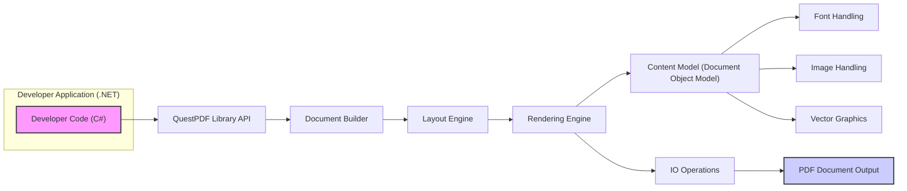
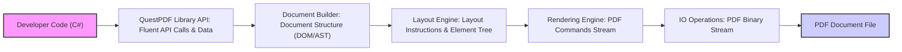

# Project Design Document: QuestPDF (Improved)

## 1. Introduction

### 1.1. Project Overview

QuestPDF is a modern, open-source .NET library designed for programmatic PDF document generation. It prioritizes developer experience by offering a fluent and declarative API for creating complex and visually appealing PDF layouts.  QuestPDF distinguishes itself by focusing on:

*   **Intuitive Layout System:**  A flexible and predictable layout engine enabling pixel-perfect control over document structure and element positioning.
*   **Comprehensive Feature Set:** Support for text, images, vector graphics, tables, lists, headers/footers, pagination, and more.
*   **Theming and Styling:**  Robust styling capabilities allowing for consistent document appearance and branding.
*   **Extensibility and Customization:**  Designed for extensibility, allowing developers to create custom elements and extend core functionalities.
*   **Performance and Efficiency:** Optimized for performance to handle large and complex documents efficiently.
*   **Cross-Platform Compatibility:** Built on .NET Standard to ensure compatibility across various .NET environments.
*   **Open Source and Community Driven:**  Developed as an open-source project, fostering community contributions and transparency.

This document provides a detailed design overview of QuestPDF, intended to serve as the basis for a thorough threat model and security assessment.

### 1.2. Purpose of this Document

This design document is created to facilitate a comprehensive threat modeling exercise for the QuestPDF library. It aims to provide security experts and developers with a clear understanding of the system's internal workings, data flow, and technology stack. This understanding is crucial for:

*   **Threat Identification:**  Systematically identifying potential threats and vulnerabilities within the QuestPDF library.
*   **Attack Surface Analysis:**  Mapping out the attack surfaces and entry points that malicious actors could potentially exploit.
*   **Risk Assessment:**  Evaluating the potential impact and likelihood of identified threats to prioritize security efforts.
*   **Security Control Design:**  Developing and implementing appropriate security controls and mitigation strategies to reduce identified risks.
*   **Secure Development Practices:**  Guiding secure development practices for ongoing maintenance and future development of QuestPDF.

This document is a living document and will be updated to reflect changes in the QuestPDF project's design and implementation.

## 2. System Architecture

### 2.1. Architecture Diagram

### 2.2. Component Descriptions

*   **"Developer Application (.NET)"**: Represents the external .NET application code that integrates and utilizes the QuestPDF library. This code, written by developers, uses the QuestPDF API to define the structure, content, and styling of PDF documents. It is the initial point of interaction with the QuestPDF library.
*   **"QuestPDF Library API"**: This is the public-facing API of the QuestPDF library, providing a fluent C# interface for developers. It exposes classes, methods, and interfaces for document creation, layout definition, content addition, styling, and configuration. This API acts as the entry point for all developer interactions with QuestPDF. Input validation and sanitization should ideally begin at this layer to protect against malicious input.
*   **"Document Builder"**:  This component is responsible for parsing and interpreting the developer's instructions received through the API. It translates the fluent API calls into an internal, structured representation of the PDF document, often referred to as a Document Object Model (DOM) or similar abstract syntax tree. This component is crucial for ensuring the logical structure of the document is correctly understood and prepared for layout.  It should perform validation to ensure API usage is correct and prevent unexpected document structures.
*   **"Layout Engine"**: The core layout engine is responsible for calculating the precise position and size of each element within the PDF document. It takes the document structure from the Document Builder and applies layout rules, considering factors like element types, styling, constraints, and page boundaries. This engine handles complex layout scenarios, including element nesting, floating elements, and page breaks.  Performance and efficiency are critical here to avoid excessive resource consumption during layout calculations.
*   **"Rendering Engine"**: This component takes the finalized layout information from the Layout Engine and translates it into the PDF format's drawing instructions. It handles the actual rendering of text, images, vector graphics, and other content onto the PDF pages according to the calculated layout.  This component is responsible for generating the binary PDF stream. Secure rendering practices are essential to prevent vulnerabilities related to content interpretation.
*   **"Content Model (Document Object Model)"**: This is the internal data structure, likely a tree-like Document Object Model (DOM), that represents the document being constructed. It holds all information about the document's structure, elements, content, styles, and metadata. It serves as the central repository of document information throughout the generation process, facilitating data sharing and manipulation between components.
*   **"Font Handling"**: This module manages font resources required for rendering text in the PDF document. It handles font loading, embedding, subsetting, and glyph rendering. It ensures that the correct fonts are used and embedded in the PDF to maintain document fidelity across different systems.  This component is a potential attack surface if it improperly handles or parses font files, especially if external fonts can be loaded.
*   **"Image Handling"**: This component is responsible for processing and embedding images into the PDF document. It supports various image formats (e.g., JPEG, PNG, TIFF) and handles image decoding, resizing, compression, and placement within the layout.  Image processing can be a source of vulnerabilities if not handled securely, requiring careful parsing and decoding to prevent exploits.
*   **"Vector Graphics"**: This module handles the rendering of vector graphics within the PDF document. It allows developers to include shapes, paths, and other vector-based elements defined using vector graphics commands. It interprets and renders vector graphics instructions into PDF drawing operations.  Similar to image and font handling, secure parsing and rendering of vector graphics data are important.
*   **"IO Operations"**: This component manages all input/output operations related to PDF generation. It handles the creation of the PDF file stream, writing the rendered PDF data to the output stream, and potentially managing temporary files or buffers. It might also be responsible for loading external resources like fonts or images from the file system or embedded resources. Secure file handling and access control are relevant considerations for this component.
*   **"PDF Document Output"**: This is the final generated PDF document file, a binary file conforming to the PDF specification. It contains all the formatted content, structure, and metadata as defined by the developer's code and processed by QuestPDF. This is the ultimate artifact produced by the library.

## 3. Data Flow

### 3.1. Data Flow Diagram

### 3.2. Data Description

*   **"Developer Code (C#)"**:  The initial input is C# code written by the developer. This code contains instructions for the QuestPDF library, defining the document's structure, content, and styling using the fluent API. This code is processed by the .NET runtime and interacts with the QuestPDF library.
*   **"QuestPDF Library API: Fluent API Calls & Data"**: Data passed through the API consists of method calls, object parameters, and configuration settings. This data represents the developer's intent for the PDF document, including text strings, image paths, styling information, and layout directives.  This is the primary input point from the user application and needs careful validation.
*   **"Document Builder: Document Structure (DOM/AST)"**: The Document Builder processes the API calls and constructs an in-memory representation of the document, likely a Document Object Model (DOM) or Abstract Syntax Tree (AST). This data structure represents the logical structure of the document, organized as a tree of elements and their properties. This internal representation facilitates further processing by subsequent components.
*   **"Layout Engine: Layout Instructions & Element Tree"**: The Layout Engine receives the document structure (DOM/AST) and generates layout instructions. This data includes information about element positions, sizes, margins, padding, and other layout-related properties. It's essentially a refined representation of the document structure with concrete layout information calculated.
*   **"Rendering Engine: PDF Commands Stream"**: The Rendering Engine consumes the layout instructions and generates a stream of PDF commands. This stream is a sequence of instructions in the PDF language that describe how to draw the document content. This is an intermediate, low-level representation of the document ready for final output.
*   **"IO Operations: PDF Binary Stream"**: The PDF commands stream is processed by the IO Operations component, which converts it into a binary PDF data stream. This stream is the raw binary content of the PDF file, encoded according to the PDF specification.
*   **"PDF Document File"**: The final output is the PDF document file, a binary file containing the complete PDF data stream. This file can be opened and viewed by any PDF reader application.

## 4. Technology Stack

*   **Programming Language:** C# (.NET)
*   **Target Framework:** .NET Standard (for broad cross-platform compatibility)
*   **PDF Generation Core:**  Likely implemented using direct PDF primitives and drawing commands within .NET's graphics libraries to minimize external dependencies and maximize control.  Alternatively, may use a carefully selected, minimal set of low-level PDF libraries for specific tasks, prioritizing security and stability.  The project aims to avoid large, complex external PDF libraries to reduce the attack surface.
*   **Image Processing Libraries:** Potentially utilizes built-in .NET image processing capabilities or minimal, well-vetted image libraries for decoding and encoding various image formats. Security and vulnerability history of any external image libraries would be a key consideration.
*   **Font Rendering:**  Leverages .NET's font rendering capabilities, potentially with custom logic for font embedding and subsetting.  If external font libraries are used, they would be carefully chosen and scrutinized for security.
*   **Build System:** Standard .NET build tools (MSBuild, .NET CLI)
*   **Version Control:** Git (GitHub - [https://github.com/questpdf/questpdf](https://github.com/questpdf/questpdf))

## 5. Security Considerations (Detailed)

This section expands on the initial security considerations, providing more specific examples and potential vulnerabilities:

*   **Dependency Vulnerabilities:**
    *   **Risk:**  Even with minimal dependencies, any external libraries used (especially for image processing, font handling, or low-level PDF operations) could contain known or unknown vulnerabilities.
    *   **Examples:** Vulnerabilities in image decoding libraries (e.g., buffer overflows in JPEG or PNG parsing), font parsing vulnerabilities (e.g., TrueType font parsing exploits).
    *   **Mitigation:**  Thoroughly vet and select external dependencies, prioritize libraries with strong security track records and active maintenance, perform regular dependency scanning and updates, consider static analysis tools to detect potential vulnerabilities in dependencies.

*   **Resource Exhaustion (Denial of Service):**
    *   **Risk:**  Maliciously crafted or excessively complex document structures could lead to excessive resource consumption (CPU, memory, disk I/O), causing denial of service.
    *   **Examples:**  Deeply nested layouts, extremely large images, documents with millions of pages, recursive element definitions.
    *   **Mitigation:** Implement resource limits and quotas (e.g., maximum document size, maximum number of elements, timeouts for layout and rendering operations), perform input validation to detect and reject overly complex document definitions, implement circuit breaker patterns to prevent cascading failures.

*   **Font Handling Vulnerabilities:**
    *   **Risk:**  Improper handling of font files, especially if external fonts can be loaded, could lead to vulnerabilities like buffer overflows, format string bugs, or arbitrary code execution.
    *   **Examples:**  Parsing maliciously crafted font files (e.g., OpenType, TrueType), vulnerabilities in font rendering engines.
    *   **Mitigation:**  Strictly validate font file formats, use secure font parsing libraries (if external libraries are used), sanitize font data, implement sandboxing for font rendering processes, restrict the ability to load external fonts or carefully control allowed font sources.

*   **Image Processing Vulnerabilities:**
    *   **Risk:**  Vulnerabilities in image decoding and processing logic could be exploited by providing malicious image files, leading to buffer overflows, memory corruption, or other exploits.
    *   **Examples:**  Exploiting vulnerabilities in JPEG, PNG, or TIFF decoders, image format string vulnerabilities, heap overflows during image resizing or compression.
    *   **Mitigation:**  Use secure and well-vetted image processing libraries, perform rigorous input validation on image files (format, size, metadata), sanitize image data, implement bounds checking and error handling in image processing routines, consider using sandboxed image processing.

*   **Vector Graphics Vulnerabilities:**
    *   **Risk:**  Improper parsing or rendering of vector graphics commands (e.g., SVG-like paths) could lead to vulnerabilities.
    *   **Examples:**  Exploiting vulnerabilities in path parsing or rendering logic, command injection in vector graphics instructions.
    *   **Mitigation:**  Sanitize and validate vector graphics data, use secure vector graphics rendering libraries, implement bounds checking and error handling in vector graphics processing.

*   **PDF Output Security Features Misuse/Vulnerabilities:**
    *   **Risk:** If QuestPDF implements PDF security features (e.g., password protection, encryption, digital signatures), vulnerabilities in their implementation could weaken or bypass these features.
    *   **Examples:**  Weak encryption algorithms, insecure key management, vulnerabilities in digital signature verification.
    *   **Mitigation:**  Use well-established and secure cryptographic libraries for implementing PDF security features, follow security best practices for key management, thoroughly test and audit the implementation of security features.

*   **Input Validation and Injection Attacks:**
    *   **Risk:**  While the primary input is C# code, the library API might accept data that could be maliciously crafted if not properly validated.
    *   **Examples:**  Path traversal vulnerabilities if file paths are accepted as input, format string vulnerabilities if user-provided strings are used in formatting operations, cross-site scripting (XSS) if generated PDFs are intended for web display (though less likely in typical PDF generation scenarios).
    *   **Mitigation:**  Implement robust input validation at the API level, sanitize all user-provided data, use parameterized queries or safe APIs to prevent injection attacks, avoid using user-provided data directly in potentially unsafe operations.

*   **Error Handling and Information Leakage:**
    *   **Risk:**  Poor error handling could lead to information leakage (e.g., revealing internal paths, configuration details, or sensitive data in error messages) or unexpected program termination, potentially aiding attackers in reconnaissance or exploitation.
    *   **Examples:**  Displaying stack traces in error messages, logging sensitive information, failing to handle exceptions gracefully.
    *   **Mitigation:**  Implement robust error handling and logging mechanisms, avoid exposing sensitive information in error messages, log errors securely, use generic error messages for external users while providing detailed logs for administrators, implement proper exception handling to prevent crashes and unexpected behavior.

## 6. Threat Modeling Scope

This design document provides a solid foundation for conducting a comprehensive threat model of the QuestPDF library. The next steps in the threat modeling process should include:

*   **Threat Actor Identification:**  Define potential threat actors and their motivations (e.g., external attackers, malicious insiders, developers using the library insecurely).
*   **Security Goal Definition:**  Clearly define security goals for QuestPDF (e.g., protect confidentiality, integrity, and availability of PDF generation; prevent generation of malicious PDFs; ensure secure operation of the library).
*   **Threat Analysis (STRIDE/PASTA):**  Apply a structured threat modeling methodology like STRIDE (Spoofing, Tampering, Repudiation, Information Disclosure, Denial of Service, Elevation of Privilege) or PASTA (Process for Attack Simulation and Threat Analysis) to systematically identify threats against each component and data flow described in this document.
*   **Attack Surface Mapping:**  Map out the attack surfaces, including API entry points, data inputs, external dependencies, and interactions with the operating system.
*   **Risk Assessment and Prioritization:**  Assess the likelihood and impact of each identified threat to prioritize mitigation efforts based on risk level.
*   **Mitigation Strategy Development:**  Develop specific security controls and mitigation strategies to address the identified risks. This may include code changes, security configuration, testing procedures, and security guidelines for developers using QuestPDF.
*   **Security Testing and Validation:**  Conduct security testing (e.g., penetration testing, fuzzing, static analysis) to validate the effectiveness of implemented security controls and identify any remaining vulnerabilities.

This document will serve as a crucial reference throughout the threat modeling process, ensuring a thorough and well-informed security analysis of the QuestPDF project. Regular review and updates of this document are essential to maintain its relevance and accuracy as the project evolves.