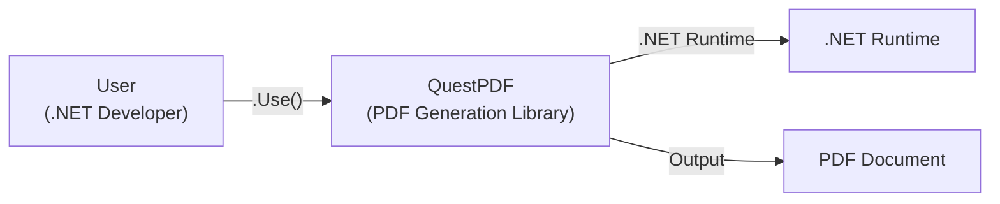
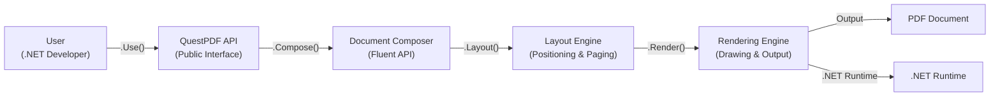
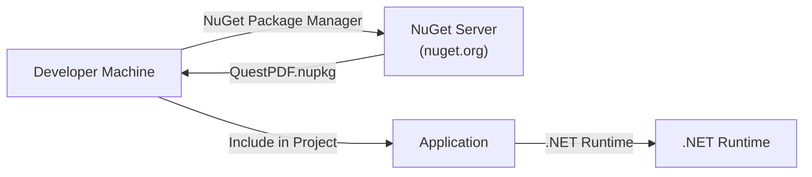
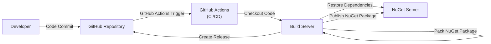

# BUSINESS POSTURE

Business Priorities and Goals:

*   Provide a reliable and efficient solution for PDF generation in .NET applications.
*   Offer a user-friendly API that simplifies the complex task of PDF creation.
*   Maintain high performance and low memory consumption for optimal resource utilization.
*   Ensure compatibility across different .NET environments.
*   Foster a strong open-source community for continuous improvement and support.
*   Establish QuestPDF as a leading .NET library for PDF generation.

Most Important Business Risks:

*   Inability to generate valid PDF documents, leading to data loss or corruption.
*   Performance bottlenecks or excessive memory usage, impacting application responsiveness.
*   Security vulnerabilities that could be exploited to compromise the system or data.
*   Lack of compatibility with specific .NET versions or platforms, limiting adoption.
*   Insufficient documentation or support, hindering developer productivity.
*   Competition from other PDF generation libraries, eroding market share.

# SECURITY POSTURE

Existing Security Controls:

*   security control: Input validation: The library performs input validation to prevent common vulnerabilities like buffer overflows or injection attacks. Implemented in the code, specifically in areas handling external data or user-provided content.
*   security control: Exception handling: Robust exception handling is implemented to gracefully handle errors and prevent unexpected application termination. Implemented throughout the codebase.
*   security control: Code reviews: Regular code reviews are conducted to identify and address potential security issues. Documented in pull requests and code review comments within the GitHub repository.
*   security control: Static analysis: Static analysis tools are used to detect potential vulnerabilities and code quality issues. Integrated into the build process, as indicated by the use of linters and code analysis tools.
*   security control: Dependency management: Dependencies are carefully managed to minimize the risk of introducing vulnerable libraries. Tracked and managed through the .NET project files and package manager.

Accepted Risks:

*   accepted risk: The library relies on external dependencies, which may introduce vulnerabilities beyond the project's direct control.
*   accepted risk: The library's performance may be affected by the complexity and size of the generated PDF documents.
*   accepted risk: The library may not be fully compatible with all possible .NET environments or configurations.

Recommended Security Controls:

*   security control: Fuzz testing: Implement fuzz testing to identify unexpected behavior and potential vulnerabilities by providing invalid or random inputs.
*   security control: Content Security Policy (CSP): If applicable, implement CSP to mitigate the risk of cross-site scripting (XSS) attacks.
*   security control: Regular security audits: Conduct regular security audits to identify and address potential vulnerabilities.

Security Requirements:

*   Authentication: Not directly applicable, as the library itself does not handle authentication.
*   Authorization: Not directly applicable, as the library itself does not handle authorization.
*   Input Validation:
    *   All inputs to the library should be validated to ensure they conform to expected types, lengths, and formats.
    *   Specific validation rules should be implemented based on the type and purpose of each input.
    *   Invalid inputs should be rejected with appropriate error messages.
*   Cryptography:
    *   If the library handles sensitive data, appropriate cryptographic algorithms should be used for encryption and hashing.
    *   Cryptographic keys should be securely managed and protected.
    *   Consider supporting PDF encryption features if required by users.
*   Output Encoding:
    *   Ensure that any data included in the PDF is properly encoded to prevent injection vulnerabilities.

# DESIGN

## C4 CONTEXT

Element Descriptions:

*   Element:
    *   Name: User
    *   Type: Person
    *   Description: A .NET developer who integrates QuestPDF into their application to generate PDF documents.
    *   Responsibilities: Uses the QuestPDF API to define the structure and content of PDF documents.
    *   Security controls: Not directly applicable.
*   Element:
    *   Name: QuestPDF
    *   Type: Software System
    *   Description: The QuestPDF library, a .NET library for generating PDF documents.
    *   Responsibilities: Provides an API for creating and manipulating PDF documents. Translates high-level instructions into low-level PDF syntax.
    *   Security controls: Input validation, Exception handling, Code reviews, Static analysis, Dependency management.
*   Element:
    *   Name: .NET Runtime
    *   Type: Platform
    *   Description: The .NET runtime environment required to execute QuestPDF.
    *   Responsibilities: Provides the necessary infrastructure for running .NET applications.
    *   Security controls: Relies on the security features of the .NET runtime itself.
*   Element:
    *   Name: PDF Document
    *   Type: Data
    *   Description: The generated PDF document.
    *   Responsibilities: Stores the final output in a standardized format.
    *   Security controls: Can be encrypted if required, using PDF encryption features.

## C4 CONTAINER

Element Descriptions:

*   Element:
    *   Name: User
    *   Type: Person
    *   Description: A .NET developer who integrates QuestPDF into their application.
    *   Responsibilities: Uses the QuestPDF API to define PDF content and structure.
    *   Security controls: Not directly applicable.
*   Element:
    *   Name: QuestPDF API
    *   Type: API
    *   Description: The public interface of the QuestPDF library.
    *   Responsibilities: Exposes methods and classes for developers to interact with the library.
    *   Security controls: Input validation.
*   Element:
    *   Name: Document Composer
    *   Type: Component
    *   Description: Provides a fluent API for defining document structure.
    *   Responsibilities: Allows developers to easily define elements like text, images, and tables.
    *   Security controls: Input validation.
*   Element:
    *   Name: Layout Engine
    *   Type: Component
    *   Description: Calculates the position and size of elements within the document.
    *   Responsibilities: Handles page breaks, margins, and element placement.
    *   Security controls: Input validation, Exception handling.
*   Element:
    *   Name: Rendering Engine
    *   Type: Component
    *   Description: Draws the elements onto the PDF document.
    *   Responsibilities: Translates the layout information into low-level PDF drawing commands.
    *   Security controls: Input validation, Exception handling.
*   Element:
    *   Name: .NET Runtime
    *   Type: Platform
    *   Description: The .NET runtime environment.
    *   Responsibilities: Provides the necessary infrastructure for running .NET applications.
    *   Security controls: Relies on the security features of the .NET runtime itself.
*   Element:
    *   Name: PDF Document
    *   Type: Data
    *   Description: The generated PDF document.
    *   Responsibilities: Stores the final output in a standardized format.
    *   Security controls: Can be encrypted if required.

## DEPLOYMENT

Possible Deployment Solutions:

1.  NuGet Package: The most common way to distribute .NET libraries. Developers can easily install and update QuestPDF using the NuGet package manager.
2.  Manual Download: Developers can download the library files directly from the GitHub repository and include them in their projects.
3.  Docker Image: While not the primary deployment method for a library, a Docker image could be created containing a sample application or a testing environment for QuestPDF.

Chosen Solution (NuGet Package):

Element Descriptions:

*   Element:
    *   Name: Developer Machine
    *   Type: Workstation
    *   Description: The developer's computer where the application is being developed.
    *   Responsibilities: Hosts the development environment, including the code editor, build tools, and NuGet package manager.
    *   Security controls: Relies on the security measures implemented on the developer's machine.
*   Element:
    *   Name: NuGet Server
    *   Type: Server
    *   Description: The central repository for NuGet packages (nuget.org).
    *   Responsibilities: Stores and serves NuGet packages to developers.
    *   Security controls: Relies on the security measures implemented by the NuGet server (e.g., package signing, vulnerability scanning).
*   Element:
    *   Name: QuestPDF.nupkg
    *   Type: File
    *   Description: The NuGet package containing the QuestPDF library.
    *   Responsibilities: Contains the compiled library files and metadata.
    *   Security controls: Can be digitally signed to ensure authenticity and integrity.
*   Element:
    *   Name: Application
    *   Type: Software System
    *   Description: The .NET application that uses QuestPDF.
    *   Responsibilities: Integrates and utilizes the QuestPDF library to generate PDF documents.
    *   Security controls: Inherits the security controls of the application and the QuestPDF library.
*   Element:
    *   Name: .NET Runtime
    *   Type: Platform
    *   Description: The .NET runtime environment.
    *   Responsibilities: Provides necessary infrastructure.
    *   Security controls: Relies on the security features of the .NET runtime itself.

## BUILD

Build Process Description:

1.  Developer commits code changes to the GitHub repository.
2.  GitHub Actions is triggered by the commit.
3.  GitHub Actions checks out the code onto a build server.
4.  The build server restores the necessary dependencies from the NuGet server.
5.  The project is built, producing the compiled library files.
6.  Unit tests are executed to ensure code quality and functionality.
7.  Static analysis tools (linters, code analyzers) are run to identify potential issues.
8.  The library is packaged into a NuGet package (QuestPDF.nupkg).
9.  The NuGet package is published to the NuGet server.
10. A release is created on the GitHub repository, marking the new version.

Security Controls in Build Process:

*   security control: Dependency management: NuGet is used to manage dependencies, allowing for tracking and updating of external libraries.
*   security control: Static analysis: Linters and code analyzers are used to detect potential vulnerabilities and code quality issues.
*   security control: Automated testing: Unit tests are run automatically to ensure code correctness and prevent regressions.
*   security control: CI/CD: GitHub Actions provides a secure and automated build environment.
*   security control: Code signing: The NuGet package can be digitally signed to ensure authenticity and integrity.

# RISK ASSESSMENT

Critical Business Processes to Protect:

*   PDF generation: The core functionality of the library must be reliable and secure.
*   Application integration: The library must integrate seamlessly with .NET applications without introducing vulnerabilities.
*   Reputation: Maintaining a positive reputation as a secure and reliable library is crucial.

Data to Protect and Sensitivity:

*   Source code: The source code of the library itself is not highly sensitive, as it is open-source. However, protecting it from unauthorized modification is important.
*   User data (indirectly): The library processes data provided by the user to generate PDF documents. The sensitivity of this data depends on the specific application and the content being included in the PDFs. The library itself does not store or transmit this data, but it should be designed to handle it securely.
*   Dependencies: Information about dependencies is not highly sensitive, but it's important to track them for security updates.

# QUESTIONS & ASSUMPTIONS

Questions:

*   Are there any specific compliance requirements (e.g., GDPR, HIPAA) that the library needs to consider?
*   Are there any specific security certifications or standards that the library aims to achieve?
*   What level of support will be provided for older .NET versions?
*   What is the expected usage pattern of the library (e.g., high-volume document generation, complex layouts)?
*   Will the library support advanced PDF features like digital signatures or form filling?

Assumptions:

*   BUSINESS POSTURE: The primary goal is to provide a reliable and efficient PDF generation library for .NET developers.
*   BUSINESS POSTURE: The project prioritizes ease of use and developer productivity.
*   BUSINESS POSTURE: The project values open-source collaboration and community contributions.
*   SECURITY POSTURE: The project follows secure coding practices and uses appropriate tools for vulnerability detection.
*   SECURITY POSTURE: The project relies on the security features of the .NET runtime and external dependencies.
*   SECURITY POSTURE: The project assumes that users will implement appropriate security measures in their applications that integrate QuestPDF.
*   DESIGN: The library is designed to be modular and extensible.
*   DESIGN: The library is primarily used as a NuGet package.
*   DESIGN: The build process is automated using GitHub Actions.
*   DESIGN: The library targets modern .NET versions.