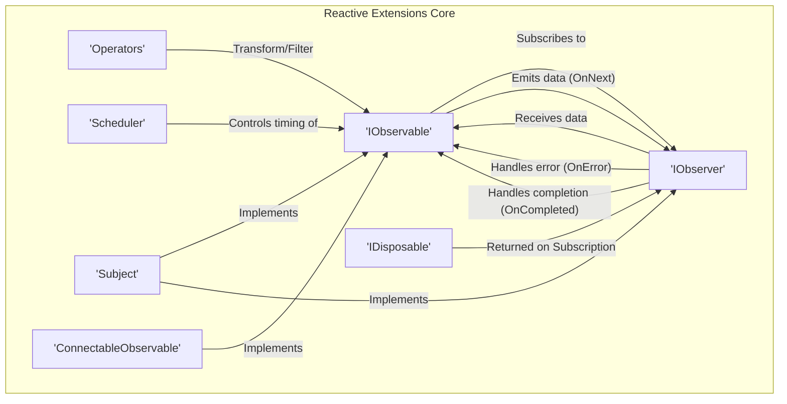

## Project Design Document: Reactive Extensions for .NET (`dotnet/reactive`) - Improved

**1. Introduction**

This document provides an enhanced architectural design of the Reactive Extensions for .NET (`dotnet/reactive`) project, building upon the previous version. It aims for greater clarity, detail, and a stronger focus on aspects relevant to threat modeling. This document serves as a foundational resource for security professionals and developers to understand the system's architecture, data flow, and potential security considerations.

**1.1. Purpose**

The primary purpose of this document is to provide a more detailed and refined architectural description of the `dotnet/reactive` library. This enhanced description will facilitate more effective threat modeling by providing a clearer understanding of the library's components, their interactions, and potential attack surfaces.

**1.2. Scope**

This document expands on the previous version by providing more specific examples and clarifying the boundaries of the `dotnet/reactive` library. It continues to focus on the core architectural components and concepts, including Observables, Observers, Schedulers, and Operators, but with added detail and context. It still does not delve into the specific implementation details of individual operators or the internal workings of the .NET runtime, but provides more concrete examples of their usage.

**1.3. Target Audience**

This document is intended for the same audience as the previous version, but with the expectation of providing a deeper and more actionable understanding:

* Security architects and engineers responsible for threat modeling and security assessments.
* Developers contributing to or using the `dotnet/reactive` library.
* Anyone seeking a deeper and more practical understanding of the library's architecture for security analysis.

**2. Overview**

The Reactive Extensions for .NET (`dotnet/reactive`), or Rx.NET, is a powerful library for composing asynchronous and event-based programs using observable sequences. It implements the observer pattern for data streams over time, offering a rich set of query operators for declarative sequence manipulation.

Key concepts remain:

* **Observable:** A stream of data or events emitted over time. It's the data producer.
* **Observer:** Consumes data from an Observable, reacting to new data, errors, and completion signals.
* **Operator:** Functions that transform, filter, combine, or otherwise manipulate observable sequences.
* **Scheduler:** Manages the concurrency and timing of notifications within an observable sequence.

**Example:**

```csharp
// Simple example of an Observable and Observer
IObservable<int> numbers = Observable.Range(1, 5);
IObserver<int> observer = Observer.Create<int>(
    onNext: x => Console.WriteLine($"Received: {x}"),
    onError: ex => Console.WriteLine($"Error: {ex.Message}"),
    onCompleted: () => Console.WriteLine("Completed")
);
numbers.Subscribe(observer);
```

**3. Architectural Design**

The `dotnet/reactive` library's architecture centers around the interaction of its core components.

* **Observable Abstractions:** Defines the `IObservable<T>` interface and related abstract classes, forming the foundation for reactive streams.
* **Observer Abstractions:** Defines the `IObserver<T>` interface and related helper classes for consuming observable data.
* **Core Operators:** A fundamental set of operators directly implemented within the core library, providing essential stream manipulation capabilities.
* **Extended Operators:** A vast collection of extension methods providing a wide range of data transformation and combination functionalities.
* **Scheduling Infrastructure:**  The `IScheduler` interface and concrete implementations for managing concurrency (e.g., `ThreadPoolScheduler`, `TaskPoolScheduler`, `ImmediateScheduler`).
* **Subject Implementations:** Concrete classes like `Subject<T>`, `BehaviorSubject<T>`, `ReplaySubject<T>` that act as both observables and observers.
* **Connectable Observable Implementations:** Classes like `ConnectableObservable<T>` that allow for controlled sharing of subscriptions.
* **Disposable Management:** The `IDisposable` interface and related classes for managing the lifecycle of subscriptions.

**3.1. Enhanced Component Diagram with Data Flow**



**3.2. Component Descriptions (Enhanced)**

* **`IObservable<T>`:** The core interface representing a push-based data stream. It signals data (`OnNext`), errors (`OnError`), and completion (`OnCompleted`) to its subscribers. Think of it as a contract for data producers.
* **`IObserver<T>`:** The interface defining how consumers react to data, errors, and completion signals from an `IObservable<T>`. Concrete implementations define the logic for handling these events.
* **Operators:** These are the workhorses of Rx.NET. They are implemented as extension methods on `IObservable<T>` and allow for declarative manipulation of data streams. Examples include:
    * **Transformation:** `Select`, `SelectMany`
    * **Filtering:** `Where`, `Distinct`
    * **Combination:** `Merge`, `CombineLatest`, `Zip`
    * **Error Handling:** `Catch`, `Retry`
    * **Time-based:** `Throttle`, `Debounce`, `Delay`
* **`Scheduler`:**  An abstraction for controlling the execution context of observable sequences. It determines which thread or context notifications are delivered on. Choosing the right scheduler is crucial for managing concurrency and responsiveness.
* **`Subject<T>`:** A versatile component that acts as both an observable and an observer. This allows for multicasting values to multiple subscribers and bridging different parts of a reactive system. Different types of subjects (e.g., `BehaviorSubject`, `ReplaySubject`) offer varying behaviors regarding the caching and replaying of values.
* **`ConnectableObservable<T>`:** An observable that remains dormant until its `Connect()` method is called. This allows multiple observers to subscribe before the observable starts emitting items, ensuring they all receive the same sequence of data.
* **`IDisposable`:** Represents a resource that needs to be cleaned up. In the context of Rx.NET, the `IDisposable` returned by `Subscribe()` is used to unsubscribe from an observable, stopping the flow of notifications and releasing associated resources.

**3.3. Key Interactions (More Detailed)**

1. **Subscription Initiation:** An `IObserver<T>` subscribes to an `IObservable<T>` by calling its `Subscribe()` method. This action establishes a connection and often triggers the observable to start producing data.
2. **Data Emission and Propagation:** The `IObservable<T>` emits data items by invoking the `OnNext()` method of all its subscribed `IObserver<T>` instances. This data may have been transformed or filtered by intervening operators.
3. **Error Signaling:** If an error occurs within the observable's data production or processing pipeline, it signals this by calling the `OnError(Exception error)` method of its subscribers. This typically terminates the sequence.
4. **Completion Signaling:** When the observable has finished emitting all its data (and will not produce any more), it signals completion by calling the `OnCompleted()` method of its subscribers.
5. **Operator Chaining and Transformation:** Operators are applied to observables to create new observables with modified behavior. This often involves creating intermediary observer implementations that handle the specific logic of the operator. For example, the `Where` operator creates an observer that only forwards items that satisfy a given predicate.
6. **Scheduler Influence:** Schedulers dictate the thread or context on which the `OnNext`, `OnError`, and `OnCompleted` methods of observers are invoked. This is crucial for managing concurrency and ensuring operations are performed on appropriate threads (e.g., UI thread).
7. **Unsubscription and Resource Management:** When an observer no longer needs to receive notifications, it can call the `Dispose()` method on the `IDisposable` returned during subscription. This unsubscribes the observer and allows the observable to release any resources associated with that subscription.

**4. Data Flow (Concrete Example)**

Consider a scenario where we want to process user input, filtering out short strings and converting the rest to uppercase:

1. **Source Observable:** An observable is created from a user input event stream (`IObservable<string> userInput`).
2. **Filtering Operator:** The `Where` operator is applied to `userInput` to create a new observable that only emits strings with a length greater than 3 (`userInput.Where(s => s.Length > 3)`).
3. **Transformation Operator:** The `Select` operator is then applied to the filtered observable to create another observable that emits the uppercase version of the strings (`userInput.Where(s => s.Length > 3).Select(s => s.ToUpper())`).
4. **Observer Subscription:** An observer subscribes to the final observable in the chain.
5. **Data Processing:** When the user enters a string longer than 3 characters, the `Where` operator allows it to pass through. The `Select` operator then converts it to uppercase.
6. **Notification:** The uppercase string is then delivered to the subscribed observer's `OnNext()` method.

**5. Security Considerations (Detailed for Threat Modeling)**

Building upon the previous version, here are more detailed security considerations relevant for threat modeling:

* **Resource Exhaustion (Amplified):**
    * **Threat:** A malicious or poorly designed observable could emit an unbounded stream of data, consuming excessive memory or CPU.
    * **Example:** An observable connected to a rapidly updating sensor without proper throttling could overwhelm the system.
    * **Mitigation:** Implement backpressure mechanisms, use time-based operators like `Throttle` or `Debounce`, and set limits on buffer sizes.
* **Unhandled Exceptions (Exposure Risk):**
    * **Threat:** Exceptions thrown within observable sequences or operator logic might not be handled correctly, potentially crashing the application or exposing sensitive information in error messages or logs.
    * **Example:** An operator performing a database query might throw an exception containing connection details if the connection fails.
    * **Mitigation:** Use `Catch` operators to gracefully handle exceptions, log errors securely, and avoid exposing sensitive information in error messages.
* **Concurrency Issues (Race Conditions):**
    * **Threat:** Incorrect use of schedulers or shared mutable state within operators can lead to race conditions, data corruption, or unexpected behavior.
    * **Example:** Multiple observers updating a shared variable concurrently without proper synchronization.
    * **Mitigation:** Carefully choose appropriate schedulers, minimize shared mutable state, and use synchronization primitives if necessary.
* **Data Exposure (Unintentional Leaks):**
    * **Threat:** Sensitive data processed within observable sequences might be unintentionally logged, stored, or transmitted due to improper handling.
    * **Example:** An observable processing user credentials might inadvertently log them if logging is not configured to filter sensitive information.
    * **Mitigation:** Implement secure logging practices, avoid storing sensitive data unnecessarily, and ensure data transformations do not inadvertently expose sensitive information.
* **Supply Chain Security (Dependency Vulnerabilities):**
    * **Threat:** Vulnerabilities in the `dotnet/reactive` library itself or its dependencies could be exploited.
    * **Mitigation:** Keep the library and its dependencies updated, regularly scan for vulnerabilities, and follow secure development practices.
* **Malicious Observables/Observers (Code Injection):**
    * **Threat:** If external code can provide observables or observers, malicious actors could inject code that performs unauthorized actions.
    * **Example:** An application accepting user-defined operators could be vulnerable to code injection if those operators are not properly sandboxed.
    * **Mitigation:** Carefully validate and sanitize any externally provided observables or observers, and avoid executing untrusted code.
* **Timing Attacks (Information Disclosure):**
    * **Threat:** The timing of events within observable sequences could be exploited to infer sensitive information.
    * **Example:** The time it takes for an observable to emit a value might reveal information about the success or failure of an operation.
    * **Mitigation:** Be aware of potential timing attack vectors and implement countermeasures like adding artificial delays or masking timing differences.
* **Backpressure Vulnerabilities (DoS):**
    * **Threat:** If an observable produces data faster than its observers can consume it, leading to unbounded buffering and potential denial of service.
    * **Mitigation:** Implement backpressure strategies using operators like `Buffer`, `Window`, `Sample`, or by implementing custom backpressure handling.

**6. Assumptions and Constraints**

* This document assumes a foundational understanding of reactive programming principles.
* The threat modeling process will delve deeper into specific attack vectors and mitigation strategies.
* The focus remains on the architectural aspects relevant to security analysis.

**7. Future Considerations**

* Further analysis of the security implications of specific operators and their potential for misuse.
* Development of security best practices and guidelines for using Rx.NET in security-sensitive applications.
* Exploration of static analysis tools and techniques for identifying potential security vulnerabilities in Rx.NET code.
* Investigation of the security implications of integrating Rx.NET with other asynchronous programming models.

This improved design document provides a more comprehensive and detailed understanding of the `dotnet/reactive` library's architecture, enhancing its value for threat modeling and security analysis. The added examples and more specific security considerations offer a more actionable foundation for identifying and mitigating potential security risks.