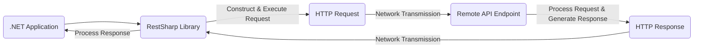
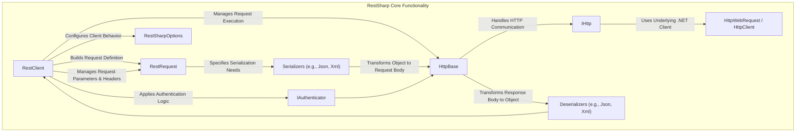
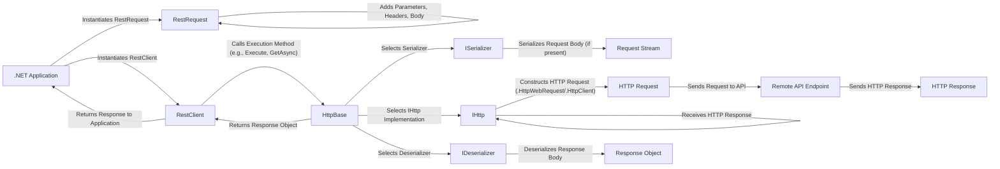

## Project Design Document: RestSharp HTTP Client Library (Improved)

**1. Introduction**

This document provides an enhanced design overview of the RestSharp HTTP client library for .NET. It aims to offer a more detailed understanding of the library's architecture, core components, data flow, and, critically, its security implications. This document is specifically crafted to serve as a robust foundation for subsequent threat modeling activities.

**2. Goals and Objectives**

*   To offer a developer-friendly and intuitive interface for executing HTTP requests within .NET applications.
*   To comprehensively support standard HTTP methods, including GET, POST, PUT, DELETE, PATCH, HEAD, and OPTIONS.
*   To facilitate seamless request and response serialization/deserialization for prevalent data formats such as JSON and XML, with extensibility for others.
*   To provide a flexible and extensible framework for implementing diverse authentication schemes.
*   To ensure reliable operation through robust error handling mechanisms and configurable retry policies.
*   To enable fine-grained control over request construction, including headers, query parameters, and request body.
*   To support both synchronous and asynchronous request execution patterns.
*   To maintain a performant and lightweight library footprint, minimizing overhead on consuming applications.

**3. Target Audience**

This document is primarily intended for:

*   Security architects and engineers tasked with performing threat modeling and security assessments of systems utilizing RestSharp.
*   Software architects and developers requiring an in-depth understanding of RestSharp's internal mechanisms and potential security ramifications.
*   Quality assurance engineers involved in the testing and validation of applications employing RestSharp.

**4. System Architecture**

**4.1. High-Level Architecture**

*   The `.NET Application` initiates HTTP interactions by utilizing the RestSharp library.
*   The `RestSharp Library` encapsulates the logic for constructing, configuring, and executing HTTP requests, and processing responses.
*   The `HTTP Request` represents the structured data transmitted to the external API.
*   The `Remote API Endpoint` signifies the external service being targeted by the HTTP request.
*   The `HTTP Response` represents the data returned by the external API in response to the request.

**4.2. Component-Level Architecture**

*   **`RestClient`**: Serves as the primary interface for interacting with RestSharp. It manages the base URL, default parameters, and facilitates request execution.
*   **`RestRequest`**: Represents a specific HTTP request, encapsulating details such as the resource URL, HTTP method, parameters, headers, and request body.
*   **`HttpBase`**: An abstract base class responsible for the core logic of executing HTTP requests, independent of the underlying HTTP client implementation.
*   **`IHttp`**: An interface defining the contract for performing HTTP communication, allowing for different underlying implementations.
*   **`HttpWebRequest / HttpClient`**: The concrete .NET classes used for making HTTP requests. RestSharp dynamically selects or allows configuration of the preferred implementation.
*   **`Serializers (e.g., Json, Xml)`**: Components responsible for converting .NET objects into the format required for the request body (e.g., JSON, XML). Implementations often rely on external libraries.
*   **`Deserializers (e.g., Json, Xml)`**: Components responsible for converting the response body from formats like JSON or XML back into .NET objects.
*   **`IAuthenticator`**: An interface defining the contract for authentication mechanisms. Concrete implementations handle adding authentication details to requests (e.g., Basic Auth headers, OAuth tokens).
*   **`RestSharpOptions`**:  A class holding various configuration options for the `RestClient`, such as timeouts, default headers, proxy settings, and authentication providers.

**5. Data Flow**

1. The `.NET Application` creates an instance of `RestRequest`, specifying the target resource and HTTP method.
2. Necessary parameters, headers, and the request body (if applicable) are added to the `RestRequest` instance.
3. A `RestClient` instance is created, often configured with the base URL of the target API.
4. The application calls an execution method on the `RestClient` (e.g., `Execute`, `GetAsync`), passing the `RestRequest`.
5. `HttpBase` determines the appropriate `ISerializer` based on the request's `RequestFormat`.
6. The selected `ISerializer` converts the request body object into a streamable format.
7. `HttpBase` selects the configured or default `IHttp` implementation.
8. The chosen `IHttp` implementation utilizes `HttpWebRequest` or `HttpClient` to construct the underlying HTTP request message.
9. The HTTP request is transmitted to the `Remote API Endpoint`.
10. The `Remote API Endpoint` processes the request and generates an `HTTP Response`.
11. The `IHttp` implementation receives the `HTTP Response`.
12. `HttpBase` determines the appropriate `IDeserializer` based on the response's `Content-Type`.
13. The selected `IDeserializer` converts the response body stream into a .NET object.
14. `HttpBase` returns the deserialized response object to the `RestClient`.
15. The `RestClient` returns the response object to the calling `.NET Application`.

**6. Security Considerations**

*   **Transport Layer Security (TLS) Enforcement:** RestSharp relies on the underlying .NET framework for secure communication. Applications *must* enforce HTTPS to protect data in transit.
    *   **Threat:** Man-in-the-middle attacks could intercept sensitive data if HTTP is used.
    *   **Mitigation:** Ensure `RestClient` instances are configured to use `https://` for sensitive endpoints. Implement certificate pinning for enhanced security.
*   **Authentication Mechanism Security:** RestSharp supports various authentication methods, each with its own security implications.
    *   **Basic Authentication:** Credentials transmitted in plaintext (Base64 encoded) are vulnerable without HTTPS.
        *   **Threat:** Credential theft via eavesdropping.
        *   **Mitigation:** *Always* use Basic Authentication over HTTPS. Avoid storing credentials directly in code; use secure configuration mechanisms.
    *   **OAuth 2.0:** Improper implementation can lead to vulnerabilities.
        *   **Threats:** Authorization code interception, access token theft, insecure storage of refresh tokens, open redirects.
        *   **Mitigation:** Adhere strictly to OAuth 2.0 specifications. Validate redirect URIs. Securely store refresh tokens. Use the principle of least privilege for scopes.
    *   **API Keys:** Treat API keys as secrets.
        *   **Threat:** Exposure of API keys leading to unauthorized access and potential abuse.
        *   **Mitigation:** Avoid embedding API keys in code. Use environment variables or secure vault solutions. Implement key rotation.
    *   **Custom Authentication:**  Security depends entirely on the implementation.
        *   **Threat:**  Vulnerabilities inherent in the custom logic (e.g., weak hashing, insecure token generation).
        *   **Mitigation:**  Thorough security review and testing of custom authentication implementations are crucial. Follow secure coding practices.
*   **Input Validation and Request Construction:** Data used to build requests originates from the application.
    *   **Threat:** Header injection, parameter pollution, and other injection vulnerabilities if user-supplied data is not properly sanitized and encoded.
    *   **Mitigation:**  Validate and sanitize all user inputs before incorporating them into request parameters, headers, or the request body. Use parameterized requests where possible.
*   **Response Handling and Output Encoding:** Processing API responses requires careful attention.
    *   **Threat:** Cross-site scripting (XSS) vulnerabilities if response data is displayed in a web UI without proper encoding.
    *   **Mitigation:**  Implement appropriate output encoding based on the context where the data is being displayed (e.g., HTML encoding for web pages).
*   **Dependency Vulnerabilities:** RestSharp relies on other NuGet packages.
    *   **Threat:**  Known vulnerabilities in dependencies could be exploited.
    *   **Mitigation:**  Regularly update RestSharp and its dependencies to the latest versions. Monitor security advisories for known vulnerabilities.
*   **Error Handling and Information Disclosure:**  How errors are handled can reveal sensitive information.
    *   **Threat:**  Error messages might expose internal system details or sensitive data.
    *   **Mitigation:**  Implement generic error handling and logging. Avoid displaying detailed error messages to end-users in production environments.
*   **Rate Limiting and Denial of Service:** Uncontrolled request patterns can lead to abuse.
    *   **Threat:**  Overwhelming the target API, leading to service disruption or being blocked.
    *   **Mitigation:** Implement retry policies with exponential backoff. Respect API rate limits. Consider circuit breaker patterns.
*   **Secure Defaults and Configuration:**  The default settings of RestSharp should be reviewed.
    *   **Threat:** Insecure default configurations might leave applications vulnerable.
    *   **Mitigation:**  Review and configure RestSharp options appropriately, such as setting reasonable timeouts.
*   **Serialization and Deserialization Vulnerabilities:**  Flaws in serialization libraries can be exploited.
    *   **Threat:**  Remote code execution or denial-of-service through malicious payloads.
    *   **Mitigation:**  Keep serialization libraries up-to-date. Be cautious when deserializing data from untrusted sources. Consider using safe deserialization settings.

**7. Deployment Considerations**

*   RestSharp is typically deployed as a NuGet package alongside the .NET application.
*   No specific deployment infrastructure is solely required for RestSharp.
*   Security during deployment focuses on the application itself (e.g., secure configuration management, secure deployment pipelines, protecting connection strings and API keys).

**8. Future Considerations**

*   Potential integration with more advanced HTTP client features available in newer .NET versions.
*   Enhanced support for emerging authentication standards and protocols.
*   Further improvements in error handling, logging, and observability.

This improved design document provides a more comprehensive and security-focused overview of the RestSharp library. It highlights key areas that require careful consideration during threat modeling to ensure the secure utilization of this HTTP client library.