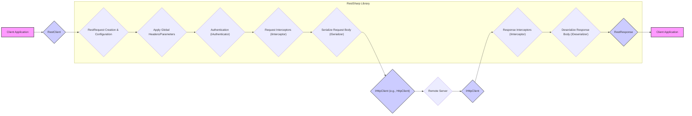
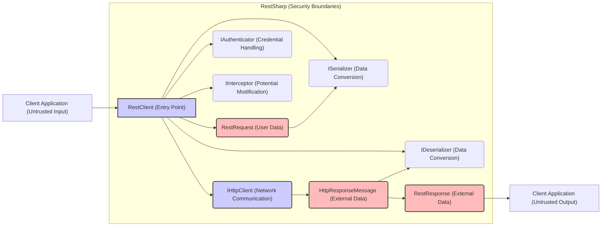

# Project Design Document: RestSharp - Improved Version

**1. Introduction**

This document provides an enhanced architectural design of the RestSharp library, an open-source HTTP client library for .NET. Its primary purpose is to serve as a detailed reference for understanding the library's structure, components, and data flow, specifically to facilitate comprehensive threat modeling activities. This document outlines the key elements of RestSharp that are highly relevant from a security perspective, aiming to identify potential vulnerabilities and attack vectors.

**2. Goals**

*   Clearly and comprehensively define the architecture and components of the RestSharp library, with a focus on security implications.
*   Illustrate the data flow within the library during request processing, highlighting security-sensitive stages.
*   Identify key external dependencies and their potential security risks.
*   Provide a robust and detailed foundation for subsequent threat modeling exercises, enabling the identification of potential threats and mitigation strategies.

**3. Target Audience**

This document is intended for:

*   Security architects and engineers responsible for performing threat modeling and security assessments.
*   Developers contributing to the RestSharp library, ensuring secure development practices.
*   Developers using the RestSharp library, enabling them to understand and mitigate potential security risks in their applications.
*   Anyone requiring a deep understanding of RestSharp's internal workings, particularly from a security standpoint.

**4. Scope**

This document covers the core functionalities of RestSharp related to constructing, executing, and handling HTTP requests and responses. It focuses on the logical architecture, data flow, and key interfaces within the library itself. It includes considerations for how RestSharp interacts with the underlying .NET networking stack and external serialization libraries but does not delve into the implementation details of those external components.

**5. Architectural Overview**

RestSharp offers a fluent interface to simplify the process of making HTTP requests. It abstracts away much of the complexity involved in creating and sending HTTP messages, handling responses, and serializing/deserializing data. Understanding this abstraction is crucial for identifying where security controls need to be applied.

*   The central component is the `RestClient`, responsible for managing the base URL, executing requests, and orchestrating the interaction between other components.
*   `RestRequest` objects encapsulate all the necessary details for a specific HTTP request, acting as the carrier of potentially sensitive information.
*   Interceptors provide a mechanism to inspect and modify requests and responses, offering both opportunities for enhancement and potential security risks if misused.
*   Authenticators manage the addition of authentication information, a critical aspect of secure communication.
*   Serializers and deserializers handle the conversion of data between .NET objects and various data formats, a stage where vulnerabilities related to data injection or parsing errors can occur.

**6. Component Design**

*   **RestClient:**
    *   Manages the base URL for API interactions, influencing the scope of requests.
    *   Holds global configuration settings like timeouts, default headers, and proxy settings, which can have security implications.
    *   Provides the primary methods for executing `RestRequest` objects, acting as the entry point for network communication.
    *   Orchestrates the invocation of registered interceptors and authenticators, highlighting the importance of secure management of these extensions.
    *   Internally utilizes an `IHttpClient` (typically the standard .NET `HttpClient`) to perform the actual low-level HTTP communication, inheriting its security characteristics and potential vulnerabilities.

*   **RestRequest:**
    *   Represents a single HTTP request, carrying potentially sensitive data.
    *   Contains properties defining the target resource URI, which needs careful validation to prevent unintended access.
    *   Specifies the HTTP method, influencing the intended action on the server.
    *   Includes request headers, which can contain authentication tokens, cookies, and other sensitive information, requiring secure handling.
    *   Holds request parameters (query parameters, form data), a common target for injection attacks if not properly sanitized.
    *   Contains the request body (for methods like POST and PUT), which can carry structured data susceptible to manipulation or injection.
    *   May include specific authentication information, potentially overriding global settings.
    *   Defines the data format for serialization, influencing the choice of serializer and potential parsing vulnerabilities.

*   **IRestClient (Interface):**
    *   Defines the contract for a RestSharp client, allowing for custom implementations and facilitating testing.
    *   Custom implementations could introduce security vulnerabilities if not carefully designed and reviewed.

*   **IRestRequest (Interface):**
    *   Defines the contract for a RestSharp request, enabling extensibility and customization.
    *   Custom request implementations might bypass built-in security mechanisms if not implemented correctly.

*   **IRestResponse (Interface):**
    *   Represents the response received from the HTTP request, containing information that needs careful handling.
    *   Includes the HTTP status code, indicating the outcome of the request.
    *   Contains response headers, which can reveal server information or security policies.
    *   Holds the response content (as a string or byte array), potentially containing sensitive data that needs proper sanitization before display.
    *   Provides access to deserialized response data, where parsing vulnerabilities could exist.
    *   May contain error information, which should be handled carefully to avoid leaking sensitive details.

*   **IAuthenticator (Interface):**
    *   Defines the contract for authenticating requests, a critical security component.
    *   Implementations handle various authentication schemes (e.g., Basic, OAuth, API keys), each with its own security considerations.
    *   Modifies the `RestRequest` before it's sent to add authentication headers or parameters, requiring secure storage and handling of credentials.

*   **ISerializer (Interface):**
    *   Defines the contract for serializing .NET objects into a specific format for the request body.
    *   Implementations handle the conversion logic for different data formats (e.g., JSON, XML), and vulnerabilities in these implementations could lead to injection attacks.

*   **IDeserializer (Interface):**
    *   Defines the contract for deserializing the response content into .NET objects.
    *   Implementations handle the conversion logic for different data formats, and vulnerabilities here could allow malicious data to be parsed and executed.

*   **IInterceptor (Interface):**
    *   Defines the contract for intercepting requests and responses, providing a powerful mechanism for customization but also a potential attack vector.
    *   Implementations can modify requests before they are sent (request interceptors) or process responses after they are received (response interceptors).
    *   Useful for logging, adding custom headers, or handling specific error scenarios, but malicious interceptors could inject code or exfiltrate data.

**7. Data Flow**

**Detailed Data Flow with Security Considerations:**

1. **Client Application Initiates Request:** The application creates an instance of `RestClient` and then constructs a `RestRequest` object, specifying the target resource, HTTP method, headers, and body. *Security Consideration: Ensure proper input validation at this stage to prevent injection of malicious data into the request.*
2. **Request Configuration:** Headers and parameters are added to the `RestRequest`. *Security Consideration: Validate and sanitize all user-provided input for headers and parameters to prevent injection attacks.*
3. **Apply Global Configurations:** The `RestClient` applies any globally configured headers or parameters to the `RestRequest`. *Security Consideration: Review global configurations for any potentially insecure defaults.*
4. **Authentication:** If an `IAuthenticator` is registered, it modifies the `RestRequest` to include authentication details. *Security Consideration: Securely manage and store authentication credentials. Ensure the chosen authentication method is appropriate for the sensitivity of the data.*
5. **Request Interception:** Registered `IInterceptor` instances are invoked to potentially inspect and modify the `RestRequest` before sending. *Security Consideration: Thoroughly vet and trust any registered interceptors, as malicious interceptors could compromise the request.*
6. **Serialization:** If a request body is present, the appropriate `ISerializer` is used to convert the .NET object into the specified format (e.g., JSON, XML). *Security Consideration: Be aware of potential vulnerabilities in the serialization process, such as insecure deserialization, which could allow for remote code execution.*
7. **HTTP Execution:** The `RestClient` utilizes an `IHttpClient` (typically the .NET `HttpClient`) to send the HTTP request to the remote server. *Security Consideration: Ensure TLS/HTTPS is configured to protect data in transit. Be aware of potential vulnerabilities in the underlying `HttpClient` implementation.*
8. **Remote Server Processing:** The remote server processes the request and generates a response. *This is outside the scope of RestSharp but is a crucial part of the overall security landscape.*
9. **Response Reception:** The `IHttpClient` receives the HTTP response from the server.
10. **Response Interception:** Registered `IInterceptor` instances are invoked to process the received `RestResponse`. *Security Consideration:  Thoroughly vet and trust any registered response interceptors, as malicious interceptors could manipulate the response data.*
11. **Deserialization:** If expected, the appropriate `IDeserializer` is used to convert the response content into .NET objects. *Security Consideration: Be aware of potential vulnerabilities in the deserialization process, which could lead to code execution or data corruption.*
12. **Response Handling:** A `RestResponse` object is created, containing the status code, headers, and raw content.
13. **Response Returned:** The `RestResponse` (or the deserialized object) is returned to the client application. *Security Consideration: Sanitize and validate the response data before displaying or using it in the application to prevent vulnerabilities like XSS.*

**8. External Dependencies**

*   **.NET Standard Library:** RestSharp relies on the .NET Standard Library for core functionalities like networking, threading, and basic data structures. *Security Consideration: Stay updated with the latest .NET Standard Library versions to benefit from security patches.*
*   **System.Net.Http:** The underlying HTTP client implementation used by RestSharp. *Security Consideration: Be aware of known vulnerabilities in `System.Net.Http` and ensure the .NET runtime is up-to-date.*
*   **Serialization Libraries (e.g., Newtonsoft.Json, System.Text.Json, System.Xml.Serialization):** RestSharp integrates with various serialization libraries for handling different data formats. The specific library used depends on the configuration and the requested content type. *Security Consideration:  Serialization libraries are frequent targets for vulnerabilities. Keep these libraries updated and be aware of best practices for secure serialization and deserialization to prevent issues like insecure deserialization attacks.*

**9. Security Considerations (Detailed for Threat Modeling)**

*   **Input Validation & Sanitization:**  RestSharp relies on the user to provide correct input for URIs, headers, and parameters. Lack of proper validation and sanitization of user-provided data can lead to various injection attacks (e.g., SQL injection if parameters are used to construct database queries on the server, command injection if parameters are passed to shell commands).
*   **Output Encoding:** While RestSharp handles the transmission of data, developers must implement proper output encoding when displaying or processing data received from the API to prevent cross-site scripting (XSS) vulnerabilities. Failure to encode data before rendering it in a web page can allow attackers to inject malicious scripts.
*   **Authentication Handling & Credential Management:** Secure storage and handling of authentication credentials are paramount. Developers need to choose appropriate authentication methods (e.g., OAuth 2.0 over Basic Auth where possible) and ensure secure credential management practices are followed (e.g., using secure storage mechanisms, avoiding hardcoding credentials). Improper handling can lead to credential theft and unauthorized access.
*   **TLS/HTTPS Configuration:** Ensuring that communication with the remote server occurs over HTTPS is critical to protect data in transit from eavesdropping and manipulation. Verify that the underlying `HttpClient` is configured to enforce HTTPS and validate server certificates. Mismatched configurations or allowing insecure connections can expose sensitive data.
*   **Dependency Vulnerabilities:** Vulnerabilities in the underlying .NET libraries or the chosen serialization libraries can directly impact RestSharp. Regularly scan dependencies for known vulnerabilities and update to patched versions promptly. Using outdated libraries introduces known security risks.
*   **Error Handling & Information Disclosure:** Detailed error messages in responses can inadvertently leak sensitive information about the application or the server-side implementation to potential attackers. Implement proper error handling that provides useful information for debugging but avoids exposing sensitive details.
*   **Request Forgery (CSRF):** When making requests that modify data (e.g., POST, PUT, DELETE), developers need to implement appropriate CSRF protection mechanisms. RestSharp itself doesn't inherently provide this protection, so developers must implement it at the application level (e.g., using anti-forgery tokens).
*   **Rate Limiting and Abuse:** While RestSharp facilitates making requests, it doesn't inherently handle rate limiting. Developers need to implement strategies to avoid overwhelming APIs, which could lead to denial-of-service for the target service or their own application being blocked.
*   **Interceptor Security:** Malicious or poorly written interceptors can pose a significant security risk by modifying requests or responses in unintended ways, potentially injecting malicious code or exfiltrating sensitive data. Carefully review and trust any custom interceptor implementations.
*   **Insecure Deserialization:** Vulnerabilities in the deserialization process can allow attackers to inject malicious data into the response and potentially execute arbitrary code on the application server. Use secure deserialization practices and keep serialization libraries updated.

**10. Deployment Considerations**

RestSharp is typically included as a NuGet package in .NET projects. Its deployment is generally straightforward but requires consideration of the following security aspects:

*   **Secure Package Management:** Ensure that RestSharp and its dependencies are downloaded from trusted sources (e.g., official NuGet repository) to avoid using compromised packages.
*   **Configuration Security:** Securely manage any configuration settings related to RestSharp, such as base URLs or API keys, especially in production environments. Avoid storing sensitive information directly in configuration files; use environment variables or secure configuration providers.
*   **Network Security:** Deploy the application in a secure network environment with appropriate firewall rules to restrict access to necessary external services.
*   **Regular Updates:** Keep RestSharp and its dependencies updated to benefit from security patches and bug fixes.

**11. Future Considerations**

*   Exploring built-in mechanisms for certificate pinning to enhance trust and prevent man-in-the-middle attacks.
*   Providing more guidance and tooling for implementing common security patterns, such as automatic CSRF token handling.
*   Enhancing documentation with detailed security best practices and recommendations for secure usage.
*   Investigating options for built-in request and response validation capabilities.

**12. Diagrams**

*   **Component Diagram (Security Focused):**

This improved document provides a more detailed and security-focused overview of the RestSharp library's design. The enhanced descriptions of components, the detailed data flow with security considerations, and the expanded security considerations section offer a more robust foundation for effective threat modeling.