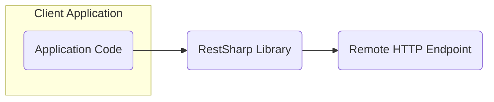
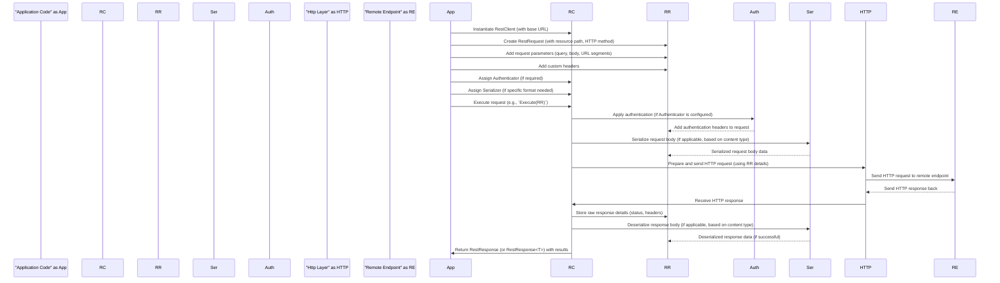

## Project Design Document: RestSharp HTTP Client Library (Improved)

**1. Introduction**

This document provides an enhanced and more detailed design overview of the RestSharp project, an open-source HTTP client library for .NET. The primary purpose of this document is to clearly articulate the architecture, components, and data flow within RestSharp, specifically to serve as a robust foundation for subsequent threat modeling activities. It emphasizes the key functionalities, design choices, and potential security implications for applications utilizing this library.

**2. Goals and Objectives**

The core goals of RestSharp are to:

*   Significantly simplify the process of making HTTP requests from .NET applications.
*   Offer a fluent and intuitive API for constructing and customizing HTTP requests.
*   Provide comprehensive support for standard HTTP methods (GET, POST, PUT, DELETE, PATCH, HEAD, OPTIONS).
*   Facilitate seamless request and response serialization/deserialization for common data formats (JSON, XML, etc.).
*   Offer a flexible and extensible framework for implementing various authentication mechanisms (Basic, OAuth 1.0/2.0, API Key, etc.).
*   Provide robust mechanisms for managing HTTP headers, cookies, and other essential HTTP constructs.
*   Enable extensibility through interfaces and abstract classes, allowing for custom behaviors and integrations.
*   Abstract away the complexities of underlying HTTP implementations (like `WebRequest` or `HttpClient`).

**3. Architectural Overview**

RestSharp employs a client-centric architecture, acting as a well-defined intermediary between the consuming .NET application and remote HTTP endpoints. The central point of interaction within RestSharp is the `RestClient` class, which is responsible for managing communication settings and orchestrating the request execution process.

**4. Detailed Component Design**

The RestSharp library is composed of several interconnected components, each with specific responsibilities:

*   **`RestClient`:**
    *   The primary entry point for interacting with RestSharp.
    *   Responsible for global configuration, including the base URL of the target API.
    *   Manages default request headers, authentication providers, and serialization settings.
    *   Provides the core methods for executing HTTP requests (`Execute`, `Get`, `Post`, `Put`, `Delete`, etc.).
    *   Handles the overall lifecycle of a request and response.
*   **`RestRequest`:**
    *   Represents a single, specific HTTP request to be executed.
    *   Encapsulates all the necessary details of a request, such as the HTTP method, resource path, and parameters.
    *   Stores request-specific headers and cookies, overriding defaults if necessary.
    *   Allows for attaching request body content, either as raw data or serialized objects.
    *   Specifies the expected response data format, influencing deserialization.
*   **`IRestClient` & Concrete Implementations:**
    *   The `IRestClient` interface defines the contract for interacting with a RestSharp client, promoting abstraction and testability.
    *   Concrete implementations (like the default `RestClient`) provide the actual functionality.
*   **`IRestRequest` & Concrete Implementations:**
    *   The `IRestRequest` interface defines the contract for representing an HTTP request.
    *   Concrete implementations (like the default `RestRequest`) hold the request details.
*   **`IRestResponse` & `RestResponse<T>`:**
    *   Represents the HTTP response received from the remote server.
    *   Contains the HTTP status code, response headers, and response content (as raw data or deserialized object).
    *   Provides access to information about any exceptions or errors encountered during the request.
    *   The generic `RestResponse<T>` facilitates automatic deserialization of the response content into a specific .NET type.
*   **`IRestSerializer` & Implementations (e.g., `JsonSerializer`, `XmlSerializer`, `NewtonsoftJsonSerializer`):**
    *   Responsible for converting .NET objects into a specific format (e.g., JSON, XML) for the request body (serialization).
    *   Handles the reverse process of converting the response content back into .NET objects (deserialization).
    *   Allows for plugging in custom serialization/deserialization logic.
*   **`IAuthenticator` & Implementations (e.g., `HttpBasicAuthenticator`, `OAuth2Authenticator`, `JwtAuthenticator`):**
    *   Manages the process of adding authentication-related information (e.g., headers, tokens) to the outgoing HTTP request.
    *   Supports various standard authentication schemes.
    *   May handle token acquisition, refresh, and storage depending on the authentication method.
*   **`IHttp` & Implementations (e.g., `HttpBasic`, potentially wrappers around `HttpClient`):**
    *   Provides the low-level mechanism for actually sending the HTTP request and receiving the response.
    *   Abstracts away the underlying HTTP implementation details (historically `WebRequest`, increasingly `HttpClient`).
    *   Handles setting up the HTTP connection, managing timeouts, and processing the raw HTTP data.
*   **`Parameter`:**
    *   Represents a single parameter associated with the request (e.g., query parameter, form data field, URL segment).
    *   Stores the parameter's name, value, and type (e.g., query string, HTTP body).
*   **`HttpHeadersCollection` & `CookieCollection`:**
    *   Specialized collections for managing HTTP headers and cookies associated with requests and responses.

**5. Data Flow**

The typical flow of data during an HTTP request initiated by RestSharp can be visualized as follows:

**6. Security Considerations (Threat Modeling Focus)**

This section highlights security considerations relevant for threat modeling when using RestSharp:

*   **Transport Layer Security (TLS/SSL) Configuration:**
    *   RestSharp relies on the underlying .NET framework's TLS/SSL implementation for secure HTTPS communication.
    *   **Threat:** Man-in-the-middle attacks if HTTPS is not used or configured correctly.
    *   **Mitigation:** Ensure all communication with sensitive endpoints uses HTTPS. Verify server certificate validity. Consider enforcing minimum TLS versions.
*   **Authentication Mechanism Security:**
    *   The security of the chosen authentication method is paramount.
    *   **Threat:** Credential compromise, unauthorized access.
    *   **Mitigation:**
        *   **Basic Authentication:** Only use over HTTPS. Avoid storing credentials directly in code.
        *   **OAuth 2.0:** Implement the flow correctly, including secure token storage and handling. Validate redirect URIs. Be aware of grant types and their security implications.
        *   **API Keys:** Treat API keys as secrets. Avoid embedding them in client-side code. Use secure storage mechanisms.
        *   **JWT (JSON Web Tokens):**  Verify signatures to ensure integrity and authenticity. Handle token expiration correctly.
    *   **Consideration:**  RestSharp's authentication implementations might have specific vulnerabilities if not used correctly or if the underlying libraries have issues.
*   **Input Validation and Sanitization:**
    *   RestSharp itself performs minimal input validation.
    *   **Threat:** Injection attacks (e.g., header injection, query injection) if unsanitized user input is included in requests.
    *   **Mitigation:**  Applications using RestSharp must rigorously validate and sanitize all user-provided data before incorporating it into request parameters, headers, or the request body.
*   **Output Encoding:**
    *   RestSharp provides the raw response content.
    *   **Threat:** Cross-site scripting (XSS) vulnerabilities if response data is displayed in a web application without proper encoding.
    *   **Mitigation:**  Applications consuming RestSharp responses must perform appropriate output encoding based on the context where the data is being used (e.g., HTML encoding for web pages).
*   **Insecure Deserialization:**
    *   **Threat:**  Remote code execution or other vulnerabilities if the application deserializes data from untrusted sources without proper validation.
    *   **Mitigation:**  Be cautious when deserializing data from external sources. Consider using specific types for deserialization and validating the structure and content of the deserialized objects. Keep serialization libraries updated.
*   **Error Handling and Information Disclosure:**
    *   **Threat:**  Sensitive information leakage through overly verbose error messages.
    *   **Mitigation:**  Implement robust error handling that avoids exposing sensitive details in production environments. Log errors securely.
*   **Dependency Management:**
    *   **Threat:**  Vulnerabilities in RestSharp's dependencies can be exploited.
    *   **Mitigation:**  Regularly update RestSharp and its dependencies to the latest versions to patch known security vulnerabilities. Use dependency scanning tools.
*   **HTTP Header Security:**
    *   **Consideration:** While RestSharp helps set headers, the application needs to be aware of security-related headers.
    *   **Threat:**  Various attacks if security headers are missing or misconfigured (e.g., clickjacking, XSS).
    *   **Mitigation:**  Set appropriate security headers (e.g., `Content-Security-Policy`, `Strict-Transport-Security`, `X-Frame-Options`) either within the application or on the server-side.
*   **Rate Limiting and Throttling (Client-Side Considerations):**
    *   **Threat:**  Overwhelming the target API, potentially leading to denial of service or account suspension.
    *   **Mitigation:**  Implement client-side rate limiting or throttling mechanisms to avoid making excessive requests.
*   **Configuration Management:**
    *   **Threat:**  Sensitive information (e.g., API keys, credentials) stored insecurely in configuration files.
    *   **Mitigation:**  Use secure configuration management practices, such as environment variables or dedicated secret management services. Avoid hardcoding sensitive information.

**7. Deployment Considerations**

RestSharp is typically deployed as a NuGet package integrated within .NET applications. Security considerations during deployment include:

*   Ensuring the application and the environment where it runs are secure.
*   Protecting configuration files containing sensitive information.
*   Regularly patching the underlying .NET framework and operating system.

**8. Future Considerations**

*   Exploring tighter integration with `HttpClientFactory` for improved performance and resilience.
*   Further enhancing support for asynchronous operations and reactive programming patterns.
*   Potentially providing more built-in mechanisms for handling retries and circuit breaking.
*   Continued focus on security best practices and addressing potential vulnerabilities.

This improved design document provides a more detailed and security-focused overview of the RestSharp library. It serves as a valuable resource for understanding the library's architecture and identifying potential security risks during the threat modeling process.