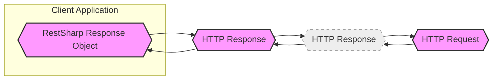
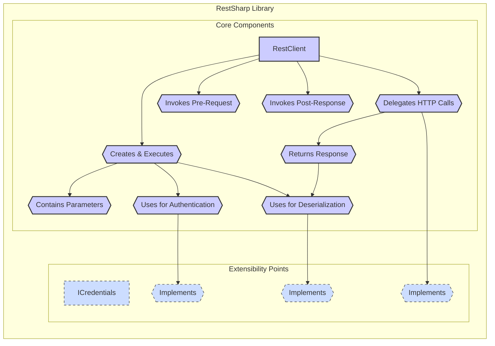
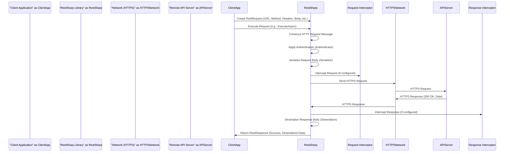
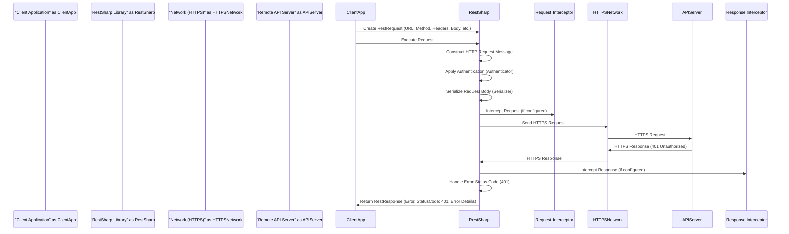

# Project Design Document: RestSharp HTTP and REST API Client

**Project Name:** RestSharp

**Project Repository:** [https://github.com/restsharp/restsharp](https://github.com/restsharp/restsharp)

**Document Version:** 1.1
**Date:** October 27, 2023
**Author:** AI Software Architecture Expert

## 1. Introduction

This document provides a detailed design overview of the RestSharp project, an open-source, cross-platform HTTP and REST API client for .NET ecosystems. It is designed to be used as a foundation for threat modeling and security analysis. The document outlines the system's architecture, key components, data flow, and security considerations to facilitate a comprehensive understanding of RestSharp's attack surface and potential vulnerabilities.

## 2. Project Overview

RestSharp is a lightweight and intuitive HTTP client library for .NET, simplifying interaction with RESTful APIs and other HTTP-based services. It abstracts the complexities of HTTP communication, offering a fluent API for constructing requests and processing responses.  Its wide adoption in the .NET community makes it a critical component in many applications, highlighting the importance of its security.

**Key Features:**

*   **Comprehensive HTTP Method Support:** Supports all standard HTTP methods (GET, POST, PUT, DELETE, PATCH, HEAD, OPTIONS, etc.).
*   **Request Construction:**  Provides a fluent interface for building requests, including setting headers, query parameters, URL segments, and request bodies.
*   **Response Handling:**  Simplifies response processing, providing access to status codes, headers, content, and error information.
*   **Serialization & Deserialization:**  Automates serialization of request bodies and deserialization of response bodies to and from various formats (JSON, XML, CSV, etc.) using pluggable serializers.
*   **Authentication Mechanisms:**  Offers built-in and extensible support for various authentication schemes, including Basic, OAuth 1.0a, OAuth 2.0, JWT Bearer, API Key, and custom authentication.
*   **File Handling:**  Supports file uploads as multipart/form-data and file downloads from HTTP responses.
*   **Asynchronous Request Execution:**  Provides asynchronous methods for non-blocking HTTP operations, improving application responsiveness.
*   **Interceptors (Request & Response):**  Allows interception and modification of requests before sending and responses after receiving, enabling logging, custom header injection, and error handling.
*   **Customizable HTTP Client:**  Allows users to plug in custom HTTP client implementations, providing flexibility for different environments and advanced scenarios.
*   **Cross-Platform Compatibility:**  Targets .NET Standard, ensuring compatibility across .NET Framework, .NET Core, .NET 5+, Xamarin, and other .NET platforms.

## 3. Goals and Objectives

The primary goals of RestSharp are to:

*   **Simplify API Integration:**  Make it easy for .NET developers to consume HTTP APIs with minimal code and complexity.
*   **Enhance Developer Productivity:**  Abstract away low-level HTTP details, allowing developers to focus on application logic rather than HTTP plumbing.
*   **Promote Code Readability and Maintainability:**  Provide a fluent and expressive API that leads to cleaner and more maintainable code.
*   **Ensure Broad Compatibility:**  Support a wide range of .NET platforms and frameworks.
*   **Maintain Performance and Efficiency:**  Provide a performant and efficient HTTP client library.
*   **Enable Extensibility and Customization:**  Allow developers to extend and customize the library to fit specific requirements.

From a security perspective, the objectives are to:

*   **Facilitate Secure Communication:**  Support and encourage the use of HTTPS/TLS for encrypted communication.
*   **Enable Secure Authentication Practices:**  Provide robust and flexible authentication mechanisms while guiding users towards secure authentication methods.
*   **Minimize Library-Introduced Vulnerabilities:**  Design and develop the library to minimize the risk of introducing vulnerabilities that could be exploited by malicious actors.  This includes careful handling of data, dependencies, and error conditions within the library itself.  *It is crucial to note that RestSharp's primary responsibility is secure HTTP communication; application-level security, including input validation and authorization logic, remains the responsibility of the application developer using RestSharp.*

## 4. Target Audience

The target audience for RestSharp includes:

*   .NET Developers:  Developers building applications in C# or other .NET languages.
*   Web Service Integrators: Developers integrating with RESTful APIs and web services.
*   Mobile App Developers: Developers building mobile applications using Xamarin or .NET MAUI that require API communication.
*   Backend Developers: Developers building backend services and microservices that need to interact with other APIs.
*   Automation Engineers:  Engineers automating tasks that involve HTTP requests and API interactions.
*   Testers:  Software testers writing automated tests that interact with APIs.

## 5. System Architecture

### 5.1. High-Level Architecture

**Description:**

*   **Client Application Code:** The .NET application utilizing RestSharp to interact with external APIs. This is where developers define API interactions using RestSharp's API.
*   **RestSharp Library:** The core library responsible for request construction, execution, response handling, serialization, deserialization, and authentication. It acts as an intermediary between the application code and the network.
*   **Network (Potentially Insecure):** Represents the network medium (Internet, LAN, etc.) over which HTTP communication occurs. This layer is marked as "potentially insecure" to highlight the importance of using HTTPS for secure communication over untrusted networks.
*   **Remote API Server:** The external server hosting the target RESTful API. This is the system RestSharp interacts with.

**Data Flow:**

1.  The Client Application initiates API interaction by making calls to the RestSharp library, defining requests (URL, method, data, etc.).
2.  RestSharp constructs the HTTP request message based on the application's specifications.
3.  RestSharp handles authentication (if configured) by adding necessary headers or parameters to the request.
4.  The HTTP request is transmitted over the network to the Remote API Server. *It is strongly recommended to use HTTPS to encrypt this communication.*
5.  The Remote API Server processes the request and generates an HTTP response.
6.  The HTTP response is sent back over the network to RestSharp.
7.  RestSharp receives and parses the HTTP response.
8.  RestSharp handles response interception (if configured) and deserializes the response body (if applicable).
9.  RestSharp returns a `RestResponse` object (or deserialized object) to the Client Application, containing the API response data.

### 5.2. Component-Level Architecture

**Component Descriptions:**

*   **`RestClient`:** The central orchestrator of RestSharp. It manages configuration (base URL, default headers, timeouts), creates `RestRequest` instances, and executes them using the configured `Http Client`. It also manages interceptors and serialization/deserialization.
*   **`RestRequest`:** Represents a single HTTP request. It encapsulates all request-specific information: HTTP method, resource URL, parameters (query, header, URL segment, body), request body content, authentication details, and serialization settings.
*   **`RestResponse`:** Represents the server's HTTP response. It contains the status code, status description, response headers, response body (raw content and deserialized object), cookies, and any error information.
*   **`Parameter`:** A generic container for request parameters. It can represent query parameters, headers, URL segments, or body parameters. Parameters have names, values, and parameter types.
*   **`Authenticator`:** An abstraction for handling authentication. RestSharp provides built-in implementations for common schemes (Basic, OAuth, JWT, API Key).  The `IAuthenticator` interface allows for custom authentication logic.
*   **`Serializer/Deserializer`:** Responsible for converting .NET objects to request body content (serialization) and converting response body content to .NET objects (deserialization). RestSharp supports JSON, XML, and other formats via pluggable `ISerializer` implementations.
*   **`Http Client (Abstraction)`:** An abstraction over the actual HTTP client implementation. By default, RestSharp uses .NET's `HttpClient`. The `IHttp` interface allows users to plug in custom HTTP client implementations for scenarios requiring specific HTTP client behaviors or for testing purposes.
*   **`Request Interceptor`:** Allows developers to intercept and modify `RestRequest` objects *before* they are sent. This is useful for adding custom headers, logging requests, or modifying request parameters dynamically.
*   **`Response Interceptor`:** Allows developers to intercept and process `RestResponse` objects *after* they are received but before being returned to the application. Useful for logging responses, handling errors globally, or modifying response data.
*   **`ICredentials`:**  Standard .NET interface for providing authentication credentials. Used by some authentication mechanisms.
*   **`IAuthenticator`:** Interface that custom authenticators must implement.
*   **`ISerializer`:** Interface that custom serializers must implement to handle different data formats.
*   **`IHttp`:** Interface that custom HTTP client implementations must implement.

**Component Interactions:**

1.  Client application code creates a `RestClient` instance, configuring base URL and potentially default settings.
2.  For each API call, the application creates a `RestRequest` using the `RestClient`.
3.  Parameters, authentication, and serialization settings are configured on the `RestRequest`.
4.  The `Authenticator` (if configured) is invoked to modify the `RestRequest` with authentication details.
5.  The `Serializer` (if a request body is present) serializes the request body.
6.  The `Request Interceptor` (if configured) is invoked, allowing pre-request modifications.
7.  `RestClient` delegates the actual HTTP request execution to the `Http Client` implementation (`IHttp`).
8.  The `Http Client` sends the HTTP request over the network and receives the `RestResponse`.
9.  The `Response Interceptor` (if configured) is invoked, allowing post-response processing.
10. The `Deserializer` (if configured) deserializes the response body.
11. The `RestResponse` object (with deserialized content) is returned to the client application.

## 6. Data Flow Diagrams

### 6.1. Successful API Request Flow (HTTPS)

### 6.2. Error Handling Flow (e.g., 401 Unauthorized - Authentication Failure)

## 7. Technology Stack

*   **Core Language:** C#
*   **Target Frameworks:** .NET Standard 2.0 (and higher), .NET Framework 4.6.1 (and higher), .NET Core 2.0 (and higher), .NET 5/6/7/8+
*   **HTTP Client Implementation:**  Primarily uses `System.Net.Http.HttpClient` in modern .NET. May use `System.Net.WebRequest` in older .NET Framework versions or under specific configurations.  Abstracted via `IHttp` interface.
*   **Serialization/Deserialization Libraries:**
    *   **JSON:**  Defaults to `System.Text.Json` (in .NET Core 3.0+ and .NET 5+) or Newtonsoft.Json (Json.NET) for broader compatibility and flexibility. Pluggable serializers allow for other JSON libraries or custom implementations.
    *   **XML:** Uses standard .NET XML libraries (`System.Xml.Serialization`, `System.Xml.Linq`).
    *   **CSV, Plain Text, etc.:** Support for other formats can be added through custom `ISerializer` implementations.
*   **Authentication Libraries:**  Relies on built-in .NET classes for some authentication schemes and provides abstractions for integrating with external authentication libraries (e.g., for OAuth 2.0 flows).

## 8. Security Considerations (Detailed)

This section expands on the initial security considerations, providing more detail and potential mitigation strategies for threat modeling.

*   **Transport Layer Security (TLS/SSL) - HTTPS Enforcement:**
    *   **Threat:** Man-in-the-Middle (MITM) attacks, eavesdropping, data interception if HTTP is used instead of HTTPS.
    *   **Mitigation:**
        *   **Client Application Responsibility:**  Applications *must* be configured to use HTTPS for all sensitive API interactions. RestSharp itself does not enforce HTTPS, but relies on the underlying .NET HTTP client and application configuration.
        *   **Guidance & Documentation:** RestSharp documentation should strongly emphasize the importance of HTTPS and provide examples of configuring `RestClient` to use HTTPS URLs.
        *   **Consider HSTS:**  For web applications using RestSharp, consider implementing HTTP Strict Transport Security (HSTS) on the server-side to force browsers to always use HTTPS.
*   **Authentication and Authorization Security:**
    *   **Threats:** Credential theft, unauthorized access, insecure authentication schemes, weak or hardcoded credentials, improper credential storage.
    *   **Mitigation:**
        *   **Strong Authentication Schemes:**  Encourage the use of robust authentication methods like OAuth 2.0, JWT, or API Keys over HTTPS. Discourage Basic Authentication over HTTP.
        *   **Secure Credential Management (Client Application Responsibility):**
            *   **Avoid Hardcoding:** Never hardcode API keys or secrets directly in the application code.
            *   **Environment Variables/Configuration:** Store credentials securely using environment variables, configuration files (encrypted if necessary), or dedicated secret management services (e.g., Azure Key Vault, AWS Secrets Manager).
            *   **Secure Storage:**  If credentials need to be stored locally (e.g., in desktop applications), use secure storage mechanisms provided by the operating system or platform.
        *   **Proper API Server Authorization:**  RestSharp clients rely on the API server to enforce authorization. Ensure the API server has robust authorization mechanisms in place to control access to resources based on authenticated users/clients.
        *   **Input Validation (API Server Responsibility, but relevant to RestSharp usage):** While primarily a server-side concern, ensure the API server properly validates all inputs to prevent injection attacks and other vulnerabilities. Malformed requests generated by misuse of RestSharp could potentially expose server-side vulnerabilities.
        *   **RestSharp Feature Usage:** Utilize RestSharp's built-in authentication features and extensibility points to implement authentication securely.  Avoid custom authentication logic that might introduce vulnerabilities.
*   **Serialization and Deserialization Vulnerabilities:**
    *   **Threats:** Deserialization vulnerabilities (if custom serializers are used improperly), potential for injection vulnerabilities if user-controlled data is directly embedded in serialized data without proper encoding (though less direct risk in RestSharp itself, more of a server-side concern).
    *   **Mitigation:**
        *   **Use Well-Vetted Serializers:**  Prefer RestSharp's built-in serializers (JSON.NET, `System.Text.Json`) or well-established, secure third-party serializers.
        *   **Careful Custom Serializer Implementation:** If custom serializers are necessary, implement them with security in mind, avoiding potential deserialization vulnerabilities. Thoroughly test custom serializers.
        *   **Server-Side Input Validation & Output Encoding:**  Reinforce the importance of server-side input validation and output encoding to mitigate risks even if client-side serialization is compromised.
*   **Dependency Vulnerabilities:**
    *   **Threat:** Vulnerabilities in third-party libraries that RestSharp depends on (e.g., JSON.NET, underlying HTTP client libraries).
    *   **Mitigation:**
        *   **Regular Dependency Updates:**  Keep RestSharp and its dependencies updated to the latest versions to patch known vulnerabilities.
        *   **Dependency Scanning:**  Use dependency scanning tools to identify and monitor for known vulnerabilities in RestSharp's dependencies.
        *   **Supply Chain Security:**  Be mindful of the security of the NuGet package source and ensure packages are obtained from trusted sources.
*   **Error Handling and Information Disclosure:**
    *   **Threat:**  Exposure of sensitive information (API keys, internal server details, user data) in error messages or logs.
    *   **Mitigation:**
        *   **Sanitize Error Responses:**  Ensure that client applications using RestSharp handle error responses gracefully and avoid displaying or logging overly detailed error messages that could reveal sensitive information.
        *   **Generic Error Handling:** Implement generic error handling in client applications to catch exceptions and return user-friendly error messages without exposing internal details.
        *   **Secure Logging Practices:**  If logging requests and responses, ensure sensitive data (credentials, PII) is not logged or is properly masked/redacted.
*   **Request and Response Interceptor Security:**
    *   **Threat:**  Vulnerabilities introduced by poorly written custom interceptors. Interceptors have access to request and response data and could potentially introduce logging vulnerabilities, data manipulation vulnerabilities, or performance issues if not implemented carefully.
    *   **Mitigation:**
        *   **Secure Interceptor Implementation:**  Develop interceptors with security in mind. Avoid logging sensitive data in interceptors unless absolutely necessary and with proper redaction. Ensure interceptors do not introduce new vulnerabilities (e.g., by modifying requests in a way that bypasses security checks on the server).
        *   **Code Review for Interceptors:**  Thoroughly review the code of custom interceptors for potential security flaws.
        *   **Principle of Least Privilege:**  Interceptors should only have the necessary permissions and access to data required for their intended functionality.

## 9. Deployment Model

RestSharp is deployed as a NuGet package that is integrated into .NET applications.

*   **Deployment via NuGet:**  Developers add RestSharp as a dependency to their .NET projects using NuGet package manager.
*   **Application Deployment:**  The application, including the RestSharp library, is then deployed to the target environment (desktop, web server, mobile device, cloud platform, etc.) as a standard .NET application deployment.
*   **No Standalone Deployment:** RestSharp itself is not deployed as a standalone service or application. It is always embedded within a client application.

## 10. Assumptions and Constraints

*   **Secure Network Infrastructure:**  Assumes that the underlying network infrastructure is reasonably secure, although RestSharp is designed to mitigate risks even over potentially insecure networks by encouraging HTTPS.
*   **API Server Security:**  Relies on the security of the remote API server. RestSharp cannot protect against vulnerabilities in the API server itself.
*   **.NET Runtime Environment:** Requires a compatible .NET runtime environment to be installed on the client machine or server.
*   **Developer Security Awareness:**  Assumes that developers using RestSharp have a basic understanding of web security principles and will use the library responsibly and securely.
*   **Correct Usage of RestSharp API:** Assumes developers will use the RestSharp API correctly and avoid patterns that could lead to security vulnerabilities (e.g., hardcoding credentials, mishandling errors).

## 11. Future Considerations

*   **Enhanced Security Features:**  Explore opportunities to incorporate more built-in security features, such as automatic HTTPS enforcement (where feasible), improved credential management guidance within the library, and potentially built-in input validation helpers (though this needs careful consideration to avoid overlapping with server-side responsibilities).
*   **Improved Documentation & Security Guidance:**  Continuously improve documentation to provide clear and comprehensive security guidance for developers using RestSharp, including best practices for authentication, HTTPS usage, and secure coding.
*   **Regular Security Audits:**  Conduct periodic security audits and penetration testing of the RestSharp library to identify and address potential vulnerabilities proactively.
*   **Community Engagement on Security:**  Encourage community contributions and feedback on security aspects of RestSharp.

This improved design document provides a more detailed and security-focused overview of RestSharp, suitable for in-depth threat modeling and security analysis. It emphasizes security responsibilities shared between the RestSharp library and the developers using it, highlighting areas where developers need to apply secure coding practices when using RestSharp.