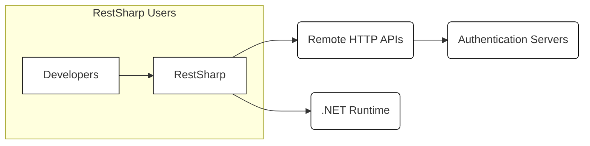
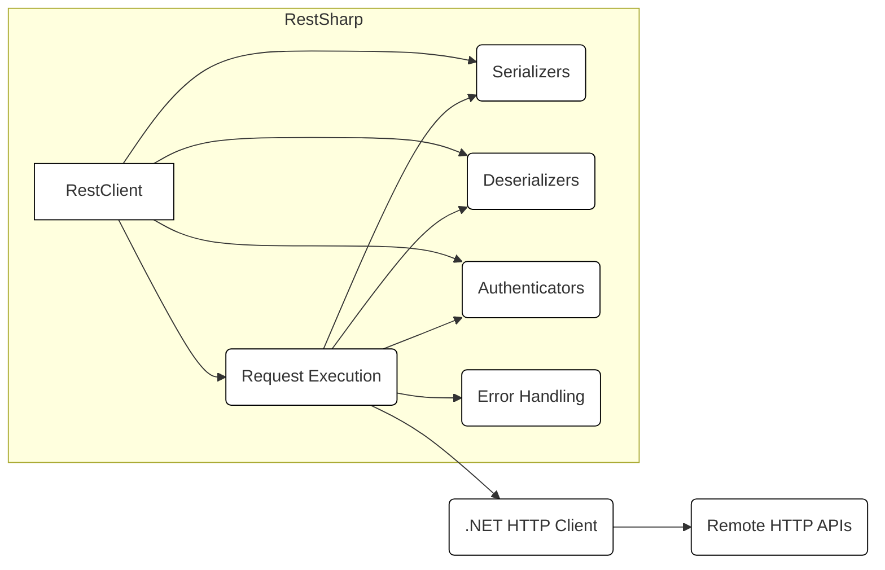
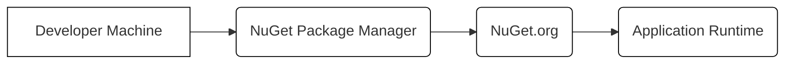
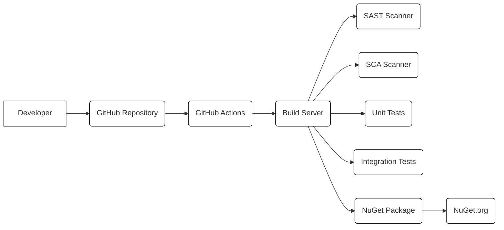

Okay, let's create a design document for the RestSharp project.

# BUSINESS POSTURE

RestSharp is a widely-used, open-source HTTP and REST client library for .NET. Its primary business goals are:

*   Provide a simple, intuitive, and flexible API for making HTTP requests and consuming RESTful services.
*   Support a wide range of .NET platforms and versions.
*   Maintain high performance and low overhead.
*   Foster a vibrant community of users and contributors.
*   Ensure the library remains free and open-source.

Business priorities:

*   Ease of Use:  The library must be easy to learn and use, reducing the development time for integrating with HTTP services.
*   Compatibility:  Broad compatibility across .NET versions is crucial for adoption and continued use.
*   Performance:  The library should be performant to avoid becoming a bottleneck in applications that use it.
*   Community:  A strong community ensures the library's longevity and helps with issue resolution and feature development.
*   Maintainability: The codebase should be maintainable to allow for bug fixes, new features, and security updates.

Most important business risks:

*   Security Vulnerabilities:  As a library handling HTTP requests, vulnerabilities could expose applications using RestSharp to attacks like injection, data breaches, or denial of service.
*   Breaking Changes:  Incompatible updates could disrupt existing applications, leading to user frustration and migration challenges.
*   Lack of Maintenance:  If the project is abandoned or poorly maintained, it could become obsolete, forcing users to switch to alternatives.
*   Performance Degradation:  Performance issues could negatively impact the applications using the library.
*   Dependency Issues:  Vulnerabilities or compatibility problems in dependencies could affect RestSharp's stability and security.

# SECURITY POSTURE

Existing security controls:

*   security control: Input Sanitization: RestSharp appears to handle URL encoding and parameter serialization, which helps prevent injection vulnerabilities. Implemented in the codebase, specifically around URL and parameter handling.
*   security control: Dependency Management: The project uses package managers (NuGet) to manage dependencies, allowing for updates and vulnerability patching. Described in the project files and build process.
*   security control: Community Scrutiny: Being open-source, the codebase is subject to review by a large community, increasing the chances of identifying and fixing security issues. Evident from the GitHub repository and issue tracker.
*   security control: Automated Tests: The project includes a suite of unit and integration tests, which can help catch regressions and unexpected behavior that might indicate security flaws. Visible in the test projects within the repository.

Accepted risks:

*   accepted risk: Third-Party Dependency Vulnerabilities: While dependencies are managed, there's an inherent risk of vulnerabilities in those dependencies.
*   accepted risk: Limited Cryptographic Control: RestSharp relies on the underlying .NET framework for cryptographic operations (like TLS/SSL). While generally secure, it limits fine-grained control over cryptographic settings.
*   accepted risk: User Misconfiguration: Users might misuse the library in ways that introduce security vulnerabilities (e.g., disabling certificate validation).

Recommended security controls:

*   security control: Implement SAST (Static Application Security Testing) tools in the build pipeline to automatically scan for common vulnerabilities.
*   security control: Implement DAST (Dynamic Application Security Testing) to test the library in a running state, simulating real-world attacks.
*   security control: Conduct regular security audits and penetration testing, either internally or by external experts.
*   security control: Establish a clear security policy and vulnerability disclosure process.
*   security control: Provide security guidance and best practices documentation for users.
*   security control: Implement SCA (Software Composition Analysis) to track and manage vulnerabilities in third-party dependencies.

Security Requirements:

*   Authentication:
    *   Support various authentication mechanisms, including Basic, Bearer Token, OAuth 1.0a, OAuth 2.0, and API Keys.
    *   Securely handle and store credentials, preventing leakage.
    *   Allow customization of authentication flows.
*   Authorization:
    *   While RestSharp primarily focuses on making requests, it should facilitate the implementation of authorization schemes by allowing users to easily include authorization headers or parameters.
*   Input Validation:
    *   Properly encode URLs and parameters to prevent injection attacks.
    *   Validate user-provided data before including it in requests.
    *   Handle different character encodings correctly.
*   Cryptography:
    *   Utilize the .NET framework's secure defaults for TLS/SSL connections.
    *   Allow users to configure TLS/SSL settings (e.g., certificate validation) when necessary, but provide clear warnings about potential risks.
    *   Support secure hashing algorithms for data integrity checks if needed.

# DESIGN

## C4 CONTEXT

Element List:

*   Element:
    *   Name: Developers
    *   Type: Person
    *   Description: Software developers who use RestSharp in their applications to interact with HTTP services.
    *   Responsibilities: Integrate RestSharp into their applications, configure requests, handle responses, and implement security best practices.
    *   Security controls: Follow secure coding practices, validate user inputs, and securely manage credentials.

*   Element:
    *   Name: RestSharp
    *   Type: Software System
    *   Description: The RestSharp library itself, providing an API for making HTTP requests.
    *   Responsibilities: Handle request creation, serialization, execution, deserialization, and error handling.
    *   Security controls: Input sanitization, secure defaults for TLS/SSL, support for various authentication mechanisms.

*   Element:
    *   Name: Remote HTTP APIs
    *   Type: Software System
    *   Description: External HTTP-based services that RestSharp interacts with.
    *   Responsibilities: Provide data and functionality to applications using RestSharp.
    *   Security controls: Implement appropriate security measures on their end, such as authentication, authorization, input validation, and encryption.

*   Element:
    *   Name: .NET Runtime
    *   Type: Software System
    *   Description: The .NET runtime environment on which RestSharp and the applications using it execute.
    *   Responsibilities: Provide the underlying platform and libraries for RestSharp to function.
    *   Security controls: Provide secure implementations of networking and cryptographic functions.

*   Element:
    *   Name: Authentication Servers
    *   Type: Software System
    *   Description: Servers responsible for handling authentication requests (e.g., OAuth servers).
    *   Responsibilities: Authenticate users and applications, issue tokens, and manage authorization.
    *   Security controls: Implement secure authentication protocols, protect user credentials, and prevent unauthorized access.

## C4 CONTAINER

Element List:

*   Element:
    *   Name: RestClient
    *   Type: Container
    *   Description: The main entry point for users of the library.  Provides methods for configuring and executing requests.
    *   Responsibilities: Manage request configuration, handle execution, and provide access to other components.
    *   Security controls: Input validation, configuration of authentication.

*   Element:
    *   Name: Request Execution
    *   Type: Container
    *   Description: Handles the actual execution of HTTP requests.
    *   Responsibilities: Send requests, receive responses, manage timeouts, and handle retries.
    *   Security controls: Uses .NET HTTP Client with secure defaults.

*   Element:
    *   Name: Serializers
    *   Type: Container
    *   Description: Handles the serialization of request bodies into various formats (e.g., JSON, XML).
    *   Responsibilities: Convert .NET objects into data formats suitable for HTTP requests.
    *   Security controls: Use secure serialization libraries and avoid vulnerable serialization patterns.

*   Element:
    *   Name: Deserializers
    *   Type: Container
    *   Description: Handles the deserialization of response bodies from various formats into .NET objects.
    *   Responsibilities: Convert data from HTTP responses into .NET objects.
    *   Security controls: Use secure deserialization libraries and avoid vulnerable deserialization patterns.

*   Element:
    *   Name: Authenticators
    *   Type: Container
    *   Description: Implement different authentication mechanisms (e.g., Basic, OAuth).
    *   Responsibilities: Add authentication headers or parameters to requests.
    *   Security controls: Securely handle credentials and implement authentication protocols correctly.

*   Element:
    *   Name: Error Handling
    *   Type: Container
    *   Description: Handles errors that occur during request execution.
    *   Responsibilities: Provide information about errors and allow for custom error handling.
    *   Security controls: Avoid exposing sensitive information in error messages.

*   Element:
    *   Name: .NET HTTP Client
    *   Type: Container
    *   Description: The underlying .NET HttpClient used for making the actual HTTP requests.
    *   Responsibilities: Low-level handling of HTTP communication.
    *   Security controls: Relies on the security features of the .NET framework.

*   Element:
    *   Name: Remote HTTP APIs
    *   Type: Software System
    *   Description: External HTTP-based services that RestSharp interacts with.
    *   Responsibilities: Provide data and functionality to applications using RestSharp.
    *   Security controls: Implement appropriate security measures on their end, such as authentication, authorization, input validation, and encryption.

## DEPLOYMENT

Possible deployment solutions:

1.  NuGet Package: RestSharp is primarily distributed as a NuGet package. This is the standard way for .NET libraries to be consumed.
2.  Source Code: Users can also download the source code directly from GitHub and build it themselves.

Chosen solution (NuGet Package):

Element List:

*   Element:
    *   Name: Developer Machine
    *   Type: Infrastructure Node
    *   Description: The machine where the developer is building their application.
    *   Responsibilities: Host the development environment and tools.
    *   Security controls: Standard development machine security practices.

*   Element:
    *   Name: NuGet Package Manager
    *   Type: Software
    *   Description: The NuGet client integrated into the development environment (e.g., Visual Studio, .NET CLI).
    *   Responsibilities: Download and manage NuGet packages.
    *   Security controls: Verify package signatures (if enabled).

*   Element:
    *   Name: NuGet.org
    *   Type: Infrastructure Node
    *   Description: The central repository for NuGet packages.
    *   Responsibilities: Host and serve NuGet packages.
    *   Security controls: Implement security measures to protect the repository and packages.

*   Element:
    *   Name: Application Runtime
    *   Type: Infrastructure Node
    *   Description: The environment where the application using RestSharp is running.
    *   Responsibilities: Execute the application and load the RestSharp library.
    *   Security controls: Standard runtime environment security practices.

## BUILD

Build Process Description:

1.  Developer: Developers contribute code changes to the RestSharp project on GitHub.
2.  GitHub Repository: The source code is hosted on GitHub.
3.  GitHub Actions: Continuous integration is managed using GitHub Actions. Workflows are defined to trigger builds on various events (e.g., pushes, pull requests).
4.  Build Server: GitHub Actions uses runners (virtual machines) to execute the build process.
5.  SAST Scanner: A Static Application Security Testing (SAST) tool (recommended, not currently implemented) would scan the source code for potential vulnerabilities.
6.  SCA Scanner: A Software Composition Analysis (SCA) tool (recommended, not currently implemented) would analyze dependencies for known vulnerabilities.
7.  Unit Tests: Unit tests are executed to verify the functionality of individual components.
8.  Integration Tests: Integration tests are executed to verify the interaction between different parts of the library.
9.  NuGet Package: The build process creates a NuGet package containing the compiled library.
10. NuGet.org: The NuGet package is published to NuGet.org, making it available for developers to consume.

Security Controls in Build Process:

*   security control: GitHub Actions: Provides a secure and automated build environment.
*   security control: Unit and Integration Tests: Help ensure code quality and catch regressions.
*   security control: (Recommended) SAST Scanner: Automatically detects potential security vulnerabilities in the source code.
*   security control: (Recommended) SCA Scanner: Identifies known vulnerabilities in third-party dependencies.
*   security control: Code Reviews: Pull requests are reviewed by other developers before being merged, providing an opportunity to catch security issues.

# RISK ASSESSMENT

Critical Business Processes:

*   Making HTTP requests to external services: This is the core functionality of RestSharp. Any disruption to this process would impact applications relying on the library.
*   Consuming data from external services: Applications use RestSharp to retrieve data from APIs. Inability to do so would break application functionality.
*   Integrating with third-party systems: RestSharp facilitates integration with various services. Security vulnerabilities could compromise these integrations.

Data Sensitivity:

*   Request Data:
    *   Sensitivity: Varies greatly depending on the application and the specific API being used. Can range from public, non-sensitive data to highly confidential information (e.g., PII, financial data, API keys).
    *   Protection: Encryption in transit (TLS/SSL), proper handling of sensitive data in requests (e.g., avoiding logging secrets).
*   Response Data:
    *   Sensitivity: Similar to request data, the sensitivity varies greatly.
    *   Protection: Proper handling of sensitive data received in responses, secure storage if necessary.
*   Credentials:
    *   Sensitivity: High. Credentials used for authentication (e.g., API keys, passwords, tokens) are highly sensitive.
    *   Protection: Secure storage and handling of credentials, avoiding hardcoding, using secure authentication mechanisms.

# QUESTIONS & ASSUMPTIONS

Questions:

*   Are there any specific compliance requirements (e.g., PCI DSS, HIPAA) that applications using RestSharp typically need to adhere to?
*   What are the most common types of APIs that RestSharp is used to interact with?
*   What is the expected lifespan of the project, and what are the long-term maintenance plans?
*   What level of support is provided to users, and what is the process for reporting security vulnerabilities?
*   What are the performance benchmarks for the library, and are there any known performance bottlenecks?

Assumptions:

*   BUSINESS POSTURE: The primary goal is to provide a reliable and easy-to-use HTTP client library. Security is a high priority, but usability and compatibility are also crucial.
*   SECURITY POSTURE: The project relies on the security features of the .NET framework and community contributions for security. There is an implicit trust in the .NET ecosystem.
*   DESIGN: The library is designed to be flexible and extensible, allowing users to customize its behavior. The .NET HttpClient is the core component for handling HTTP communication. The library is primarily consumed via NuGet.