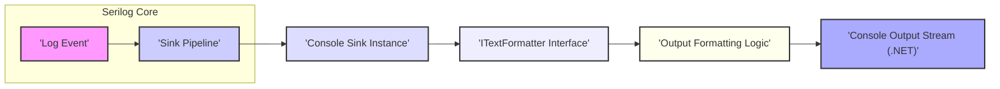

## Project Design Document: Serilog.Sinks.Console

**Version:** 1.1
**Date:** October 26, 2023
**Author:** AI Software Architect

### 1. Introduction

This document provides an enhanced design overview of the `Serilog.Sinks.Console` project, a crucial component within the Serilog logging library ecosystem. This sink is specifically designed to write log events to the application's console output stream. This revised document aims to offer a more detailed understanding of the sink's architecture, data flow, and critical considerations, with a strong emphasis on facilitating future threat modeling activities. It is intended for developers, security engineers, and anyone involved in the design, deployment, and security assessment of applications utilizing this sink.

### 2. Goals

*   Provide a clear and comprehensive explanation of the `Serilog.Sinks.Console` functionality and its role within the Serilog ecosystem.
*   Detail the architectural components, their responsibilities, and interactions.
*   Thoroughly describe the data flow within the sink, highlighting key transformation points.
*   Identify and elaborate on potential security vulnerabilities and attack vectors relevant for threat modeling exercises.

### 3. Non-Goals

*   This document explicitly excludes a deep dive into the internal workings of the Serilog core library beyond its interaction with the sink.
*   Implementation specifics of the underlying .NET console output mechanisms are not within the scope of this document.
*   Performance benchmarking, optimization strategies, and detailed resource consumption analysis are not covered here.
*   The historical evolution of the project, including past design decisions and development lifecycle details, are outside the scope.

### 4. Architectural Overview

The `Serilog.Sinks.Console` acts as a bridge between the Serilog logging pipeline and the application's console output. Its core function is to receive structured log events and transform them into a presentable format for the console.

**Components:**

*   **Log Event:** The fundamental data structure in Serilog, encapsulating all information related to a logged event. This includes the timestamp, log level, message template, and associated properties (structured data).
*   **Sink Pipeline:** The internal mechanism within Serilog responsible for routing `Log Event` instances to all configured sinks.
*   **Console Sink Instance:** A concrete instance of the `Serilog.Sinks.Console` class. Configuration options, such as the chosen `ITextFormatter`, are associated with this instance.
*   **ITextFormatter Interface:**  A key abstraction point. Implementations of this interface define how a `Log Event` is transformed into a textual representation. This allows for pluggable formatting strategies.
*   **Output Formatting Logic:** The code within a specific `ITextFormatter` implementation. This logic accesses the `Log Event` properties and applies formatting rules to generate the output string.
*   **Console Output Stream (.NET):** The underlying .NET framework component (`System.Console.Out` or `System.Console.Error`) responsible for writing text to the console.

### 5. Data Flow

The lifecycle of a log event as it passes through the `Serilog.Sinks.Console` involves the following steps:

1. **Log Event Creation:** A log event is initiated within the application code using the Serilog API. For example: `Log.Information("User {Username} from IP {IpAddress} accessed resource", username, ipAddress)`.
2. **Serilog Core Processing:** The Serilog core library intercepts the created log event and determines the appropriate sinks to which it should be dispatched based on configured filtering rules and sink registrations.
3. **Sink Delivery:** The log event is passed to the registered `Console Sink Instance`.
4. **Formatter Selection:** The `Console Sink Instance` utilizes the configured `ITextFormatter`. If no formatter is explicitly configured, a default formatter is used.
5. **Formatting:** The selected `ITextFormatter` receives the `Log Event` as input. This involves:
    *   **Property Access:** The formatter accesses properties of the `Log Event` (timestamp, level, message, properties).
    *   **Template Rendering:** If using a template-based formatter, placeholders in the message template are replaced with the corresponding property values.
    *   **Data Transformation:**  The formatter might perform data transformations (e.g., formatting dates, serializing complex objects).
    *   **Exception Handling:** If the log event includes an exception, the formatter renders the exception details into the output string.
6. **Output to Stream:** The `ITextFormatter` produces a formatted string. This string is then written to the designated console output stream (`System.Console.Out` or `System.Console.Error`) using methods provided by the .NET framework.

### 6. Configuration Details

The behavior of `Serilog.Sinks.Console` is highly customizable through its configuration options, typically set via the Serilog configuration API (e.g., using `appsettings.json` or code-based configuration). Key configuration aspects include:

*   **Output Template:** A string pattern that dictates the structure and content of the log message. It uses placeholders (e.g., `{Timestamp:yyyy-MM-dd HH:mm:ss.fff zzz}`, `{Level:u3}`, `{Message:lj}`) to incorporate log event properties.
*   **Text Formatter Selection:**  Specifying the `ITextFormatter` implementation to be used. Common choices include:
    *   `Serilog.Formatting.Compact.CompactJsonFormatter`: Outputs log events in a compact JSON format, suitable for machine consumption.
    *   `Serilog.Formatting.Display.MessageTemplateTextFormatter`: Renders the output based on the original message template, providing a human-readable format.
    *   Custom `ITextFormatter` implementations, allowing for highly specialized formatting needs.
*   **Standard Output vs. Standard Error Redirection:**  The ability to direct log output to either the standard output stream (`stdout`) or the standard error stream (`stderr`). This is crucial for differentiating informational messages from error and warning messages.
*   **Theme Configuration:**  Allows for applying visual themes (colors and styles) to the console output, enhancing readability, particularly in terminals that support ANSI escape codes.
*   **Culture-Specific Formatting:** Options to control how culture-sensitive data (e.g., numbers, dates) is formatted in the output.

### 7. Security Considerations for Threat Modeling

While `Serilog.Sinks.Console` primarily focuses on output, its configuration and the nature of the logged data introduce several security considerations relevant for threat modeling:

*   **Information Disclosure (Confidentiality):**
    *   **Exposure of Sensitive Data:** If the application logs sensitive information (e.g., API keys, passwords, personally identifiable information (PII), internal system details) and the console output is accessible to unauthorized individuals (e.g., through container logs, development environments, shared terminals), it can lead to significant data breaches.
    *   **Verbose Error Messages:**  Detailed error messages, including stack traces and internal state information, written to the console can inadvertently reveal architectural details, potential vulnerabilities, and attack surfaces to malicious actors.
*   **Denial of Service (Availability):**
    *   **Log Flooding:**  If the application is configured to log excessively, the continuous writing to the console can consume significant system resources (CPU, I/O), potentially leading to a localized denial of service, especially in resource-constrained environments or during periods of high load.
*   **Tampering/Integrity Issues:**
    *   **Log Injection (Less Likely but Possible):** While less likely with structured logging, if the output template or a custom formatter mishandles user-controlled input that is directly logged without proper sanitization, it could theoretically allow an attacker to inject arbitrary text into the logs, potentially misleading administrators or security monitoring systems.
*   **Dependency Vulnerabilities:**
    *   The `Serilog.Sinks.Console` relies on the Serilog core library and potentially other formatting libraries. Known vulnerabilities in these dependencies could indirectly impact the security of applications using this sink. Regular dependency updates are crucial.
*   **Configuration Security:**
    *   **Misconfigured Output Destinations:**  If the console output is inadvertently redirected to a shared file or a location accessible to unintended parties due to misconfiguration, it can expose sensitive information.
    *   **Overly Permissive Logging Levels:** Configuring the sink to log at very verbose levels (e.g., `Verbose` or `Debug` in production) can significantly increase the volume of logged data, increasing the risk of information disclosure and potential performance issues.
*   **Lack of Auditing:**  While the console output itself can serve as a form of audit log, it lacks the robustness and security features of dedicated audit logging systems. Relying solely on console output for critical security auditing is generally not recommended.

### 8. Future Considerations

Potential future developments or changes to `Serilog.Sinks.Console` that could have security implications include:

*   **Advanced Formatting Features:** Introduction of more complex formatting options or the ability to execute code within formatters could introduce new attack vectors if not carefully designed and implemented.
*   **Direct Integration with Console Emulators/Viewers:**  If the sink were to directly interact with specific console emulators or log viewers, security considerations related to those external components would need to be evaluated.
*   **Changes in Underlying .NET Console Implementation:**  Significant modifications to how the .NET framework handles console output could necessitate a re-evaluation of the sink's security posture.

This enhanced design document provides a more comprehensive understanding of the `Serilog.Sinks.Console` project, specifically tailored for threat modeling activities. By carefully considering the architecture, data flow, configuration options, and potential security vulnerabilities outlined here, security engineers can effectively assess and mitigate risks associated with the use of this sink in their applications.
