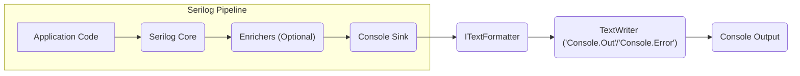
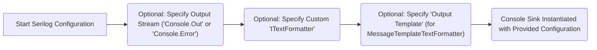

# Project Design Document: Serilog.Sinks.Console

**Version:** 1.1
**Date:** October 26, 2023
**Author:** AI Software Architect

## 1. Introduction

This document provides an enhanced design overview of the `Serilog.Sinks.Console` project. This sink, an integral part of the Serilog logging library ecosystem, is responsible for directing log events to the console output. This revised document aims for increased clarity, completeness, and a stronger focus on aspects relevant to threat modeling. It outlines the architecture, data flow, and key components of the sink in detail.

### 1.1. Purpose

The primary purpose of this document is to:

*   Provide a clear and comprehensive description of the architecture and functionality of the `Serilog.Sinks.Console`.
*   Precisely identify key components and their interactions within the sink.
*   Thoroughly outline the data flow of log events as they are processed by the sink.
*   Offer sufficient and specific details to enable security professionals to perform effective threat modeling.
*   Serve as a reliable reference for developers working with, extending, or maintaining the `Serilog.Sinks.Console` project.

### 1.2. Scope

This document comprehensively covers the design of the `Serilog.Sinks.Console` library, with a strong emphasis on its core function of receiving log events from Serilog and rendering them to the console. This includes detailed information about:

*   The sink's seamless integration within the broader Serilog pipeline.
*   The mechanisms and processes involved in formatting and outputting log events to the console.
*   The various configuration options available to customize the sink's behavior.
*   The explicit dependencies on external libraries required for the sink's operation.

This document explicitly excludes:

*   In-depth analysis of the internal operations of the Serilog core library.
*   Low-level implementation specifics of the underlying .NET console output mechanisms.
*   Detailed quantitative performance analysis or specific optimization strategies for the sink.

### 1.3. Target Audience

This document is primarily intended for:

*   Security architects and engineers tasked with performing threat modeling and security assessments.
*   Software architects and developers utilizing Serilog in their applications.
*   Developers actively contributing to the development and maintenance of the `Serilog.Sinks.Console` project.
*   Individuals seeking a detailed technical understanding of the sink's internal design and operation.

## 2. Overview

The `Serilog.Sinks.Console` acts as a crucial bridge within the Serilog ecosystem, specifically designed to route structured log events to the standard output or standard error streams of the console. It enables applications to leverage Serilog's rich logging capabilities while still providing output to the familiar console environment. This sink is commonly used in development, debugging, and simple deployment scenarios where console output is sufficient for monitoring and diagnostics. The sink is engineered for efficiency and offers several configuration options to tailor the format and destination of log messages.

## 3. Architectural Design

The `Serilog.Sinks.Console` operates as a module within the larger Serilog logging pipeline. When an application emits a log event using Serilog, this event progresses through a series of optional enrichers before being directed to the configured sinks. The console sink intercepts these log events and manages their presentation on the console.

### 3.1. Key Components

*   **`ConsoleSink` Class:** This central class implements the `ILogEventSink` interface defined by Serilog. Its primary responsibility is to receive `LogEvent` objects from the Serilog pipeline and orchestrate their writing to the console.
*   **`ITextFormatter` Interface:** Serilog employs formatters to transform the structured `LogEvent` objects into a human-readable textual representation. The console sink relies on an `ITextFormatter` to prepare the log message for console output. Common implementations include the `MessageTemplateTextFormatter` (for structured output based on templates) and the `JsonFormatter` (for JSON-formatted logs).
*   **`TextWriter` (System.IO):**  This fundamental .NET class provides the underlying mechanism for writing character streams. The sink utilizes a `TextWriter` instance, typically connected to `System.Console.Out` (for standard output) or `System.Console.Error` (for standard error), to physically output the formatted log message.
*   **Configuration:** The behavior of the console sink is customizable through Serilog's flexible configuration system. This allows users to specify crucial parameters such as the target output stream (standard output or standard error) and the specific `ITextFormatter` to be employed.

### 3.2. Component Interactions

*   **Application Code:** The application initiates the logging process by generating log events using the Serilog API (e.g., `Log.Information("User {User} logged in", username)`).
*   **Serilog Core:** The core Serilog library intercepts the log event and manages its journey through the configured logging pipeline.
*   **Enrichers (Optional):** Before reaching the sinks, log events may pass through enrichers that add contextual properties (e.g., timestamp, thread ID) to the event.
*   **Console Sink:** The `ConsoleSink` class receives the enriched `LogEvent` from the Serilog pipeline.
*   **ITextFormatter:** The sink utilizes a pre-configured `ITextFormatter` to render the `LogEvent` into a formatted string suitable for console display.
*   **TextWriter ('Console.Out'/'Console.Error'):** The formatted string is then written to the console's standard output or standard error stream using an appropriate `TextWriter` instance.
*   **Console Output:** The final formatted log message is displayed on the application's console.

## 4. Data Flow

The journey of a log event through the `Serilog.Sinks.Console` can be broken down into the following steps:

1. An event requiring logging is generated within the application code, utilizing the Serilog logging API (e.g., `Log.Warning("File not found: {Path}", filePath)`).
2. The central Serilog core library intercepts this log event and applies any configured enrichers to add supplementary information.
3. Serilog's core identifies the sinks configured to receive this log event, including the `ConsoleSink`.
4. The `LogEvent` object is then passed as an argument to the `Emit` method of the `ConsoleSink` instance.
5. The `ConsoleSink` retrieves or instantiates the `ITextFormatter` that has been configured for its use.
6. The sink invokes the `Format` method of the `ITextFormatter`, providing the `LogEvent` and a `TextWriter` (connected to either `System.Console.Out` or `System.Console.Error`) as arguments.
7. The `ITextFormatter` transforms the `LogEvent` into a formatted textual representation and writes this output to the provided `TextWriter`.
8. Finally, the formatted log message is displayed on the console via the underlying `TextWriter`.

## 5. Configuration

The `Serilog.Sinks.Console` offers several configuration options, typically managed through Serilog's configuration mechanisms. These options allow for fine-tuning the sink's behavior:

*   **Output Stream Selection:**  Configuration allows specifying whether log events should be directed to the standard output stream or the standard error stream. This is commonly achieved using configuration syntax like `.WriteTo.Console(outputAction: Console.Error)`.
*   **Custom Text Formatter:** Users can specify a custom implementation of the `ITextFormatter` interface to exert complete control over the formatting of log messages. If no formatter is explicitly provided, a default formatter, usually `MessageTemplateTextFormatter`, is employed. Configuration might look like `.WriteTo.Console(formatter: new MyCustomFormatter())`.
*   **Output Template (for `MessageTemplateTextFormatter`):** When using the default `MessageTemplateTextFormatter`, an output template string can be provided to customize the arrangement and presentation of log properties. For example: `.WriteTo.Console(outputTemplate: "[{Timestamp:yyyy-MM-dd HH:mm:ss.fff zzz}] [{Level}] {SourceContext}{NewLine}{Message:lj}{NewLine}{Exception}")`.

Configuration is typically performed within the `LoggerConfiguration` block when initializing the Serilog logging framework.

## 6. Dependencies

The `Serilog.Sinks.Console` relies on the following external dependencies:

*   **`Serilog` (Core Library):** The fundamental Serilog library, providing the core logging abstractions, interfaces (including `ILogEventSink`), and the overall logging pipeline infrastructure.
*   **`.NET Standard Library`:** The sink is built against a specific version of the .NET Standard Library, granting access to essential functionalities, notably the `System.IO` namespace and its `TextWriter` class.

## 7. Security Considerations (Detailed for Threat Modeling)

This section expands upon the initial security considerations, providing more specific examples and potential attack vectors to facilitate thorough threat modeling.

*   **Information Disclosure:**
    *   **Threat:** Sensitive data, such as user credentials, API keys, personally identifiable information (PII), or internal system details, might inadvertently be included in log messages and displayed on the console.
    *   **Scenario:** An exception handler logs the full details of a database connection string, including the password, to the console.
    *   **Mitigation:** Implement careful logging practices, sanitize log messages to remove sensitive data, and restrict access to console output in production environments. Consider using structured logging to separate sensitive data into properties that can be filtered or masked.
*   **Denial of Service (DoS):**
    *   **Threat:** An attacker or a misconfigured application could generate an excessive volume of log messages, overwhelming the console output mechanism and potentially impacting system performance or stability.
    *   **Scenario:** A debugging mode is left enabled in production, causing the application to log every request and response to the console, consuming significant CPU and I/O resources.
    *   **Mitigation:** Implement appropriate logging levels and filtering to control the volume of log messages. Employ rate limiting or buffering mechanisms if console output becomes a bottleneck.
*   **Log Injection:**
    *   **Threat:** An attacker could craft malicious input that, when logged and formatted, injects arbitrary content into the console output. This could be used to mislead administrators, inject control characters to manipulate the terminal, or exploit vulnerabilities in log analysis tools.
    *   **Scenario:** A log message includes user-provided input that contains ANSI escape codes, allowing an attacker to manipulate the terminal display of subsequent log messages.
    *   **Mitigation:**  Be cautious when logging user-provided input directly. Sanitize or encode input before logging. Ensure that custom `ITextFormatter` implementations are robust and do not introduce vulnerabilities.
*   **Configuration Vulnerabilities:**
    *   **Threat:** If the application's logging configuration is stored insecurely or can be modified by unauthorized users, attackers could manipulate the console output settings. This could involve redirecting logs to a different location, changing the formatting to hide malicious activity, or disabling logging altogether.
    *   **Scenario:** The logging configuration is stored in a publicly accessible file, allowing an attacker to change the output stream to a network location they control.
    *   **Mitigation:** Secure the logging configuration files and mechanisms. Implement access controls to restrict who can modify the logging configuration. Avoid storing sensitive configuration data in plain text.

## 8. Future Considerations

Potential future developments or modifications to the `Serilog.Sinks.Console` that could influence its design and security posture include:

*   **Asynchronous Output:** Implementing asynchronous writing to the console to prevent blocking the main application thread, especially under heavy logging loads. This would introduce considerations around thread synchronization and potential race conditions in the formatting and writing process.
*   **Enhanced Error Handling:** Providing more granular control over how errors encountered during the console writing process are managed and reported. This could involve options for custom error handlers or more detailed error logging.
*   **Support for Structured Console Output Formats:** Exploring the integration of more structured console output formats beyond plain text, such as utilizing ANSI escape codes for richer formatting or supporting machine-readable formats for easier parsing. This would require careful consideration of potential injection vulnerabilities associated with these formats.

## 9. Conclusion

This revised document offers a more detailed and comprehensive design overview of the `Serilog.Sinks.Console`. By elaborating on the key components, data flow, and configuration options, and by providing more specific security considerations, this document aims to provide a robust foundation for understanding the sink's functionality and security implications. This enhanced information is crucial for conducting thorough threat modeling and ensuring the secure and reliable operation of applications leveraging this sink. The detailed security considerations outlined here serve as a valuable starting point for in-depth security analysis and mitigation planning.