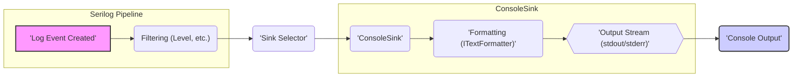

# Project Design Document: Serilog.Sinks.Console

**Version:** 1.1
**Date:** October 26, 2023
**Author:** AI Software Architect

## 1. Introduction

This document details the design of the `Serilog.Sinks.Console` project, a Serilog sink designed to output log events to the application's console. This document serves as a comprehensive reference for understanding the sink's architecture, data flow, and security considerations, specifically for future threat modeling exercises.

## 2. Goals and Non-Goals

### 2.1. Goals

*   Enable Serilog to write log events to standard output (stdout) or standard error (stderr).
*   Support customizable log output formatting using Serilog's formatting mechanisms.
*   Provide options to filter log events based on a minimum severity level.
*   Maintain a lightweight and efficient implementation to minimize performance impact.
*   Integrate seamlessly within the Serilog logging framework.
*   Offer straightforward configuration via code and configuration files.

### 2.2. Non-Goals

*   Implementing advanced console features such as colored output (this is the responsibility of formatters or terminal emulators).
*   Providing built-in log buffering or batching capabilities (handled by Serilog's core).
*   Managing redirection of console output to alternative destinations like files.
*   Supporting interactive console input or control.
*   Implementing complex log filtering logic beyond minimum level filtering.

## 3. Architecture and Components

The `Serilog.Sinks.Console` sink operates as a bridge between the Serilog logging pipeline and the operating system's console output streams.

*   **`ConsoleSink` Class:** The core component, implementing Serilog's `ILogEventSink` interface. Its responsibilities include:
    *   Receiving log events emitted by Serilog.
    *   Utilizing a configured `ITextFormatter` to render the log event into a string.
    *   Writing the formatted string to the designated console output stream (stdout or stderr).
    *   Managing minimal resource disposal (typically no significant resources).

*   **`ITextFormatter` Interface:**  A Serilog interface responsible for transforming a log event into a textual representation. The `ConsoleSink` is configured with a concrete implementation, such as:
    *   `MessageTemplateTextFormatter`: Renders log messages based on provided templates.
    *   `JsonFormatter`: Outputs log events in JSON format.
    *   User-defined custom formatters.

*   **Console Output Streams (stdout/stderr):** Standard output channels provided by the operating system. The `ConsoleSink` writes formatted log messages to either stdout or stderr, as determined by its configuration. This interaction leverages the `System.Console` class in .NET.

*   **Configuration Options:** Settings that control the sink's behavior, configured through Serilog's configuration system (code or configuration files):
    *   `output`: Specifies the target output stream: `stdout` or `stderr`.
    *   `formatter`: Defines the `ITextFormatter` implementation to use for rendering log events.
    *   `restrictedToMinimumLevel`: Sets the minimum `LogEventLevel` for events to be processed by this sink.

## 4. Data Flow

The following diagram illustrates the journey of a log event through the `Serilog.Sinks.Console`:



**Detailed Steps:**

1. **'Log Event Created'**: An event is logged within the application code using Serilog's logging methods (e.g., `Log.Information()`).
2. **Filtering (Level, etc.)**: Serilog's core pipeline evaluates the log event against configured filters, including the minimum level set for sinks.
3. **'Sink Selector'**: If the event passes the filters, Serilog's pipeline routes it to the appropriate sinks, including the `ConsoleSink`.
4. **'ConsoleSink'**: The `ConsoleSink`'s `Emit()` method is invoked, receiving the log event.
5. **'Formatting (ITextFormatter)'**: The `ConsoleSink` utilizes the configured `ITextFormatter` to transform the `LogEvent` into a formatted string representation.
6. **'Output Stream (stdout/stderr)'**: Based on the sink's configuration, the formatted string is directed to either the standard output stream (stdout) or the standard error stream (stderr).
7. **'Console Output'**: The formatted log message is written to the selected console output stream using methods provided by the operating system's console API (typically via `System.Console.WriteLine()` or `System.Console.Error.WriteLine()` in .NET).

## 5. Security Considerations (For Threat Modeling)

This section outlines potential security considerations relevant to the `Serilog.Sinks.Console`, intended to inform future threat modeling activities.

*   **Information Disclosure via Console Output:** Log events might contain sensitive data (e.g., API keys, user credentials, internal paths). If console output is not appropriately secured (e.g., in container environments, development machines, or shared systems), this information could be inadvertently exposed.
    *   **Example Threat:** A misconfigured container environment allows unauthorized access to container logs, revealing sensitive data logged to the console.
*   **Indirect Format String Vulnerabilities:** While the `ConsoleSink` doesn't directly process format strings, the configured `ITextFormatter` might. If a formatter like `MessageTemplateTextFormatter` is used with log messages derived from untrusted user input, it could potentially lead to format string vulnerabilities.
    *   **Example Threat:** A user-provided string is used directly in a log message template, allowing an attacker to inject format specifiers and potentially read memory or cause a crash.
*   **Denial of Service through Excessive Logging:**  Uncontrolled or excessive logging to the console can consume significant system resources (CPU, memory), potentially impacting application performance and leading to a denial of service. This is more related to overall logging configuration but the console sink is the final output point.
    *   **Example Threat:** A bug in the application logic causes a logging loop, flooding the console with messages and exhausting system resources.
*   **Compromised Configuration:** If the application's configuration is compromised, an attacker could modify the `ConsoleSink`'s settings to log sensitive information to a more accessible output stream or use a malicious formatter.
    *   **Example Threat:** An attacker gains access to the application's configuration file and changes the console output to `stdout` when sensitive data is being logged, making it easier to capture.
*   **Logging Sensitive Data to Standard Output in Production:** Writing sensitive information to `stdout`, which is often captured by default in container logs, CI/CD pipelines, or monitoring systems, can lead to unintended and persistent exposure of sensitive data.
    *   **Example Threat:**  Database connection strings are logged to `stdout` during application startup and are subsequently stored in the container's log history, accessible to unauthorized personnel.

## 6. Deployment

The `Serilog.Sinks.Console` is distributed as a NuGet package that can be easily integrated into any .NET project. Once added as a dependency, it can be configured as a sink within the Serilog logging pipeline.

**Configuration Examples:**

*   **Code-based configuration:**

    ```csharp
    var logger = new LoggerConfiguration()
        .WriteTo.Console() // Writes to stdout with the default formatter
        .CreateLogger();

    var loggerWithCustomFormat = new LoggerConfiguration()
        .WriteTo.Console(outputTemplate: "[{Timestamp:HH:mm:ss} {Level:u3}] {Message:lj}{NewLine}{Exception}")
        .CreateLogger();

    var loggerToErrorStream = new LoggerConfiguration()
        .WriteTo.Console(output: Output.Error)
        .CreateLogger();
    ```

*   **Configuration file (e.g., `appsettings.json`):**

    ```json
    {
      "Serilog": {
        "WriteTo": [
          { "Name": "Console" },
          {
            "Name": "Console",
            "Args": {
              "outputTemplate": "[{Timestamp:HH:mm:ss} {Level:u3}] {Message:lj}{NewLine}{Exception}"
            }
          },
          {
            "Name": "Console",
            "Args": {
              "output": "Error"
            }
          }
        ]
      }
    }
    ```

## 7. Future Considerations

*   **Asynchronous Output Option:**  Investigate the potential benefits of offering an asynchronous mode for writing to the console to avoid potential blocking of the main application thread in high-throughput scenarios.
*   **Extensibility for Terminal Features:** Explore options for allowing extension points or integrations for basic terminal-specific features (e.g., simple progress indicators) in a cross-platform manner, without making them core features.
*   **Enhanced Documentation on Security Best Practices:** Provide more explicit guidance in the documentation regarding security best practices when using the console sink, particularly concerning sensitive data and production environments.

This improved design document provides a more detailed and structured overview of the `Serilog.Sinks.Console` project, enhancing its value for threat modeling and future development efforts.