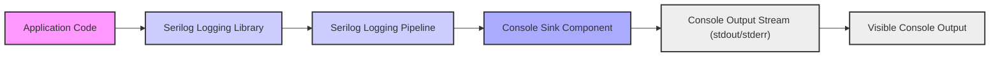

# Project Design Document: Serilog Console Sink (Improved)

**Project:** Serilog Console Sink (`serilog-sinks-console`)

**Version:** 1.1

**Date:** 2023-10-27 (Revised)

**Author:** AI Expert (as requested)

## 1. Introduction

This document provides an enhanced design overview of the Serilog Console Sink project (`serilog-sinks-console`), a sink for the Serilog logging library. This revised document aims to provide even greater clarity and detail for threat modeling and security analysis. It outlines the architecture, components, data flow, and key security considerations with more specific examples and mitigation strategies.

### 1.1. Purpose

The `serilog-sinks-console` project serves as a Serilog sink, directing log events to the application's console output streams (standard output or standard error). Its primary use cases include:

* **Rapid Development Feedback:** Providing immediate, visible logging output during software development and debugging phases.
* **Local Application Monitoring:** Enabling straightforward logging for applications running in local environments where console access is readily available.
* **Simplified Logging Solutions:** Offering a lightweight logging mechanism for scenarios that do not necessitate the complexity of more persistent or remote logging sinks.

### 1.2. Target Audience

This document is designed for a broad technical audience:

* **Security Architects and Engineers:** To gain a deep understanding of the sink's architecture for comprehensive threat modeling and security assessments, enabling them to identify potential vulnerabilities and recommend appropriate security controls.
* **Software Developers:** To understand the internal workings of the sink, facilitating effective integration with Serilog and informed decisions regarding logging configurations and potential security implications in their code.
* **Operations and DevOps Teams:** To understand the sink's operational behavior, especially in containerized or cloud environments, and to manage the security aspects of console logs within their infrastructure.

## 2. System Overview

The `serilog-sinks-console` operates as an integral part of the Serilog logging ecosystem. It functions as a destination for log events generated by applications utilizing Serilog.  The sink is configured within the Serilog pipeline, receiving structured log events and transforming them into a human-readable format for display in the console.

### 2.1. High-Level Architecture

The following diagram illustrates the high-level architecture and data flow, emphasizing the interaction between the application, Serilog, the console sink, and the final console output:



**Components (Descriptive Names):**

* **"Application Code"**: The .NET application that generates log events using the Serilog API.
* **"Serilog Logging Library"**: The core Serilog library, responsible for creating, enriching, and routing log events based on configured settings.
* **"Serilog Logging Pipeline"**: The configured processing pipeline within Serilog that receives log events and directs them to registered sinks, including the console sink.
* **"Console Sink Component"**: The `serilog-sinks-console` component, specifically designed to receive log events from the Serilog pipeline and format them for console presentation.
* **"Console Output Stream (stdout/stderr)"**: The standard output or standard error streams associated with the application's process, serving as the immediate destination for formatted log messages.
* **"Visible Console Output"**: The actual text displayed in the console window or terminal, representing the final rendered log messages as seen by users or captured by logging systems.

### 2.2. Key Features (Expanded)

* **Flexible Text Formatting:** Supports a variety of `ITextFormatter` implementations, enabling fine-grained control over the structure and appearance of log messages. This includes options for simple text, structured JSON, compact formats, and customizable templates.
* **Configurable Output Streams:** Allows redirection of log output to either standard output (`stdout`) for general informational messages or standard error (`stderr`) for error and warning messages, providing semantic separation of log streams.
* **Themed Console Output:**  Leverages `ConsoleTheme` to enhance readability and visual differentiation of log levels and message components through color and style customization, improving the developer experience.
* **Simplified Setup and Integration:** Designed for easy configuration, either programmatically within code or declaratively through configuration files (e.g., `appsettings.json`), minimizing setup overhead.
* **Minimal Resource Footprint:**  Introduces minimal dependencies and processing overhead, making it suitable for applications where performance is a critical consideration, especially during development and debugging.

## 3. Component Design (Detailed)

This section provides a deeper dive into the internal components of the `serilog-sinks-console` project.

### 3.1. `ConsoleSink` Class (Core Logic)

The `ConsoleSink` class is the central component, implementing the `ILogEventSink` interface from Serilog. This interface dictates how sinks interact with the Serilog pipeline.

**Responsibilities (Detailed):**

* **Log Event Reception:**  Accepts `LogEvent` objects pushed from the Serilog pipeline. Each `LogEvent` encapsulates structured log data, including timestamp, level, message template, properties, and exception details.
* **Log Event Formatting:** Employs a configured `ITextFormatter` to transform the rich `LogEvent` object into a plain text string suitable for console display. The choice of formatter dictates the final output format.
* **Console Output Writing:**  Writes the formatted log message string to the designated console output stream (`stdout` or `stderr`) using a `TextWriter`. This is the final step in the sink's processing pipeline.
* **Resource Management (Minimal):** While console streams are typically managed by the operating system and process lifecycle, the `ConsoleSink` handles any internal resource disposal if required by the chosen formatter or output stream configuration (though generally minimal in this sink).

**Configuration Options (Programmatic and Declarative):**

* **`outputStream` (TextWriter):**
    * **Purpose:**  Specifies the `TextWriter` instance to which log messages will be written.
    * **Defaults:**  Defaults to `Console.Out` (standard output).
    * **Options:** Can be explicitly set to `Console.Error` (standard error) or a custom `TextWriter` for advanced scenarios (e.g., writing to a memory stream for testing).
* **`formatter` (ITextFormatter):**
    * **Purpose:** Defines the format in which `LogEvent` objects are rendered as text.
    * **Common Implementations:**
        * `MessageTemplateTextFormatter`:  Formats output based on message templates defined in log statements, enabling structured and readable logs.
        * `JsonFormatter`: Serializes the entire `LogEvent` into JSON format, suitable for machine consumption and structured logging analysis.
        * `CompactJsonFormatter`:  Produces a more space-efficient JSON representation of the `LogEvent`.
        * Custom `ITextFormatter` implementations: Allows developers to create highly specialized output formats tailored to specific needs.
* **`theme` (ConsoleTheme, Optional):**
    * **Purpose:**  Applies visual styling (colors, text attributes) to the console output, enhancing readability and highlighting log levels or message components.
    * **Themes:**  Predefined themes like `AnsiConsoleTheme` (for ANSI-compatible terminals) and `SystemConsoleTheme` (for system consoles) are available, and custom themes can be created.

### 3.2. `ITextFormatter` Interface and Formatters (Extensibility)

The `ITextFormatter` interface is a crucial abstraction point, enabling pluggable formatting logic within the console sink.

**Key Formatters (Ecosystem Integration):**

* **`MessageTemplateTextFormatter` (Structured Text):**  Formats log messages according to message templates, preserving structure and readability. Example: `"{Timestamp:HH:mm:ss} [{Level}] {Message}{NewLine}{Exception}"`.
* **`JsonFormatter` (Machine-Readable JSON):**  Serializes the complete `LogEvent` object into JSON. Ideal for integration with log analysis tools and systems that consume structured data. Example output: `{"Timestamp":"...","Level":"...","Message":"...", ...}`.
* **`CompactJsonFormatter` (Optimized JSON):**  A variation of `JsonFormatter` that produces more compact JSON output by removing redundant whitespace and potentially optimizing data representation.
* **Custom Formatters (Developer Defined):**  Developers can implement the `ITextFormatter` interface to create completely custom formatting logic, allowing for highly specialized output formats to meet unique requirements. This promotes extensibility and adaptation to diverse logging needs.

### 3.3. `ConsoleTheme` and Styling (Visual Enhancement)

`ConsoleTheme` provides a mechanism to customize the visual presentation of console logs, improving readability and making it easier to quickly identify log levels and important information.

**Key Features (Customization):**

* **Log Level Color Mapping:**  Associates specific colors with each Serilog log level (Verbose, Debug, Information, Warning, Error, Fatal). For example, Errors might be displayed in red, Warnings in yellow, and Information in green.
* **Style Application (Attributes):**  Allows applying text styles like bold, italic, or underline to different parts of the log message (e.g., highlighting the log level in bold).
* **Theme Extensibility (Custom Themes):**  Developers can define their own `ConsoleTheme` instances to create unique visual styles or adapt to specific terminal color schemes. Pre-built themes offer starting points and common styling conventions.

### 3.4. Configuration Mechanisms (Simplified and Flexible)

`serilog-sinks-console` benefits from Serilog's flexible configuration system, supporting both programmatic and declarative approaches.

**Configuration Methods (Examples):**

* **Programmatic Configuration (Fluent API):**
    ```csharp
    Log.Logger = new LoggerConfiguration()
        .WriteTo.Console() // Basic console logging with default formatter
        .WriteTo.Console(formatter: new JsonFormatter()) // Using JSON formatter
        .WriteTo.Console(outputTemplate: "[{Timestamp:HH:mm:ss} {Level:u3}] {Message:lj}{NewLine}{Exception}", theme: ConsoleTheme.None) // Custom template and theme
        .CreateLogger();
    ```
* **Declarative Configuration (JSON - `appsettings.json`):**
    ```json
    {
      "Serilog": {
        "WriteTo": [
          {
            "Name": "Console",
            "Args": {
              "outputTemplate": "[{Timestamp:HH:mm:ss} {Level:u3}] {Message:lj}{NewLine}{Exception}",
              "theme": "Serilog.Sinks.SystemConsole.Themes.SystemConsoleTheme::Grayscale" // Using a predefined theme
            }
          }
        ]
      }
    }
    ```
* **Extension Methods (Convenience):** Serilog's `WriteTo` static class provides extension methods like `Console()` to streamline sink configuration, making setup concise and readable.

## 4. Data Flow (Detailed Steps)

This section elaborates on the step-by-step data flow within the `serilog-sinks-console` during log event processing.


**Data Flow Steps (Detailed Breakdown):**

1. **"Log Event Object (Serilog Pipeline)"**: A `LogEvent` object, containing structured log data, is passed from the Serilog logging pipeline to the registered `ConsoleSink` instance. This event is the unit of data processed by the sink.
2. **"ConsoleSink Instance"**: The `ConsoleSink` receives the `LogEvent`. This is the entry point for the sink's processing logic.
3. **"Output Formatting (ITextFormatter)"**: The `ConsoleSink` invokes the configured `ITextFormatter` (e.g., `MessageTemplateTextFormatter`, `JsonFormatter`). The formatter takes the `LogEvent` as input and applies formatting rules to generate a text representation.
4. **"Formatted Log Message String"**: The `ITextFormatter` produces a formatted string. This string is now ready to be written to the console.
5. **"Console Output Stream (stdout/stderr)"**: The `ConsoleSink` obtains the configured `TextWriter` (representing either `stdout` or `stderr`). It then writes the formatted log message string to this `TextWriter`.
6. **"Console Display"**: The operating system handles the `TextWriter` output, ultimately displaying the formatted log message in the application's console or terminal window. This is the final output visible to users or captured by logging infrastructure.

## 5. Security Considerations (Enhanced)

This section expands on security considerations, providing more specific examples and mitigation strategies for each potential risk.

### 5.1. Information Disclosure (Risk and Mitigation)

* **Risk:** Log events may inadvertently contain sensitive data such as user credentials, API keys, Personally Identifiable Information (PII), internal system paths, or detailed error messages revealing system internals. If console output is accessible to unauthorized individuals (e.g., in shared development environments, exposed container logs, or through screen sharing), this can lead to significant information disclosure.
* **Examples:**
    * Logging HTTP request headers that contain authorization tokens.
    * Including database connection strings in debug logs.
    * Printing stack traces that reveal internal code paths and variable values.
* **Mitigation Strategies:**
    * **Data Sanitization:** Implement robust data sanitization techniques within the application code *before* logging. Remove or redact sensitive information from log messages. Use Serilog's filtering and masking capabilities to prevent sensitive properties from being logged.
    * **Principle of Least Privilege:** Restrict access to environments where console output is visible. In development, limit access to developers actively working on the application. In containerized environments, secure container logs and restrict access to authorized personnel.
    * **Log Level Management:** Carefully control log levels. Avoid logging highly verbose debug or trace information in production environments where console output might be more broadly accessible. Use appropriate log levels (Information, Warning, Error) to minimize the risk of accidental sensitive data logging.
    * **Output Redirection (stderr for sensitive logs):** Consider directing more sensitive or error-related logs to standard error (`stderr`). While not a security control in itself, `stderr` might be less commonly captured or redirected by default in some environments compared to `stdout`.
    * **Regular Security Audits:** Periodically review log output and logging configurations to identify and rectify any instances of unintentional sensitive data logging.

### 5.2. Denial of Service (DoS) (Risk and Mitigation)

* **Risk:** Excessive logging to the console, especially with verbose formatters or high log volumes during peak load or under attack, can consume significant system resources (CPU, I/O). This can degrade application performance and potentially lead to a denial-of-service condition, particularly in resource-constrained environments.
* **Examples:**
    * Logging every HTTP request and response in detail.
    * Logging sensor data at very high frequencies.
    * Uncontrolled logging during error conditions or attack scenarios.
* **Mitigation Strategies:**
    * **Rate Limiting/Throttling:** Implement rate limiting or throttling mechanisms within the application or Serilog configuration to control the volume of log events generated, especially for less critical log levels.
    * **Asynchronous Logging:** Serilog is inherently asynchronous. Ensure that logging operations do not block the main application threads. Verify asynchronous sink behavior under load.
    * **Efficient Formatters:** Choose efficient `ITextFormatter` implementations. Avoid overly complex or computationally expensive formatters, especially in high-throughput scenarios. Consider simpler formatters like `MessageTemplateTextFormatter` with optimized templates or `CompactJsonFormatter`.
    * **Log Level Filtering:** Configure Serilog to filter out less important log levels (e.g., Debug, Verbose) in production environments or during periods of high load. Only log essential information (Information, Warning, Error, Fatal).
    * **Resource Monitoring:** Monitor application resource consumption (CPU, I/O) related to logging, especially under load testing, to identify potential performance bottlenecks caused by excessive console logging.

### 5.3. Access Control to Console Output (Risk and Mitigation)

* **Risk:** Inadequate access control to console output can allow unauthorized users to view sensitive log information, potentially leading to information disclosure or aiding in malicious activities.
* **Examples:**
    * Shared development servers where multiple developers can access each other's console output.
    * Container logs exposed without proper authentication or authorization in container orchestration platforms.
    * Screen sharing or remote access sessions where console output is visible to unintended parties.
* **Mitigation Strategies:**
    * **Operating System Permissions:** Leverage operating system-level permissions to restrict access to the application process and its output streams. Ensure that only authorized users or processes can access console output directly.
    * **Container Security:** In containerized environments, implement robust access control mechanisms for container logs. Utilize container orchestration platform features (e.g., Kubernetes RBAC, Docker secrets management) to secure log access.
    * **Log Aggregation Security:** If console output is aggregated into centralized logging systems, implement strong authentication and authorization controls for accessing these aggregated logs. Follow security best practices for the chosen logging platform.
    * **Secure Development Practices:** Educate developers about the importance of secure logging practices and the risks of exposing console output in insecure environments. Promote awareness of access control considerations.

### 5.4. Dependency Security (Risk and Mitigation)

* **Risk:** The `serilog-sinks-console` depends on the core Serilog library and potentially other formatting libraries. Vulnerabilities in these dependencies could indirectly affect the security of applications using the console sink.
* **Mitigation Strategies:**
    * **Dependency Scanning:** Regularly scan project dependencies (including Serilog core and formatter libraries) for known security vulnerabilities using dependency scanning tools (e.g., OWASP Dependency-Check, Snyk).
    * **Dependency Updates:** Keep Serilog core, `serilog-sinks-console`, and any formatter dependencies up-to-date with the latest versions. Regularly apply security patches and updates released by the Serilog project and dependency maintainers.
    * **Vulnerability Monitoring:** Subscribe to security advisories and vulnerability databases related to .NET and Serilog to stay informed about potential security issues affecting dependencies.

### 5.5. Input Validation (Indirect - Log Message Content)

* **Risk:** While the console sink itself doesn't directly process user input, the *content* of log messages originates from application code, which *can* be influenced by user input. If application code is vulnerable to injection attacks or improper input handling, malicious or crafted input could be logged, potentially leading to log injection vulnerabilities in downstream log processing systems (though less directly exploitable via the console sink itself).
* **Mitigation Strategies:**
    * **Secure Coding Practices:** Implement secure coding practices in the application to prevent injection vulnerabilities (e.g., SQL injection, command injection, log injection). Properly validate and sanitize user input before processing and logging it.
    * **Output Encoding (Context-Aware):** If log messages are intended to be processed by other systems that might interpret special characters (e.g., HTML in web logs), consider context-aware output encoding to prevent injection attacks in those downstream systems. However, for simple console output, this is less of a direct concern.
    * **Log Analysis Security:** If console logs are ingested into log analysis platforms, ensure that those platforms are also secured against log injection vulnerabilities and have appropriate input validation and sanitization mechanisms.

## 6. Deployment Considerations (Expanded)

* **Development Environments (Primary Use Case):** Console sink remains highly recommended for development due to its ease of use, immediate feedback, and minimal setup. It's invaluable for debugging and local testing.
* **Local Applications (Suitable):** Well-suited for desktop applications, command-line tools, and scripts running locally where console output is directly accessible and provides a simple logging solution.
* **Containerized Applications (Common, but with caveats):** Frequently used in containerized environments because container runtimes typically capture `stdout` and `stderr` as container logs. However, in production container environments:
    * **Log Persistence:** Console logs are often ephemeral and tied to the container lifecycle. For persistent logging, consider using file sinks mounted to volumes or dedicated logging sidecar containers that forward logs to centralized systems.
    * **Scalability:** For high-scale containerized applications, relying solely on console logs might not be scalable for log aggregation and analysis. Consider using network sinks (e.g., Elasticsearch, Graylog, cloud logging services) for centralized and scalable logging.
* **Production Environments (Limited Direct Use):** Direct console logging in production is generally *not recommended* for critical, high-scale, or long-running applications due to:
    * **Lack of Persistence:** Console output is typically not persistently stored by default.
    * **Scalability Challenges:** Managing and analyzing console logs across many production instances can be complex.
    * **Performance Overhead (Potential):** While generally lightweight, excessive console logging can still introduce some performance overhead in production.
    * **Security Concerns (Access Control):** Ensuring secure access to console output in production environments can be more challenging compared to dedicated logging systems.
* **Production Alternatives:** For production logging, consider more robust and scalable sinks like:
    * **File Sinks:** Writing logs to files provides persistence and is suitable for many server applications.
    * **Database Sinks:** Storing logs in databases enables structured querying and analysis.
    * **Network Sinks (Centralized Logging):** Forwarding logs to centralized logging systems (e.g., Elasticsearch, Splunk, cloud logging services) provides scalability, searchability, and centralized management for production environments.

## 7. Threat Modeling Focus Areas (Actionable)

When conducting threat modeling for systems utilizing `serilog-sinks-console`, focus on these actionable areas, directly linked to the security considerations:

* **Information Disclosure via Console Logs:**
    * **Action:** Analyze log message content for sensitive data. Implement data sanitization and masking in application code and Serilog configuration. Review log levels and reduce verbosity in sensitive environments.
* **Access Control to Console Output Streams:**
    * **Action:** Evaluate access control mechanisms for environments where console output is visible (development servers, container logs, screen sharing). Implement OS-level permissions, container security policies, and secure log aggregation practices.
* **Dependency Vulnerabilities in Serilog and Formatters:**
    * **Action:** Implement automated dependency scanning and vulnerability monitoring. Establish a process for promptly updating Serilog core, `serilog-sinks-console`, and formatter dependencies to address security patches.
* **Denial of Service through Excessive Console Logging:**
    * **Action:** Conduct load testing to assess the impact of console logging on application performance. Implement rate limiting, log level filtering, and consider asynchronous logging to mitigate DoS risks.
* **Indirect Log Injection via Application Input:**
    * **Action:** Enforce secure coding practices to prevent injection vulnerabilities in application code. Validate and sanitize user input before logging. If logs are processed by downstream systems, ensure those systems are also protected against log injection.

## 8. Conclusion (Reinforced)

The `serilog-sinks-console` remains a valuable and efficient sink for fundamental logging needs, particularly during development and in local application contexts. This enhanced design document provides a more detailed and security-focused perspective. While the sink itself is relatively simple, understanding the potential information disclosure risks, access control requirements, and dependency management aspects is crucial for building secure applications. By proactively addressing the threat modeling focus areas and implementing the recommended mitigation strategies, developers and security teams can confidently leverage `serilog-sinks-console` while minimizing potential security vulnerabilities. For production environments, carefully evaluate the limitations of console logging and consider more robust and scalable logging solutions as needed.