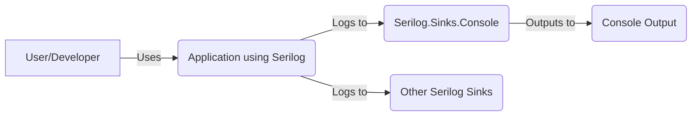
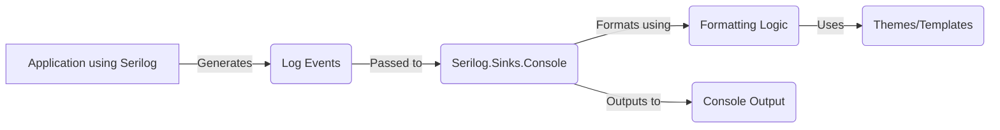
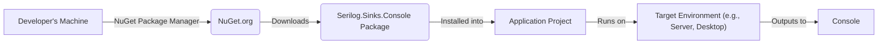
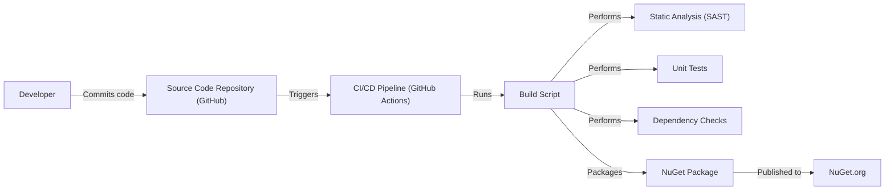

# BUSINESS POSTURE

Business Priorities and Goals:

*   Provide a simple and efficient way to output structured log events to the console.
*   Offer flexible formatting options for log output, including themes and custom templates.
*   Maintain high performance and minimal overhead to avoid impacting application performance.
*   Ensure compatibility with various operating systems and .NET versions.
*   Provide a well-documented and easy-to-use library for developers.
*   Support for structured logging, allowing for easier querying and analysis of log data.

Business Risks:

*   Inadequate log output formatting could hinder debugging and troubleshooting efforts.
*   Performance bottlenecks in the sink could negatively impact the performance of applications using it.
*   Compatibility issues with specific platforms or .NET versions could limit adoption.
*   Lack of sufficient documentation or examples could make it difficult for developers to use the sink effectively.
*   Vulnerabilities in the sink could potentially expose sensitive information or allow for code injection attacks.

# SECURITY POSTURE

Existing Security Controls:

*   security control: The project is open-source, allowing for community review and contributions to identify and address security vulnerabilities. (GitHub repository)
*   security control: The project uses established and well-vetted libraries like Serilog, reducing the risk of introducing new vulnerabilities. (Serilog dependency)
*   security control: The project follows standard .NET coding practices, minimizing the likelihood of common coding errors.
*   accepted risk: The sink itself does not handle sensitive data directly, reducing the risk of data breaches. It primarily deals with formatting and outputting log messages.
*   accepted risk: The sink does not perform any authentication or authorization, as it is not its responsibility.

Recommended Security Controls:

*   security control: Implement regular security audits and code reviews to identify and address potential vulnerabilities.
*   security control: Integrate static analysis tools into the build process to detect potential security issues early on.
*   security control: Consider adding support for sanitizing or escaping potentially sensitive data in log messages before outputting them to the console.

Security Requirements:

*   Authentication: Not applicable, as the sink does not handle user authentication.
*   Authorization: Not applicable, as the sink does not control access to resources.
*   Input Validation:
    *   The sink should handle potentially malicious or unexpected input gracefully, avoiding crashes or vulnerabilities.
    *   If custom formatters or templates are used, ensure they are validated or sanitized to prevent code injection attacks.
*   Cryptography: Not applicable, as the sink does not handle encryption or decryption.

# DESIGN

## C4 CONTEXT

Element Descriptions:

*   Element 1:
    *   Name: User/Developer
    *   Type: Person
    *   Description: The developer integrating Serilog and the console sink into their application, or the user interacting with the application.
    *   Responsibilities: Configures Serilog, writes log messages, and views the console output.
    *   Security controls: Not directly applicable.

*   Element 2:
    *   Name: Application using Serilog
    *   Type: Software System
    *   Description: The application that uses Serilog for logging.
    *   Responsibilities: Generates log events.
    *   Security controls: Application-specific security controls.

*   Element 3:
    *   Name: Serilog.Sinks.Console
    *   Type: Software System (Library)
    *   Description: The Serilog console sink library.
    *   Responsibilities: Formats and outputs log events to the console.
    *   Security controls: Input validation of format strings, safe handling of log event data.

*   Element 4:
    *   Name: Console Output
    *   Type: System (Operating System)
    *   Description: The standard output console (terminal).
    *   Responsibilities: Displays the formatted log messages.
    *   Security controls: Operating system-level security controls.

*   Element 5:
    *   Name: Other Serilog Sinks
    *   Type: Software System (Library)
    *   Description: Other sinks that might be used.
    *   Responsibilities: Formats and outputs log events to the different targets.
    *   Security controls: Sink-specific security controls.

## C4 CONTAINER

Element Descriptions:

*   Element 1:
    *   Name: Application using Serilog
    *   Type: Software System
    *   Description: The application that uses Serilog for logging.
    *   Responsibilities: Generates log events.
    *   Security controls: Application-specific security controls.

*   Element 2:
    *   Name: Log Events
    *   Type: Data
    *   Description: Structured log events generated by the application.
    *   Responsibilities: Contains the data to be logged.
    *   Security controls: Data sanitization within the application.

*   Element 3:
    *   Name: Serilog.Sinks.Console
    *   Type: Container (Library)
    *   Description: The Serilog console sink library.
    *   Responsibilities: Receives log events, formats them, and outputs them to the console.
    *   Security controls: Input validation of format strings, safe handling of log event data.

*   Element 4:
    *   Name: Formatting Logic
    *   Type: Component
    *   Description: The logic within the sink that handles formatting of log events.
    *   Responsibilities: Applies themes and templates to format log events.
    *   Security controls: Input validation, sanitization of user-provided format strings.

*   Element 5:
    *   Name: Console Output
    *   Type: System (Operating System)
    *   Description: The standard output console (terminal).
    *   Responsibilities: Displays the formatted log messages.
    *   Security controls: Operating system-level security controls.

*   Element 6:
    *   Name: Themes/Templates
    *   Type: Configuration
    *   Description: Configuration settings that control the appearance of log output.
    *   Responsibilities: Defines the format of log messages.
    *   Security controls: Validation of custom templates to prevent injection attacks.

## DEPLOYMENT

Possible Deployment Solutions:

1.  NuGet Package: The most common way to deploy Serilog.Sinks.Console is as a NuGet package. The application developer adds a dependency to their project, and the package manager handles downloading and installing the library.
2.  Manual DLL Reference: Less common, but possible, is to manually download the DLL and reference it in the project.

Chosen Solution (NuGet Package):

Element Descriptions:

*   Element 1:
    *   Name: Developer's Machine
    *   Type: Infrastructure Node
    *   Description: The machine where the developer builds the application.
    *   Responsibilities: Hosts the development environment and tools.
    *   Security controls: Standard development environment security controls.

*   Element 2:
    *   Name: NuGet.org
    *   Type: Infrastructure Node (Package Repository)
    *   Description: The public NuGet package repository.
    *   Responsibilities: Hosts the Serilog.Sinks.Console package.
    *   Security controls: NuGet.org's security measures (e.g., package signing, vulnerability scanning).

*   Element 3:
    *   Name: Serilog.Sinks.Console Package
    *   Type: Software Artifact
    *   Description: The compiled library packaged for distribution.
    *   Responsibilities: Provides the functionality of the console sink.
    *   Security controls: Code signing (if implemented).

*   Element 4:
    *   Name: Application Project
    *   Type: Software System
    *   Description: The developer's application project.
    *   Responsibilities: Contains the application code and dependencies.
    *   Security controls: Application-specific security controls.

*   Element 5:
    *   Name: Target Environment (e.g., Server, Desktop)
    *   Type: Infrastructure Node
    *   Description: The environment where the application is deployed and runs.
    *   Responsibilities: Executes the application code.
    *   Security controls: Operating system and environment-specific security controls.

*   Element 6:
    *   Name: Console
    *   Type: System (Operating System)
    *   Description: Standard output.
    *   Responsibilities: Displays output.
    *   Security controls: Operating system and environment-specific security controls.

## BUILD

Element Descriptions:

*   Element 1:
    *   Name: Developer
    *   Type: Person
    *   Description: The person writing and committing code.
    *   Responsibilities: Writes code, performs unit tests, commits changes.
    *   Security controls: Code review practices.

*   Element 2:
    *   Name: Source Code Repository (GitHub)
    *   Type: System
    *   Description: The repository hosting the project's source code.
    *   Responsibilities: Stores code, tracks changes, manages versions.
    *   Security controls: Access controls, branch protection rules.

*   Element 3:
    *   Name: CI/CD Pipeline (GitHub Actions)
    *   Type: System
    *   Description: The automated build and deployment pipeline.
    *   Responsibilities: Automates building, testing, and packaging the software.
    *   Security controls: Secure configuration of the pipeline, access controls.

*   Element 4:
    *   Name: Build Script
    *   Type: Script
    *   Description: The script that defines the build process.
    *   Responsibilities: Compiles code, runs tests, packages the software.
    *   Security controls: Secure coding practices within the script.

*   Element 5:
    *   Name: Static Analysis (SAST)
    *   Type: Process
    *   Description: Static analysis tools scan the code for potential vulnerabilities.
    *   Responsibilities: Identifies potential security issues in the code.
    *   Security controls: Configuration of the SAST tool, review of findings.

*   Element 6:
    *   Name: Unit Tests
    *   Type: Process
    *   Description: Automated tests that verify the functionality of individual components.
    *   Responsibilities: Ensures code quality and correctness.
    *   Security controls: Thorough test coverage.

*   Element 7:
    *   Name: Dependency Checks
    *   Type: Process
    *   Description: Checks for known vulnerabilities in project dependencies.
    *   Responsibilities: Identifies outdated or vulnerable dependencies.
    *   Security controls: Use of dependency checking tools (e.g., OWASP Dependency-Check).

*   Element 8:
    *   Name: NuGet Package
    *   Type: Artifact
    *   Description: The compiled library packaged for distribution.
    *   Responsibilities: Contains the compiled code and metadata.
    *   Security controls: Code signing (if implemented).

*   Element 9:
    *   Name: NuGet.org
    *   Type: System
    *   Description: The public NuGet package repository.
    *   Responsibilities: Hosts the Serilog.Sinks.Console package.
    *   Security controls: NuGet.org's security measures.

# RISK ASSESSMENT

Critical Business Processes:

*   Application logging: The ability for applications to reliably log events is critical for monitoring, debugging, and auditing.

Data Protection:

*   Log event data: While the sink itself doesn't handle sensitive data directly, the log messages generated by the application *might* contain sensitive information (e.g., user IDs, error messages revealing internal details). The sensitivity depends entirely on what the application logs.
    *   Sensitivity: Potentially sensitive, depending on the application's logging practices.

# QUESTIONS & ASSUMPTIONS

Questions:

*   Are there any specific compliance requirements (e.g., GDPR, HIPAA) that need to be considered regarding the content of log messages?
*   Are there any specific performance requirements or limitations for the sink?
*   Are there any plans to support custom output targets beyond the standard console?
*   What is the process for handling security vulnerabilities reported in the project?

Assumptions:

*   BUSINESS POSTURE: The primary goal is to provide a reliable and performant console sink for Serilog.
*   SECURITY POSTURE: The application using the sink is responsible for handling sensitive data appropriately and not logging it directly. The sink itself does not require authentication or authorization.
*   DESIGN: The sink will be deployed primarily as a NuGet package. The build process will include static analysis and dependency checking.