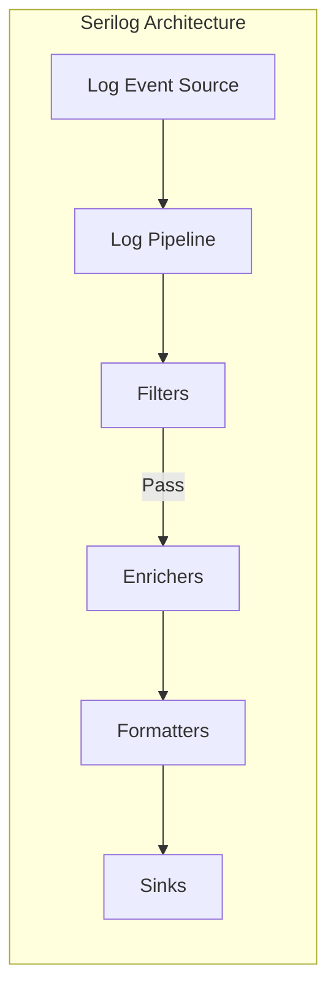
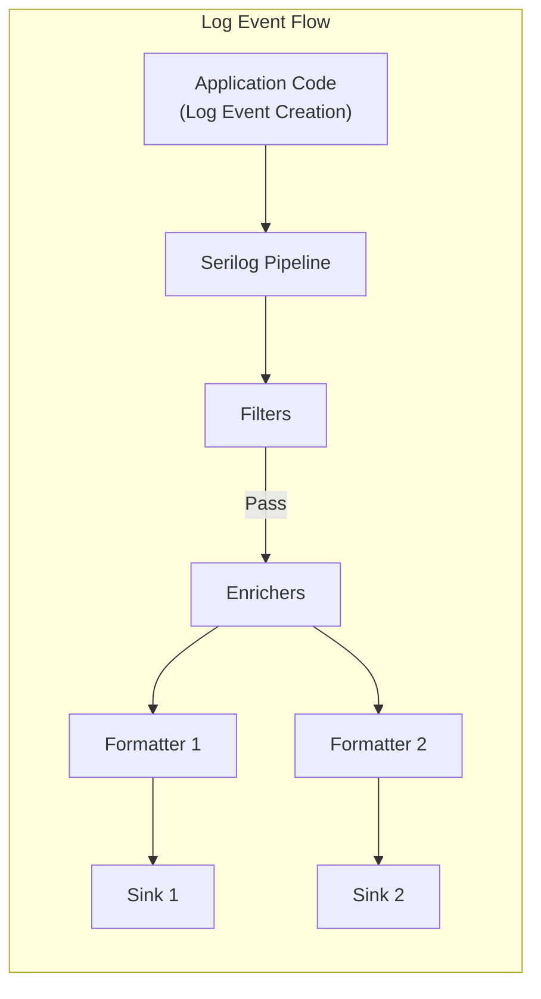

# Project Design Document: Serilog

**Version:** 1.1
**Date:** October 26, 2023
**Author:** AI Software Architect

## 1. Introduction

This document provides a detailed design overview of the Serilog logging library. It aims to describe the architecture, key components, and data flow within Serilog. This document will serve as a foundation for subsequent threat modeling activities, enabling a comprehensive understanding of potential security vulnerabilities and attack surfaces.

### 1.1. Purpose

The primary purpose of this document is to provide a clear and comprehensive design description of Serilog for the purpose of threat modeling. It outlines the system's architecture, components, and data flow, enabling security professionals to identify potential vulnerabilities and design appropriate mitigations.

### 1.2. Scope

This document covers the core architecture and functionality of the Serilog library as represented in the provided GitHub repository. It focuses on the logical components and their interactions within the logging pipeline. It does not delve into the specifics of individual sinks or enrichers unless they are crucial to understanding the core architecture.

### 1.3. Target Audience

This document is intended for:

* Security architects and engineers involved in threat modeling and security assessments of systems utilizing Serilog.
* Developers who need a deeper understanding of Serilog's internal workings for debugging or extending its functionality.
* DevOps engineers responsible for deploying and managing applications that use Serilog.

## 2. System Overview

Serilog is a diagnostic logging library for .NET applications. It is designed to be easy to use, extensible, and efficient. Its core features include:

* Structured Logging: Capturing log events as structured data (properties) rather than just plain text.
* Extensibility: A pluggable architecture allowing for various output destinations (sinks), formatting options, and data enrichment.
* Contextual Information: The ability to easily add contextual information to log events.
* Filtering: Mechanisms to filter log events based on severity, source, or other criteria.

## 3. Architectural Design

Serilog's architecture is centered around a pipeline that processes log events from their source to their final destination. The key components involved in this pipeline are:

* Log Event Source
* Log Pipeline
* Sinks
* Formatters
* Enrichers
* Filters

### 3.1. Component Descriptions

* **Log Event Source:**
    * Represents the point within the application code where log events are initiated.
    * Developers interact with the static `Log` class, using methods like `Log.Information()`, `Log.Warning()`, `Log.Error()`, etc.
    * Each logging call creates a `LogEvent` object.
    * A `LogEvent` minimally contains a message template (a string with optional placeholders) and a collection of properties captured at the time of logging.

* **Log Pipeline:**
    * The central processing unit of Serilog.
    * Holds the configuration for sinks, enrichers, and filters.
    * Receives `LogEvent` objects from the `Log Event Source`.
    * Orchestrates the application of filters, enrichers, and formatters to the `LogEvent`.
    * Manages the dispatching of processed `LogEvent`s to the configured sinks.

* **Sinks:**
    * Represent the output destinations for processed log events.
    * Implemented as separate NuGet packages (e.g., `Serilog.Sinks.Console`, `Serilog.Sinks.File`, `Serilog.Sinks.Seq`).
    * Each sink is responsible for accepting formatted log events and writing them to its specific target (e.g., console, file, database, remote service).
    * Sinks have their own configuration options, such as file paths, connection strings, API endpoints, and formatting rules specific to the destination.

* **Formatters:**
    * Responsible for transforming the structured `LogEvent` data into a specific textual representation suitable for a sink.
    * The default formatter produces a human-readable plain text format.
    * Custom formatters can be implemented to generate output in formats like JSON, XML, or other structured formats.
    * Formatters are typically associated with specific sinks, allowing different output formats for different destinations.

* **Enrichers:**
    * Components that add additional properties to `LogEvent` objects as they pass through the pipeline.
    * Provide contextual information beyond what is explicitly included in the logging call.
    * Can add properties like:
        * Machine name
        * Thread ID
        * Process ID
        * Environment variables
        * Custom application-specific data
    * Enrichers can be built-in or custom-implemented.

* **Filters:**
    * Determine whether a `LogEvent` should be processed further down the pipeline.
    * Allow for selective logging based on various criteria, such as:
        * Log event level (e.g., only log errors and fatal messages).
        * Source context (the class or namespace where the log event originated).
        * Specific property values within the log event.
    * Filters are applied early in the pipeline, preventing unnecessary processing of unwanted log events.

## 4. Data Flow

The typical flow of a log event through Serilog is as follows:

1. **Log Event Creation:** The application code executes a logging statement, creating a `LogEvent` object. This object contains the message template and any associated properties provided in the logging call.
2. **Pipeline Entry:** The newly created `LogEvent` is passed to the Serilog pipeline.
3. **Filtering:** The pipeline evaluates the `LogEvent` against the configured filters. If any filter rejects the event, it is dropped, and no further processing occurs.
4. **Enrichment:** If the `LogEvent` passes all filters, the configured enrichers are applied. Each enricher adds its specific properties to the `LogEvent`.
5. **Formatting:** The enriched `LogEvent` is then passed to the formatters associated with each configured sink. Each formatter transforms the `LogEvent` into the format required by its corresponding sink.
6. **Sink Output:** Finally, the formatted log event is passed to its designated sink, which writes the log information to its output destination (e.g., file, console, database).

## 5. Security Considerations (For Threat Modeling)

This section outlines security considerations relevant for threat modeling. It focuses on potential vulnerabilities and attack surfaces within the Serilog architecture.

* **Sink Security:**
    * **Compromised Sinks:** If a sink writes to an external system (e.g., a database, a network service), a compromise of that external system could lead to unauthorized access or modification of log data.
    * **Sink Injection Vulnerabilities:**  If sinks do not properly sanitize formatted log data before writing it to their destination, they could be vulnerable to injection attacks (e.g., SQL injection if logging to a database, command injection if logging to a system command).
    * **Credential Exposure:** Sinks often require credentials (e.g., connection strings, API keys). Insecure storage or transmission of these credentials could lead to unauthorized access.
    * **Denial of Service (DoS):**  A malicious actor could flood the logging system, causing excessive resource consumption in the sinks and potentially leading to a denial of service.

* **Log Event Content Security:**
    * **Exposure of Sensitive Information:** Log events might inadvertently contain sensitive data (e.g., passwords, API keys, personal identifiable information). Lack of proper filtering or masking could lead to data breaches.
    * **Information Disclosure through Logs:**  Overly detailed or poorly managed logs can reveal internal system architecture, configuration details, and potential vulnerabilities to attackers.

* **Configuration Security:**
    * **Unauthorized Configuration Changes:** If the Serilog configuration is not properly secured, attackers could modify it to:
        * Redirect logs to malicious sinks.
        * Disable logging, hindering incident response and auditing.
        * Modify filtering rules to hide malicious activity.
    * **Exposure of Configuration Data:** Storing configuration information (including sink credentials) in insecure locations (e.g., plain text files, version control without proper secrets management) can expose sensitive information.

* **Enricher Security:**
    * **Information Leakage by Enrichers:** Custom enrichers might inadvertently collect and add sensitive information to log events.
    * **Performance Impact of Malicious Enrichers:**  Attackers could potentially introduce custom enrichers that consume excessive resources, leading to performance degradation or denial of service.

* **Filtering Vulnerabilities:**
    * **Bypassing Filters:**  Flaws in the implementation or configuration of filters could allow malicious log events to bypass intended restrictions.
    * **Filter Logic Exploitation:** Attackers might craft log messages specifically designed to exploit vulnerabilities in filter logic.

* **Trust Boundaries:**
    * **Application Code as a Source of Malicious Logs:**  Compromised application code could intentionally generate misleading or malicious log events.
    * **Sink Dependencies:**  The security of Serilog deployments depends on the security of the sink implementations and their dependencies. Vulnerabilities in sink libraries could be exploited.

## 6. Deployment Considerations

Serilog is typically deployed as a library integrated directly into .NET applications. Its configuration can be managed through various methods, each with its own security implications:

* **Code-based configuration:**  Configuration is defined directly in the application's source code. While convenient, hardcoding sensitive information like connection strings is a security risk.
* **Configuration files (e.g., `appsettings.json`):**  Configuration is stored in external files. These files need to be protected with appropriate file system permissions to prevent unauthorized access. Sensitive information should be stored securely (e.g., using Azure Key Vault or similar secrets management solutions).
* **Environment variables:**  Configuration is managed through environment variables. While this can be useful for containerized environments, care must be taken to ensure environment variables are not exposed or logged inadvertently.
* **Centralized Configuration:** Some sinks or extensions might allow for centralized configuration management. The security of this centralized system becomes critical.

The deployment environment (e.g., on-premises servers, cloud environments, containers) will influence the specific security measures required.

## 7. Future Considerations

While not directly within the current scope, potential future enhancements to Serilog could introduce new security considerations:

* **Built-in Log Redaction/Obfuscation:**  Features to automatically redact or obfuscate sensitive data in log events before they reach sinks.
* **Enhanced Configuration Security:**  More robust mechanisms for securing Serilog configurations, such as encryption or access control.
* **Integration with Security Information and Event Management (SIEM) Systems:**  Improved integration could enhance security monitoring and incident response capabilities.
* **Support for Signed Log Events:**  Mechanisms to cryptographically sign log events to ensure their integrity and non-repudiation.

## 8. Conclusion

This document provides an enhanced and detailed design overview of the Serilog logging library, specifically tailored for threat modeling activities. By outlining the architecture, data flow, and key components, along with specific security considerations, this document serves as a valuable resource for identifying potential vulnerabilities and designing appropriate security mitigations for applications utilizing Serilog. Understanding the trust boundaries and potential attack vectors within the logging pipeline is crucial for building secure and resilient systems.