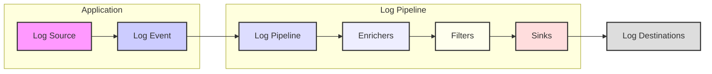
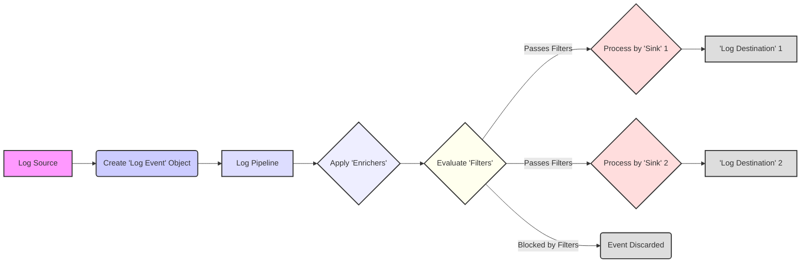

## Project Design Document: Serilog - Structured Logging for .NET

**Version:** 1.1
**Date:** October 26, 2023
**Author:** AI Software Architect

### 1. Introduction

This document provides a detailed architectural design of Serilog, a widely adopted structured logging library for .NET applications. Its primary purpose is to serve as a foundation for subsequent threat modeling activities. The document outlines Serilog's key components, the journey of a log event through the system, and its interactions with external entities, establishing the necessary context for identifying potential security vulnerabilities.

This design is based on the information available in the official Serilog GitHub repository: [https://github.com/serilog/serilog](https://github.com/serilog/serilog).

### 2. Goals and Non-Goals

*   **Goals:**
    *   Clearly describe Serilog's architectural components and their functions.
    *   Illustrate the flow of log events from generation to storage.
    *   Identify external systems and dependencies that Serilog interacts with.
    *   Define the system boundaries for effective threat modeling.

*   **Non-Goals:**
    *   Provide a deep dive into the source code implementation details.
    *   Conduct performance benchmarking or analysis of Serilog.
    *   Offer specific security mitigation strategies (these will be addressed during threat modeling).
    *   Document every possible configuration option or edge case.

### 3. Architecture Overview

Serilog employs a pipeline architecture to process log events in a structured manner. Log events are generated, enriched with context, filtered based on criteria, and finally written to configured destinations.

### 4. Detailed Component Description

*   **Log Source:**
    *   The origin point of a log event within the application's code.
    *   Utilizes methods from the `Serilog.Log` static class or an `ILogger` instance.
    *   Provides the core log message as a template and associated structured data (properties).

*   **Log Event:**
    *   The fundamental data structure representing a single logging occurrence.
    *   Key attributes include:
        *   `Timestamp`: When the event occurred.
        *   `Level`:  Severity of the event (e.g., `Information`, `Warning`, `Error`).
        *   `Message Template`: A string defining the log message with placeholders for properties.
        *   `Properties`: A collection of key-value pairs representing structured data associated with the event.
        *   `Exception`: Details of any exception that occurred (if applicable).

*   **Log Pipeline:**
    *   The central processing mechanism for log events.
    *   Manages the sequence of operations applied to each event: enrichment, filtering, and routing to sinks.
    *   Configuration is defined through the `LoggerConfiguration` object, allowing customization of the pipeline's behavior.

*   **Enrichers:**
    *   Components that add contextual information to log events as properties.
    *   Examples of information added by enrichers:
        *   Machine name.
        *   Current thread ID.
        *   Process ID.
        *   Environment variables.
        *   Custom application-specific details.
    *   Enrichers operate by modifying the `Properties` collection of the `Log Event`.

*   **Filters:**
    *   Components that selectively determine whether a log event should proceed further in the pipeline.
    *   Filtering decisions can be based on:
        *   The event's `Level`.
        *   The source of the log event (source context).
        *   The presence or value of specific `Properties`.
        *   More complex logical conditions.
    *   Filters evaluate the `Log Event` and return a boolean value indicating whether the event is accepted.

*   **Sinks:**
    *   The destination points where processed log events are written.
    *   Responsible for formatting and transmitting log data to various outputs.
    *   Common sink types include:
        *   Console output.
        *   File storage (various formats like plain text or JSON).
        *   Databases (SQL and NoSQL).
        *   Cloud-based logging services (e.g., Azure Monitor, AWS CloudWatch, Google Cloud Logging).
        *   Message queues (e.g., RabbitMQ, Kafka).
        *   Specialized logging platforms (e.g., Splunk, Seq, Elasticsearch).
    *   Each sink implements the logic to handle `Log Event` objects and persist them to its specific target.

*   **Log Destinations:**
    *   The external systems or storage mediums where the log data ultimately resides after being processed by a sink.
    *   These are external to Serilog itself but represent critical points in the logging infrastructure.

### 5. Data Flow

A log event progresses through Serilog in the following sequence:

1. A logging statement in the application code, acting as the **Log Source**, triggers the creation of a **Log Event**.
2. The newly created **Log Event** enters the **Log Pipeline**.
3. **Enrichers** within the pipeline add contextual data to the **Log Event** as properties.
4. **Filters** evaluate the **Log Event** based on configured rules. Events that don't meet the filter criteria are discarded.
5. **Sinks** that are configured to accept the event receive it for processing.
6. Each **Sink** formats the **Log Event** and writes the data to its designated **Log Destination**.

### 6. External Dependencies and Integrations

Serilog's extensibility means it interacts with various external components. Key integration points include:

*   **Log Sink Destinations:**  The multitude of available sinks facilitates integration with a wide array of external logging and storage systems. The security posture of these integrations is dependent on the specific sink implementation and the security measures of the target system.
*   **Configuration Providers:** Serilog's configuration can be sourced from several locations:
    *   Directly in code (fluent configuration API).
    *   Configuration files (e.g., `appsettings.json`).
    *   Environment variables.
    *   External configuration services (e.g., Azure App Configuration, HashiCorp Vault).
    Secure configuration management is vital to prevent unauthorized changes to logging behavior.
*   **Dependency Injection (DI) Containers:** Serilog is commonly integrated with DI containers in .NET applications to manage `ILogger` instances. The security of this integration relies on the security of the DI container itself.
*   **Third-Party Libraries (Sink and Enricher Dependencies):**  Many sinks and enrichers rely on external third-party libraries to function. The security of these dependencies needs to be considered as part of the overall system security.

### 7. Security Considerations (Initial Thoughts)

This section highlights potential security concerns based on Serilog's architecture, serving as a preliminary step for more in-depth threat modeling.

*   **Exposure of Sensitive Data in Logs:**  A primary concern is the unintentional logging of sensitive information (e.g., credentials, personal data, API keys) within log messages or properties.
*   **Log Injection Vulnerabilities:** If user-supplied data is directly incorporated into log messages without proper sanitization, attackers could inject malicious content, potentially leading to log manipulation or exploitation of systems that consume the logs.
*   **Security of Sinks and Destinations:** The security of the communication channels and authentication mechanisms used by sinks to transmit logs to their destinations is critical. Compromised sinks or destinations could lead to data breaches or manipulation.
*   **Configuration Security Risks:** Unauthorized access to or modification of Serilog's configuration could allow attackers to disable logging, redirect logs to malicious destinations, or inject false log entries.
*   **Vulnerabilities in Dependencies:**  Security vulnerabilities in Serilog's own dependencies (including sink and enricher libraries) could be exploited to compromise the logging system or the application itself.
*   **Information Disclosure through Logs:**  Even seemingly innocuous log data can reveal valuable information to attackers if they gain unauthorized access to log stores. Secure storage and access control for log destinations are essential.

### 8. Deployment Considerations

Serilog is a library integrated directly into .NET applications, so its deployment is inherently linked to the application's deployment process. However, specific aspects related to sink configuration and log destination management are crucial for security.

*   **Secure Sink Configuration:**  Sensitive configuration details for sinks, such as connection strings, API keys, and authentication credentials, must be managed securely, avoiding hardcoding or storing them in easily accessible locations.
*   **Security of Log Destinations:** The chosen log destinations must have appropriate security measures in place, including access controls, encryption at rest, and secure transmission protocols.
*   **Network Security for Remote Logging:** When logs are transmitted over a network to remote logging services or infrastructure, secure communication protocols (e.g., TLS) should be enforced to protect the data in transit.

This document provides a comprehensive architectural overview of Serilog, setting the stage for a detailed threat modeling exercise to identify and mitigate potential security vulnerabilities.