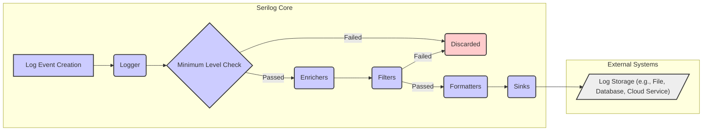
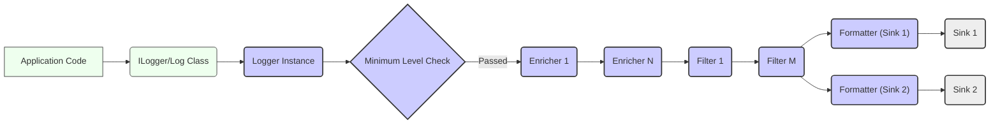

# Project Design Document: Serilog

**Version:** 1.1
**Date:** October 26, 2023
**Author:** AI Software Architect

## 1. Introduction

This document provides a detailed design overview of the Serilog logging library for .NET. It outlines the architecture, key components, and data flow within Serilog. This document is intended to serve as a foundation for subsequent threat modeling activities, providing a clear understanding of the system's workings and potential vulnerabilities.

Serilog is a diagnostic logging library for .NET applications designed with structured event data in mind. Instead of treating logs as simple text strings, Serilog captures the *structure* of the data being logged. This enables more powerful filtering, searching, analysis, and integration with various log analysis tools and platforms.

## 2. Goals

* Provide a clear and comprehensive overview of Serilog's architecture and its internal workings.
* Identify key components and clearly define their responsibilities within the logging pipeline.
* Describe the complete flow of log events from their creation to their final destination in sinks.
* Highlight potential areas of interest for security considerations and provide a solid foundation for detailed threat modeling.

## 3. Non-Goals

* This document does not aim to be an exhaustive specification of every class, interface, and method within the Serilog codebase.
* It does not cover the implementation details of specific, individual sinks or formatters beyond their general purpose within the architecture.
* It does not provide a detailed performance analysis or benchmarking of Serilog's performance characteristics.
* This document primarily focuses on the core Serilog library and does not delve into the specifics of integrations with particular frameworks or libraries unless those integrations are fundamental to understanding the core architecture.

## 4. Architectural Overview

Serilog employs a pipeline architecture to process log events. When a log event is created, it passes through a series of stages, each with a specific responsibility. The central element is the `Logger`, which receives log events and orchestrates their journey through enrichers, filters, formatters, and ultimately, sinks.

## 5. Component Description

This section provides a detailed description of the key components within the Serilog architecture, highlighting their roles and potential security considerations.

* **Log Event:** The fundamental data structure in Serilog, representing a single logging occurrence. It contains:
    * **Timestamp:** A precise record of when the event occurred.
    * **Level:** The severity of the event, indicating its importance (e.g., `Verbose`, `Debug`, `Information`, `Warning`, `Error`, `Fatal`).
    * **Message Template:** A string that defines the structure of the log message, including placeholders for properties (e.g., "User {Username} logged in from {IpAddress}").
    * **Properties:** A collection of key-value pairs representing the structured data associated with the event, extracted from the message template or added by enrichers.
    * **Exception:** An optional exception object associated with the event, providing details about errors.

* **Logger:** The central orchestrator of the logging pipeline. Applications interact with the `ILogger` interface or the static `Log` class to emit log events. The Logger is configured with the entire logging pipeline, including enrichers, filters, and sinks. It acts as the entry point for all log events.

* **Minimum Level Check:** A crucial early stage in the pipeline. The Logger compares the log event's level against the configured minimum level for the pipeline. If the event's level is below the minimum, it is immediately discarded, preventing unnecessary processing. This is important for performance and controlling log volume.

* **Enrichers:** Components responsible for adding contextual information to log events. They operate on the log event object, adding or modifying its properties. Enrichers can provide valuable context, such as:
    * Machine name
    * Thread ID
    * Process ID
    * Environment variables
    * Custom application-specific data (e.g., user ID, request ID).
    * **Security Note:**  Custom enrichers, especially those interacting with external systems or sensitive data, represent a potential attack surface if not implemented securely.

* **Filters:** Components that selectively allow or block log events from proceeding further down the pipeline based on specific criteria. Filters examine the properties of the log event, such as:
    * Log level
    * Message content (using string matching or regular expressions)
    * Specific properties and their values.
    * **Security Note:**  Incorrectly configured or vulnerable filters could allow malicious log events to reach sinks or prevent legitimate security-related logs from being recorded.

* **Formatters:** Responsible for transforming the structured `LogEvent` object into a specific output format suitable for the target sink. Common formats include:
    * Plain text (with customizable formatting rules)
    * JSON (JavaScript Object Notation)
    * Compact JSON (CLEF - Compact Logging Event Format), optimized for machine readability.
    * **Security Note:** While formatters primarily handle data transformation, vulnerabilities could theoretically exist if they mishandle malformed or excessively large log event data.

* **Sinks:** The destination for processed and formatted log events. Sinks are responsible for writing log events to various outputs. Examples include:
    * Console output
    * Files (plain text, JSON, etc.)
    * Databases (SQL, NoSQL)
    * Cloud logging services (e.g., Azure Monitor, AWS CloudWatch, Google Cloud Logging)
    * External services and platforms (e.g., Seq, Elasticsearch, Splunk).
    * **Security Note:** Sinks are a critical security boundary. The security of the sink itself (e.g., file permissions, database credentials, API keys for cloud services) is paramount. Vulnerabilities in sink implementations could lead to data breaches or unauthorized access.

## 6. Data Flow

The journey of a log event through the Serilog pipeline follows a well-defined sequence:

1. **Log Event Creation:** Application code initiates the logging process by calling methods on the `ILogger` interface or the static `Log` class. This involves specifying the log level, a message template, and optionally providing properties as arguments.

2. **Logger Reception:** The configured `Logger` instance receives the newly created `LogEvent` object.

3. **Minimum Level Check:** The Logger immediately evaluates the `LogEvent`'s `Level` against the configured minimum level. If the event's severity is below the threshold, processing stops, and the event is discarded.

4. **Enrichment:** If the event passes the minimum level check, it is passed through the chain of configured enrichers. Each enricher in the pipeline has the opportunity to add new properties or modify existing ones on the `LogEvent` object, adding contextual information.

5. **Filtering:** After enrichment, the `LogEvent` is evaluated by the configured filters. Filters examine the event's properties and can decide to drop the event, preventing it from reaching the sinks. Multiple filters can be configured, and they are typically evaluated in order.

6. **Formatting:** If the `LogEvent` passes all configured filters, it is then passed to the formatters associated with each configured sink. The formatter transforms the structured `LogEvent` object into the specific format required by the sink (e.g., converting it to a JSON string for a JSON file sink).

7. **Sink Emission:** Finally, the formatted log event is passed to the configured sinks. Each sink is responsible for writing the formatted event to its designated output. This could involve writing to a file, inserting a record into a database, sending data to a cloud service API, or other sink-specific operations.

## 7. Security Considerations (For Threat Modeling)

This section details potential security considerations within Serilog's architecture, providing a basis for threat modeling activities.

* **Log Event Content Injection:**
    * **Threat:** Malicious or compromised parts of the application could inject misleading, fabricated, or harmful data into log events. This could obscure real security incidents, inject false information into audit logs, or potentially exploit vulnerabilities in log analysis tools.
    * **Mitigation:** Implement robust input validation and sanitization within the application before logging data. Be cautious about logging user-provided input directly.

* **Enricher Security:**
    * **Threat:** Vulnerabilities in custom enricher implementations could be exploited. For example, an enricher fetching data from an external API might be susceptible to injection attacks if it doesn't properly sanitize the API response. A compromised enricher could inject malicious data into all subsequent log events.
    * **Mitigation:** Thoroughly review and test custom enricher code. Follow secure coding practices when developing enrichers that interact with external resources or sensitive data. Consider the principle of least privilege for enricher access.

* **Filter Bypass:**
    * **Threat:** If filters are not configured correctly or contain vulnerabilities, attackers might craft malicious log events designed to bypass the filters and reach sensitive sinks. Conversely, overly restrictive or flawed filters could prevent critical security logs from being recorded.
    * **Mitigation:** Carefully design and test filter configurations. Regularly review filter logic to ensure it effectively blocks unwanted events without hindering legitimate logging.

* **Formatter Vulnerabilities:**
    * **Threat:** Although less common, vulnerabilities in formatters could potentially be exploited if they process untrusted or malformed log event data in an unsafe manner, potentially leading to issues like buffer overflows or denial-of-service.
    * **Mitigation:** Rely on well-established and vetted formatters. If custom formatters are necessary, implement them with extreme caution and thorough security testing.

* **Sink Security:**
    * **Threat:** Sinks represent a critical security boundary. Compromising a sink can lead to unauthorized access, modification, or deletion of log data.
    * **Mitigation:**
        * **File Sinks:** Implement strict access control lists (ACLs) on log files and directories.
        * **Database Sinks:** Use secure connection strings, enforce strong authentication and authorization, and follow database security best practices.
        * **Network Sinks:** Secure communication channels using TLS/SSL. Implement robust authentication and authorization mechanisms for accessing remote logging services (e.g., API keys, OAuth). Protect API keys and credentials used to access these services.
        * **Third-Party Sinks:** Exercise caution when using community-contributed sinks. Evaluate their security posture and ensure they are from trusted sources. Keep sink libraries up-to-date to patch known vulnerabilities.

* **Configuration Security:**
    * **Threat:** If Serilog's configuration (e.g., minimum level, enabled sinks, API keys for sinks) is not securely managed, attackers could modify it to disable logging, redirect logs to a malicious destination, or gain access to sensitive credentials.
    * **Mitigation:** Store configuration securely (e.g., using encrypted configuration files, secure environment variables, or dedicated secrets management solutions). Restrict access to configuration files and environment variables.

* **Sensitive Data Logging:**
    * **Threat:** Unintentionally logging sensitive information (e.g., passwords, API keys, personal data) in plain text can lead to data breaches if logs are compromised.
    * **Mitigation:** Implement filtering or masking techniques to prevent sensitive data from being logged. Design applications to avoid handling sensitive data unnecessarily.

* **Denial of Service (DoS):**
    * **Threat:** Attackers could intentionally generate a large volume of log events to overwhelm logging infrastructure, potentially leading to performance degradation or service disruption.
    * **Mitigation:** Implement rate limiting or throttling mechanisms at the application level or within the logging pipeline. Monitor log volume and resource consumption.

## 8. Deployment Considerations

The security of Serilog deployments is influenced by the environment in which it operates.

* **Cloud Environments:** When using cloud-based sinks, ensure proper Identity and Access Management (IAM) roles and permissions are configured to restrict access to logging resources. Utilize secure storage options provided by the cloud provider.
* **Containerized Environments:** Consider the security implications of logging within containers, including access to the container's file system and network. Ensure that container images are secure and that logging configurations are managed appropriately within the container orchestration platform.
* **On-Premise Deployments:** Implement robust security measures for log storage infrastructure, including physical security, network segmentation, and access controls.

## 9. Future Considerations

Potential future enhancements to Serilog that could impact its architecture and security include:

* **More granular and expressive filtering capabilities:** Allowing for more complex filtering logic to better control which events are logged.
* **Built-in support for data masking and redaction:** Providing standardized mechanisms for automatically removing or obscuring sensitive data in log events.
* **Enhanced auditing of logging configuration changes:** Providing a clear audit trail of modifications to Serilog's configuration.
* **Improved mechanisms for securing communication with remote sinks:** Exploring more robust authentication and encryption options for network-based sinks.

This document provides a comprehensive design overview of Serilog, focusing on aspects relevant to security and threat modeling. It should serve as a valuable resource for understanding the system's architecture and identifying potential vulnerabilities.