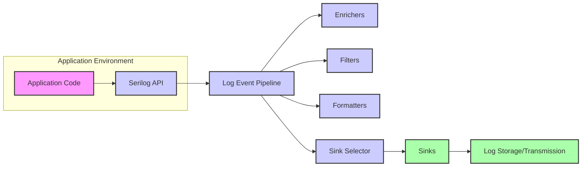
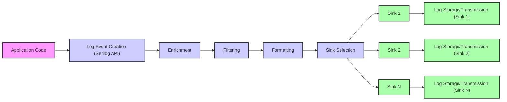

# Serilog Project Design Document for Threat Modeling (Improved)

## 1. Introduction

### 1.1. Purpose of this Document

This document provides a detailed design overview of the Serilog logging library, specifically tailored to facilitate threat modeling. It aims to clearly articulate Serilog's architecture, components, data flow, and security-relevant features. This detailed design will serve as the foundation for identifying, analyzing, and mitigating potential security threats in systems that utilize Serilog. The document is intended for security professionals, developers, and operations teams involved in securing applications leveraging Serilog.

### 1.2. Project Overview

Serilog is a powerful and flexible structured logging library for .NET applications. It moves beyond simple text-based logging by capturing rich event data in a structured format. This structure makes logs easily consumable by both humans and machines, enabling advanced diagnostics, monitoring, and security analysis. Key features of Serilog include:

*   **Structured Logging:** Logs events as structured data (key-value pairs), enabling efficient querying and analysis.
*   **Extensive Sink Support:** Offers a wide array of "sinks" for outputting logs to diverse destinations, from files and databases to cloud-based logging services and SIEM systems.
*   **Contextual Enrichment:** Allows enriching log events with contextual information (e.g., user details, transaction IDs, environment metadata) through "enrichers".
*   **Granular Filtering:** Provides robust filtering mechanisms to control which log events are processed and outputted based on severity, properties, and expressions.
*   **Customizable Formatting:** Enables tailoring the output format of log events using "formatters" to suit different sinks and consumption needs.
*   **Flexible Configuration:** Supports configuration through code, configuration files (e.g., JSON, XML), and environment variables, offering adaptability across deployment environments.

### 1.3. Target Audience

This document is designed for:

*   **Security Architects and Engineers:** To understand Serilog's internal workings and identify potential security vulnerabilities and attack surfaces.
*   **Developers:** To gain a comprehensive understanding of Serilog's components and data flow, promoting secure logging practices and informed sink selection.
*   **Threat Modeling Teams:** To utilize this document as a primary resource for conducting structured threat modeling exercises on systems incorporating Serilog.
*   **Operations and DevOps Teams:** To understand the deployment, configuration, and operational security aspects of Serilog in production environments.
*   **Auditors and Compliance Officers:** To assess the security posture of logging implementations using Serilog and ensure compliance with relevant security standards.

## 2. System Architecture

### 2.1. High-Level Architecture Diagram

### 2.2. Component Description

#### 2.2.1. Core Serilog Library

*   **"Serilog API"**: This is the public interface through which applications interact with Serilog. Developers use this API to create and submit log events. It offers methods for logging at different severity levels (e.g., `Log.Verbose()`, `Log.Debug()`, `Log.Information()`, `Log.Warning()`, `Log.Error()`, `Log.Fatal()`) and for creating log events with structured data.
*   **"Log Event Pipeline"**: The central processing engine of Serilog. It receives log events from the API and orchestrates the sequence of processing steps: enrichment, filtering, formatting, and sink selection. This pipeline ensures consistent and configurable log event handling.
*   **"Sink Selector"**:  This component determines which configured sinks are responsible for processing a given log event. Based on filters and configuration, it routes each processed log event to the appropriate set of sinks for output.

#### 2.2.2. "Sinks"

*   "Sinks" are the output destinations for log events. They are responsible for writing or transmitting log data to various storage or monitoring systems. Serilog's modular sink architecture is a key strength, allowing integration with a wide range of technologies.
*   **Examples of Sink Categories:**
    *   **File-Based Sinks:**  Write logs to local or network file systems. Examples include text files, JSON files, rolling log files (e.g., `Serilog.Sinks.File`).
    *   **Console Sinks:** Output logs to the application's console or standard output (e.g., `Serilog.Sinks.Console`).
    *   **Database Sinks:** Store logs in relational databases (SQL Server, PostgreSQL, MySQL, etc.) or NoSQL databases (e.g., `Serilog.Sinks.MSSqlServer`, `Serilog.Sinks.PostgreSQL`).
    *   **Cloud Logging Sinks:** Transmit logs to cloud-based logging and monitoring services like Azure Monitor, AWS CloudWatch, Google Cloud Logging, Datadog, Splunk, Seq, Elasticsearch, and many others (e.g., `Serilog.Sinks.AzureMonitor`, `Serilog.Sinks.AWSCloudWatch`, `Serilog.Sinks.Elasticsearch`).
    *   **Email Sinks:** Send log events via email notifications (e.g., `Serilog.Sinks.Email`).
    *   **Event Log Sinks:** Write logs to the Windows Event Log (e.g., `Serilog.Sinks.EventLog`).
    *   **Messaging Queue Sinks:** Publish log events to message queues like RabbitMQ or Kafka (e.g., community-contributed sinks).
    *   **Third-Party and Custom Sinks:** A vast ecosystem of community-developed sinks and the ability to create custom sinks for specific needs.
*   Sinks are configured with specific settings, including connection details, formatting options, and filters to control which events they process.

#### 2.2.3. "Formatters"

*   "Formatters" define how log events are rendered into a specific output format before being written to a sink. They control the structure and presentation of log data.
*   **Examples of Formatters:**
    *   **Text Formatters:** Render logs as human-readable plain text strings. Various text formatters exist, including simple and more structured options (e.g., `Serilog.Formatting.Compact.CompactFormatter`, `Serilog.Formatting.Json.JsonFormatter`).
    *   **JSON Formatters:** Format logs as JSON objects, preserving the structured data of log events. Ideal for machine consumption and integration with log analysis tools.
    *   **Compact JSON Formatters:** Optimized JSON formatters for reduced size and improved performance, often used for high-volume logging scenarios.
    *   **Custom Formatters:** Developers can create custom formatters to implement specific output formats tailored to unique requirements or sink specifications.
*   The choice of formatter depends on the sink's requirements and the intended use of the logs (human readability, machine processing, storage efficiency, etc.).

#### 2.2.4. "Enrichers"

*   "Enrichers" add contextual properties to log events, providing valuable metadata that enhances the usefulness of logs for debugging, monitoring, and security analysis. Enrichers automatically add information to each log event as it passes through the pipeline.
*   **Examples of Enrichers:**
    *   **Standard Enrichers:** Include common contextual information like thread ID, machine name, process ID, environment name, application version (e.g., `Serilog.Enrichers.Thread`, `Serilog.Enrichers.Environment`, `Serilog.Enrichers.Process`).
    *   **Log Context Enricher:** Allows adding properties within a specific code scope using `LogContext.PushProperty()`, enabling context-specific enrichment.
    *   **User Enrichers:** Add user-related information, such as user ID, username, or roles, if available and relevant to the application context.
    *   **HTTP Request Enrichers:** In web applications, enrichers can automatically capture details from HTTP requests, such as request path, method, headers, and user agent.
    *   **Custom Enrichers:** Developers can create custom enrichers to add application-specific context, business logic identifiers, or security-relevant metadata.

#### 2.2.5. "Filters"

*   "Filters" selectively control which log events are processed further in the pipeline or by specific sinks. They are essential for managing log volume, focusing on relevant events, and implementing conditional logging logic.
*   **Types of Filters:**
    *   **Minimum Level Filters:**  Process only events at or above a specified severity level (e.g., log only Warning, Error, and Fatal events for a production sink).
    *   **Expression Filters:** Use boolean expressions to filter events based on log event properties, message content, or other criteria. These provide powerful and flexible filtering capabilities using syntax like C# expressions or similar.
    *   **Source Context Filters:** Filter events based on the source context (namespace or class) where the log event originated.
    *   **Sink-Specific Filters:** Apply filters that are specific to a particular sink, allowing different sinks to receive different subsets of log events.
    *   **Combined Filters:** Filters can be combined using logical operators (AND, OR, NOT) to create complex filtering rules.

#### 2.2.6. "Configuration"

*   "Configuration" is the process of setting up and customizing Serilog's behavior. Serilog offers multiple configuration methods to suit different environments and preferences.
*   **Configuration Methods:**
    *   **Code-based Configuration:** Configuration is defined programmatically in application code using the `LoggerConfiguration` fluent API. This provides maximum flexibility and control, especially for complex setups.
    *   **Configuration Files:** Configuration can be loaded from external configuration files, such as `appsettings.json` (common in .NET Core and .NET) or XML files. This allows for externalizing configuration and modifying logging behavior without recompiling the application.
    *   **Environment Variables:** Configuration can be influenced or overridden by environment variables, useful for deployment-specific settings and secrets management in containerized environments.
    *   **Combined Configuration Sources:** Serilog supports combining configuration from multiple sources. For example, a base configuration can be defined in code, and then overridden or extended by settings from configuration files and environment variables. This provides a layered and flexible approach to configuration management.

## 3. Data Flow

### 3.1. Logging Data Flow Diagram

### 3.2. Data Elements

*   **"Log Event"**: The fundamental unit of logging in Serilog. It represents a single logged occurrence within the application. Each log event contains structured data.
*   **"Message Template"**: A string that defines the basic message of the log event. It can include named placeholders (e.g., "User {Username} attempted login from {IPAddress}"). These placeholders are used to capture structured properties.
*   **"Properties"**: Structured data associated with a log event, represented as key-value pairs. Properties are extracted from message template placeholders and can be added by enrichers. They provide the structured nature of Serilog logs.
*   **"Severity Level"**: Indicates the importance or severity of the log event. Standard levels are Verbose, Debug, Information, Warning, Error, and Fatal, ordered from least to most severe.
*   **"Timestamp"**:  Records the precise time when the log event occurred.
*   **"Exception"**: If the log event is related to an exception, the exception object itself, including type, message, and stack trace, is captured as part of the log event data.
*   **"Source Context"**:  Indicates the origin of the log event, typically the namespace or class where the logging call was made.

### 3.3. Data Storage and Transmission

*   Data storage and transmission mechanisms are entirely determined by the configured sinks. Each sink implements its own method for storing or transmitting log data.
*   **Examples based on Sink Types:**
    *   **File Sinks:** Store logs in files on local or network drives. Storage format (text, JSON, etc.) depends on the configured formatter. Transmission is typically local file system writes, but network file shares involve network transmission.
    *   **Database Sinks:** Store logs in database tables. Data is transmitted to the database server over network connections using database protocols. Schema is defined by the sink implementation.
    *   **Cloud Service Sinks:** Transmit logs to cloud logging platforms via APIs (e.g., REST APIs, SDKs). Data is transmitted over the internet, typically using HTTPS. Storage is managed by the cloud service provider.
*   **Security Considerations for Data Storage and Transmission:**
    *   **Volume Management:** Log volume can be substantial, especially in high-traffic applications. Sinks and storage solutions must be chosen to handle the expected volume and implement appropriate retention policies.
    *   **Retention Policies:** Define log retention periods based on regulatory requirements, security needs, and operational requirements. Implement automated log rotation and archival where necessary.
    *   **Storage Security:** Secure log storage locations to protect sensitive information. Implement access control lists (ACLs), encryption at rest, and regular security audits.
    *   **Transmission Security:** Ensure secure transmission of logs, especially when sending logs over networks or the internet. Use encrypted protocols (HTTPS, TLS) and secure authentication mechanisms.

## 4. Key Features Relevant to Security

### 4.1. Structured Logging for Security Analysis

*   **Security Benefit:** Structured logging is crucial for effective security monitoring and incident response. It enables efficient searching, filtering, correlation, and analysis of logs for security events using security information and event management (SIEM) systems and log analysis tools.
*   **Security Relevance:** Facilitates the detection of security anomalies, potential breaches, and suspicious activities. Structured data allows for programmatic analysis, automated alerting, and faster incident investigation. Security rules and dashboards can be built based on specific log event properties.

### 4.2. Extensibility and Integration with Security Tools

*   **Security Benefit:** Serilog's extensible architecture, particularly its sink ecosystem, allows seamless integration with various security tools and platforms. This includes SIEM systems, security monitoring dashboards, threat intelligence platforms, and incident response systems. Enrichers can be used to add security-specific context to logs.
*   **Security Relevance:** Enables forwarding logs to centralized security monitoring platforms for real-time analysis, correlation with other security data sources, and proactive threat detection. Custom enrichers can add security-relevant information like user identities, session IDs, request origins, and security event classifications.

### 4.3. Granular Filtering for Security Event Focus

*   **Security Benefit:**  Filtering capabilities allow focusing logging efforts on security-relevant events while reducing noise from less critical operational logs. This improves the signal-to-noise ratio for security monitoring and reduces the volume of logs that need to be analyzed for security purposes.
*   **Security Relevance:** Configuration can be tailored to log specific security events (e.g., authentication failures, authorization violations, suspicious transactions, security exceptions) at appropriate severity levels. Filters can be used to exclude verbose or debug logs from security-sensitive sinks.

### 4.4. Secure Configuration Practices

*   **Security Benefit:** Serilog's flexible configuration options allow for implementing secure configuration practices. Configuration can be managed securely, and sensitive information (like credentials for sinks) can be externalized and protected.
*   **Security Relevance:** Secure configuration is essential to prevent unauthorized access to logs, protect sensitive data within logs, and ensure the integrity of the logging system itself. Secure configuration includes protecting configuration files, using secure methods for storing and retrieving credentials, and regularly auditing logging configurations.

### 4.5. Performance Considerations for Security Logging

*   **Security Benefit:** Serilog is designed to be performant and have minimal impact on application performance. Asynchronous sinks and efficient processing ensure that security logging does not introduce performance bottlenecks that could be exploited or hinder application availability.
*   **Security Relevance:**  Maintaining application performance is crucial for security. Performance degradation due to logging could be a symptom of a denial-of-service attack or could be exploited to cause resource exhaustion. Performant logging ensures that security logging is always enabled and effective without negatively impacting application responsiveness.

## 5. Technologies Used

*   **Programming Language:** C# (.NET Framework, .NET Core, .NET)
*   **Core Library Dependencies:** Serilog core library has minimal external dependencies, focusing on core logging functionality.
*   **Sink, Formatter, and Enricher Dependencies:** Sinks, formatters, and enrichers may introduce dependencies on specific libraries or SDKs depending on their functionality. For example:
    *   Database sinks depend on database drivers (e.g., `System.Data.SqlClient` for SQL Server).
    *   Cloud service sinks depend on cloud provider SDKs (e.g., Azure SDK, AWS SDK).
    *   Network-based sinks rely on network libraries (e.g., HTTP clients).
*   **Deployment Environments:** Serilog is designed to be platform-agnostic within the .NET ecosystem and can be used in various deployment environments:
    *   On-premises servers (Windows, Linux)
    *   Cloud environments (Azure, AWS, GCP, etc.)
    *   Containerized environments (Docker, Kubernetes)
    *   Serverless functions (Azure Functions, AWS Lambda)
    *   Desktop applications
    *   Mobile applications (Xamarin, .NET MAUI)

## 6. Deployment Model

Serilog is primarily deployed as a library embedded within the application process.

*   **In-Process Logging (Embedded Library):** Serilog runs directly within the application's process. Log events are generated, processed, and often initially buffered within the application runtime before being sent to sinks. This is the most common and straightforward deployment model.
*   **Centralized Logging Architecture (Sink-Driven):**  Serilog is configured to utilize sinks that transmit logs to a centralized logging system. This is essential for distributed applications, microservices architectures, and cloud environments. Centralized logging enables aggregation, correlation, and analysis of logs from multiple application instances and components. Examples include sending logs to Elasticsearch clusters, cloud logging services, or SIEM platforms.
*   **Sidecar Pattern (Sink Destination Context):** While Serilog itself is in-process, the *destination* of logs might be deployed as a sidecar, especially in containerized environments. For instance, a Serilog sink might write logs to a shared volume within a Kubernetes pod, and a separate sidecar container (like Fluentd, Filebeat, or Vector) would then be responsible for forwarding those logs to a central logging system. In this scenario, Serilog remains in-process, but the log *delivery* infrastructure leverages a sidecar pattern.

## 7. Security Considerations and Potential Threats

This section outlines security considerations and potential threats related to Serilog and logging practices. This forms the basis for a more detailed threat model.

### 7.1. Confidentiality Threats

*   **Threat 1: Logging Sensitive Data in Plain Text:** Unintentional or improper logging of sensitive data (passwords, API keys, secrets, PII, financial data, health information) directly into log messages or properties.
    *   **Attack Vector:**  Application code logging sensitive variables or data structures without proper sanitization or masking.
    *   **Impact:** Exposure of sensitive information in log files, databases, or centralized logging systems, leading to data breaches, compliance violations, and reputational damage.
    *   **Mitigation:**
        *   **Code Reviews and Secure Coding Practices:** Implement mandatory code reviews to identify and prevent logging of sensitive data. Train developers on secure logging practices and data handling.
        *   **Data Masking and Redaction:** Utilize format strings and structured logging to avoid directly embedding sensitive data in message templates. Implement filtering and masking techniques to redact or remove sensitive data before it is written to sinks. Consider using enrichers to selectively remove or hash sensitive properties.
        *   **Principle of Least Privilege Logging:** Only log the minimum necessary information required for operational and security purposes. Avoid excessive logging of detailed request/response payloads or internal application state.

*   **Threat 2: Insecure Log Storage and Transmission:** Logs stored in insecure locations (unencrypted file systems, databases with weak access controls) or transmitted over insecure channels (unencrypted HTTP, unauthenticated connections).
    *   **Attack Vector:**  Compromise of log storage systems or interception of log data in transit.
    *   **Impact:** Unauthorized access to sensitive information contained in logs, potential data breaches, and compromise of audit trails.
    *   **Mitigation:**
        *   **Secure Sink Selection:** Choose sinks that support secure communication protocols (HTTPS, TLS, SSH) and encryption for data in transit.
        *   **Secure Storage Configuration:** Configure sinks to store logs in secure locations with strong access controls (ACLs, IAM policies). Implement encryption at rest for log storage (e.g., database encryption, file system encryption, cloud storage encryption).
        *   **Authentication and Authorization:** Configure sinks to use authentication and authorization mechanisms where applicable to control access to log data.

### 7.2. Integrity Threats

*   **Threat 3: Log Tampering and Modification:** Unauthorized modification or deletion of log data, either at the storage location or during transmission.
    *   **Attack Vector:**  Compromise of log storage systems, network interception, or insider threats.
    *   **Impact:** Loss of audit trails, inability to detect security incidents, and potential cover-up of malicious activities.
    *   **Mitigation:**
        *   **Immutable Log Storage:** Utilize sinks that support immutable log storage (e.g., append-only logs, write-once-read-many storage).
        *   **Log Integrity Verification:** Implement mechanisms to verify the integrity of logs, such as digital signatures or checksums.
        *   **Access Controls and Monitoring:** Enforce strict access controls to log storage systems and monitoring systems to detect and alert on unauthorized access or modification attempts.

*   **Threat 4: Log Injection Attacks:** Attackers injecting malicious log events into the log stream, potentially misleading security analysis, triggering false alarms, or exploiting vulnerabilities in log processing systems.
    *   **Attack Vector:**  Exploiting vulnerabilities in application logging logic or input validation to inject crafted log messages.
    *   **Impact:**  Pollution of log data, masking of real security events, potential denial-of-service attacks on log processing systems, and misleading security investigations.
    *   **Mitigation:**
        *   **Input Validation and Sanitization:** Sanitize and validate data before logging, especially data originating from external sources (user inputs, API requests). Avoid directly logging unsanitized user input.
        *   **Secure Logging API Usage:** Use Serilog API correctly and avoid constructing log messages from untrusted data in a way that could allow injection.
        *   **Log Event Filtering and Validation:** Implement filters and validation rules at the log processing and analysis stage to detect and discard suspicious or malformed log events.

### 7.3. Availability Threats

*   **Threat 5: Logging System Denial-of-Service (DoS):** Attackers overwhelming the logging system with excessive log events, causing performance degradation, log loss, or system crashes.
    *   **Attack Vector:**  Exploiting vulnerabilities in application logging logic or intentionally generating a high volume of log events.
    *   **Impact:**  Loss of logging functionality, inability to monitor application behavior, and potential application instability due to logging overhead.
    *   **Mitigation:**
        *   **Rate Limiting and Throttling:** Implement rate limiting and throttling mechanisms at the application level or within the logging pipeline to control the volume of log events generated.
        *   **Efficient Sink Selection:** Choose sinks that are designed to handle high volumes of log data and are resilient to DoS attacks. Consider using asynchronous sinks to minimize performance impact on the application.
        *   **Monitoring and Alerting:** Monitor logging system performance and resource utilization. Set up alerts to detect anomalies or excessive log volume that could indicate a DoS attack.

*   **Threat 6: Sink Availability Issues:**  Dependency on a single, critical sink that becomes unavailable, leading to log loss or logging failures.
    *   **Attack Vector:**  Sink infrastructure failures, network outages, or targeted attacks on sink systems.
    *   **Impact:**  Interruption of logging, loss of critical log data, and reduced visibility into application behavior.
    *   **Mitigation:**
        *   **Redundant Sinks:** Configure Serilog to use multiple sinks, including redundant or backup sinks, to ensure logging continues even if one sink becomes unavailable.
        *   **Sink Health Monitoring:** Implement health checks and monitoring for sinks to detect and alert on sink availability issues.
        *   **Fallback Mechanisms:** Implement fallback mechanisms in the application or logging configuration to handle sink failures gracefully (e.g., buffering logs locally until the sink recovers, switching to a backup sink).

## 8. Threat Modeling Scope and Methodology

### 8.1. In-Scope Components for Threat Modeling

For threat modeling focused on Serilog, the following components and aspects are considered in scope:

*   **Serilog Core Library and API:** The core logging engine and its public interface.
*   **Configured Sinks:** All sinks used in the target application's Serilog configuration (File, Console, Database, Cloud Service sinks, etc.).
*   **Formatters and Enrichers:** Custom or standard formatters and enrichers used in the configuration.
*   **Filters:** Configured filters that control log event processing.
*   **Configuration Mechanisms:** Code-based configuration, configuration files, and environment variables used to configure Serilog.
*   **Data Flow:** The entire data flow from log event creation in the application code to the final storage or transmission by sinks.
*   **Sink Infrastructure (to the extent it impacts Serilog security):**  Security aspects of the infrastructure supporting sinks (e.g., network security for cloud sinks, database security for database sinks) are in scope as they relate to Serilog's security posture.

### 8.2. Out-of-Scope Components

The following are generally considered out-of-scope for threat modeling *specifically focused on Serilog itself*, but may be in scope when considering the broader application security:

*   **The Applications Using Serilog:** The internal logic and vulnerabilities of applications that *use* Serilog are generally out of scope, except for how they interact with the Serilog API and logging practices within the application code.
*   **Underlying Infrastructure (OS, Hardware, Network):** The general security of the operating systems, hardware, and network infrastructure where Serilog and its sinks are deployed is typically out of scope, unless specific to a sink's vulnerability or configuration.
*   **Third-Party Log Analysis Tools and SIEM Systems:** External systems that consume logs from Serilog sinks (SIEMs, log dashboards) are generally out of scope, although the *integration* between Serilog sinks and these systems is in scope.

### 8.3. Recommended Threat Modeling Methodology

This design document is intended to be used with a structured threat modeling methodology.  A recommended approach is to use **STRIDE** (Spoofing, Tampering, Repudiation, Information Disclosure, Denial of Service, Elevation of Privilege) in conjunction with diagramming the Serilog system as described in this document.

**Steps for Threat Modeling using this Document and STRIDE:**

1.  **Diagram Review:** Review the architecture diagrams (High-Level Architecture and Data Flow) in this document to understand the components and data flow of Serilog in the target application.
2.  **Component Decomposition:** Break down the Serilog system into its key components as described in Section 2.2 (Serilog API, Pipeline, Sinks, Formatters, Enrichers, Filters, Configuration).
3.  **Threat Identification (STRIDE per Component):** For each component and data flow element, systematically apply the STRIDE categories to identify potential threats. Consider the security considerations outlined in Section 7 as a starting point.
    *   **Spoofing:** Can an attacker impersonate a component or user? (e.g., spoofing log sources, injecting logs from unauthorized sources).
    *   **Tampering:** Can data be tampered with? (e.g., modifying log events, altering configuration, tampering with log storage).
    *   **Repudiation:** Can actions be repudiated? (e.g., can a user deny logging actions, lack of audit trails).
    *   **Information Disclosure:** Can information be disclosed unintentionally? (e.g., logging sensitive data, insecure log storage, insecure transmission).
    *   **Denial of Service:** Can the system be made unavailable? (e.g., logging DoS, sink DoS, performance impact).
    *   **Elevation of Privilege:** Can an attacker gain elevated privileges through the logging system? (Less directly applicable to Serilog itself, but consider sink security and configuration).
4.  **Threat Analysis and Prioritization:** Analyze the identified threats, assess their likelihood and impact, and prioritize them based on risk level.
5.  **Mitigation Planning:** For each prioritized threat, develop mitigation strategies and security controls. Refer to the mitigation suggestions in Section 7 and consider additional security best practices.
6.  **Documentation and Review:** Document the threat model, identified threats, and planned mitigations. Regularly review and update the threat model as the application and logging configuration evolve.

## 9. Conclusion

This improved design document provides a comprehensive and security-focused overview of Serilog, tailored for effective threat modeling. By understanding Serilog's architecture, data flow, and security considerations outlined in this document, security professionals, developers, and operations teams can proactively identify and mitigate potential security risks associated with logging practices. This document, used in conjunction with a structured threat modeling methodology like STRIDE, will enable the development of more secure and resilient applications that leverage Serilog for robust and secure logging.