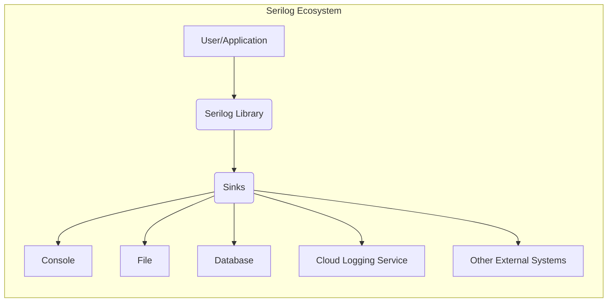
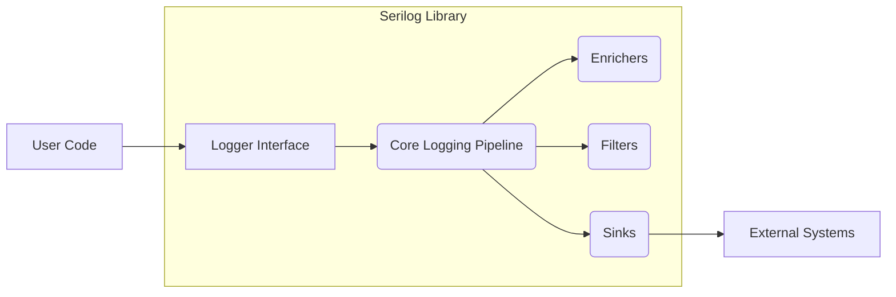
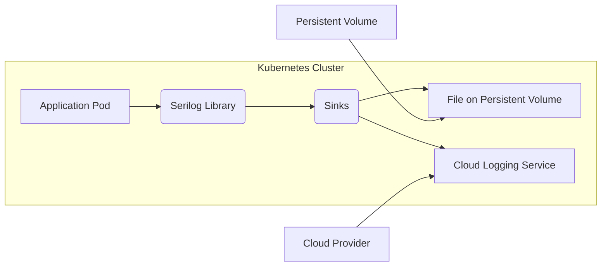
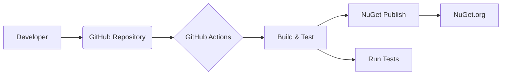

# BUSINESS POSTURE

Serilog is a popular logging library for .NET applications. It's widely used across various industries and company sizes, from small startups to large enterprises. The business priorities and goals for Serilog can be summarized as:

*   Provide a flexible and extensible logging framework for .NET developers.
*   Enable efficient and structured logging to facilitate debugging, monitoring, and auditing of applications.
*   Offer a wide range of integrations with different logging sinks (storage/output destinations).
*   Maintain a high level of performance and reliability to minimize the impact on application performance.
*   Foster a strong community and ecosystem around the library.

Based on these priorities, the most important business risks that need to be addressed are:

*   Vulnerabilities in the library that could be exploited to compromise applications using Serilog.
*   Performance bottlenecks or instability in the library that could negatively impact application performance.
*   Lack of support for important logging sinks or integration scenarios, limiting the library's usefulness.
*   Complexity or difficulty in using the library, hindering adoption and developer productivity.
*   Inadequate documentation or community support, making it difficult for developers to use the library effectively.

# SECURITY POSTURE

Serilog, as a logging library, has a unique security posture. It's not a security product itself, but it plays a crucial role in security by providing the means to record security-relevant events. It also needs to be secure itself to prevent log manipulation or injection attacks.

Existing security controls and accepted risks (based on the GitHub repository and common practices):

*   security control: Input sanitization: Serilog itself does not directly handle user input in the same way a web application would. However, it's crucial that applications using Serilog sanitize any user-provided data *before* logging it to prevent log injection attacks. This is the responsibility of the application using Serilog, not Serilog itself. Implemented in application code.
*   security control: Structured logging: Serilog promotes structured logging, which makes it easier to analyze logs and detect security incidents. Structured logs are less susceptible to certain types of injection attacks compared to free-form text logs. Implemented in Serilog core.
*   security control: Extensible architecture: Serilog's sink-based architecture allows for secure transport of log data to various destinations, including encrypted storage or security information and event management (SIEM) systems. Implemented in Serilog core and various sink packages.
*   security control: Code reviews and static analysis: The Serilog project appears to use standard development practices, including code reviews and likely some form of static analysis. Implemented in development process.
*   security control: Dependency management: The project uses package managers (NuGet) to manage dependencies, reducing the risk of using outdated or vulnerable components. Implemented in development process.
*   accepted risk: Log injection: If an application using Serilog does not properly sanitize user input before logging it, attackers could inject malicious data into the logs, potentially leading to log forging, misinterpretation, or even code execution in log analysis tools. This is primarily the responsibility of the application using Serilog.
*   accepted risk: Denial of service: While Serilog is designed to be performant, excessive logging or misconfiguration could potentially lead to resource exhaustion (disk space, CPU, memory) on the application server or the logging infrastructure. This is mitigated by proper configuration and monitoring.
*   accepted risk: Information disclosure: If sensitive data is logged without proper redaction or masking, it could be exposed to unauthorized individuals who have access to the logs. This is the responsibility of the application using Serilog.

Recommended security controls (high priority):

*   security control: Security audits: Regular security audits of the Serilog codebase and its core sinks should be conducted to identify and address potential vulnerabilities.
*   security control: Vulnerability disclosure program: A clear and accessible vulnerability disclosure program should be established to encourage responsible reporting of security issues.
*   security control: Supply chain security: Implement measures to ensure the integrity of the build and release pipeline, such as code signing and software bill of materials (SBOM) generation.

Security requirements:

*   Authentication: Serilog itself does not handle authentication. Authentication is typically handled by the application or the logging infrastructure (e.g., authentication to a cloud-based logging service).
*   Authorization: Serilog does not implement authorization mechanisms. Authorization for accessing or managing logs is typically handled by the logging infrastructure or the application using Serilog.
*   Input validation: As mentioned above, Serilog does not directly handle user input. Input validation is the responsibility of the application using Serilog. Applications should sanitize all user-provided data before logging it.
*   Cryptography: Serilog supports the use of encryption for transporting and storing logs, depending on the chosen sink. For example, sinks for cloud-based logging services typically use HTTPS for transport encryption. Sinks for file-based logging may support encryption at rest.
*   Configuration Security: Serilog configuration should be secured and protected from unauthorized modification.

# DESIGN

## C4 CONTEXT

Elements description:

*   Element:
    *   Name: User/Application
    *   Type: User/Actor
    *   Description: The .NET application that uses Serilog for logging.
    *   Responsibilities: Generates log events, configures Serilog, and handles application logic.
    *   Security controls: Input validation, sanitization of data before logging, secure configuration management.

*   Element:
    *   Name: Serilog Library
    *   Type: Software System
    *   Description: The core Serilog library that provides the logging API and infrastructure.
    *   Responsibilities: Provides logging API, manages log event processing, routes events to sinks.
    *   Security controls: Structured logging, extensible architecture, code reviews, dependency management.

*   Element:
    *   Name: Sinks
    *   Type: Software System
    *   Description: Serilog sinks that receive log events and write them to specific destinations.
    *   Responsibilities: Format log events, write events to the target destination, handle errors.
    *   Security controls: Secure transport (e.g., HTTPS), encryption at rest (depending on the sink), access controls (depending on the sink).

*   Element:
    *   Name: Console
    *   Type: External System
    *   Description: The console output.
    *   Responsibilities: Displays log events in the console.
    *   Security controls: Limited access to the console.

*   Element:
    *   Name: File
    *   Type: External System
    *   Description: A file on the local file system.
    *   Responsibilities: Stores log events in a file.
    *   Security controls: File system permissions, encryption at rest (optional).

*   Element:
    *   Name: Database
    *   Type: External System
    *   Description: A database system (e.g., SQL Server, PostgreSQL, MongoDB).
    *   Responsibilities: Stores log events in a database.
    *   Security controls: Database authentication, authorization, encryption, auditing.

*   Element:
    *   Name: Cloud Logging Service
    *   Type: External System
    *   Description: A cloud-based logging service (e.g., Azure Monitor, AWS CloudWatch, Google Cloud Logging).
    *   Responsibilities: Stores, analyzes, and monitors log events.
    *   Security controls: Cloud provider's security controls (authentication, authorization, encryption, auditing, etc.).

*   Element:
    *   Name: Other External Systems
    *   Type: External System
    *   Description: Other external systems that Serilog can integrate with (e.g., Seq, Elasticsearch, Splunk).
    *   Responsibilities: Varies depending on the system.
    *   Security controls: Varies depending on the system.

## C4 CONTAINER

Since Serilog is a library, the container diagram is essentially an extension of the context diagram. The "containers" are the logical components within the library itself.

Elements description:

*   Element:
    *   Name: Logger Interface
    *   Type: Component
    *   Description: The public API that applications use to create loggers and write log events.
    *   Responsibilities: Provides methods for creating loggers and writing log events with different levels and properties.
    *   Security controls: None directly. Relies on application-level input validation.

*   Element:
    *   Name: Core Logging Pipeline
    *   Type: Component
    *   Description: The central component that processes log events.
    *   Responsibilities: Receives log events, applies enrichers and filters, routes events to sinks.
    *   Security controls: Internal error handling.

*   Element:
    *   Name: Enrichers
    *   Type: Component
    *   Description: Components that add additional properties to log events (e.g., timestamps, thread IDs, machine names).
    *   Responsibilities: Enrich log events with contextual information.
    *   Security controls: Should not introduce vulnerabilities by processing untrusted data.

*   Element:
    *   Name: Filters
    *   Type: Component
    *   Description: Components that filter log events based on certain criteria (e.g., log level, message content).
    *   Responsibilities: Filter log events to control which events are processed by sinks.
    *   Security controls: Should not introduce vulnerabilities by processing untrusted data.

*   Element:
    *   Name: Sinks
    *   Type: Component
    *   Description: Components that write log events to specific destinations (e.g., console, file, database).
    *   Responsibilities: Format log events, write events to the target destination, handle errors.
    *   Security controls: Secure transport (e.g., HTTPS), encryption at rest (depending on the sink), access controls (depending on the sink).

*   Element:
    *   Name: User Code
    *   Type: External
    *   Description: Code of application that is using Serilog.
    *   Responsibilities: Calls Serilog API to generate log events.
    *   Security controls: Input validation, sanitization of data before logging.

*   Element:
    *   Name: External Systems
    *   Type: External
    *   Description: External systems that receive log data from Serilog sinks.
    *   Responsibilities: Store, process, and analyze log data.
    *   Security controls: Varies depending on the system (e.g., authentication, authorization, encryption).

## DEPLOYMENT

Serilog, being a library, is deployed as part of the application that uses it. There isn't a separate Serilog deployment. The deployment model depends entirely on how the application itself is deployed. Here are a few common scenarios:

1.  **Self-contained .NET application:** The application and all its dependencies, including Serilog, are packaged into a single executable or a directory. This is deployed as a unit.
2.  **.NET application with dependencies:** The application is deployed along with its dependency DLLs, including Serilog, in a directory.
3.  **Containerized application (Docker):** The application and its dependencies, including Serilog, are packaged into a Docker image. This image is then deployed to a container orchestration platform (e.g., Kubernetes, Docker Swarm).
4.  **Cloud-based application (Azure App Service, AWS Elastic Beanstalk, Google App Engine):** The application and its dependencies are deployed to a cloud platform's application hosting service.

We'll describe the containerized deployment using Kubernetes in detail:

Elements description:

*   Element:
    *   Name: Application Pod
    *   Type: Runtime Instance
    *   Description: A Kubernetes pod running the application that uses Serilog.
    *   Responsibilities: Executes the application logic, generates log events.
    *   Security controls: Kubernetes security context, network policies, resource limits.

*   Element:
    *   Name: Serilog Library
    *   Type: Library
    *   Description: The Serilog library within the application pod.
    *   Responsibilities: Processes log events and sends them to sinks.
    *   Security controls: As described in previous sections.

*   Element:
    *   Name: Sinks
    *   Type: Component
    *   Description: Serilog sinks configured within the application.
    *   Responsibilities: Write log events to the configured destinations.
    *   Security controls: As described in previous sections.

*   Element:
    *   Name: File on Persistent Volume
    *   Type: Data Store
    *   Description: A file on a persistent volume attached to the pod.
    *   Responsibilities: Stores log events.
    *   Security controls: Kubernetes persistent volume security, file system permissions, encryption at rest (if supported by the storage provider).

*   Element:
    *   Name: Cloud Logging Service
    *   Type: External System
    *   Description: A cloud-based logging service (e.g., Azure Monitor, AWS CloudWatch).
    *   Responsibilities: Stores, analyzes, and monitors log events.
    *   Security controls: Cloud provider's security controls.

*   Element:
    *   Name: Persistent Volume
    *   Type: Infrastructure
    *   Description: Kubernetes persistent volume.
    *   Responsibilities: Provides storage for log files.
    *   Security controls: Access control, encryption.

*   Element:
    *   Name: Cloud Provider
    *   Type: Infrastructure
    *   Description: Cloud provider that hosts Kubernetes cluster and cloud logging service.
    *   Responsibilities: Provides infrastructure for Kubernetes and logging service.
    *   Security controls: Cloud provider's security controls.

## BUILD

Serilog's build process is automated using GitHub Actions. The process involves building the library, running tests, and publishing NuGet packages.

Elements description:

*   Developer: Initiates the build process by pushing code to the GitHub repository.
*   GitHub Repository: Stores the source code and build configuration.
*   GitHub Actions: The CI/CD platform that orchestrates the build process.
    *   Security controls: Access controls to the GitHub repository, secrets management for API keys and credentials.
*   Build & Test: The stage that compiles the code and runs unit tests.
    *   Security controls: Static analysis (likely used, but not explicitly mentioned in the repository), dependency scanning (through NuGet).
*   NuGet Publish: The stage that creates and publishes NuGet packages.
    *   Security controls: Code signing (should be implemented), API key protection for publishing to NuGet.org.
*   NuGet.org: The public NuGet package repository.
*   Run Tests: Stage that runs unit tests.
    *   Security controls: None.

Security controls in the build process:

*   Dependency management: NuGet is used to manage dependencies, reducing the risk of using outdated or vulnerable components.
*   Automated builds: GitHub Actions ensures consistent and repeatable builds.
*   Testing: Unit tests are run as part of the build process to catch bugs early.
*   (Recommended) Code signing: NuGet packages should be signed to ensure their integrity and authenticity.
*   (Recommended) SAST/DAST: Static and dynamic analysis tools should be integrated into the build pipeline to identify potential security vulnerabilities.
*   (Recommended) SBOM generation: A software bill of materials should be generated for each release to track dependencies and facilitate vulnerability management.

# RISK ASSESSMENT

*   Critical business process we are trying to protect: The primary business process is providing a reliable and secure logging framework for .NET applications. This supports the broader business processes of the applications that use Serilog.
*   Data we are trying to protect and their sensitivity:
    *   Serilog itself does not handle sensitive data directly. However, applications using Serilog may log sensitive data. The sensitivity of this data depends entirely on the application and what it chooses to log. This can range from non-sensitive diagnostic information to highly sensitive personal data, financial information, or authentication credentials. It is crucial that applications using Serilog are designed and configured to avoid logging sensitive data unnecessarily and to redact or mask any sensitive data that must be logged.
    *   The integrity of the log data itself is also important. Attackers should not be able to modify or delete log entries, as this could be used to cover their tracks or disrupt investigations.

# QUESTIONS & ASSUMPTIONS

*   Questions:
    *   Are there any specific compliance requirements (e.g., GDPR, HIPAA, PCI DSS) that apply to applications using Serilog? This will influence the recommendations for data handling and logging practices.
    *   What are the specific threat models for the applications that use Serilog? This will help to prioritize security controls and address the most relevant risks.
    *   What is the current level of security awareness and training among developers who use Serilog? This will inform the recommendations for secure coding practices and configuration.
    *   What logging sinks are most commonly used with Serilog in different deployment scenarios? This will help to tailor the security recommendations for those specific sinks.
    *   What is the process for handling security vulnerabilities discovered in Serilog? Is there a vulnerability disclosure program in place?

*   Assumptions:
    *   Business Posture: It is assumed that Serilog aims to be a general-purpose logging library suitable for a wide range of applications and industries.
    *   Security Posture: It is assumed that the Serilog project follows basic secure development practices, such as code reviews and dependency management. It is also assumed that the primary responsibility for securing the log data lies with the applications that use Serilog and the logging infrastructure they use.
    *   Design: It is assumed that the deployment model for Serilog is determined by the application that uses it. The most common deployment scenarios are likely to be self-contained .NET applications, containerized applications, and cloud-based applications.
    *   Build: It is assumed that the build process is automated using GitHub Actions and that NuGet is used for package management.