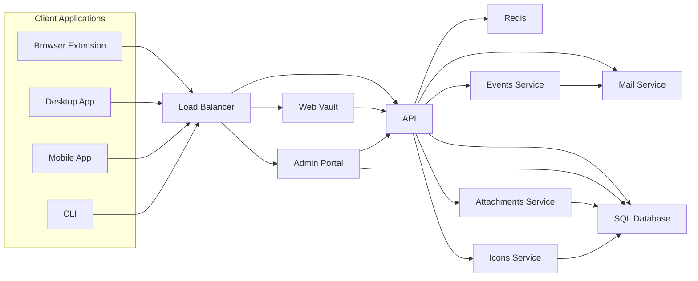

## Project Design Document: Bitwarden Server

**1. Introduction**

This document provides a detailed architectural design of the Bitwarden server project, based on the open-source repository found at [https://github.com/bitwarden/server](https://github.com/bitwarden/server). This document aims to provide a comprehensive understanding of the system's components, their interactions, and the overall architecture. It will serve as a foundation for subsequent threat modeling activities.

**2. Goals**

*   Clearly define the major components of the Bitwarden server.
*   Illustrate the interactions and data flow between these components.
*   Describe the deployment architecture and key infrastructure elements.
*   Provide sufficient detail for effective threat identification and analysis.

**3. Target Audience**

*   Security engineers and architects
*   Development team members
*   Operations and infrastructure personnel

**4. System Overview**

The Bitwarden server is a self-hosted solution for managing passwords and other sensitive information. It provides a backend for various Bitwarden client applications (browser extensions, desktop apps, mobile apps, and CLI). The core functionality includes user authentication, secure storage of encrypted data, and synchronization across devices.

**5. Architectural Design**

The Bitwarden server architecture can be broken down into several key components:

*   **Web Vault:** The primary user interface for managing passwords and settings, accessible through a web browser.
*   **API:** A RESTful API that handles requests from client applications for authentication, data retrieval, and synchronization.
*   **Admin Portal:** A web interface for administrative tasks, such as user management, organization management, and system configuration.
*   **SQL Database:**  The primary data store for user accounts, encrypted vault data, organizations, and other persistent information.
*   **Redis:** An in-memory data store used for caching, session management, and potentially rate limiting.
*   **Events Service:**  A component responsible for handling real-time events and notifications.
*   **Attachments Service:** Manages the storage and retrieval of file attachments associated with vault items.
*   **Icons Service:**  Provides icons for websites and applications.
*   **Mail Service:** Handles sending emails for user registration, password resets, and other notifications.

**6. Component Interactions and Data Flow**

**Data Flow Description:**

*   Client applications (Browser Extension, Desktop App, Mobile App, CLI) communicate with the server through a Load Balancer.
*   The Load Balancer distributes traffic to either the Web Vault, API, or Admin Portal based on the request.
*   The Web Vault primarily interacts with the API for data retrieval and updates.
*   The API is the central component, interacting with the SQL Database for persistent storage, Redis for caching and session management, the Events Service for real-time updates, the Attachments Service for file storage, the Icons Service for website icons, and the Mail Service for email communication.
*   The Admin Portal interacts with the API and directly with the SQL Database for administrative tasks.
*   The Events Service may send notifications via the Mail Service.
*   The Attachments Service stores and retrieves files, potentially using the SQL Database for metadata.
*   The Icons Service retrieves and serves website icons, potentially using the SQL Database for storage or caching.

**7. Deployment Architecture**

The Bitwarden server can be deployed in various configurations. A typical deployment might involve:

*   **Load Balancer:** Distributes incoming traffic across multiple API and Web Vault instances for high availability and scalability.
*   **Web Servers:** Host the Web Vault and Admin Portal applications.
*   **API Servers:** Host the core API application.
*   **Database Server:**  Runs the SQL Database (e.g., MySQL, MariaDB, PostgreSQL).
*   **Redis Server:**  Runs the Redis in-memory data store.
*   **Mail Server (SMTP):**  Used for sending emails.
*   **Storage for Attachments:**  Could be local storage, cloud storage (e.g., AWS S3, Azure Blob Storage), or a network file system.

**8. Key Technologies and Components**

*   **Programming Languages:** C# (.NET)
*   **Web Framework:** ASP.NET Core
*   **Database:** SQL (MySQL, MariaDB, PostgreSQL)
*   **Caching/Session Management:** Redis
*   **Message Queue/Real-time:** Potentially SignalR or similar for the Events Service
*   **Web Server:**  Kestrel (typically behind a reverse proxy like Nginx or Apache)
*   **Operating System:** Linux (common), Windows

**9. Security Considerations**

*   **Authentication:** User authentication is crucial and likely involves username/password, two-factor authentication (TOTP, U2F/WebAuthn), and potentially enterprise SSO integrations.
*   **Authorization:**  Role-based access control (RBAC) is used to manage permissions for users and organizations.
*   **Encryption:** End-to-end encryption is a core feature. User vault data is encrypted client-side before being sent to the server. The server stores only encrypted data.
*   **Secure Storage:** Sensitive data at rest (e.g., encryption keys) needs to be securely stored, potentially using hardware security modules (HSMs) or key management systems.
*   **Transport Security:** HTTPS is essential for securing communication between clients and the server.
*   **Input Validation:**  Rigorous input validation is required to prevent injection attacks.
*   **Rate Limiting:**  Mechanisms to prevent brute-force attacks and denial-of-service attacks.
*   **Regular Security Audits:**  Essential for identifying and addressing potential vulnerabilities.
*   **Dependency Management:**  Keeping dependencies up-to-date to patch known security flaws.

**10. Future Considerations**

*   **Clustering and High Availability:**  Further enhancements to ensure continuous availability and fault tolerance.
*   **Scalability:**  Architectural improvements to handle a growing number of users and data.
*   **Integration with other services:**  Potential integrations with other security and productivity tools.

This document provides a foundational understanding of the Bitwarden server architecture. It highlights the key components, their interactions, and important security considerations. This information will be valuable for conducting a thorough threat model of the system.
