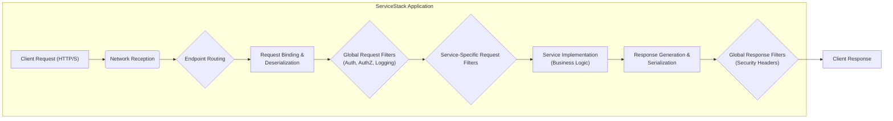
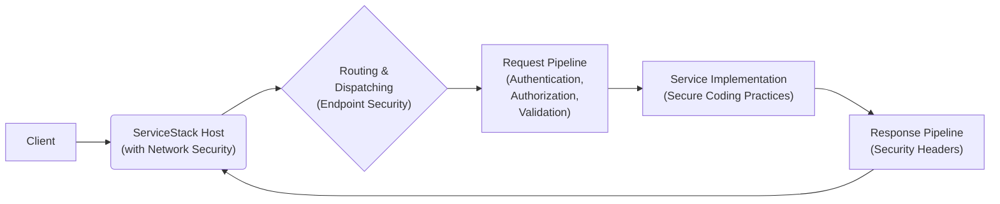
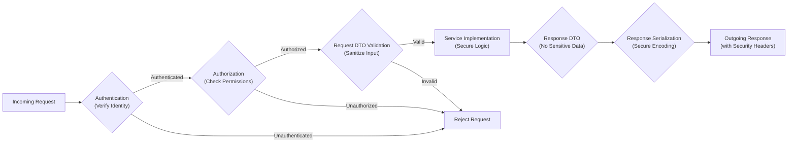

## Project Design Document: ServiceStack Framework (Improved)

**Document Version:** 1.1
**Date:** October 26, 2023
**Prepared By:** AI Software Architecture Expert

### 1. Introduction

This document provides an enhanced architectural overview of the ServiceStack framework, specifically tailored for threat modeling. It details the key components, data flows, and inherent security considerations to facilitate the identification of potential vulnerabilities. ServiceStack is a versatile, open-source .NET framework designed for building efficient and robust web services and applications. Its emphasis on convention, speed, and a message-based architecture makes it a popular choice for various applications. This document serves as a crucial input for systematically analyzing potential threats and designing appropriate security mitigations.

### 2. Goals

* Deliver a refined and more detailed architectural description of the ServiceStack framework, optimized for threat analysis.
* Clearly delineate key components and their interactions, highlighting potential attack surfaces.
* Provide a granular view of data flow within a ServiceStack application, pinpointing sensitive data transit points.
* Emphasize built-in security features and inherent security responsibilities for developers.
* Serve as the definitive design reference for conducting comprehensive threat modeling sessions.

### 3. Architectural Overview

ServiceStack employs a layered architecture, promoting modularity and separation of concerns. Understanding this structure is crucial for identifying where security controls are implemented and where vulnerabilities might arise. The framework's core function is to efficiently process requests and generate responses, primarily utilizing standard web protocols like HTTP.

* **Core Principles:**
    * **Convention over Configuration:** Streamlines development but requires understanding default behaviors for security implications.
    * **POCO-Driven Development:** While simplifying data handling, developers must ensure proper serialization and deserialization to prevent manipulation.
    * **Message-Based Architecture:**  Defines clear communication boundaries but necessitates secure handling of message payloads.
    * **Extensibility:**  Plugins offer added functionality but introduce potential security risks if not properly vetted.

* **Key Architectural Layers (with Security Focus):**
    * **Presentation Layer (Client):**  The consumer of the API. Security concerns here include unauthorized access and data breaches on the client-side.
    * **Service Layer:** Contains business logic. Vulnerable to injection attacks, business logic flaws, and unauthorized data access.
    * **Data Access Layer:** Interacts with data stores. Susceptible to SQL injection, NoSQL injection, and data breaches if not secured.
    * **Infrastructure Layer:** Provides supporting services. Vulnerabilities here can impact the entire application (e.g., compromised caching can lead to data leaks).

### 4. Data Flow (Detailed)

A comprehensive understanding of data flow is essential for pinpointing potential interception and manipulation points. The following steps detail the typical request lifecycle within a ServiceStack application:

1. **Client Request Initiation:** A client (browser, app, service) sends a request to a ServiceStack endpoint via HTTP(S). The choice of protocol impacts confidentiality and integrity.
2. **Network Reception:** The request is received by the hosting environment (e.g., Kestrel, IIS). Network security configurations are critical here.
3. **Endpoint Routing:** ServiceStack's routing engine maps the URL and HTTP method to a specific service operation. Misconfigured routes can expose unintended endpoints.
4. **Request Binding & Deserialization:**  Incoming data is bound to the request DTO. Vulnerabilities can arise from insecure deserialization practices.
5. **Global Request Filters:**  These filters execute before service-specific logic. They are crucial for cross-cutting security concerns like authentication, authorization, and logging.
6. **Service-Specific Request Filters:**  Apply to individual service operations, providing granular control for security checks.
7. **Service Execution:** The core business logic of the service is executed. This is where vulnerabilities related to business logic flaws and data manipulation can occur.
8. **Response Generation & Serialization:** The service generates a response DTO, which is then serialized. Ensure sensitive data is not inadvertently included in responses.
9. **Global Response Filters:**  These filters execute after service logic. They can modify responses, add security headers, and perform final logging.
10. **Client Response Transmission:** The formatted response is sent back to the client. Secure headers and proper content encoding are important here.

### 5. Key Components (Security Focused)

* **Request DTOs (Data Transfer Objects):** Define the expected structure of incoming data. Crucial for input validation and preventing injection attacks.
* **Response DTOs:** Define the structure of outgoing data. Care must be taken to avoid leaking sensitive information.
* **Service Implementations:** Contain the core logic. Require secure coding practices to prevent vulnerabilities like business logic flaws and data breaches.
* **AppHost:** The central configuration. Misconfigurations can lead to significant security vulnerabilities (e.g., insecure authentication settings).
* **Virtual File System (VFS):**  Provides access to static files. Requires careful configuration to prevent unauthorized access to sensitive files.
* **Caching (ICacheClient):**  Improves performance but can introduce security risks if sensitive data is cached without proper protection.
* **Authentication Providers (IAuthProvider):**  Handle user authentication. Choosing strong providers and configuring them correctly is paramount.
* **Authorization Attributes:** Control access to service operations. Properly defining and applying these attributes is essential for enforcing access control.
* **Serialization (ISerializer):**  Handles data conversion. Insecure deserialization can be a major vulnerability.
* **Validation (FluentValidation):**  Enforces data integrity and prevents invalid data from reaching the service logic.
* **Plugins (IPlugin):**  Extend functionality. Security of plugins must be carefully evaluated as they can introduce vulnerabilities.
* **Providers (e.g., IDbConnectionFactory):**  Abstraction layers. Security depends on the underlying implementation of the provider.
* **Messaging (IMessageService):**  Enables asynchronous communication. Requires secure message handling and transport.
* **Logging (ILog):**  Essential for security auditing and incident response. Logs themselves must be protected.
* **Metrics (IMetrics):**  Provide performance insights but should not expose sensitive data.

### 6. Security Considerations (Expanded)

ServiceStack offers a range of built-in security features, but developers bear significant responsibility for their correct implementation and configuration.

* **Input Validation:**  Leverage ServiceStack's validation features (e.g., FluentValidation) to sanitize and validate all incoming data to prevent injection attacks (SQL, XSS, etc.).
* **Authentication:**  Choose appropriate authentication providers (API Keys, JWT, OAuth 2.0) based on the application's requirements. Securely store and manage credentials. Implement multi-factor authentication where necessary.
* **Authorization:**  Utilize ServiceStack's authorization attributes (`[Authenticate]`, `[Authorize]`, `[RequiredRole]`, `[RequiredPermission]`) to enforce granular access control to service operations. Follow the principle of least privilege.
* **HTTPS Enforcement:**  Mandate HTTPS to encrypt communication and protect data in transit. Configure HTTP Strict Transport Security (HSTS) headers.
* **Cross-Origin Resource Sharing (CORS):**  Configure CORS policies carefully to restrict cross-domain requests and prevent malicious websites from interacting with your API.
* **Content Security Policy (CSP):**  Implement CSP headers to mitigate cross-site scripting (XSS) attacks by controlling the sources from which the browser is allowed to load resources.
* **Protection Against Common Web Vulnerabilities:**  Be aware of and actively mitigate OWASP Top Ten vulnerabilities. ServiceStack helps with some (e.g., ORM Lite for parameterized queries to prevent SQL injection), but developer vigilance is crucial.
* **Security Headers:**  Utilize security-related HTTP headers (e.g., `X-Frame-Options`, `X-Content-Type-Options`, `Referrer-Policy`) to enhance security posture.
* **Rate Limiting & Throttling:**  Implement mechanisms to limit the number of requests from a single source to prevent denial-of-service (DoS) attacks.
* **Secure Deserialization:**  Be cautious when deserializing data from untrusted sources. Avoid using insecure deserialization settings that could lead to remote code execution.
* **Error Handling:**  Avoid exposing sensitive information in error messages. Implement proper logging for debugging purposes.
* **Dependency Management:**  Keep ServiceStack and its dependencies up-to-date to patch known security vulnerabilities.
* **Regular Security Audits:**  Conduct regular security assessments and penetration testing to identify potential weaknesses.

### 7. Deployment Considerations (Security Implications)

The deployment environment significantly impacts the security of a ServiceStack application.

* **ASP.NET on IIS:**  Requires careful configuration of IIS security features, including authentication, authorization, and request filtering. Keep IIS patched and updated.
* **ASP.NET Core (Kestrel):**  Kestrel is a reverse proxy server and should typically be placed behind a more robust web server like Nginx or Apache in production for enhanced security and features.
* **Self-Hosting:**  Requires careful consideration of network security, process isolation, and access control. Responsibility for security configuration lies heavily with the developer.
* **Containers (Docker):**  Secure container image creation is crucial. Minimize the attack surface by including only necessary components. Regularly scan images for vulnerabilities.
* **Serverless Environments:**  Leverage the security features provided by the serverless platform (e.g., AWS Lambda, Azure Functions). Follow the platform's security best practices.

### 8. Diagrams

#### 8.1. High-Level Architecture (Security Focused)

#### 8.2. Request Processing Flow (Detailed Security Checks)

### 9. Conclusion

This enhanced design document provides a more detailed and security-focused overview of the ServiceStack framework. It emphasizes the key components, data flow, and security considerations crucial for effective threat modeling. By understanding these architectural aspects and potential security implications, security professionals and developers can collaboratively identify vulnerabilities and implement robust security mitigations, ultimately leading to more secure and resilient ServiceStack applications. This document serves as a vital resource for proactive security planning and ongoing security management.