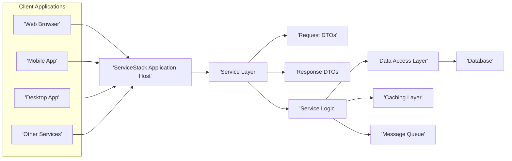
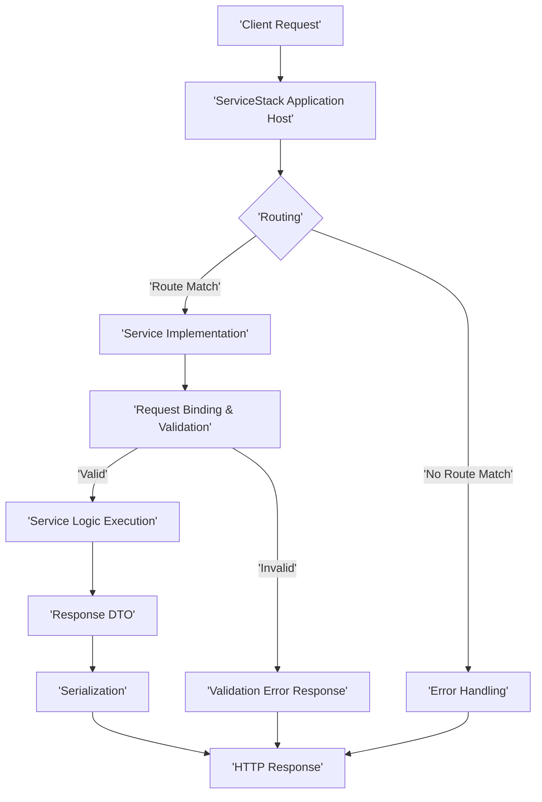

# Project Design Document: ServiceStack Framework

**Version:** 1.1
**Date:** October 26, 2023
**Author:** AI Software Architect

## 1. Introduction

This document provides an enhanced architectural design of the ServiceStack framework, an open-source, cross-platform framework for building web services and applications. This revised document aims to provide a more in-depth understanding of the framework's components, interactions, and key functionalities, specifically tailored for subsequent threat modeling activities. We will delve deeper into security aspects and provide more granular details on certain components.

## 2. Goals and Objectives

The primary goals of this design document are to:

*   Clearly and comprehensively articulate the architecture of the ServiceStack framework.
*   Identify key components and their specific responsibilities with greater detail.
*   Describe the data flow and interactions within the framework with more granularity.
*   Highlight important security considerations and features, providing concrete examples.
*   Provide a robust and detailed basis for identifying potential threats and vulnerabilities.

## 3. Architectural Overview

ServiceStack employs a layered architecture, emphasizing separation of concerns, modularity, and developer productivity. Its design prioritizes speed and ease of use for building robust web services.

### 3.1. High-Level Architecture

*   **Client Applications:** Represent diverse consumers interacting with the ServiceStack application, including web browsers, native mobile applications, desktop software, and other backend services.
*   **ServiceStack Application Host:** The central entry point for all incoming requests. It manages request routing, processing, and response generation. This typically runs within a web server environment (e.g., ASP.NET Core's Kestrel, IIS) or as a self-hosted application.
*   **Service Layer:** The core business logic layer responsible for handling incoming requests, orchestrating operations, and interacting with other layers.
*   **Request DTOs (Data Transfer Objects):** Plain C# objects that define the structure and expected data for incoming requests. They facilitate strong typing and validation.
*   **Response DTOs (Data Transfer Objects):** Plain C# objects defining the structure of the data returned in responses. They ensure consistent and predictable data output.
*   **Service Logic:** Contains the specific business rules and workflows for processing requests. This is where the application's core functionality is implemented.
*   **Data Access Layer:**  Responsible for abstracting interactions with data storage mechanisms. ServiceStack offers built-in support and integrations for various ORMs (e.g., OrmLite) and data access patterns.
*   **Database:** The persistent storage system for the application's data. This could be a relational database, NoSQL database, or other data store.
*   **Caching Layer:** An optional layer to improve performance by storing frequently accessed data in memory or other fast storage. ServiceStack supports various caching providers (e.g., Redis, MemoryCache).
*   **Message Queue:** An optional component enabling asynchronous communication and decoupling of services. ServiceStack integrates with popular message queue systems (e.g., RabbitMQ, Azure Service Bus).

### 3.2. Detailed Architecture and Components

This section provides a more granular look at the key components within the ServiceStack framework.

*   **AppHost:**
    *   The foundational component for configuring and bootstrapping a ServiceStack application.
    *   Responsible for registering all services, plugins, and dependency injections.
    *   Configures crucial framework settings such as request routing rules, serialization formats, and global filters.
    *   Manages the application's lifecycle events, including startup and shutdown.
*   **Request Binding:**
    *   The process of automatically converting incoming request data (e.g., HTTP query parameters, JSON request bodies, form data) into strongly-typed Request DTO instances.
    *   Supports a wide range of content types, including JSON, XML, CSV, and MessagePack.
    *   Includes built-in mechanisms for handling model binding and type conversion.
*   **Routing:**
    *   The mechanism for mapping incoming HTTP requests to specific service implementations based on the request URL and HTTP method.
    *   Supports both attribute-based routing (decorating service methods with route attributes) and convention-based routing.
    *   Allows for defining custom route patterns and constraints for complex scenarios.
*   **Service Implementations:**
    *   Concrete classes that contain the business logic for handling specific types of requests.
    *   Typically inherit from the `Service` base class, providing access to framework features.
    *   Receive fully populated Request DTOs as input parameters and return Response DTOs as the result.
*   **Serialization:**
    *   The process of converting .NET objects into a format suitable for transmission (e.g., JSON, XML) and vice versa.
    *   ServiceStack provides highly performant built-in serializers and allows for the registration of custom serializers.
    *   Supports content negotiation, allowing clients to specify their preferred response format.
*   **Validation:**
    *   A crucial step in ensuring data integrity by verifying that incoming request data meets predefined rules and constraints.
    *   ServiceStack offers a fluent validation API (ServiceStack.FluentValidation) for defining validation rules declaratively.
    *   Validation errors are automatically returned to the client in a structured format, aiding in debugging and error handling.
*   **Filters:**
    *   Interceptors that allow for executing custom logic before and after service requests are processed.
    *   Can be used for a wide range of tasks, including authentication, authorization, logging, request/response modification, and exception handling.
    *   Supports global filters that apply to all requests and service-specific filters.
*   **Plugins:**
    *   Modular extensions that add new functionalities and integrations to the ServiceStack framework.
    *   Examples include authentication providers (e.g., AuthFeature), caching providers (e.g., RedisFeature), Swagger/OpenAPI support (OpenApiFeature), and message queue integrations.
    *   Registered within the `AppHost` during application startup.
*   **Virtual File System (VFS):**
    *   An abstraction layer providing a unified way to access static files and embedded resources, regardless of their physical location.
    *   Supports various file system providers, including physical file systems and embedded resources within assemblies.
*   **Client Libraries:**
    *   Libraries available for various platforms (.NET, Java, JavaScript, etc.) that simplify the process of consuming ServiceStack services.
    *   Handle tasks such as request serialization, HTTP communication, and error handling, making it easier for client applications to interact with the API.

## 4. Data Flow

The following diagram illustrates the typical flow of a request through a ServiceStack application, highlighting key processing stages.

1. **Client Request:** A client application initiates an HTTP request to the ServiceStack application host.
2. **ServiceStack Application Host:** The host receives the incoming request and begins the processing pipeline.
3. **Routing:** The routing engine analyzes the request URL and HTTP method to determine the appropriate service implementation to handle the request.
4. **Service Implementation:** If a matching route is found, an instance of the corresponding service class is created.
5. **Request Binding & Validation:** The framework attempts to bind the incoming request data to the properties of the designated Request DTO. Validation rules defined for the DTO are then executed.
6. **Service Logic Execution:** If the request is successfully bound and validated, the service method containing the business logic is invoked.
7. **Response DTO:** The service method executes its logic and constructs a Response DTO containing the result of the operation.
8. **Serialization:** The Response DTO is serialized into the format requested by the client (or the default format if none is specified), typically JSON or XML.
9. **HTTP Response:** The serialized response is packaged into an HTTP response and sent back to the client.
10. **Error Handling:** If no matching route is found for the incoming request, the framework's error handling mechanism generates an appropriate error response.
11. **Validation Error Response:** If the request fails validation, a response containing details of the validation errors is generated and returned to the client.

## 5. Security Considerations

ServiceStack incorporates numerous features and promotes secure development practices to protect applications from various threats.

*   **Authentication:**
    *   Provides a flexible authentication system with built-in support for various methods:
        *   **Basic Authentication:** Username and password transmitted in the `Authorization` header.
        *   **API Keys:**  Unique keys used to identify and authenticate clients.
        *   **JWT (JSON Web Tokens):**  A standard for securely transmitting information between parties as a JSON object. ServiceStack provides easy integration with JWT.
        *   **OAuth 2.0:**  An authorization framework that enables secure delegated access. ServiceStack offers plugins for popular OAuth 2.0 providers.
        *   **Credentials Authentication:**  Utilizing username/password stored securely.
    *   The `AuthFeature` plugin simplifies the integration of these authentication methods.
    *   Extensible architecture allows for the creation of custom authentication providers to meet specific requirements.
*   **Authorization:**
    *   Enables fine-grained control over who can access specific service endpoints and resources.
    *   Role-based authorization allows you to define roles and assign users to them, granting access based on their roles.
    *   Permission-based authorization provides more granular control, allowing you to define specific permissions and assign them to users or roles.
    *   Authorization can be implemented using attributes on service methods (e.g., `[RequiredRole("Admin")]`, `[RequiredPermission("EditWidgets")]`) or through custom authorization logic within filters.
*   **HTTPS Support:**
    *   Strongly encourages the use of HTTPS to encrypt communication between clients and the server, protecting sensitive data in transit.
    *   Configuration of HTTPS is typically handled at the web server or load balancer level.
*   **Input Validation:**
    *   Emphasizes the importance of validating all incoming data to prevent injection attacks (e.g., SQL injection, cross-site scripting).
    *   The fluent validation API allows developers to define comprehensive validation rules for Request DTOs.
    *   Validation helps ensure that only well-formed and expected data is processed by the application.
*   **Output Encoding:**
    *   Promotes proper output encoding to mitigate cross-site scripting (XSS) vulnerabilities.
    *   ServiceStack's serialization mechanisms typically handle encoding based on the output format (e.g., HTML encoding for HTML responses).
*   **Cross-Origin Resource Sharing (CORS):**
    *   Provides configurable CORS support to control which domains are permitted to make requests to the API, preventing unauthorized cross-domain access.
    *   CORS policies can be configured globally or per-service.
*   **Security Headers:**
    *   Allows for setting security-related HTTP headers to enhance client-side security:
        *   **Content-Security-Policy (CSP):**  Controls the sources from which the browser is allowed to load resources, mitigating XSS attacks.
        *   **Strict-Transport-Security (HSTS):**  Forces browsers to always connect to the server over HTTPS.
        *   **X-Frame-Options:**  Protects against clickjacking attacks.
        *   **X-Content-Type-Options:** Prevents MIME sniffing vulnerabilities.
*   **Protection against Common Web Attacks:**
    *   The framework's design and features help mitigate risks associated with common web attacks:
        *   **SQL Injection:**  Encourages the use of parameterized queries or ORMs like OrmLite, which automatically handle escaping and prevent SQL injection.
        *   **Cross-Site Request Forgery (CSRF):**  Support for implementing anti-forgery tokens to protect against CSRF attacks.
        *   **Mass Assignment:**  DTOs help control which properties can be bound from incoming requests, preventing unintended data modification.
*   **Dependency Management:**
    *   Leverages NuGet for managing dependencies, allowing for timely updates and security patching of underlying libraries. Regularly updating dependencies is crucial for maintaining security.
*   **Rate Limiting:**
    *   Can be implemented using middleware or plugins to protect against denial-of-service (DoS) attacks by limiting the number of requests a client can make within a specific time frame.

## 6. Deployment

ServiceStack applications offer flexible deployment options, catering to various infrastructure needs.

*   **Web Servers:**
    *   **IIS (Internet Information Services):**  A common choice for deploying .NET applications on Windows servers.
    *   **Kestrel:** A cross-platform, lightweight web server ideal for ASP.NET Core applications and often used as an edge server behind a reverse proxy.
    *   **Nginx and Apache:** Popular web servers that can be used as reverse proxies in front of ServiceStack applications, providing features like load balancing and SSL termination.
*   **Cloud Platforms:**
    *   **Azure App Service:** A platform-as-a-service (PaaS) offering from Microsoft Azure, simplifying the deployment and management of web applications.
    *   **AWS Elastic Beanstalk:** A similar PaaS offering from Amazon Web Services, providing an easy way to deploy and scale web applications.
    *   **Google Cloud App Engine:** Google's PaaS offering for deploying and scaling web applications.
    *   **Containerization (Docker):** ServiceStack applications can be easily containerized using Docker, enabling consistent deployments across different environments and facilitating orchestration with platforms like Kubernetes.
*   **Self-Hosted Applications:**
    *   ServiceStack applications can be run as standalone console applications or Windows services, providing flexibility for scenarios where a traditional web server is not required.

Typical deployment steps involve:

*   **Building the application:** Compiling the ServiceStack project into deployable artifacts.
*   **Configuring the deployment environment:** Setting up the web server, cloud platform resources, or container environment.
*   **Deploying application files:** Copying the compiled application files to the deployment environment.
*   **Configuring environment variables and connection strings:**  Setting up environment-specific configurations, such as database connection details and API keys.
*   **Setting up HTTPS certificates:**  Configuring SSL/TLS certificates for secure communication over HTTPS.
*   **Configuring reverse proxies (if applicable):** Setting up reverse proxies for load balancing, SSL termination, and other edge server functionalities.

## 7. Future Considerations

*   Detailed architectural diagrams for specific plugins (e.g., AuthFeature, RedisFeature) to understand their internal workings.
*   In-depth analysis of specific security features and their configuration options, including best practices for secure configuration.
*   Exploration of the framework's extensibility points for implementing custom security mechanisms and integrations.
*   Diagrams illustrating specific security workflows, such as the authentication and authorization process flow.
*   Consideration of security best practices for different deployment environments (e.g., cloud-specific security configurations).

This enhanced document provides a more detailed and comprehensive architectural overview of the ServiceStack framework, specifically tailored for threat modeling activities. The increased granularity in component descriptions, data flow, and security considerations aims to provide a solid foundation for identifying and mitigating potential vulnerabilities.