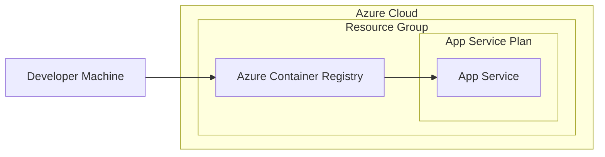

Okay, let's create a design document for the ServiceStack framework based on the provided GitHub repository.

# BUSINESS POSTURE

ServiceStack is a mature, open-source .NET framework designed for building high-performance web services.  It emphasizes convention over configuration, simplicity, and speed.  Given its widespread use and the nature of web services, the following business priorities and risks are paramount:

Priorities:

*   Enable rapid development of web services.
*   Provide a high-performance, scalable, and maintainable framework.
*   Offer a rich feature set out-of-the-box, reducing the need for external dependencies.
*   Maintain a strong and active community for support and contributions.
*   Ensure compatibility across various .NET versions and platforms.
*   Minimize the "ceremony" and boilerplate code required for common tasks.

Business Risks:

*   Security vulnerabilities in the framework could expose applications built with ServiceStack to attacks, leading to data breaches, service disruptions, and reputational damage.
*   Performance bottlenecks in the framework could limit the scalability of applications, impacting user experience and potentially increasing infrastructure costs.
*   Lack of maintainability or overly complex code could hinder future development and bug fixes, slowing down the project's evolution.
*   Incompatibility with newer .NET versions or platforms could limit the framework's adoption and longevity.
*   Insufficient documentation or community support could make it difficult for developers to use the framework effectively, hindering adoption.
*   Reliance on outdated or vulnerable third-party dependencies could introduce security risks.

# SECURITY POSTURE

ServiceStack, being a framework, provides building blocks and encourages secure development practices, but the ultimate security responsibility lies with the applications built upon it.  Here's a breakdown of existing controls, accepted risks, recommendations, and requirements:

Existing Security Controls:

*   security control: Input Validation: ServiceStack encourages the use of Data Transfer Objects (DTOs) and provides mechanisms for validating requests. (Described in documentation and examples).
*   security control: Authentication and Authorization: ServiceStack offers built-in support for various authentication providers (e.g., Credentials, JWT, API Keys) and authorization mechanisms (e.g., roles, permissions). (Described in documentation and examples).
*   security control: Cross-Site Scripting (XSS) Prevention: ServiceStack's Razor support and HTML helpers are designed to mitigate XSS vulnerabilities by default. (Described in documentation and examples).
*   security control: Cross-Site Request Forgery (CSRF) Prevention: ServiceStack provides mechanisms to generate and validate anti-forgery tokens. (Described in documentation and examples).
*   security control: Session Management: ServiceStack offers secure session management capabilities, including support for various backing stores (e.g., Redis, Memory Cache). (Described in documentation and examples).
*   security control: Data Protection: ServiceStack provides utilities for encrypting and decrypting data, as well as integrating with platform-specific data protection APIs. (Described in documentation and examples).
*   security control: Dependency Management: ServiceStack uses NuGet for dependency management, allowing developers to track and update dependencies. (Visible in project files).
*   security control: Regular Updates: The ServiceStack team regularly releases updates and patches to address security vulnerabilities and improve performance. (Visible in release notes and GitHub commits).

Accepted Risks:

*   accepted risk: Third-party dependency vulnerabilities: While ServiceStack strives to use secure dependencies, there's always a risk of vulnerabilities in third-party libraries.
*   accepted risk: Misconfiguration by developers: ServiceStack provides secure defaults, but developers can misconfigure the framework or their applications, introducing security vulnerabilities.
*   accepted risk: Zero-day vulnerabilities: Like any software, ServiceStack is susceptible to zero-day vulnerabilities that are unknown and unpatched.

Recommended Security Controls:

*   security control: Implement a robust Content Security Policy (CSP) to mitigate XSS and data injection attacks.
*   security control: Enforce HTTPS with strong ciphers and protocols (TLS 1.3).
*   security control: Regularly conduct security audits and penetration testing of applications built with ServiceStack.
*   security control: Implement a Web Application Firewall (WAF) to protect against common web attacks.
*   security control: Use a centralized logging and monitoring system to detect and respond to security incidents.
*   security control: Implement rate limiting and throttling to prevent abuse and denial-of-service attacks.

Security Requirements:

*   Authentication:
    *   Support for multiple authentication providers (e.g., OAuth 2.0, OpenID Connect, JWT).
    *   Secure storage of user credentials (e.g., using password hashing with salt).
    *   Secure session management with configurable timeouts and expiration.
    *   Multi-factor authentication (MFA) support.
*   Authorization:
    *   Role-based access control (RBAC).
    *   Attribute-based access control (ABAC).
    *   Fine-grained permission management.
*   Input Validation:
    *   Validation of all input data against predefined schemas.
    *   Sanitization of input data to prevent injection attacks.
    *   Whitelist-based validation whenever possible.
*   Cryptography:
    *   Use of strong, industry-standard cryptographic algorithms.
    *   Secure key management practices.
    *   Protection of sensitive data at rest and in transit.
    *   Regular review and update of cryptographic libraries.

# DESIGN

## C4 CONTEXT

```mermaid
graph LR
    subgraph "ServiceStack Application Ecosystem"
        User(("User")) --> ServiceStackApp["ServiceStack Application"];
        ServiceStackApp --|> ExternalSystems["External Systems\n(e.g., Databases, APIs)"];
        ServiceStackApp --|> AuthProviders["Authentication Providers\n(e.g., OAuth, JWT)"];
    end
```

Element Descriptions:

*   Element:
    *   Name: User
    *   Type: Person
    *   Description: Represents a user interacting with the ServiceStack application.
    *   Responsibilities: Initiates requests, provides input, receives responses.
    *   Security controls: Browser security features, user-side security software.

*   Element:
    *   Name: ServiceStack Application
    *   Type: Software System
    *   Description: The application built using the ServiceStack framework.
    *   Responsibilities: Handles requests, processes data, interacts with external systems, enforces business logic.
    *   Security controls: Input validation, authentication, authorization, output encoding, session management, data protection.

*   Element:
    *   Name: External Systems
    *   Type: Software System
    *   Description: External systems that the ServiceStack application interacts with, such as databases, APIs, and other services.
    *   Responsibilities: Varies depending on the specific system.
    *   Security controls: Dependent on the security measures implemented by the external system. ServiceStack application should use secure communication protocols and authentication when interacting with these systems.

*   Element:
    *   Name: Authentication Providers
    *   Type: Software System
    *   Description: External services used for user authentication, such as OAuth providers or JWT issuers.
    *   Responsibilities: Authenticating users and providing identity information.
    *   Security controls: Dependent on the security measures implemented by the authentication provider. ServiceStack application should use secure protocols and validate tokens properly.

## C4 CONTAINER

```mermaid
graph LR
    subgraph "ServiceStack Application"
        User(("User")) --> WebApp["Web Application\n(UI)"];
        WebApp --> ServiceInterface["Service Interface\n(API Layer)"];
        ServiceInterface --> AppLogic["Application Logic\n(Business Layer)"];
        AppLogic --> DataAccess["Data Access Layer"];
        DataAccess --> Database[(Database)];
        ServiceInterface --|> AuthProvider["Authentication Provider"];
    end
```

Element Descriptions:

*   Element:
    *   Name: User
    *   Type: Person
    *   Description: Represents a user interacting with the ServiceStack application.
    *   Responsibilities: Initiates requests, provides input, receives responses.
    *   Security controls: Browser security features, user-side security software.

*   Element:
    *   Name: Web Application (UI)
    *   Type: Container: Web Application
    *   Description: The user interface of the application, typically a web application.
    *   Responsibilities: Renders the user interface, handles user input, communicates with the Service Interface.
    *   Security controls: XSS prevention, CSRF protection, secure communication (HTTPS).

*   Element:
    *   Name: Service Interface (API Layer)
    *   Type: Container: API Application
    *   Description: The layer that exposes the application's functionality as services.
    *   Responsibilities: Handles requests, validates input, routes requests to the Application Logic, serializes/deserializes data.
    *   Security controls: Input validation, authentication, authorization, rate limiting.

*   Element:
    *   Name: Application Logic (Business Layer)
    *   Type: Container: .NET
    *   Description: The core business logic of the application.
    *   Responsibilities: Implements business rules, processes data, interacts with the Data Access Layer.
    *   Security controls: Business rule enforcement, data validation.

*   Element:
    *   Name: Data Access Layer
    *   Type: Container: .NET
    *   Description: The layer responsible for interacting with the database.
    *   Responsibilities: Retrieves and persists data, handles database connections.
    *   Security controls: Parameterized queries, data validation, secure connection strings.

*   Element:
    *   Name: Database
    *   Type: Container: Database
    *   Description: The database used to store the application's data.
    *   Responsibilities: Stores and retrieves data.
    *   Security controls: Database security features (e.g., access control, encryption), secure network configuration.

*   Element:
    *   Name: Authentication Provider
    *   Type: Container: Library/Service
    *   Description: Handles user authentication. Could be internal or external.
    *   Responsibilities: Authenticates users, issues tokens.
    *   Security controls: Secure authentication protocols, secure token management.

## DEPLOYMENT

ServiceStack applications can be deployed in various ways, including:

1.  Self-hosted console application.
2.  Windows Service.
3.  IIS (Internet Information Services).
4.  Docker containers.
5.  Cloud platforms (e.g., AWS, Azure, GCP) using various services (e.g., VMs, App Services, Kubernetes).

We'll describe deployment to Azure App Service using Docker containers:



Element Descriptions:

*   Element:
    *   Name: Developer Machine
    *   Type: Infrastructure Node
    *   Description: The developer's workstation where the code is written and built.
    *   Responsibilities: Code development, building Docker images.
    *   Security controls: Local security measures, secure coding practices.

*   Element:
    *   Name: Azure Container Registry (ACR)
    *   Type: Infrastructure Node: Container Registry
    *   Description: A private registry for storing Docker images.
    *   Responsibilities: Stores and manages Docker images.
    *   Security controls: Access control, image scanning, network security.

*   Element:
    *   Name: App Service Plan
    *   Type: Infrastructure Node
    *   Description: Defines the resources (e.g., CPU, memory) for the App Service.
    *   Responsibilities: Provides the compute resources for the application.
    *   Security controls: Network security, scaling settings.

*   Element:
    *   Name: App Service
    *   Type: Infrastructure Node: Web App
    *   Description: The Azure App Service that hosts the ServiceStack application.
    *   Responsibilities: Runs the application, handles incoming requests.
    *   Security controls: HTTPS enforcement, authentication/authorization settings, network security, Web Application Firewall (WAF) integration.

*   Element:
    *   Name: Resource Group
    *   Type: Logical Group
    *   Description: Logical group for Azure resources.
    *   Responsibilities: Grouping resources.
    *   Security controls: Azure RBAC.

## BUILD

The build process for a ServiceStack application typically involves the following steps:

1.  Developer writes code on their local machine.
2.  Code is committed to a source code repository (e.g., GitHub).
3.  A Continuous Integration (CI) system (e.g., GitHub Actions, Azure DevOps) is triggered.
4.  The CI system checks out the code.
5.  The CI system restores NuGet packages.
6.  The CI system builds the application (e.g., using `dotnet build`).
7.  The CI system runs unit tests (e.g., using `dotnet test`).
8.  (Optional) The CI system runs static analysis tools (e.g., SAST, linters).
9.  The CI system creates a Docker image (e.g., using `docker build`).
10. The CI system pushes the Docker image to a container registry (e.g., Azure Container Registry).

```mermaid
graph LR
    Developer["Developer"] --> GitHub["GitHub\n(Source Code)"];
    GitHub --|> GitHubActions["GitHub Actions\n(CI)"];
    GitHubActions --> Restore["Restore NuGet Packages"];
    Restore --> Build["Build Application"];
    Build --> Test["Run Unit Tests"];
    Test --> StaticAnalysis["Static Analysis\n(SAST, Linters)"];
    StaticAnalysis --> DockerBuild["Build Docker Image"];
    DockerBuild --> DockerPush["Push to Container Registry"];
    DockerPush --> Artifacts[(Build Artifacts\n(Docker Image))];
```

Security Controls in Build Process:

*   security control: Source Code Management: Using a secure source code repository (e.g., GitHub) with access control and audit trails.
*   security control: Dependency Management: Using NuGet to manage dependencies and regularly checking for vulnerable packages.
*   security control: Static Analysis: Integrating SAST tools into the CI pipeline to identify potential security vulnerabilities in the code.
*   security control: Build Automation: Using a CI system to automate the build process, ensuring consistency and repeatability.
*   security control: Secure Build Environment: Running the build process in a secure environment (e.g., isolated build agents).
*   security control: Image Scanning: Scanning Docker images for vulnerabilities before deploying them.

# RISK ASSESSMENT

Critical Business Processes:

*   API service availability and responsiveness: Ensuring the APIs built with ServiceStack are available and performant to meet user needs and business requirements.
*   Data integrity and confidentiality: Protecting the data processed and stored by ServiceStack applications from unauthorized access, modification, or disclosure.
*   User authentication and authorization: Ensuring that only authorized users can access specific resources and perform specific actions.

Data Sensitivity:

The data sensitivity depends on the specific application built with ServiceStack. It can range from non-sensitive public data to highly sensitive personal data, financial information, or intellectual property.  Applications should classify data based on sensitivity and apply appropriate security controls.

# QUESTIONS & ASSUMPTIONS

Questions:

*   What specific types of applications are most commonly built with ServiceStack within the organization? (This helps prioritize security controls for common use cases).
*   What are the existing security policies and standards within the organization? (This ensures the design aligns with existing requirements).
*   What is the organization's risk tolerance? (This helps determine the appropriate level of security investment).
*   Are there any specific compliance requirements (e.g., GDPR, HIPAA, PCI DSS) that need to be considered?
*   What is the expected scale and traffic volume for applications built with ServiceStack?

Assumptions:

*   BUSINESS POSTURE: The organization values the rapid development and performance benefits of ServiceStack.
*   BUSINESS POSTURE: The organization has a moderate risk tolerance, balancing security with development speed and cost.
*   SECURITY POSTURE: Developers using ServiceStack have a basic understanding of secure coding practices.
*   SECURITY POSTURE: The organization has some existing security infrastructure (e.g., firewalls, logging).
*   DESIGN: Applications built with ServiceStack will primarily be web services or APIs.
*   DESIGN: The deployment environment will be cloud-based (e.g., Azure, AWS).
*   DESIGN: A CI/CD pipeline will be used for building and deploying applications.