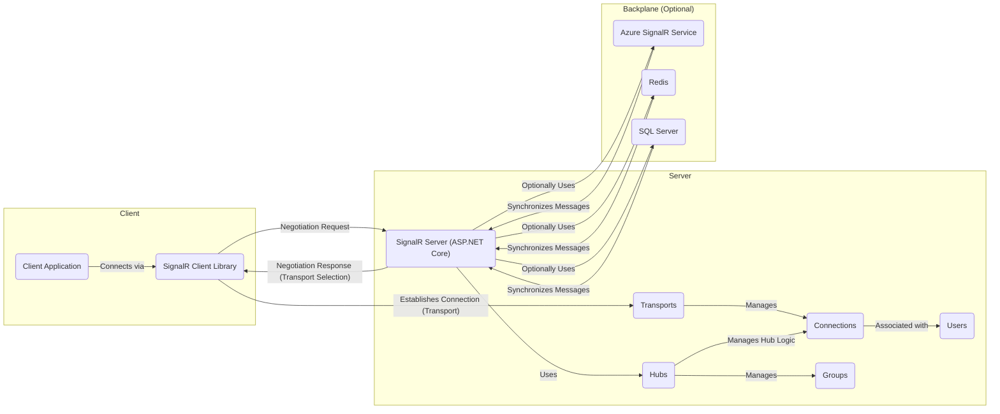

## Project Design Document: SignalR (Improved)

**1. Introduction**

This document provides a detailed architectural design of the SignalR project, focusing on aspects relevant for threat modeling. It outlines the key components, their interactions, data flow, and deployment considerations. This document serves as a foundation for subsequent security analysis and identification of potential vulnerabilities. This revision incorporates tables for improved readability and ensures all Mermaid diagram node names are quoted.

**2. Project Overview**

SignalR is an open-source library that simplifies adding real-time web functionality to applications. It enables server-side code to push content to connected clients instantly as it becomes available, rather than having clients continuously poll the server for updates. This is particularly useful for applications requiring high-frequency updates, such as social networks, online gaming, collaborative tools, and dashboards.

**3. Goals**

* Provide a clear and comprehensive architectural overview of SignalR.
* Identify key components and their responsibilities.
* Describe the communication flow between components.
* Outline different deployment models and their implications.
* Highlight security features and considerations within the architecture.
* Present information in a well-formatted and easily digestible manner.

**4. Target Audience**

This document is intended for:

* Security architects and engineers performing threat modeling.
* Developers working with or extending SignalR.
* Operations teams responsible for deploying and maintaining SignalR applications.

**5. System Architecture**

The core of SignalR revolves around enabling persistent connections between clients and servers. It abstracts away the complexities of different real-time transport mechanisms.

**5.1. Key Components:**

* **Hubs:** High-level constructs on the server that define the methods clients can call (server-to-client communication) and the methods the server can call on connected clients (client-to-server communication). Hubs act as the central point for managing connections and broadcasting messages.
* **Clients:** Applications (web browsers, mobile apps, desktop applications) that connect to the SignalR server. Clients use specific SignalR client libraries for their respective platforms (.NET, JavaScript, Java).
* **Transports:** The underlying mechanisms used to establish and maintain real-time connections. SignalR automatically negotiates the best available transport based on client and server capabilities.

    | Transport Type        | Description                                                                 | Directionality | Requirements                                  |
    | --------------------- | --------------------------------------------------------------------------- | -------------- | --------------------------------------------- |
    | WebSockets            | Provides a full-duplex communication channel over a single TCP connection. | Bidirectional  | Server and client support WebSockets.         |
    | Server-Sent Events (SSE) | A unidirectional transport where the server pushes data to the client.      | Server to Client | Server and client support SSE.                |
    | Long Polling          | Client makes a request, server holds it until data is available.           | Bidirectional  | Basic HTTP support.                           |
    | Forever Frame (deprecated) | An older technique using a hidden iframe.                                 | Bidirectional  | Browser support for iframes (generally phased out). |

* **Connection:** Represents an individual, persistent connection between a client and a SignalR Hub. Each connected client has a unique connection ID.
* **Groups:** A way to organize connections into named sets. This allows the server to send messages to specific subsets of connected clients.
* **Users:** Represents authenticated users. SignalR provides mechanisms to associate connections with authenticated users.
* **Backplane (Scaleout):** When deploying SignalR in a multi-server environment, a backplane is used to synchronize state and messages across the servers.

    | Backplane Option      | Description                                                                 | Dependencies                                  | Considerations                                  |
    | --------------------- | --------------------------------------------------------------------------- | --------------------------------------------- | --------------------------------------------- |
    | Azure SignalR Service | A fully managed Azure service for handling SignalR connections.             | Azure Subscription                            | Scalability, reliability, managed service.    |
    | Redis                 | An in-memory data structure store often used for caching and message brokering. | Redis server instance                         | Performance, in-memory storage, configuration. |
    | SQL Server            | A relational database that can be used as a backplane.                       | SQL Server instance                           | Persistence, potential performance overhead. |

* **Dependency Injection (DI) Container:** SignalR leverages dependency injection for managing its components and extensibility.

**5.2. Component Interactions:**

**5.3. Data Flow:**

* **Client Connection:**
    1. The "Client Application" uses the "SignalR Client Library" to initiate a connection to the "SignalR Server (ASP.NET Core)".
    2. The client sends a negotiation request to the server.
    3. The server responds with the available transports and selects the best one.
    4. The client and server establish a persistent connection using the chosen transport managed by "Transports".
* **Client to Server Message:**
    1. The "Client Application" calls a method on the Hub proxy provided by the "SignalR Client Library".
    2. The "SignalR Client Library" serializes the method call and its arguments.
    3. The serialized message is sent to the server over the established transport.
    4. The "SignalR Server (ASP.NET Core)" receives the message, deserializes it, and invokes the corresponding method on the "Hubs" instance.
* **Server to Client Message:**
    1. The server-side code (within a "Hubs" method or elsewhere) calls methods on the `Clients` property of the Hub context to send messages to specific clients, "Groups", or all connected clients.
    2. The "SignalR Server (ASP.NET Core)" serializes the message and sends it to the targeted clients over their respective "Connections".
    3. The "SignalR Client Library" on the receiving client deserializes the message and invokes the corresponding method registered on the client-side Hub proxy.
* **Scaleout (with Backplane):**
    1. When a server sends a message to clients, it publishes the message to the configured "Backplane (Optional)" (e.g., "Azure SignalR Service", "Redis").
    2. Other "SignalR Server (ASP.NET Core)" instances subscribed to the backplane receive the message.
    3. These server instances then deliver the message to the appropriate connected clients through their managed "Connections".

**6. Deployment Model**

SignalR can be deployed in various ways, each with its own security implications:

* **Single Server:** All clients connect to a single instance of the SignalR server. This is the simplest deployment but lacks high availability and scalability, making it a single point of failure.
* **Load Balanced Servers (without Backplane - *Not Recommended*):** Multiple SignalR server instances are behind a load balancer. This approach can lead to issues with sticky sessions and message delivery, as a client might connect to one server while a message intended for that client is routed to another. This configuration is generally **not recommended** for production environments due to potential inconsistencies and message loss.
* **Load Balanced Servers with Backplane:** Multiple SignalR server instances are behind a load balancer, and a backplane (Azure SignalR Service, Redis, SQL Server) is used to synchronize messages and connection information. This is the recommended approach for scalable and highly available SignalR deployments, ensuring consistent message delivery across instances.
* **Azure SignalR Service:** A fully managed Azure service that handles the complexities of managing SignalR connections, scaling, and reliability. This offloads the infrastructure management to Azure and provides built-in security features.

**7. Data Storage**

SignalR itself doesn't typically persist application-specific data. However, the chosen backplane might involve data storage:

* **Azure SignalR Service:** Manages connection state and message delivery internally. Specific storage details are managed by the Azure service.
* **Redis:** Stores connection information and messages in memory. Persistence can be configured, allowing data to be written to disk.
* **SQL Server:** Stores connection information and messages in a relational database, providing persistent storage.

Application-specific data that needs to be persisted would typically be handled by other components of the application (e.g., a database accessed by the server-side application logic).

**8. Security Considerations**

SignalR incorporates several security features, but proper configuration and implementation are crucial:

* **Authentication:** SignalR integrates with standard ASP.NET Core authentication mechanisms (e.g., cookies, JWT tokens) to identify and authenticate users. This ensures only authorized users can establish connections.
* **Authorization:** Hub methods can be decorated with authorization attributes (e.g., `[Authorize]`, `[Authorize(Roles = "Admin")]`) to restrict access based on user roles or policies. This prevents unauthorized actions.
* **Connection Management:** SignalR provides events for handling connection and disconnection (`OnConnectedAsync`, `OnDisconnectedAsync`), allowing for custom logic to be implemented (e.g., logging, cleanup, tracking online users). This can be used for security auditing and resource management.
* **Message Security:**
    * **Transport Layer Security (TLS/SSL):** Encryption of communication between clients and the server is **essential** and should be enforced. This protects data in transit from eavesdropping.
    * **Input Validation:** Server-side Hub methods **must** validate input received from clients to prevent injection attacks (e.g., SQL injection, command injection).
    * **Output Encoding:** When sending data to clients, proper encoding (e.g., HTML encoding, JavaScript encoding) should be used to prevent cross-site scripting (XSS) vulnerabilities.
* **Cross-Origin Resource Sharing (CORS):** CORS should be configured to explicitly allow only trusted domains to connect to the SignalR server. This prevents unauthorized cross-domain requests.
* **Cross-Site Request Forgery (CSRF) Prevention:** SignalR leverages ASP.NET Core's built-in CSRF protection mechanisms. Ensure anti-forgery tokens are correctly implemented in client-side code for non-browser clients.
* **Denial of Service (DoS) Mitigation:** Consider implementing rate limiting on the SignalR endpoint and potentially using a Web Application Firewall (WAF) to protect against DoS attacks.
* **Backplane Security:** The security of the chosen backplane is critical. Ensure proper authentication and authorization are configured for access to the backplane. Secure communication channels should be used between SignalR servers and the backplane.
* **Hub Method Accessibility:** Carefully consider the accessibility of Hub methods. Avoid exposing sensitive functionality through methods that can be called by any connected client.
* **Message Size Limits:** Implement and enforce message size limits to prevent resource exhaustion attacks.

**9. Threat Landscape**

Based on the architecture, potential threat categories include:

* **Authentication and Authorization Bypass:** Exploiting vulnerabilities to gain unauthorized access or perform actions without proper permissions.
* **Injection Attacks:** Injecting malicious code or data through Hub method parameters.
* **Cross-Site Scripting (XSS):** Injecting malicious scripts into messages that are then executed by other clients.
* **Cross-Site Request Forgery (CSRF):** Tricking authenticated users into performing unintended actions.
* **Denial of Service (DoS):** Overwhelming the server with connection requests or messages.
* **Man-in-the-Middle (MitM) Attacks:** Intercepting and potentially manipulating communication between clients and the server (mitigated by TLS).
* **Backplane Security Breaches:** Compromising the backplane, potentially leading to message manipulation or information disclosure.
* **Information Disclosure:** Exposing sensitive information through messages or connection metadata.

**10. Assumptions and Dependencies**

* The server-side application is built using ASP.NET Core.
* Clients utilize the appropriate SignalR client libraries.
* Secure communication (HTTPS) is used for production deployments.
* Proper authentication and authorization mechanisms are implemented in the application.
* The chosen backplane is configured and secured appropriately.

**11. Out of Scope**

This document does not cover:

* Detailed implementation specifics of individual Hub methods.
* Specific client-side implementation details beyond the use of the SignalR client library.
* Performance tuning and optimization strategies.
* Detailed configuration of the chosen backplane beyond its role in the architecture.
* Specific security configurations of the underlying infrastructure (e.g., operating system hardening).

**12. Glossary**

* **Hub:** A server-side class that defines methods clients can invoke and methods the server can invoke on clients.
* **Connection ID:** A unique identifier assigned to each connected client.
* **Group:** A named collection of connections.
* **Backplane:** A mechanism for synchronizing state and messages across multiple SignalR server instances.
* **Transport:** The underlying communication protocol used by SignalR (e.g., WebSockets, Server-Sent Events).
* **Negotiation:** The process where the client and server agree on the best available transport.

This improved document provides a more detailed and well-formatted architectural overview of SignalR, enhancing its utility for threat modeling and security analysis. The inclusion of tables and properly formatted Mermaid diagrams improves readability and understanding.
