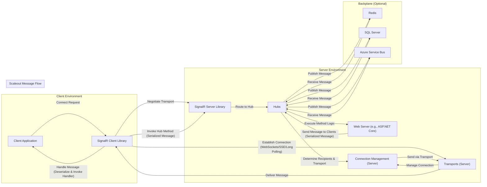

# Project Design Document: SignalR

**Version:** 1.1
**Date:** October 26, 2023
**Author:** AI Software Architect

## 1. Introduction

This document provides an enhanced architectural design overview of the SignalR project (as represented by the GitHub repository: [https://github.com/signalr/signalr](https://github.com/signalr/signalr)). This revised document is specifically tailored to facilitate thorough threat modeling. It details the key components, data flows, and technologies involved in SignalR, with a strong emphasis on identifying potential attack surfaces and security considerations.

## 2. Project Overview

SignalR is an open-source library enabling real-time, bidirectional communication between server and client. This allows server-side code to proactively push content to connected clients, eliminating the need for constant client-initiated requests for updates. SignalR intelligently negotiates and utilizes various transport protocols based on available capabilities, ensuring the most efficient and reliable connection possible.

## 3. Architectural Design

SignalR's architecture comprises distinct server-side and client-side elements that collaborate to establish and maintain persistent, real-time communication channels.

### 3.1. Server-Side Architecture

The server-side implementation of SignalR is typically integrated within a web application framework, such as ASP.NET Core, acting as a conduit for real-time interactions.

*   **Hubs:**
    *   Serve as high-level communication endpoints that clients connect to for real-time interaction.
    *   Define the contract for communication: specifying methods clients can invoke on the server and methods the server can invoke on connected clients.
    *   Manage client connections, grouping, and mechanisms for targeted message delivery (specific clients, groups, or all connected clients).
*   **Transports:**
    *   Underlying communication protocols responsible for the actual transmission of data between the server and clients.
    *   SignalR automatically negotiates the optimal transport based on client and server capabilities and network conditions.
    *   Key transports include:
        *   WebSockets: The preferred transport, providing a full-duplex communication channel over a single, long-lived TCP connection. Offers the lowest latency.
        *   Server-Sent Events (SSE): A unidirectional (server-to-client) transport over HTTP. Suitable when only server push is required.
        *   Long Polling: A fallback mechanism where clients make HTTP requests that the server holds open until data is available or a timeout occurs.
*   **Connection Management:**
    *   Responsible for the lifecycle management of client connections, encompassing establishment, maintenance (including handling disconnections and reconnections), and closure.
    *   Maintains a registry of connected clients and associated metadata, crucial for targeted messaging.
*   **Scaleout (Backplane):**
    *   Essential in multi-server deployments to ensure consistent message delivery and connection awareness across all server instances.
    *   Synchronizes messages and connection state, allowing a message sent from one server to reach clients connected to a different server.
    *   Common backplane implementations:
        *   Redis: A popular in-memory data store often used for its speed and pub/sub capabilities.
        *   SQL Server: A relational database that can be used for backplane functionality.
        *   Azure Service Bus: A cloud-based messaging service providing reliable message queuing and pub/sub.
*   **Dependency Injection:**
    *   SignalR leverages dependency injection for managing its internal components and enabling extensibility.
    *   Allows developers to customize or replace default implementations (e.g., custom authentication providers, message serializers).
*   **Authentication and Authorization:**
    *   Integrates with the host web application's authentication and authorization framework to secure SignalR endpoints.
    *   Enables control over who can connect to hubs and invoke specific methods, ensuring only authorized users can perform certain actions.
*   **Message Encoding:**
    *   Handles the serialization of outgoing messages and deserialization of incoming messages.
    *   JSON is the default encoding format, chosen for its interoperability and efficiency.

### 3.2. Client-Side Architecture

The client-side of SignalR is typically implemented as a JavaScript library for web browsers or a .NET client library for other application types, facilitating communication with the server.

*   **Client Proxy (Hub Connection):**
    *   Provides a high-level abstraction for connecting to server-side SignalR hubs.
    *   Manages the underlying transport connection and negotiation process.
    *   Offers methods for invoking server-side hub methods and registering handlers for server-initiated messages.
*   **Transports (Client-Side):**
    *   Implements the client-side logic for the various supported transport protocols (WebSockets, SSE, Long Polling).
    *   Participates in the transport negotiation process with the server to establish the connection.
*   **Message Handling:**
    *   Responsible for receiving messages pushed from the server.
    *   Deserializes received messages and invokes the appropriate client-side handlers that have been registered.
*   **Connection Management (Client-Side):**
    *   Manages the client's perspective of the connection lifecycle.
    *   Handles connection initiation, automatic reconnection attempts in case of disconnections, and explicit disconnection requests.

## 4. Data Flow

Understanding the flow of data is crucial for identifying potential points of interception or manipulation. A typical SignalR interaction follows these steps:

*   **Client Connection Initiation:**
    *   The client application starts the SignalR client library, initiating a connection to a specific hub endpoint on the server.
*   **Transport Negotiation:**
    *   The client and server engage in a negotiation process to determine the most suitable transport protocol to use for the connection.
*   **Connection Establishment:**
    *   A persistent connection is established using the agreed-upon transport (e.g., a WebSocket connection is opened).
*   **Client-to-Server Message Transmission:**
    *   The client invokes a method on the server-side hub through the client proxy.
    *   The message data is serialized (typically to JSON) and transmitted to the server over the established transport.
*   **Server-Side Message Processing:**
    *   The server receives the message, deserializes it, and routes it to the appropriate hub method for execution.
    *   The server-side code performs the requested action or logic.
*   **Server-to-Client Message Transmission:**
    *   The server-side code can invoke methods on connected clients through the hub context (e.g., sending a message to a specific user or a group).
    *   The message data is serialized and sent to the targeted client(s) over their respective connections.
*   **Client-Side Message Reception:**
    *   The client receives the message from the server.
    *   The message is deserialized, and the corresponding registered handler function on the client is invoked to process the received data.
*   **Scaleout Scenario Data Flow (if applicable):**
    *   When multiple server instances are involved, and a client connected to Server A needs to receive a message initiated by Server B:
        *   Server B publishes the message to the configured backplane (e.g., Redis).
        *   Server A, subscribed to the backplane, receives the message.
        *   Server A then delivers the message to the client connected to it.

## 5. Security Considerations for Threat Modeling

This section highlights key security considerations relevant for threat modeling SignalR applications, focusing on potential vulnerabilities and attack vectors.

*   **Authentication Vulnerabilities:**
    *   **Missing or Weak Authentication:** Failure to properly authenticate clients before establishing a SignalR connection allows unauthorized access.
    *   **Authentication Bypass:** Vulnerabilities in the authentication implementation could allow attackers to bypass authentication checks.
    *   **Credential Stuffing/Brute Force:**  If authentication is not rate-limited or protected against brute-force attacks, attackers may attempt to guess credentials.
*   **Authorization Vulnerabilities:**
    *   **Insufficient Authorization:**  Even with authentication, inadequate authorization checks on hub methods could allow users to perform actions they are not permitted to.
    *   **Authorization Bypass:** Flaws in the authorization logic could enable attackers to circumvent authorization controls.
*   **Input Validation and Injection Attacks:**
    *   **Lack of Input Validation:** Failure to validate data received from clients before processing it on the server can lead to various injection attacks (e.g., SQL injection if data is used in database queries, command injection if used in system commands).
    *   **Client-Side Input Manipulation:** Attackers can manipulate client-side code to send malicious data to the server.
*   **Transport Security (Encryption) Weaknesses:**
    *   **Unencrypted Communication (HTTP/WS):**  Using unencrypted protocols exposes communication to eavesdropping and man-in-the-middle attacks, allowing attackers to intercept sensitive data.
    *   **Downgrade Attacks:** Attackers might attempt to force the connection to use less secure transport protocols.
*   **Cross-Site Scripting (XSS):**
    *   **Reflected XSS:** If the server echoes unvalidated client input back to other clients through SignalR messages, it can lead to XSS vulnerabilities.
    *   **Stored XSS:** If malicious scripts are stored on the server (e.g., in a database) and then sent to clients via SignalR, it can result in stored XSS.
*   **Cross-Site Request Forgery (CSRF):**
    *   If proper CSRF protection mechanisms are not in place, attackers can potentially trick authenticated users into performing unintended actions through SignalR.
*   **Denial of Service (DoS) Attacks:**
    *   **Connection Flooding:** Attackers can overwhelm the server with a large number of connection requests, exhausting server resources.
    *   **Message Flooding:** Sending a high volume of messages can overload the server and potentially the backplane.
*   **Message Integrity Issues:**
    *   Although HTTPS provides encryption, if message tampering is a significant threat, additional mechanisms like message signing might be necessary.
*   **Backplane Security Weaknesses (if applicable):**
    *   **Unsecured Backplane Communication:** If the communication between server instances and the backplane is not secured (e.g., using TLS/SSL), it can be a point of vulnerability.
    *   **Weak Backplane Authentication:**  Compromised backplane credentials could allow attackers to eavesdrop or inject messages.
*   **Dependency Vulnerabilities:**
    *   Outdated SignalR libraries or dependencies with known security vulnerabilities can be exploited by attackers.
*   **Information Disclosure:**
    *   Error messages or debugging information exposed through SignalR messages could reveal sensitive information to attackers.

## 6. Deployment Scenario Security Implications

The deployment environment significantly impacts the security posture of a SignalR application.

*   **Single Server Deployment:**
    *   Simpler to secure as all components reside on a single machine.
    *   DoS attacks targeting the single server are a primary concern.
*   **Load-Balanced Deployment:**
    *   Requires careful configuration and securing of the backplane.
    *   Security of communication between load balancer and servers needs consideration.
    *   Ensuring consistent security configurations across all server instances is crucial.
*   **Cloud Deployments (e.g., Azure SignalR Service):**
    *   Offloads infrastructure security responsibilities to the cloud provider.
    *   Understanding and configuring the cloud service's security features (e.g., access control, network security) is essential.
    *   Reliance on the cloud provider's security posture.

## 7. Technology Stack

Understanding the underlying technologies helps identify technology-specific vulnerabilities.

*   **Server-Side:**
    *   .NET Framework or .NET (primarily ASP.NET Core): Potential vulnerabilities associated with the .NET runtime and framework.
    *   C#: Security considerations related to the programming language itself (e.g., memory safety).
*   **Client-Side:**
    *   JavaScript (for web browsers): Susceptible to client-side vulnerabilities like XSS.
    *   .NET (for other application types): Security considerations similar to server-side .NET.
*   **Transports:**
    *   WebSockets: Security depends on the underlying TLS/SSL implementation (WSS).
    *   Server-Sent Events (SSE): Relies on HTTP/HTTPS security.
    *   Long Polling: Inherits security characteristics of standard HTTP/HTTPS requests.
*   **Backplane (Optional):**
    *   Redis: Requires secure configuration and access controls.
    *   SQL Server: Requires proper database security measures.
    *   Azure Service Bus: Relies on Azure's security features.
*   **Message Encoding:**
    *   JSON (default): Potential vulnerabilities if deserialization is not handled carefully (e.g., JSON deserialization vulnerabilities).

## 8. Assumptions and Constraints

*   This document focuses on the general architectural principles of SignalR as represented by the core library. Specific application implementations may introduce additional complexities or security considerations.
*   The security considerations outlined are not exhaustive but represent common areas of concern for SignalR applications.
*   It is assumed that standard web application security best practices are also being followed in conjunction with SignalR-specific security measures.

This enhanced design document provides a more detailed and security-focused overview of SignalR's architecture, serving as a robust foundation for comprehensive threat modeling activities. By understanding the components, data flows, and potential vulnerabilities, security professionals can effectively identify and mitigate risks associated with SignalR deployments.