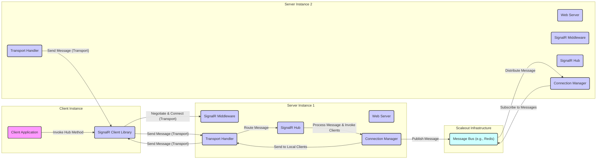

# Project Design Document: SignalR

**Version:** 1.1
**Date:** October 26, 2023
**Author:** AI Architecture Expert

## 1. Introduction

This document provides an enhanced and detailed design overview of the SignalR project, based on the codebase available at [https://github.com/signalr/signalr](https://github.com/signalr/signalr). The primary goal of this document is to offer a comprehensive understanding of SignalR's architecture, data flows, and security considerations, making it suitable for thorough threat modeling exercises.

## 2. Project Overview

SignalR is a robust open-source library designed to seamlessly integrate real-time web functionalities into applications. This capability allows server-side code to proactively push content to connected clients the moment it becomes available, eliminating the need for clients to repeatedly request updates.

Key features of SignalR include:

*   **Persistent, Bidirectional Connections:** Establishes and maintains long-lived, two-way communication channels between the server and clients.
*   **Server-Initiated Communication (Server Push):** Enables the server to initiate communication with clients without prior request.
*   **Intelligent Transport Negotiation:** Automatically selects the optimal transport protocol (WebSockets, Server-Sent Events, Long Polling) based on the capabilities of both the client and the server, ensuring the best possible real-time experience.
*   **Hubs API:** Provides a high-level abstraction that simplifies communication by allowing clients and servers to directly invoke methods on each other as if they were local.
*   **Group Management:** Facilitates broadcasting messages to specific subsets of connected clients, enabling targeted communication.
*   **Scalability through Backplanes:** Supports horizontal scaling of applications across multiple server instances using various backplane implementations.

## 3. Architectural Design

The SignalR architecture is logically divided into distinct client-side and server-side components, with optional supporting infrastructure for scaling the server component.

### 3.1. Client-Side Architecture

The client-side architecture comprises libraries that empower web browsers and other client applications to establish and maintain connections with a SignalR server.

*   **Client Libraries (SDKs):**
    *   JavaScript client (`@microsoft/signalr`): Primarily used within web browsers and Node.js environments.
    *   .NET client (`Microsoft.AspNetCore.SignalR.Client`): Designed for use in .NET applications (desktop, mobile, etc.).
    *   Java client (`com.microsoft.signalr`): Enables integration with Java-based applications.
*   **Automatic Transport Negotiation:** The client library intelligently handles the process of negotiating and managing the underlying transport protocol with the server.
    *   Prioritizes WebSockets for persistent, full-duplex communication.
    *   Falls back to Server-Sent Events (SSE) for unidirectional server-to-client push in environments where WebSockets are not available.
    *   Utilizes Long Polling as a last resort for simulating real-time behavior in older browsers or restricted network environments.
*   **Connection Lifecycle Management:**  Manages the entire lifecycle of the connection, including establishing the initial connection, handling disconnections and reconnections, and gracefully closing the connection.
*   **Hub Proxy Generation:**  Dynamically generates proxy objects that mirror the server-side Hub methods, allowing clients to invoke these methods with type safety (in some client libraries).
*   **Event Subscription and Handling:** Provides mechanisms for clients to subscribe to events broadcasted by the server and to define handlers for invoking client-side methods from the server.

### 3.2. Server-Side Architecture

The server-side of SignalR is typically integrated as middleware within a web application framework.

*   **SignalR Hubs:**
    *   Represent the core of the server-side logic, acting as endpoints for client communication.
    *   Defined as classes that inherit from the `Hub` base class (or a similar abstraction).
    *   Contain methods that can be directly invoked by connected clients.
    *   Provide methods for invoking methods on connected clients, groups, or all connected clients.
*   **Connection Manager:** A central component responsible for tracking and managing all active client connections to the server instance.
    *   Maintains a registry of connected clients and their associated connection IDs.
    *   Provides methods for retrieving and manipulating client connections.
*   **Transport Handlers:** Implement the specific logic for handling different transport protocols.
    *   Each transport handler is responsible for managing the underlying connection and message serialization/deserialization for its respective protocol.
    *   Abstracts the complexities of each transport from the rest of the SignalR pipeline.
*   **Message Bus (Backplane for Scaleout):** An optional but crucial component for scaling SignalR applications across multiple server instances.
    *   Enables servers to communicate with each other and synchronize state.
    *   Common implementations include:
        *   Redis: A popular in-memory data store often used for its speed and pub/sub capabilities.
        *   Azure Service Bus: A cloud-based messaging service providing reliable asynchronous message queuing.
        *   SQL Server: A relational database that can be used as a backplane, though typically less performant than dedicated messaging systems.
*   **Dependency Injection Integration:** SignalR is designed to seamlessly integrate with dependency injection frameworks, allowing for loose coupling and easy extensibility of its components.
*   **Authentication and Authorization Pipeline:** Provides a framework for securing SignalR endpoints and controlling access to Hub methods.
    *   Leverages the authentication and authorization mechanisms of the underlying web framework.
    *   Allows for custom authentication and authorization logic to be implemented.

### 3.3. Data Flow

The following diagram illustrates a typical message flow within a SignalR application, including a scaled-out scenario:

**Detailed Data Flow Steps:**

*   **Client Initiates Invocation:** The client application intends to trigger an action on the server and calls a method on the generated Hub proxy within the SignalR client library.
*   **Connection and Negotiation:** The client library ensures an active connection with the SignalR server. If a connection doesn't exist, it initiates the negotiation process to determine the optimal transport protocol.
*   **Message Transmission:** The client library serializes the method invocation details (Hub name, method name, arguments) and sends it to the server using the negotiated transport.
*   **Server-Side Routing:** The SignalR middleware on the server receives the message through the appropriate Transport Handler. The middleware then routes the message to the designated SignalR Hub based on the Hub name provided in the message.
*   **Hub Method Execution:** The SignalR Hub receives the message and invokes the corresponding method. This method contains the server-side business logic.
*   **Server Initiates Client Invocation (Optional):**  The server-side Hub method may, in turn, invoke methods on connected clients. It uses the Connection Manager to identify the target clients (individual clients, members of a group, or all connected clients).
*   **Message Delivery to Clients:** The Connection Manager instructs the appropriate Transport Handlers to send the message to the targeted clients.
*   **Scaleout Message Distribution (If Applicable):** In a scaled-out environment, when a server instance needs to send a message to clients connected to *other* server instances, it publishes the message to the configured Message Bus. Other server instances subscribe to this bus and their Connection Managers deliver the message to their locally connected clients.
*   **Client Receives and Processes:** The client-side SignalR library receives the message from the server through the established transport connection. It deserializes the message and invokes the corresponding client-side method or event handler.

## 4. Key Components and Interactions (Detailed)

*   **Client Application:** The end-user application (e.g., a web page, a mobile app) that utilizes the SignalR client library to establish real-time communication with the server.
*   **SignalR Client Library:** Provides the necessary API and logic for client applications to connect to, send messages to, and receive messages from a SignalR server. It handles transport negotiation, connection management, and message serialization/deserialization.
*   **Web Server:** The host process (e.g., an ASP.NET Core application running on IIS or Kestrel) that hosts the server-side SignalR components and handles incoming client requests.
*   **SignalR Middleware:**  Integrates into the web server's request processing pipeline. It intercepts requests destined for SignalR endpoints, manages connection handshakes, and routes incoming messages to the appropriate Hub.
*   **SignalR Hub:**  A developer-defined class on the server that serves as a communication endpoint. It defines methods that clients can invoke and provides methods for the server to invoke methods on connected clients. Hub instances are typically transient and created per connection or per request.
*   **Connection Manager:** A singleton component within each server instance responsible for maintaining a registry of active client connections for that specific instance. It provides methods for retrieving connection information and sending messages to specific connections or groups.
*   **Transport Handlers:** Concrete implementations responsible for managing the low-level details of different real-time communication protocols (WebSockets, Server-Sent Events, Long Polling). They handle the establishment, maintenance, and closing of connections, as well as message framing and parsing for their respective protocols.
*   **Message Bus (Scaleout Backplane):** An external system (e.g., Redis, Azure Service Bus) used to facilitate communication and state synchronization between multiple SignalR server instances in a scaled-out deployment. It enables messages sent from one server to reach clients connected to other servers.

## 5. Security Considerations (Enhanced)

Security is paramount in real-time applications. SignalR incorporates several features and requires careful consideration of security best practices.

*   **Authentication:**
    *   **Integration with Web Framework Authentication:** SignalR seamlessly integrates with the authentication mechanisms provided by the underlying web framework (e.g., ASP.NET Core Identity, JWT Bearer authentication).
    *   **Authentication Handshake:** Clients typically provide authentication credentials (e.g., access tokens) during the initial connection handshake. This can be done through query string parameters or custom headers.
    *   **Hub Method Authentication:** Individual Hub methods can be secured using authorization attributes (e.g., `[Authorize]`) to restrict access to authenticated users or users with specific roles or claims.
    *   **Example Threat:** Lack of proper authentication allows unauthorized users to connect and potentially invoke sensitive Hub methods or receive confidential data.
*   **Authorization:**
    *   **Role-Based and Policy-Based Authorization:** SignalR supports role-based and policy-based authorization, allowing fine-grained control over who can invoke specific Hub methods.
    *   **Custom Authorization Logic:** Developers can implement custom authorization logic within Hub methods or through authorization handlers to enforce specific business rules.
    *   **Connection Context:** The `HubCallerContext` provides access to information about the current client connection, including the authenticated user, allowing for context-aware authorization decisions.
    *   **Example Threat:** Insufficient authorization allows authenticated but unauthorized users to perform actions they shouldn't, such as accessing data or triggering operations they are not permitted to.
*   **Transport Security (HTTPS):**
    *   **Mandatory for Production:** Using HTTPS is crucial to encrypt all communication between the client and the server, protecting against eavesdropping and man-in-the-middle attacks. This is especially important for transmitting sensitive data like authentication tokens.
    *   **Example Threat:** Without HTTPS, communication is in plain text, allowing attackers to intercept sensitive information, including authentication credentials and message content.
*   **Input Validation:**
    *   **Server-Side Validation:** All input received from clients through Hub method invocations must be rigorously validated on the server-side to prevent injection attacks (e.g., SQL injection if data is used in database queries, script injection if data is rendered on other clients).
    *   **Example Threat:** Failure to validate input can lead to attackers injecting malicious code or commands that can compromise the server or other clients.
*   **Cross-Site Scripting (XSS) Prevention:**
    *   **Output Encoding:** When displaying data received from clients to other clients, proper encoding (e.g., HTML encoding) is essential to prevent XSS vulnerabilities. Avoid directly rendering raw client input.
    *   **Example Threat:**  An attacker could send a message containing malicious JavaScript code that, if not properly encoded, could be executed in the browsers of other connected clients.
*   **Cross-Site Request Forgery (CSRF) Prevention:**
    *   **Automatic Token Generation:** SignalR clients typically include an access token with each request, which helps mitigate CSRF attacks by ensuring that requests originate from the legitimate application.
    *   **Example Threat:** Without CSRF protection, an attacker could trick a logged-in user into making unintended requests to the SignalR server.
*   **Denial of Service (DoS) Protection:**
    *   **Rate Limiting:** Implement rate limiting on the server to prevent malicious clients from overwhelming the server with excessive requests.
    *   **Connection Limits:** Configure limits on the maximum number of concurrent connections to prevent resource exhaustion.
    *   **Message Size Limits:** Enforce limits on the size of messages to prevent excessively large messages from consuming excessive resources.
    *   **Example Threat:** An attacker could flood the server with connection requests or messages, making it unavailable to legitimate users.
*   **Message Bus Security (Scaleout):**
    *   **Secure Configuration:** When using a message bus for scaleout, ensure the message bus itself is properly secured with authentication and authorization to prevent unauthorized access and message tampering. Use secure communication protocols (e.g., TLS) for communication with the message bus.
    *   **Example Threat:** An unsecured message bus could allow attackers to eavesdrop on messages exchanged between server instances or inject malicious messages.

## 6. Deployment Scenarios (Detailed)

SignalR offers flexibility in deployment, catering to various application needs and scales.

*   **Single Server Deployment:**
    *   **Description:** The simplest deployment model where all clients connect to a single instance of the SignalR server.
    *   **Use Cases:** Suitable for low-traffic applications, development environments, or internal tools with a limited number of concurrent users.
    *   **Limitations:** Limited scalability and fault tolerance. If the server goes down, all connections are lost.
*   **Scaled-Out Deployment with Message Bus:**
    *   **Description:** Multiple instances of the SignalR server run behind a load balancer. A message bus (e.g., Redis, Azure Service Bus) is used as a backplane to synchronize messages between the server instances, ensuring that messages sent from one server reach clients connected to other servers.
    *   **Use Cases:** Ideal for high-traffic applications requiring scalability and resilience. Allows handling a large number of concurrent connections and provides fault tolerance as the failure of one server instance does not necessarily disrupt the entire application.
    *   **Considerations:** Requires configuring and managing the message bus infrastructure. Latency can be slightly higher compared to a single-server deployment due to message propagation through the backplane.
*   **Cloud-Based Managed Services (e.g., Azure SignalR Service):**
    *   **Description:** Leverages managed services like Azure SignalR Service, which offload the complexities of managing the SignalR infrastructure, including scaling, reliability, and security. The service handles connection management, message routing, and scaling automatically.
    *   **Use Cases:** Recommended for production applications requiring high availability, scalability, and simplified management. Reduces operational overhead and allows developers to focus on application logic.
    *   **Considerations:** Involves dependency on the cloud provider's service. Cost considerations based on usage. Security is largely managed by the cloud provider, but proper configuration within the service is still necessary.

## 7. Dependencies

The SignalR project relies on a set of dependencies for its functionality.

*   **.NET Runtime/SDK:**  Essential for building and executing the server-side components of SignalR. Specific versions may be required depending on the SignalR version being used.
*   **Web Framework (e.g., ASP.NET Core):** Provides the underlying web server and framework for hosting the SignalR server-side logic.
*   **JavaScript:**  Required for the client-side library used in web browsers and Node.js environments.
*   **Scaleout Backplane Libraries (Optional, depending on deployment):**
    *   Redis: `StackExchange.Redis` NuGet package for .NET.
    *   Azure Service Bus: `Azure.Messaging.ServiceBus` NuGet package for .NET.
    *   SQL Server: `Microsoft.Data.SqlClient` NuGet package for .NET.

## 8. Future Considerations

*   **Evolution of Real-Time Protocols:**  Potential adoption of newer or improved real-time communication protocols as they emerge and gain wider support.
*   **Enhanced Security Features:**  Continuous efforts to address evolving security threats and incorporate new security best practices into the library.
*   **Performance and Scalability Optimizations:** Ongoing improvements to enhance the performance and scalability of SignalR to handle increasingly demanding real-time workloads.
*   **Improved Diagnostics and Monitoring:** Enhancements to provide better insights into the health and performance of SignalR applications.

This improved design document provides a more in-depth understanding of the SignalR project, offering a solid foundation for conducting thorough threat modeling activities. The detailed explanations of architectural components, data flows, and security considerations will aid in identifying and mitigating potential vulnerabilities.