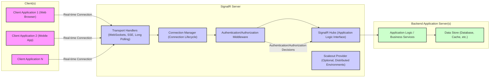

# Project Design Document: SignalR Real-time Communication Framework

**Version:** 1.1
**Date:** October 26, 2023
**Author:** AI Software Architect

## 1. Introduction

This document provides an enhanced design overview of the SignalR real-time communication framework, specifically tailored for threat modeling and security analysis. Building upon version 1.0, this iteration refines clarity, expands on security considerations, and ensures the document serves as a robust foundation for identifying and mitigating potential threats in systems leveraging SignalR.

SignalR empowers developers to integrate real-time web functionalities into applications, enabling server-initiated content pushes to connected clients without constant client-side polling. Its adaptability across various transport protocols ensures optimal communication based on environment constraints.

This document is grounded in the official SignalR documentation and the project's GitHub repository: [https://github.com/signalr/signalr](https://github.com/signalr/signalr). It aims to provide a security-focused lens on SignalR's architecture, components, and data flow.

## 2. Project Overview

**Project Name:** SignalR

**Project Goal:** To offer a versatile framework for real-time web application development, facilitating bidirectional communication between servers and clients efficiently and reliably.

**Key Features:**

*   **Bidirectional Real-time Communication:** Establishes persistent, two-way communication channels for instant data exchange.
*   **Transport Protocol Agnostic:** Dynamically selects and utilizes WebSockets, Server-Sent Events (SSE), or Long Polling based on client and server capabilities, ensuring broad compatibility.
*   **Hubs API (High-Level Abstraction):** Simplifies server-to-client and client-to-server interactions through a method-based API, abstracting away low-level transport details.
*   **Group Management:** Enables efficient message broadcasting to defined subsets of connected clients, optimizing resource utilization.
*   **Scalability and Reliability:** Designed for horizontal scaling in distributed environments and robust connection management.
*   **Platform Versatility:** Supports a wide range of client platforms, including web browsers, mobile operating systems, and desktop environments via dedicated client libraries.

**Target Audience:** Software developers and security professionals involved in building and securing real-time web applications, including:

*   Developers creating interactive user experiences (chat, collaboration tools).
*   Architects designing real-time data streaming and notification systems.
*   Security engineers performing threat assessments and penetration testing on SignalR-based applications.

## 3. Architecture Overview

SignalR employs a client-server model where a dedicated SignalR server acts as the central communication hub, mediating interactions between clients and backend application services.

### 3.1. High-Level Architecture Diagram



**Changes in Diagram:**

*   Added "Authentication/Authorization Middleware" component within the SignalR Server to explicitly highlight this crucial security aspect.
*   Clarified node names for better readability and context.

### 3.2. Component Description (Enhanced)

*   **Client Applications:** Applications initiating real-time communication with the SignalR server. They utilize SignalR client libraries (JavaScript, .NET, Java) and are the entry point for user interaction. Security considerations here include client-side vulnerabilities and secure storage of credentials if applicable.
*   **SignalR Server:** The central processing unit of SignalR, responsible for connection management, message routing, security enforcement, and interaction with backend services. Sub-components are:
    *   **Transport Handlers:** Manage the lifecycle of different transport protocols (WebSockets, SSE, Long Polling). They handle protocol negotiation, connection upgrades, and data serialization/deserialization. Security concerns include transport protocol vulnerabilities and secure configuration of transport options (e.g., enforcing WSS).
    *   **Connection Manager:** Tracks and manages active SignalR connections, assigning unique connection IDs and handling connection events (connect, disconnect, reconnect). Security aspects involve managing connection state securely and preventing unauthorized connection manipulation.
    *   **SignalR Hubs:** Server-side classes defining the application's real-time API. Hubs contain methods callable by clients and methods to invoke on clients. They are the primary interface for application logic to interact with SignalR. Security is paramount here, requiring robust input validation, authorization checks, and secure coding practices within Hub methods.
    *   **Authentication/Authorization Middleware:** Intercepts incoming connection requests and Hub method invocations to enforce authentication and authorization policies. This component is crucial for securing access to SignalR resources and ensuring only authorized users can perform specific actions. It can integrate with various authentication providers (JWT, OAuth 2.0, etc.).
    *   **Scaleout Provider (Optional):** In scaled-out deployments, this component (e.g., Redis, Azure Service Bus, SQL Server) synchronizes connection and message data across multiple SignalR server instances. Security considerations include securing the connection to the scaleout provider and protecting the data stored within it.
*   **Backend Application Server(s):** Host the core business logic and data services that SignalR applications rely on. SignalR Hubs often interact with these servers to fetch or update data and push real-time updates to clients. Security here involves securing backend APIs and data access.
*   **Data Store:** Persistent storage for application data. SignalR might also utilize a data store for scaleout state management. Security focuses on data encryption at rest and in transit, access control, and data integrity.

### 3.3. Communication Flow (Security Focused)

1.  **Client Connection Request (Potential Attack Vector):** A client initiates a connection. This is the first point of entry and a potential target for connection flooding or malicious connection attempts.
2.  **Transport Negotiation (Protocol Downgrade Risk):** Client and server negotiate the transport. While SignalR prioritizes WebSockets, fallback to less secure protocols like Long Polling might occur. Enforcing WSS and disabling fallback to HTTP-based transports in sensitive contexts is crucial.
3.  **Connection Establishment & Authentication (Authentication Bypass Vulnerability):** A persistent connection is established. Authentication middleware should verify client identity at this stage. Weak or missing authentication can lead to unauthorized access.
4.  **Message Exchange (Injection & Data Leakage Risks):**
    *   **Client to Server (Input Validation Needed):** Clients invoke Hub methods. Server-side input validation within Hub methods is critical to prevent injection attacks (XSS, command injection, SQL injection if Hubs interact with databases).
    *   **Server to Client (Output Encoding Needed):** Server invokes methods on clients. Output encoding is necessary to prevent XSS vulnerabilities when client applications render received data.
5.  **Message Routing & Authorization (Authorization Enforcement):** SignalR routes messages. Authorization checks must be performed before processing Hub method invocations and before sending data to clients to ensure users only access authorized resources and actions.
6.  **Connection Management & Session Security (Session Hijacking):** SignalR manages connection lifecycle. Secure session management is essential to prevent session hijacking and unauthorized access to existing connections.
7.  **Scaleout Synchronization (Scaleout Provider Security):** In scaled-out environments, message synchronization occurs via the scaleout provider. Secure communication and access control for the scaleout provider are vital to prevent data breaches and maintain system integrity.

## 4. Data Flow Diagram (Enhanced Security Perspective)

This diagram emphasizes data flow with security checkpoints and potential vulnerabilities highlighted.

```mermaid
graph LR
    subgraph "Client Application"
        A["Client App"]
    end

    subgraph "SignalR Server"
        B["Transport Connection (WSS/HTTPS Enforced?)"]
        C["Connection Handler (Rate Limiting?)"]
        D["Authentication Middleware (Identity Verification)"]
        E["Hub Dispatcher (Authorization Checks)"]
        F["Hub (Server-Side Logic & Input Validation)"]
        G["Scaleout Backplane (Secure Channel?)"]
    end

    subgraph "Backend Service"
        H["Backend API (Secure API?)"]
    end

    A -->|Connect Request| B
    B -->|Establish Connection| C
    C -->|Connection Metadata| D
    D -->|Authenticate Client| E
    E -->|Authorize Hub Method| F
    F -->|Process Message, Validate Input, Invoke Backend API (Optional)| H
    H -->|Data Response| F
    F -->|Send Message to Client(s), Encode Output| E
    E -->|Route to Connection(s)| C
    C -->|Send Message via Transport| B
    B -->|Message to Client App| A

    G -->|Sync Messages, Connection Info (Encrypted?) | C

    style A fill:#f9f,stroke:#333,stroke-width:2px
    style B fill:#ccf,stroke:#333,stroke-width:2px
    style C fill:#ccf,stroke:#333,stroke-width:2px
    style D fill:#ccf,stroke:#333,stroke-width:2px
    style E fill:#ccf,stroke:#333,stroke-width:2px
    style F fill:#ccf,stroke:#333,stroke-width:2px
    style G fill:#ccf,stroke:#333,stroke-width:2px
    style H fill:#cfc,stroke:#333,stroke-width:2px
```

**Data Flow Description (Security Enhancements):**

1.  **Connect Request:** Client attempts connection. **Security Checkpoint:** Transport layer security (WSS/HTTPS) should be enforced.
2.  **Establish Connection:** Transport connection established. **Security Checkpoint:** Connection Handler should implement rate limiting and connection limits to mitigate DoS attacks.
3.  **Authentication:** Authentication Middleware verifies client identity. **Security Checkpoint:** Robust authentication mechanism (JWT, OAuth 2.0, etc.) must be in place.
4.  **Authorization:** Hub Dispatcher performs authorization checks before routing to Hub methods. **Security Checkpoint:** Fine-grained authorization policies should control access to Hub methods and resources.
5.  **Process Message & Backend Interaction:** Hub method processes the message. **Security Checkpoints:**
    *   **Input Validation:**  Hub methods must rigorously validate all client inputs to prevent injection attacks.
    *   **Secure Backend API:** Interactions with backend APIs should be over secure channels with proper authentication and authorization.
6.  **Send Message to Client(s):** Hub method sends messages. **Security Checkpoint:** Output encoding should be applied to prevent XSS vulnerabilities on the client-side.
7.  **Scaleout Synchronization:** (Optional) Scaleout Backplane synchronizes data. **Security Checkpoint:** Communication channel to the scaleout provider should be encrypted, and access to the provider secured.

## 5. Technology Stack (Security Relevant Details)

*   **Server-side:**
    *   **Language:** C# (.NET) - Known for memory safety and strong type system, but still requires secure coding practices.
    *   **Framework:** ASP.NET Core (primarily), ASP.NET Framework (legacy) - ASP.NET Core offers built-in security features, but proper configuration is essential.
    *   **Transport Protocols:** WebSockets (WSS recommended), Server-Sent Events (HTTPS recommended), Long Polling (HTTPS recommended). **Security Recommendation:** Prioritize WSS and HTTPS and disable fallback to insecure transports where possible.
    *   **Scaleout Providers (Optional):** Redis (ensure secure configuration and access control), Azure Service Bus (managed security by Azure), SQL Server (secure database configuration). **Security Recommendation:** Choose providers with robust security features and configure them securely.
*   **Client-side:**
    *   **JavaScript Client:**  Primary client for web browsers. **Security Risk:** Client-side JavaScript is vulnerable to XSS. Output encoding and secure coding practices are crucial.
    *   **.NET Client, Java Client:**  For application development. **Security Consideration:** Secure storage of credentials and secure communication practices within these applications.
*   **Serialization:** JSON (primarily - text-based, potential XSS if not handled carefully), MessagePack (optional, binary - reduces XSS risk from serialization itself, but requires secure handling of deserialized data). **Security Consideration:** JSON requires careful output encoding. MessagePack can offer some XSS mitigation but doesn't eliminate all security concerns.

## 6. Security Considerations (Detailed and Categorized)

This section provides a more structured and detailed breakdown of security considerations, categorized for clarity.

**6.1. Authentication and Authorization:**

*   **Authentication Mechanisms:**
    *   **JWT (JSON Web Tokens):** Stateless, scalable, and widely adopted. Requires secure key management and validation.
    *   **Cookies/Session-based Authentication:** Stateful, simpler to implement for some scenarios. Requires protection against session hijacking and CSRF.
    *   **OAuth 2.0/OpenID Connect:** For delegated authorization and federated identity. Adds complexity but enhances security and user experience in many cases.
    *   **Windows Authentication/Kerberos (Intranet Scenarios):** Suitable for internal applications within a Windows domain.
*   **Authorization Enforcement:**
    *   **Role-Based Access Control (RBAC):** Assigning roles to users and defining permissions for each role.
    *   **Claim-Based Authorization:** Using claims (attributes about users) to make authorization decisions. More flexible than RBAC.
    *   **Policy-Based Authorization:** Defining granular authorization policies based on various factors (user attributes, resource attributes, context).
*   **Security Recommendations:**
    *   Implement robust authentication to verify client identity.
    *   Enforce authorization at the Hub level to control access to methods and data.
    *   Use HTTPS/WSS to protect credentials during transmission.
    *   Regularly review and update authentication and authorization policies.

**6.2. Transport Security:**

*   **Encryption:**
    *   **HTTPS/WSS (TLS/SSL):** Mandatory for encrypting communication, especially for sensitive data. Protects against eavesdropping and man-in-the-middle attacks.
    *   **Certificate Management:** Proper TLS/SSL certificate management is crucial. Use valid certificates from trusted CAs.
*   **Protocol Downgrade Prevention:**
    *   **Enforce WSS for WebSockets and HTTPS for SSE/Long Polling:** Prevent fallback to insecure HTTP/WS transports in security-sensitive applications.
    *   **HTTP Strict Transport Security (HSTS):** Configure HSTS headers to force browsers to always use HTTPS.
*   **Security Recommendations:**
    *   **Always use WSS for WebSockets and HTTPS for other transports in production.**
    *   **Implement HSTS.**
    *   **Regularly audit TLS/SSL configurations.**

**6.3. Input Validation and Output Encoding:**

*   **Input Validation (Server-Side):**
    *   **Validate all client inputs within Hub methods:** Prevent injection attacks (XSS, command injection, SQL injection).
    *   **Use whitelisting and sanitization techniques.**
    *   **Validate data types, formats, and ranges.**
*   **Output Encoding (Client-Side):**
    *   **Encode all data received from the server before rendering it in the client application:** Prevent XSS vulnerabilities.
    *   **Use context-aware encoding (e.g., HTML encoding, JavaScript encoding, URL encoding).**
*   **Security Recommendations:**
    *   **Implement comprehensive server-side input validation.**
    *   **Apply proper client-side output encoding.**
    *   **Educate developers on common injection vulnerabilities and secure coding practices.**

**6.4. Denial of Service (DoS) Prevention:**

*   **Rate Limiting:**
    *   **Limit the number of connection requests and messages per client within a given time frame.**
    *   **Implement rate limiting at the Connection Handler level.**
*   **Connection Limits:**
    *   **Set maximum concurrent connections per server instance.**
    *   **Implement connection limits at the Connection Manager level.**
*   **Message Size Limits:**
    *   **Restrict the maximum size of messages to prevent resource exhaustion.**
    *   **Enforce message size limits on both client and server sides.**
*   **Resource Management:**
    *   **Properly manage server resources (CPU, memory, network bandwidth).**
    *   **Implement connection timeouts and keep-alive mechanisms.**
*   **Security Recommendations:**
    *   **Implement rate limiting and connection limits.**
    *   **Set message size limits.**
    *   **Monitor server resource utilization and implement appropriate scaling strategies.**

**6.5. Cross-Site Request Forgery (CSRF) Protection:**

*   **Anti-CSRF Tokens:**
    *   **Use anti-CSRF tokens (synchronizer tokens) to protect against CSRF attacks, especially for HTTP-based transports (Long Polling, SSE).**
    *   **SignalR framework provides built-in CSRF protection mechanisms.**
*   **SameSite Cookie Attribute:**
    *   **Use the `SameSite` cookie attribute to mitigate CSRF risks.**
*   **Security Recommendations:**
    *   **Enable and properly configure SignalR's built-in CSRF protection.**
    *   **Use `SameSite` cookie attribute where appropriate.**

**6.6. Dependency Management and Updates:**

*   **Regularly Update SignalR Libraries:**
    *   **Keep SignalR server and client libraries up-to-date to patch known vulnerabilities.**
    *   **Monitor security advisories and release notes.**
*   **Secure Dependency Management:**
    *   **Use dependency scanning tools to identify vulnerabilities in third-party libraries.**
    *   **Implement a secure software supply chain process.**
*   **Security Recommendations:**
    *   **Establish a process for regularly updating SignalR and its dependencies.**
    *   **Use dependency scanning tools and secure dependency management practices.**

**6.7. Scaleout Security:**

*   **Secure Scaleout Provider Communication:**
    *   **Encrypt communication between SignalR servers and the scaleout provider.**
    *   **Use authentication and authorization to control access to the scaleout provider.**
*   **Scaleout Provider Access Control:**
    *   **Restrict access to the scaleout provider to only authorized SignalR server instances.**
    *   **Use strong authentication mechanisms for accessing the scaleout provider.**
*   **Data Security in Scaleout Provider:**
    *   **Consider encrypting sensitive data stored in the scaleout provider.**
*   **Security Recommendations:**
    *   **Secure the communication channel to the scaleout provider (e.g., TLS/SSL).**
    *   **Implement strong access control for the scaleout provider.**
    *   **Consider data encryption within the scaleout provider if sensitive data is stored.**

## 7. Deployment Considerations (Security Focused)

*   **Secure Deployment Environment:**
    *   **Harden the operating system and server infrastructure.**
    *   **Implement network segmentation to isolate SignalR servers.**
    *   **Use firewalls to restrict network access to SignalR servers.**
*   **Secure Configuration:**
    *   **Follow security best practices for configuring SignalR server and client applications.**
    *   **Disable unnecessary features and components.**
    *   **Securely store configuration data and secrets.**
*   **Load Balancing (Security Benefits):**
    *   **Use load balancers to distribute traffic and improve resilience against DoS attacks.**
    *   **Load balancers can also provide TLS termination and other security features.**
*   **Monitoring and Logging (Security Monitoring):**
    *   **Implement comprehensive monitoring and logging to detect security incidents and anomalies.**
    *   **Log authentication attempts, authorization failures, errors, and suspicious activities.**
    *   **Integrate logs with SIEM systems for security analysis and alerting.**
*   **Security Recommendations:**
    *   **Deploy SignalR in a hardened and segmented environment.**
    *   **Follow secure configuration practices.**
    *   **Utilize load balancers for security and scalability.**
    *   **Implement robust security monitoring and logging.**

## 8. Threat Modeling Focus

This design document is specifically created to facilitate threat modeling of SignalR-based applications. Key areas to focus on during threat modeling include:

*   **Trust Boundaries:** Identify trust boundaries between clients, SignalR server, backend services, and the scaleout provider.
*   **Data Flows:** Analyze data flows described in Section 4 and identify potential points of data interception, manipulation, or leakage.
*   **Entry Points:** Focus on client connection requests and Hub method invocations as primary entry points for potential attacks.
*   **Assets:** Identify critical assets protected by SignalR, such as user data, application logic, and backend systems.
*   **Threats:** Based on the security considerations in Section 6, identify potential threats such as:
    *   Authentication bypass
    *   Authorization failures
    *   Injection attacks (XSS, command injection)
    *   DoS attacks
    *   CSRF attacks
    *   Data breaches
    *   Session hijacking
    *   Scaleout provider vulnerabilities
*   **Vulnerabilities:** Analyze the architecture and technology stack for potential vulnerabilities that could be exploited by identified threats.
*   **Mitigations:** Design and implement security mitigations based on the security recommendations provided in this document and threat modeling outcomes.

This document provides a solid foundation for conducting a structured threat modeling exercise (e.g., using STRIDE methodology) to comprehensively assess and improve the security posture of SignalR-based applications.

## 9. Future Considerations

*   **Advanced Security Features:** Explore and integrate advanced security features such as:
    *   **Rate limiting per user/connection ID.**
    *   **Anomaly detection for message patterns.**
    *   **Integration with Web Application Firewalls (WAFs).**
*   **Protocol Buffers for Enhanced Security and Performance:** Further investigate Protocol Buffers or other binary serialization formats for potential security benefits (reduced XSS surface) and performance improvements.
*   **Zero Trust Architecture Integration:** Evaluate how SignalR can be integrated into a Zero Trust architecture model, emphasizing continuous verification and least privilege access.
*   **Formal Security Audits and Penetration Testing:** Conduct regular security audits and penetration testing to identify and address potential vulnerabilities in SignalR deployments.

This enhanced design document aims to provide a more comprehensive and security-focused view of the SignalR framework, serving as a valuable resource for threat modeling and security hardening of real-time applications.