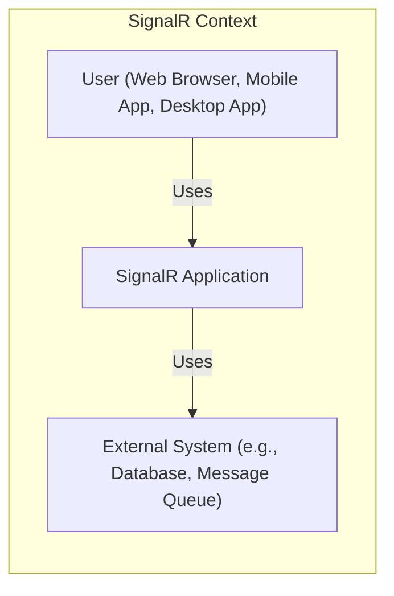
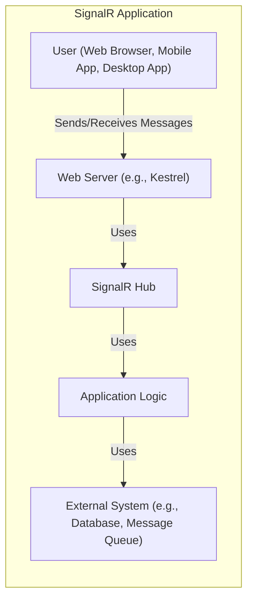
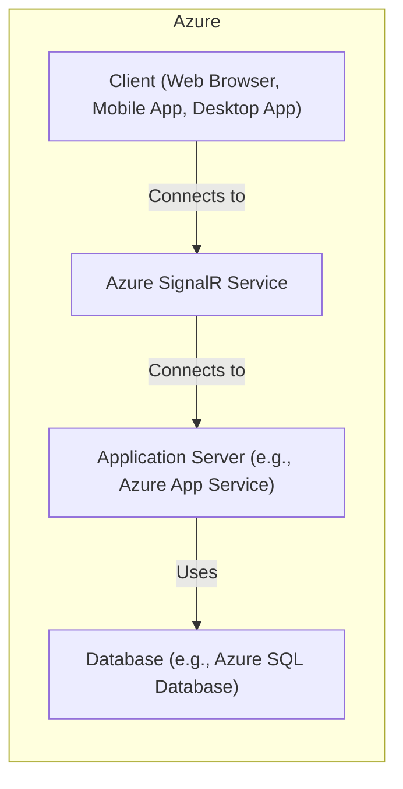
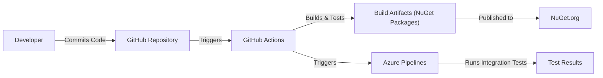

Okay, let's create a design document for the ASP.NET SignalR project, focusing on aspects relevant for threat modeling.

# BUSINESS POSTURE

SignalR is a library for ASP.NET developers that simplifies the process of adding real-time web functionality to applications. Real-time web functionality is the ability to have server code push content to connected clients instantly.  It's used in a wide variety of applications, from chat and social networking to gaming, business collaboration, and real-time data dashboards.

Priorities:

*   Ease of Use:  Make it simple for developers to add real-time functionality.
*   Performance:  Handle a large number of concurrent connections and messages efficiently.
*   Scalability:  Allow applications to scale out to handle increasing load.
*   Reliability:  Ensure messages are delivered reliably and connections are maintained.
*   Cross-Platform Compatibility: Support a wide range of clients (browsers, mobile apps, desktop apps).
*   Extensibility: Allow developers to customize and extend the functionality.

Goals:

*   Provide a robust and reliable real-time communication framework.
*   Reduce the complexity of building real-time web applications.
*   Enable developers to focus on application logic rather than low-level communication details.
*   Become a standard library for real-time .NET development.

Business Risks:

*   Service Degradation/Outage:  If SignalR fails, real-time functionality in dependent applications will be unavailable, potentially impacting user experience and business operations.  This is the most critical risk.
*   Data Breaches:  While SignalR itself doesn't store persistent data, it transmits data between clients and servers.  If the communication channel is compromised, sensitive data could be exposed.
*   Denial of Service (DoS):  Malicious actors could attempt to overwhelm SignalR servers with a flood of connections or messages, making the service unavailable to legitimate users.
*   Compatibility Issues:  Changes to SignalR could break existing applications, requiring costly updates and potentially causing downtime.
*   Reputation Damage:  Security vulnerabilities or performance issues could damage the reputation of SignalR and Microsoft.

# SECURITY POSTURE

Existing Security Controls:

*   security control: Transport Layer Security (TLS):  SignalR supports TLS to encrypt communication between clients and servers. Described in documentation and implementation.
*   security control: Cross-Origin Resource Sharing (CORS): SignalR supports CORS to control which origins can connect to the server. Described in documentation and implementation.
*   security control: Authentication and Authorization: SignalR integrates with ASP.NET Core's authentication and authorization mechanisms, allowing developers to control access to hubs and methods. Described in documentation and implementation.
*   security control: Input Validation: SignalR encourages developers to validate input from clients to prevent injection attacks. Described in documentation.
*   security control: Message Size Limits: SignalR allows configuring maximum message sizes to mitigate potential denial-of-service attacks. Described in documentation and implementation.
*   security control: Automatic Reconnection: SignalR clients automatically attempt to reconnect if the connection is lost, improving resilience. Described in documentation and implementation.
*   security control: Hub Protocol: SignalR uses well-defined protocols (e.g., JSON, MessagePack) for communication, reducing the risk of protocol-level vulnerabilities. Described in documentation and implementation.
*   security control: Dependency Management: The project uses package managers (e.g., NuGet) to manage dependencies and keep them up to date. Described in project files.
*   security control: Code Reviews: Code changes are reviewed by other developers before being merged. Described in GitHub pull request process.
*   security control: Static Analysis: The project likely uses static analysis tools to identify potential security vulnerabilities. Implied by Microsoft development practices.

Accepted Risks:

*   accepted risk: Third-Party Library Vulnerabilities: SignalR depends on third-party libraries, which may contain vulnerabilities. This risk is mitigated by regularly updating dependencies.
*   accepted risk: Misconfiguration: Developers may misconfigure SignalR, leading to security vulnerabilities. This risk is mitigated by providing clear documentation and best practices.
*   accepted risk: Client-Side Attacks: SignalR cannot prevent attacks that originate from compromised clients. This is a general risk with client-server applications.

Recommended Security Controls:

*   security control: Implement robust logging and monitoring to detect and respond to security incidents.
*   security control: Conduct regular penetration testing to identify vulnerabilities.
*   security control: Provide security training to developers using SignalR.
*   security control: Implement a Content Security Policy (CSP) to mitigate cross-site scripting (XSS) attacks.
*   security control: Consider implementing end-to-end encryption for highly sensitive data.

Security Requirements:

*   Authentication:
    *   SignalR should integrate with standard ASP.NET Core authentication mechanisms (e.g., cookies, JWT).
    *   Support for multiple authentication schemes should be provided.
    *   Authentication should be enforced for all connections and hub invocations unless explicitly disabled.

*   Authorization:
    *   SignalR should allow developers to define authorization policies for hubs and methods.
    *   Role-based access control (RBAC) should be supported.
    *   Fine-grained authorization (e.g., based on user attributes) should be possible.

*   Input Validation:
    *   All input from clients should be validated on the server.
    *   Validation should be based on a whitelist approach, specifying allowed values and formats.
    *   Developers should be provided with tools and guidance for input validation.

*   Cryptography:
    *   TLS should be used for all communication between clients and servers.
    *   Strong cryptographic algorithms and key lengths should be used.
    *   Consider end-to-end encryption for sensitive data, where SignalR acts as a transparent transport.

# DESIGN

## C4 CONTEXT

Element Descriptions:

*   Element:
    *   Name: User
    *   Type: Person
    *   Description: A user interacting with the SignalR application through a client (web browser, mobile app, desktop app).
    *   Responsibilities: Initiates connections, sends and receives messages.
    *   Security controls: Authentication and authorization mechanisms provided by the client application and potentially by SignalR (e.g., JWT validation).

*   Element:
    *   Name: SignalR Application
    *   Type: Software System
    *   Description: The application built using the SignalR library.
    *   Responsibilities: Handles real-time communication between clients and the server, manages connections, routes messages.
    *   Security controls: TLS, CORS, authentication, authorization, input validation, message size limits, hub protocol.

*   Element:
    *   Name: External System
    *   Type: Software System
    *   Description: An external system that the SignalR application interacts with (e.g., database, message queue).
    *   Responsibilities: Varies depending on the specific system.
    *   Security controls: Depends on the specific system; should include appropriate security measures.

## C4 CONTAINER

Element Descriptions:

*   Element:
    *   Name: User
    *   Type: Person
    *   Description: A user interacting with the SignalR application.
    *   Responsibilities: Initiates connections, sends and receives messages.
    *   Security controls: Authentication and authorization mechanisms provided by the client application.

*   Element:
    *   Name: Web Server
    *   Type: Container (Web Server)
    *   Description: The web server hosting the SignalR application (e.g., Kestrel).
    *   Responsibilities: Handles HTTP requests, manages connections, hosts the SignalR endpoint.
    *   Security controls: TLS, CORS, potentially web application firewall (WAF).

*   Element:
    *   Name: SignalR Hub
    *   Type: Container (Component)
    *   Description: The SignalR hub, which manages connections and message routing.
    *   Responsibilities: Handles client connections, dispatches messages to clients and server-side methods.
    *   Security controls: Authentication, authorization, input validation, message size limits.

*   Element:
    *   Name: Application Logic
    *   Type: Container (Component)
    *   Description: The application-specific logic that interacts with the SignalR hub.
    *   Responsibilities: Processes messages, interacts with external systems, performs business logic.
    *   Security controls: Input validation, business logic security checks.

*   Element:
    *   Name: External System
    *   Type: Software System
    *   Description: An external system that the application logic interacts with.
    *   Responsibilities: Varies depending on the specific system.
    *   Security controls: Depends on the specific system.

## DEPLOYMENT

Possible Deployment Solutions:

1.  Azure SignalR Service: A fully managed service that simplifies building and scaling real-time applications.
2.  Self-hosted on Azure VMs/Containers: Deploying the SignalR application on Azure Virtual Machines or containers.
3.  Self-hosted on-premises: Deploying the SignalR application on on-premises servers.
4.  Other cloud providers (AWS, GCP): Deploying on similar services or infrastructure on other cloud platforms.

Chosen Solution (for detailed description): Azure SignalR Service

Element Descriptions:

*   Element:
    *   Name: Client
    *   Type: Person/Software System
    *   Description: The client application connecting to the SignalR service.
    *   Responsibilities: Initiates connections, sends and receives messages.
    *   Security controls: Authentication and authorization mechanisms provided by the client application.

*   Element:
    *   Name: Azure SignalR Service
    *   Type: PaaS
    *   Description: The fully managed Azure SignalR Service.
    *   Responsibilities: Handles client connections, message routing, scaling, and high availability.
    *   Security controls: TLS, access keys, managed identities, network security rules, built-in monitoring and logging.

*   Element:
    *   Name: Application Server
    *   Type: PaaS/IaaS
    *   Description: The server hosting the application logic (e.g., Azure App Service, Azure VMs).
    *   Responsibilities: Processes messages, interacts with the database, performs business logic.
    *   Security controls: TLS, authentication, authorization, input validation, network security rules.

*   Element:
    *   Name: Database
    *   Type: PaaS/IaaS
    *   Description: The database used by the application (e.g., Azure SQL Database).
    *   Responsibilities: Stores and retrieves data.
    *   Security controls: Authentication, authorization, encryption at rest and in transit, firewall rules.

## BUILD

The SignalR project uses a combination of GitHub Actions and Azure Pipelines for its build and release process.

*   Developer commits code to the GitHub repository.
*   GitHub Actions are triggered by commits and pull requests.
*   GitHub Actions build the project, run unit tests, and create NuGet packages.
*   Static analysis tools (e.g., Roslyn analyzers, .NET analyzers) are used to identify potential code quality and security issues.
*   Dependency scanning tools are likely used to identify vulnerable dependencies.
*   NuGet packages are published to NuGet.org.
*   Azure Pipelines are triggered by successful builds.
*   Azure Pipelines run integration tests and other validation steps.
*   Test results are reported.

Security Controls:

*   security control: Code Reviews: All code changes are reviewed before merging.
*   security control: Static Analysis: Static analysis tools are used to identify potential vulnerabilities.
*   security control: Dependency Scanning: Dependency scanning tools are used to identify vulnerable dependencies.
*   security control: Automated Testing: Unit and integration tests are run automatically.
*   security control: Build Automation: The build process is fully automated, reducing the risk of manual errors.
*   security control: Signed Packages: NuGet packages are likely digitally signed to ensure their integrity.

# RISK ASSESSMENT

Critical Business Processes:

*   Real-time communication between clients and the server. This is the core functionality of SignalR and is critical for applications that rely on it.

Data Sensitivity:

*   SignalR itself doesn't store persistent data, but it transmits data between clients and servers. The sensitivity of this data depends on the specific application.
*   Data transmitted through SignalR could range from low sensitivity (e.g., public chat messages) to high sensitivity (e.g., financial transactions, personal health information).
*   Connection metadata (e.g., IP addresses, connection IDs) could be considered sensitive.

# QUESTIONS & ASSUMPTIONS

Questions:

*   What specific static analysis tools are used in the build process?
*   What dependency scanning tools are used?
*   Are there any specific security certifications or compliance requirements for SignalR?
*   What is the process for handling security vulnerabilities reported by external researchers?
*   What are the specific performance and scalability targets for SignalR?
*   Are there plans for supporting end-to-end encryption?
*   What is the logging and monitoring strategy for SignalR deployments?

Assumptions:

*   BUSINESS POSTURE: The primary business goal is to provide a reliable and easy-to-use real-time communication library.
*   SECURITY POSTURE: Microsoft's standard security practices are followed throughout the development lifecycle.
*   DESIGN: The Azure SignalR Service is the recommended deployment option for most scenarios. The build process uses industry-standard tools and practices.