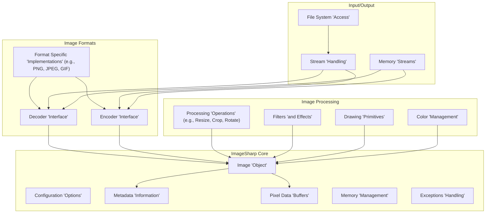
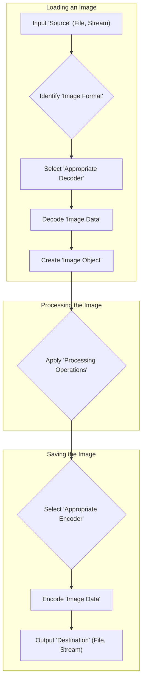

# Project Design Document: ImageSharp

**Version:** 1.1
**Date:** October 26, 2023
**Author:** AI Software Architect

## 1. Introduction

This document provides a detailed design overview of the ImageSharp library, an open-source, cross-platform 2D graphics library for .NET. This document aims to provide a comprehensive understanding of the library's architecture, components, and data flow, which will serve as the foundation for subsequent threat modeling activities. The information is based on the public repository: [https://github.com/SixLabors/ImageSharp](https://github.com/SixLabors/ImageSharp).

## 2. Goals and Objectives

The primary goals of ImageSharp are to provide:

*   A high-performance, cross-platform library for image manipulation.
*   Support for a wide range of image formats.
*   A flexible and extensible architecture for adding new features and formats.
*   A consistent and easy-to-use API.

This design document aims to capture the architectural elements relevant to security and potential vulnerabilities.

## 3. High-Level Architecture

ImageSharp's architecture is centered around the concept of an `Image` object, which represents an in-memory representation of an image. The library provides functionalities for loading, saving, and manipulating these `Image` objects.

**Key Architectural Components:**

*   **Image Object:** The central data structure representing an image in memory. It holds pixel data, metadata, and configuration information.
*   **Configuration:**  Provides options for controlling image processing behavior, such as memory management and parallel processing.
*   **Metadata:** Stores information about the image, such as EXIF data, ICC profiles, and other format-specific metadata.
*   **Pixel Data:**  The raw pixel data of the image, stored in various formats depending on the image type.
*   **Decoders:** Responsible for reading image data from a source (file, stream) and converting it into the internal `Image` representation.
*   **Encoders:** Responsible for converting the internal `Image` representation into a specific image format and writing it to a destination (file, stream).
*   **Processing Operations:**  A collection of algorithms for manipulating images, such as resizing, cropping, rotating, and applying filters.
*   **Drawing:**  Provides functionalities for drawing shapes, text, and other graphics onto an image.
*   **Color Management:** Handles color space conversions and color profile application.
*   **Input/Output:** Manages the interaction with external sources and destinations for image data.

## 4. Component Details

This section provides a more detailed look at some of the key components relevant to security considerations.

### 4.1. Image Decoders

*   **Purpose:** To interpret the byte stream of an image file and populate the `Image` object with pixel data and metadata.
*   **Functionality:**
    *   Parsing the image file header to identify the format and image properties.
    *   Decompressing compressed image data.
    *   Handling various encoding schemes within the format.
    *   Extracting metadata.
*   **Security Relevance:** Decoders are a critical point of entry for external data. Vulnerabilities in decoders can lead to:
    *   Denial of Service (DoS): Processing maliciously crafted images that consume excessive resources (memory, CPU).
    *   Remote Code Execution (RCE): Exploiting parsing vulnerabilities to execute arbitrary code.
    *   Information Disclosure: Exposing sensitive information through improper handling of metadata or pixel data.
*   **Examples:**
    *   PNG Decoder
    *   JPEG Decoder
    *   GIF Decoder
    *   BMP Decoder

### 4.2. Image Encoders

*   **Purpose:** To convert the internal `Image` representation into a specific image format for storage or transmission.
*   **Functionality:**
    *   Compressing pixel data according to the target format.
    *   Writing image headers and metadata.
    *   Formatting the output byte stream.
*   **Security Relevance:** While generally less prone to direct exploitation than decoders, vulnerabilities in encoders can lead to:
    *   Data Corruption: Generating malformed image files.
    *   Information Disclosure: Including unintended data in the output.
*   **Examples:**
    *   PNG Encoder
    *   JPEG Encoder
    *   GIF Encoder
    *   BMP Encoder

### 4.3. Processing Operations

*   **Purpose:** To modify the pixel data of an `Image` object.
*   **Functionality:**
    *   Pixel-level manipulations.
    *   Geometric transformations.
    *   Color adjustments.
    *   Filtering and effects.
*   **Security Relevance:** Processing operations, especially those dealing with user-provided parameters, can be vulnerable to:
    *   Integer Overflows/Underflows: Leading to buffer overflows or incorrect calculations.
    *   Out-of-Bounds Access: Accessing memory outside the allocated image buffer.
    *   DoS: Resource exhaustion through computationally intensive operations.
*   **Examples:**
    *   Resize
    *   Crop
    *   Rotate
    *   Gaussian Blur
    *   Color Adjustments

### 4.4. Input/Output Streams

*   **Purpose:** To handle the reading and writing of image data from various sources and destinations.
*   **Functionality:**
    *   Reading from files on the file system.
    *   Reading from and writing to memory streams.
    *   Potentially handling network streams (though less common in core ImageSharp).
*   **Security Relevance:** Improper handling of input streams can lead to:
    *   Path Traversal: Accessing files outside the intended directory.
    *   Denial of Service: Reading from excessively large or slow streams.
*   **Examples:**
    *   `FileStream`
    *   `MemoryStream`

### 4.5. Configuration Options

*   **Purpose:** To allow users to customize the behavior of ImageSharp.
*   **Functionality:**
    *   Setting memory limits.
    *   Controlling parallel processing.
    *   Specifying default encoders/decoders.
*   **Security Relevance:** Improperly configured options can introduce vulnerabilities:
    *   DoS: Setting excessively high memory limits can lead to memory exhaustion.
    *   Unexpected Behavior: Incorrectly configured decoders or encoders might lead to unexpected processing or output.

## 5. Data Flow

The typical data flow within ImageSharp involves the following steps:

**Detailed Data Flow:**

1. **Loading:**
    *   Image data is read from an input source (e.g., a file or a stream).
    *   The image format is identified (e.g., by file extension or magic numbers).
    *   The corresponding decoder for the identified format is selected.
    *   The decoder parses the input stream and populates the `Image` object with pixel data, metadata, and configuration.

2. **Processing:**
    *   Various processing operations are applied to the `Image` object. These operations manipulate the pixel data in memory.
    *   User-provided parameters influence the behavior of these operations.

3. **Saving:**
    *   An encoder is selected based on the desired output format.
    *   The encoder takes the `Image` object as input and converts it into the specified format.
    *   The encoded image data is written to an output destination (e.g., a file or a stream).

## 6. Security Considerations (Initial)

Based on the architecture and data flow, potential security considerations include:

*   **Vulnerabilities in Image Decoders:** The primary attack surface due to the need to parse potentially untrusted data.
*   **Integer Overflows/Underflows in Processing Operations:** Especially when handling user-provided dimensions or parameters.
*   **Out-of-Bounds Memory Access:** During decoding or processing, if buffer sizes are not handled correctly.
*   **Denial of Service:** Through maliciously crafted images that consume excessive resources during decoding or processing.
*   **Path Traversal:** If file paths are constructed from user input without proper sanitization.
*   **Information Disclosure:** Through improper handling of metadata or pixel data during encoding or processing.
*   **Memory Exhaustion:** If memory limits are not properly enforced or if processing large or malformed images.

We can categorize these considerations as follows:

*   **Input Validation:**
    *   Malformed image headers leading to parsing errors.
    *   Unexpected or excessively large metadata.
    *   Image dimensions exceeding reasonable limits.
*   **Memory Safety:**
    *   Buffer overflows in decoders or processing operations.
    *   Integer overflows leading to incorrect memory allocation.
    *   Use-after-free vulnerabilities (less likely in managed code but possible in native interop).
*   **Resource Management:**
    *   CPU exhaustion due to complex decoding or processing algorithms.
    *   Memory exhaustion due to large image sizes or excessive allocations.
    *   File system exhaustion (e.g., creating many temporary files).
*   **Path Security:**
    *   Path traversal vulnerabilities when loading or saving files.

## 7. Assumptions and Constraints

*   It is assumed that the library will be used in environments where it may process images from untrusted sources.
*   The library relies on the underlying operating system and .NET framework for certain functionalities (e.g., file system access).
*   Performance is a key consideration, which might influence security design choices.

## 8. Future Considerations

*   Further modularization of decoders and encoders to improve maintainability and security.
*   Implementation of more robust input validation and sanitization.
*   Consideration of sandboxing or isolation techniques for processing untrusted images.
*   Regular security audits and penetration testing.
*   Adoption of secure coding practices and static analysis tools.

This document provides a foundational understanding of the ImageSharp library's design. This information will be crucial for conducting a thorough threat model to identify and mitigate potential security vulnerabilities.
