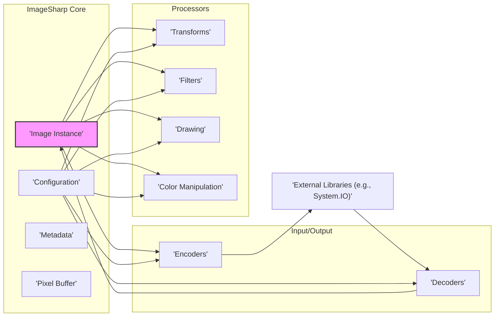

# Project Design Document: ImageSharp

**Version:** 1.1
**Date:** October 26, 2023
**Author:** AI Software Architect

## 1. Introduction

This document provides a detailed architectural design for the ImageSharp library, an open-source .NET library dedicated to the processing of image files. It aims to offer a comprehensive understanding of the library's structure, its constituent components, and the flow of data within it. This understanding is crucial and will serve as the foundational basis for subsequent threat modeling activities.

## 2. Goals and Objectives

The primary goals underpinning the design of ImageSharp are:

*   To deliver a cross-platform, high-performance image processing library tailored for the .NET ecosystem.
*   To offer comprehensive support for a broad spectrum of image file formats.
*   To provide a fluent and intuitively designed API that simplifies image manipulation tasks.
*   To prioritize memory efficiency and overall performance optimization.
*   To facilitate easy extensibility, enabling the integration of new image formats and processing operations.

The central objective of this design document is to clearly and concisely articulate the architectural blueprint of ImageSharp. This clarity is essential to facilitate thorough understanding and in-depth analysis, with a particular emphasis on security considerations.

## 3. High-Level Architecture

ImageSharp is built upon a modular architecture, a design choice that promotes both extensibility and ease of maintenance. At the heart of the library is the `Image` class, which serves as the in-memory representation of an image. Operations are performed on instances of this `Image` class through a variety of specialized processors and encoders/decoders.



**Key Architectural Components:**

*   **Image Instance:** This is the core class, acting as the central representation of an image within the library's memory. It encapsulates the image's pixel data, associated metadata, and relevant configuration settings.
*   **Configuration:** This component is responsible for managing global settings and format-specific options that govern the behavior of encoding and decoding processes.
*   **Metadata:** This component stores supplementary information about the image, including details such as EXIF data, embedded ICC profiles, and other relevant properties.
*   **Pixel Buffer:** This represents the underlying storage mechanism for the raw pixel data of the image.
*   **Decoders:** These components are tasked with the responsibility of reading image data from various file formats (e.g., JPEG, PNG, GIF) and populating the `Image` instance with this data.
*   **Encoders:** These components handle the reverse process, taking an `Image` instance and writing its data out into a specific image file format.
*   **Processors:** These are specialized modules designed to perform various operations on the `Image` instance, such as resizing, cropping, applying visual filters, and drawing graphical elements.
*   **External Libraries:** ImageSharp leverages standard .NET libraries, such as `System.IO`, for fundamental operations like file system access.

## 4. Component Details

This section delves deeper into the essential components that constitute ImageSharp, providing a more granular understanding of their roles and functionalities.

### 4.1. Image Instance

*   **Core Responsibilities:**
    *   To hold the raw pixel data that constitutes the image.
    *   To manage all metadata associated with the image.
    *   To provide controlled access to the pixel data for processing operations.
    *   To store configuration settings that are specific to the image.
*   **Key Attributes:**
    *   `Width`: An integer value representing the width of the image in pixels.
    *   `Height`: An integer value representing the height of the image in pixels.
    *   `PixelType`: An enumeration that defines the format of the image's pixels (e.g., Rgba32, Gray8).
    *   `Metadata`: A collection of key-value pairs representing the image's metadata.
    *   `Frames`: A collection of individual image frames, particularly relevant for animated image formats.

### 4.2. Configuration

*   **Core Responsibilities:**
    *   To store and manage global configuration settings for the ImageSharp library.
    *   To maintain a registry of available decoders and encoders, making them accessible to the library.
    *   To provide options for fine-tuning the behavior of encoding and decoding processes.
    *   To manage strategies for memory allocation within the library.
*   **Key Aspects:**
    *   A robust mechanism for registering and discovering decoders and encoders.
    *   Support for format-specific options, such as JPEG quality settings or PNG compression levels.
    *   Settings related to memory management and optimization.

### 4.3. Decoders

*   **Core Responsibilities:**
    *   To read raw image data from an input stream or file.
    *   To parse the structural elements of a specific image format.
    *   To decode the raw pixel data into a usable, in-memory representation.
    *   To populate a new `Image` instance with the decoded pixel data and any associated metadata.
*   **Examples of Concrete Implementations:**
    *   `JpegDecoder`
    *   `PngDecoder`
    *   `GifDecoder`
    *   `BmpDecoder`
*   **Typical Process Flow:**
    1. Receive an input stream containing the image data.
    2. Identify the specific image format of the data.
    3. Parse the file header and extract relevant metadata.
    4. Decode the compressed or raw pixel data.
    5. Create a new `Image` instance and populate it with the decoded data.

### 4.4. Encoders

*   **Core Responsibilities:**
    *   To accept an `Image` instance as input.
    *   To encode the image's pixel data into a specific target image format.
    *   To write the encoded data to an output stream or file.
    *   To include relevant metadata within the output image file.
*   **Examples of Concrete Implementations:**
    *   `JpegEncoder`
    *   `PngEncoder`
    *   `GifEncoder`
    *   `BmpEncoder`
*   **Typical Process Flow:**
    1. Receive an `Image` instance containing the image to be saved.
    2. Retrieve encoding options from the global configuration or format-specific settings.
    3. Encode the image's pixel data according to the chosen format.
    4. Write the encoded pixel data and metadata to the designated output stream.

### 4.5. Processors

*   **Core Responsibilities:**
    *   To perform a wide range of transformations and manipulations on an `Image` instance.
    *   To directly operate on the image's pixel data to achieve the desired effect.
    *   To potentially modify the image's properties, such as its metadata.
*   **Categorization of Processors:**
    *   **Transforms:** Processors that alter the spatial characteristics of the image (e.g., Resize, Crop, Rotate, Flip).
    *   **Filters:** Processors that apply visual effects to the image (e.g., Blur, Sharpen, Edge Detection).
    *   **Drawing:** Processors that allow for the addition of graphical elements to the image (e.g., drawing shapes, text, or other images).
    *   **Color Manipulation:** Processors that adjust the color properties of the image (e.g., adjusting brightness, contrast, hue, and saturation).
*   **Typical Process Flow:**
    1. Receive an `Image` instance as the target of the operation.
    2. Access and modify the image's pixel data according to the specific processing logic.
    3. Update the `Image` instance to reflect the applied changes.

## 5. Data Flow

The typical flow of data within ImageSharp involves a sequence of steps: first, an image is read into the system; then, it undergoes processing; and finally, the processed image is written back out.

```mermaid
graph LR
    subgraph "Image Loading"
        A["'Input Stream'"] --> B("'Decoder Selection'")
        B --> C("'Decoder'")
        C --> D("'Image Instance Creation'")
    end

    subgraph "Image Processing"
        D --> E("'Processor Invocation'")
        E --> F("'Pixel Data Manipulation'")
        F --> D
    end

    subgraph "Image Saving"
        D --> G("'Encoder Selection'")
        G --> H("'Encoder'")
        H --> I("'Output Stream'"]
    end

    style A fill:#ccf,stroke:#333,stroke-width:2px
    style I fill:#ccf,stroke:#333,stroke-width:2px
```

**Detailed Breakdown of Data Flow:**

1. **Image Loading Phase:**
    *   An `Input Stream` containing the raw image data is provided to the library.
    *   ImageSharp analyzes the stream's content or relies on provided hints to determine the specific image format.
    *   Based on the identified format, the appropriate `Decoder` component is selected.
    *   The chosen `Decoder` reads the data from the input stream, parses the image structure, and decodes the raw pixel information.
    *   A new `Image Instance` is created in memory and populated with the decoded pixel data, along with any extracted metadata.

2. **Image Processing Phase:**
    *   Various processing operations are applied to the `Image Instance` by invoking specific `Processor` components.
    *   `Processors` directly access and manipulate the pixel data stored within the `Image Instance`.
    *   Multiple `Processors` can be chained together sequentially to perform complex sequences of image manipulations.

3. **Image Saving Phase:**
    *   An `Output Stream` is provided, indicating where the processed image should be written.
    *   The desired output image format is specified by the user or determined by the application.
    *   The corresponding `Encoder` component for the specified output format is selected.
    *   The `Encoder` takes the `Image Instance` as input and encodes its pixel data into the target format.
    *   The encoded image data is then written to the designated `Output Stream`.

## 6. Security Considerations

This section highlights potential security considerations relevant to ImageSharp. These points will serve as crucial inputs for subsequent, more detailed threat modeling exercises.

*   **Risks Associated with Malicious Image Files:**
    *   **Decoder Vulnerabilities:** A significant threat lies in the potential for vulnerabilities within the `Decoder` components. Attackers could exploit these weaknesses by crafting malicious image files with malformed headers, invalid internal data structures, or excessively large dimensions. Successful exploitation could lead to application crashes, memory corruption, or even the execution of arbitrary code.
    *   **Denial of Service (DoS):** Carefully crafted image files can be designed to consume excessive computational resources (CPU time, memory) during the decoding process. This can lead to a denial of service, causing the application to slow down significantly or crash entirely. Examples include images with extremely high resolutions or unusually complex internal structures.
*   **Security Concerns During Image Processing:**
    *   **Integer Overflows:** Vulnerabilities may exist within the processing logic where calculations related to buffer sizes or pixel offsets could result in integer overflows. This could potentially lead to buffer overflow vulnerabilities, where data is written beyond the allocated memory region.
    *   **Resource Exhaustion:** Certain image processing operations, particularly complex filters or intricate drawing operations, can be computationally intensive. If not handled carefully, these operations could consume excessive resources, leading to a denial-of-service condition.
*   **Vulnerabilities Related to Metadata Handling:**
    *   **Information Leakage:** Image metadata can contain sensitive information (e.g., GPS coordinates embedded in EXIF data, camera serial numbers). If not handled with appropriate care, this information could be inadvertently exposed, leading to privacy violations.
    *   **Metadata Injection:** There is a potential risk of attackers injecting malicious scripts or other harmful data into metadata fields. If the application consuming the processed image does not properly sanitize or handle this metadata, it could lead to security issues.
*   **Security Implications of Dependencies:**
    *   ImageSharp relies on the underlying .NET framework and potentially other third-party libraries. Vulnerabilities present in these dependencies could indirectly affect the security of ImageSharp. It is crucial to keep these dependencies updated.
*   **Configuration-Related Security Risks:**
    *   Insecure default configuration settings could potentially expose vulnerabilities. For example, overly permissive settings related to memory allocation or resource usage could be exploited.
*   **File System Access Security:**
    *   When loading or saving images from or to the file system, standard file access security considerations are paramount. Failure to properly sanitize user-provided file paths could lead to path traversal vulnerabilities, allowing attackers to access or modify arbitrary files on the system.
*   **Memory Management Vulnerabilities:**
    *   Improper memory management practices within ImageSharp could lead to memory leaks, where allocated memory is not properly released, or use-after-free vulnerabilities, where the application attempts to access memory that has already been freed.

## 7. Deployment Considerations

ImageSharp is typically deployed as a library integrated within a larger .NET application. Security considerations during deployment include:

*   **Adherence to Secure Development Practices:** The application that utilizes ImageSharp must be developed following secure coding practices to prevent vulnerabilities that could be exploited through image processing functionalities.
*   **Robust Input Validation:** It is crucial to validate the source and type of image files before processing them. This helps to mitigate the risk of processing malicious or unexpected file types.
*   **Implementation of Resource Limits:** To prevent denial-of-service attacks, it is advisable to implement resource limits (e.g., maximum memory usage, CPU time allocation) for image processing operations.
*   **Consideration of Sandboxing:** In scenarios where untrusted image files are processed, consider running the image processing operations within a sandboxed environment. This limits the potential impact of any vulnerabilities that might be exploited.
*   **Importance of Regular Updates:** Keeping ImageSharp and all its dependencies updated is essential to patch known security vulnerabilities and ensure the application benefits from the latest security improvements.

## 8. Future Enhancements

Potential future enhancements to ImageSharp that could have implications for its architecture and security include:

*   **Expansion of Supported Image Formats:** Adding support for new and emerging image formats will necessitate the development of new `Decoder` and `Encoder` components. It is critical that these new components are developed with security best practices in mind to avoid introducing new vulnerabilities.
*   **Incorporation of Advanced Processing Algorithms:** The integration of more complex image processing algorithms could introduce new avenues for resource exhaustion or algorithmic vulnerabilities. Careful design and testing will be required.
*   **Direct Integration with Cloud Services:** If ImageSharp is extended to directly integrate with cloud storage or processing services, new security considerations related to authentication, authorization, and data transmission will need to be addressed.

This document provides a detailed and comprehensive overview of the ImageSharp architecture. The information contained within this document is intended to be a valuable resource for conducting thorough threat modeling activities, enabling the identification and mitigation of potential security risks associated with the library.