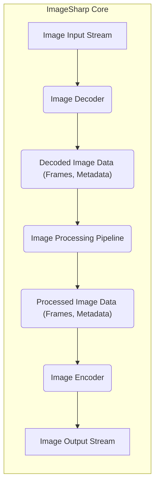
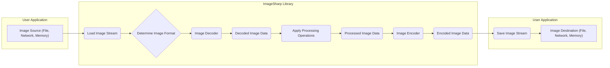

# Project Design Document: ImageSharp

**Version:** 1.1
**Date:** October 26, 2023
**Author:** AI Software Architect

## 1. Introduction

This document provides a detailed design overview of the ImageSharp library, an open-source .NET library for processing of image files. This document aims to provide a comprehensive understanding of the library's architecture, components, and data flow, with a specific focus on aspects relevant to security and potential vulnerabilities, which will be crucial for subsequent threat modeling activities.

## 2. Goals and Objectives

The primary goals of ImageSharp are:

*   Provide a cross-platform, high-performance image processing library for .NET.
*   Support a wide range of image formats, both common and less prevalent.
*   Offer a fluent and intuitive API for image manipulation, enhancing developer productivity.
*   Be extensible and allow for the development and integration of custom image formats and processing operations.
*   Maintain a strong focus on memory efficiency and performance to handle large images effectively.
*   Prioritize secure image processing by mitigating potential vulnerabilities related to malformed input and resource exhaustion.

## 3. High-Level Design

ImageSharp employs a pipeline processing model where image data flows through distinct stages: input, decoding, processing, encoding, and output. This modular design allows for flexibility and extensibility. The core components involved in this process and their interactions are illustrated below:

Key aspects of the high-level design:

*   **Decoders:**  Responsible for interpreting the raw byte stream of an image file and converting it into ImageSharp's internal representation. Each supported format has a dedicated decoder.
*   **Decoded Image Data:** This represents the image in memory after decoding, including pixel data for each frame, color profiles, and metadata extracted from the image file.
*   **Processing Pipeline:** A sequence of operations applied to the decoded image data. These operations can range from simple transformations like resizing and cropping to more complex adjustments like color manipulation and filtering.
*   **Encoders:**  The inverse of decoders, responsible for taking ImageSharp's internal representation of an image and converting it into the byte stream of a specific image format for saving or transmission.
*   **Streams:**  Image data is primarily handled through `Stream` objects for both input and output, enabling efficient processing of large images without loading the entire file into memory at once.

## 4. Detailed Design

This section provides a more granular view of the key components and their interactions within ImageSharp, highlighting aspects relevant to security.

### 4.1. Image Input and Decoding

*   **Input Streams:** ImageSharp accepts image data via implementations of the `System.IO.Stream` class. This allows for flexibility in sourcing image data from various locations, including files, network connections, and memory buffers.
*   **Image Decoders:**
    *   Each supported image format (e.g., JPEG, PNG, GIF, BMP, TIFF) has a corresponding decoder class (e.g., `JpegDecoder`, `PngDecoder`, `GifDecoder`).
    *   Decoders are responsible for:
        *   **Format Identification:** Determining the image format, often by inspecting the "magic number" at the beginning of the stream.
        *   **Header Parsing:** Reading and interpreting the image file header to extract essential information like image dimensions, color depth, and compression methods. This is a critical area for potential vulnerabilities if not handled robustly.
        *   **Data Decompression:**  Decompressing the image pixel data according to the format's specifications. Vulnerabilities can arise from flaws in decompression algorithms.
        *   **Metadata Extraction:** Extracting metadata embedded within the image file (e.g., EXIF, IPTC, XMP). Care must be taken to sanitize or avoid processing potentially malicious metadata.
        *   **Frame Construction:** Creating the internal representation of image frames, especially important for animated formats.
    *   **Decoder Selection:** ImageSharp typically attempts to automatically select the appropriate decoder based on the input stream. Users can also explicitly specify the decoder.
    *   **Configuration Options:** Decoders may offer configuration options to control decoding behavior, such as enabling strict validation or ignoring certain types of metadata.
*   **Potential Vulnerabilities:**
    *   **Malformed Header Exploits:**  Vulnerabilities in header parsing logic could lead to buffer overflows, out-of-bounds reads, or denial-of-service.
    *   **Decompression Bombs:**  Crafted images that decompress to an extremely large size, leading to memory exhaustion.
    *   **Integer Overflows:**  Errors in calculations related to image dimensions or data sizes during decoding.
    *   **Infinite Loops:**  Maliciously crafted headers that cause the decoder to enter an infinite loop.

### 4.2. Decoded Image Data

*   **Internal Representation:** ImageSharp uses a consistent internal representation for image data, encapsulated within the `Image<TPixel>` class. This representation includes:
    *   **Pixel Buffers:**  Arrays or memory structures holding the raw pixel data for each frame. The `TPixel` generic parameter defines the pixel format (e.g., `Rgba32`, `Gray8`).
    *   **Metadata Collection:** A structured collection of metadata extracted from the image.
    *   **Frame Collection:**  For multi-frame images, a collection of individual image frames.
    *   **Color Profile Information:**  Data related to the image's color space.
*   **Security Considerations:**
    *   **Memory Management:** Efficient allocation and deallocation of pixel buffers are crucial to prevent memory leaks or excessive memory consumption.
    *   **Data Integrity:** Ensuring the integrity of the decoded pixel data and metadata.

### 4.3. Image Processing Pipeline

*   **Fluent API:** ImageSharp provides a fluent API (e.g., `image.Mutate(x => x.Resize(...).Crop(...))`) for applying processing operations in a chain.
*   **Processors:** Individual processing operations are implemented as distinct processor classes (e.g., `ResizeProcessor`, `CropProcessor`, `RotateProcessor`, `WatermarkProcessor`).
*   **Pipeline Execution:** When processing operations are invoked, ImageSharp iterates through the specified processors, applying each one to the image data in sequence.
*   **Configuration Options:** Processors often have configurable parameters to customize their behavior (e.g., resize dimensions, resampling algorithms, cropping regions).
*   **Extensibility:** ImageSharp's architecture allows developers to create and integrate custom processors, which introduces potential security risks if untrusted processors are used.
*   **Potential Vulnerabilities:**
    *   **Integer Overflows in Calculations:** Processing operations involving calculations on image dimensions or pixel coordinates could be vulnerable to integer overflows, leading to out-of-bounds memory access.
    *   **Resource Exhaustion:** Certain processing operations, especially complex filters or manipulations on large images, could consume significant CPU and memory resources, potentially leading to denial-of-service.
    *   **Logic Errors:** Flaws in the implementation of processing algorithms could lead to unexpected or incorrect image transformations, potentially with security implications in specific contexts.

### 4.4. Image Encoding and Output

*   **Image Encoders:**
    *   Similar to decoders, each supported output format has a corresponding encoder class (e.g., `JpegEncoder`, `PngEncoder`, `GifEncoder`).
    *   Encoders are responsible for:
        *   **Format Conversion:** Converting ImageSharp's internal image representation into the specified output format.
        *   **Data Compression:** Applying compression algorithms appropriate for the target format. Vulnerabilities can exist in compression library implementations.
        *   **Metadata Embedding:**  Writing metadata back into the encoded image file. Care must be taken to avoid injecting malicious metadata.
        *   **Header Generation:** Creating the image file header according to the format specification.
    *   **Configuration Options:** Encoders offer options to control encoding parameters, such as JPEG quality level or PNG compression level.
*   **Output Streams:** Processed image data is written to a `System.IO.Stream`.
*   **Potential Vulnerabilities:**
    *   **Buffer Overflows in Encoding Logic:** Errors in the encoding process could lead to buffer overflows when writing data to the output stream.
    *   **Vulnerabilities in Compression Libraries:** If the encoder relies on external compression libraries, vulnerabilities in those libraries could be exploitable.
    *   **Metadata Injection:**  The possibility of injecting or manipulating metadata during the encoding process to carry malicious payloads.

## 5. Data Flow Diagram

The following diagram illustrates the typical data flow within ImageSharp, highlighting potential points of interaction with external systems and potential security considerations:

Detailed data flow steps with security considerations:

*   **Image Source:** The origin of the image data. This could be a local file, a network resource, or data in memory. **Security Consideration:** Untrusted sources may provide malicious or malformed image data.
*   **Load Image Stream:** The user application provides an input stream to ImageSharp. **Security Consideration:** Ensure proper handling of stream errors and potential resource leaks.
*   **Determine Image Format:** ImageSharp attempts to identify the image format. **Security Consideration:**  Format detection logic should be robust against attempts to spoof the file type.
*   **Image Decoder:** The appropriate decoder processes the input stream. **Security Consideration:** This is a critical point for vulnerabilities related to malformed input.
*   **Decoded Image Data:** The image data in ImageSharp's internal representation. **Security Consideration:**  Protecting the integrity of this data is important.
*   **Apply Processing Operations:** User-defined processing is applied. **Security Consideration:**  Ensure processing operations are safe and do not introduce vulnerabilities.
*   **Processed Image Data:** The image data after processing.
*   **Image Encoder:** The encoder converts the processed data into the output format. **Security Consideration:** Potential vulnerabilities in encoding logic or underlying compression libraries.
*   **Encoded Image Data:** The output image data stream.
*   **Save Image Stream:** ImageSharp provides the output stream. **Security Consideration:** Ensure proper handling of stream errors and secure writing to the destination.
*   **Image Destination:** The final destination of the processed image. **Security Consideration:**  The security of the destination is the responsibility of the user application.

## 6. Key Components

*   **`Image<TPixel>`:** The central class representing an image. It manages pixel data, metadata, and provides the primary interface for image manipulation. Security considerations include memory management and data integrity within this class.
*   **`Configuration`:**  Allows for global configuration of ImageSharp, including registering decoders, encoders, and setting memory management options. Security considerations involve the secure configuration and potential risks of loading custom components.
*   **`Formats` Namespace:** Contains implementations of `IDecoder` and `IEncoder` interfaces for various image formats. This is a critical area for security vulnerabilities related to parsing and encoding logic.
*   **`Processing` Namespace:** Contains implementations of `IImageProcessor` for various image manipulation operations. Security considerations include the robustness and safety of these processing algorithms.
*   **`IO` Namespace:** Handles stream-based input and output operations. Secure stream handling is important to prevent resource leaks and other issues.
*   **`Metadata` Namespace:** Provides classes for reading, writing, and manipulating image metadata. Security considerations involve the potential for malicious metadata injection or exploitation.

## 7. Security Considerations (for Threat Modeling)

This section expands on potential security threats and vulnerabilities within ImageSharp:

*   **Input Validation and Sanitization:**
    *   **Malformed Image Handling:** How robustly does ImageSharp handle invalid, corrupted, or maliciously crafted image files?  Consider scenarios like truncated files, invalid header values, and unexpected data structures.
    *   **Header Parsing Vulnerabilities:**  Are decoders susceptible to buffer overflows, integer overflows, or format string bugs when parsing image headers?
    *   **Metadata Exploitation:** Can malicious metadata (e.g., excessively large fields, specially crafted values) be used to trigger vulnerabilities in ImageSharp or downstream applications?
    *   **File Size and Complexity Limits:** Are there mechanisms to prevent processing excessively large or complex images that could lead to resource exhaustion (DoS)?
*   **Dependency Management:**
    *   **Third-Party Libraries:** Does ImageSharp rely on any external libraries (e.g., for compression or specific format support) that might have known security vulnerabilities?
    *   **Supply Chain Security:**  How is the integrity and security of dependencies ensured?
*   **Resource Management:**
    *   **Memory Exhaustion:** Can processing certain image types or applying specific operations lead to excessive memory consumption, potentially causing crashes or denial-of-service?
    *   **CPU Exhaustion:** Can malicious inputs or operations cause excessive CPU utilization, leading to performance degradation or denial-of-service?
    *   **File Handle Leaks:** Are there scenarios where ImageSharp might leak file handles, potentially leading to resource exhaustion?
*   **Output Security:**
    *   **Path Traversal:** If ImageSharp is used to save processed images, are there safeguards against path traversal vulnerabilities that could allow writing to arbitrary locations?
    *   **Metadata Injection in Output:** Could an attacker manipulate the encoding process to inject malicious metadata into the output image?
*   **Configuration Security:**
    *   **Secure Defaults:** Are the default configuration settings for ImageSharp secure?
    *   **Custom Component Loading:** If ImageSharp allows loading custom decoders or encoders, are there risks associated with loading untrusted code?
*   **Cryptographic Considerations:**
    *   While primarily an image processing library, if ImageSharp handles any encrypted image formats, the security of the cryptographic implementations is critical.
*   **Error Handling and Logging:**
    *   **Information Disclosure:** Does error handling or logging inadvertently expose sensitive information about the system or internal workings of ImageSharp?
    *   **Error Handling Robustness:** Are errors handled gracefully to prevent crashes or unexpected behavior?

## 8. Deployment Considerations

The security considerations for ImageSharp can vary depending on its deployment context:

*   **Web Applications:** Processing user-uploaded images introduces significant security risks related to malformed input and potential exploits. Input validation and sanitization are crucial.
*   **Desktop Applications:**  While the attack surface might be smaller, vulnerabilities could still be exploited if the application processes images from untrusted sources.
*   **Cloud Services:**  Image processing in cloud environments needs to consider scalability and potential resource exhaustion attacks. Secure storage and access control for processed images are also important.
*   **Command-Line Tools:**  Security considerations depend on how the tool is used and the source of the input images.

## 9. Future Considerations

Future development of ImageSharp should continue to prioritize security:

*   **Regular Security Audits:** Conduct periodic security audits and penetration testing to identify potential vulnerabilities.
*   **Fuzzing:** Employ fuzzing techniques to test the robustness of decoders and processors against malformed input.
*   **Secure Coding Practices:** Adhere to secure coding practices throughout the development lifecycle.
*   **Dependency Updates:**  Maintain up-to-date dependencies to address known vulnerabilities.
*   **Security Hardening Options:** Consider adding configuration options to further harden ImageSharp in specific deployment scenarios.

This improved design document provides a more detailed and security-focused overview of ImageSharp, making it more suitable for thorough threat modeling activities.