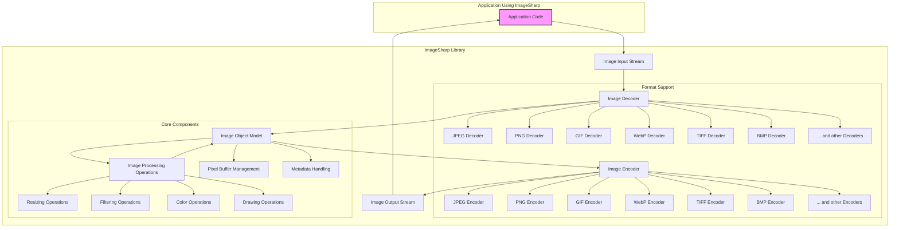

# Project Design Document: ImageSharp Library for Threat Modeling

**Project Name:** ImageSharp

**Project Repository:** [https://github.com/sixlabors/imagesharp](https://github.com/sixlabors/imagesharp)

**Document Version:** 1.1
**Date:** 2023-10-27
**Author:** AI Software Architect

## 1. Introduction

This document provides a detailed design overview of the ImageSharp library, a cross-platform 2D graphics library for .NET. This document is specifically created to serve as a foundation for threat modeling activities. It comprehensively outlines the architecture, key components, data flow, and technologies employed within ImageSharp, with a strong emphasis on aspects relevant to security considerations.

ImageSharp empowers developers to programmatically process, manipulate, and convert images across a wide array of formats within .NET applications. Its design prioritizes performance, memory efficiency, and extensibility. A thorough understanding of its design is paramount for proactively identifying potential security vulnerabilities and implementing effective risk mitigation strategies. This document aims to facilitate that understanding for security analysis.

## 2. Project Overview

ImageSharp is a fully managed, cross-platform, 2D graphics library implemented in C#. It is engineered to deliver robust image processing capabilities for .NET applications, aiming to match the performance of native libraries while retaining the advantages of cross-platform compatibility and managed code execution.

**Key Features:**

*   **Comprehensive Image Format Support:**  Supports a broad spectrum of image formats including JPEG, PNG, GIF, BMP, TIFF, WebP, and more. The library features an extensible decoder and encoder architecture, allowing for the addition of new format support.
*   **Extensive Image Manipulation Operations:** Offers a rich toolkit of operations for image processing, encompassing resizing, cropping, rotation, color adjustments (brightness, contrast, saturation, hue), applying various filters (blur, sharpen, edge detection), watermarking, and complex compositing.
*   **Direct Pixel Access:** Provides mechanisms for direct access and manipulation of pixel data, enabling advanced and custom image manipulation algorithms.
*   **Drawing and Composition Capabilities:** Facilitates drawing shapes, text, and overlaying images onto existing images, enabling complex image composition.
*   **Metadata Management:** Supports reading, writing, and manipulation of image metadata standards including EXIF, IPTC, and XMP. This includes handling embedded profiles and color information.
*   **Cross-Platform by Design:** Engineered for seamless operation across platforms supported by .NET, including Windows, Linux, macOS, and mobile platforms via .NET MAUI or similar frameworks.
*   **Modular and Extensible Architecture:** Features an extensible architecture that allows developers to contribute custom image formats, processing operations, and specialized effects through plugin mechanisms.
*   **Memory Efficiency:** Designed with memory management in mind, aiming to minimize memory footprint and optimize performance, especially when dealing with large images.

**Target Users:**

*   .NET developers requiring image processing functionalities within their applications, ranging from simple tasks to complex image manipulation pipelines.
*   Web developers building dynamic web applications that necessitate on-the-fly image generation, manipulation, and optimization for web delivery.
*   Desktop application developers integrating image editing, processing, or display features into their software.
*   Backend service developers implementing image processing workflows in cloud environments, such as image resizing for content delivery networks or image analysis services.
*   Mobile application developers needing image manipulation capabilities within cross-platform mobile applications.

## 3. System Architecture

ImageSharp is architected as a library intended for integration into other .NET applications. It is not designed as a standalone application or service. The following diagram illustrates the high-level architecture and data flow within ImageSharp when it is utilized by a host application.

**Components Description (Expanded):**

*   **"Application Code"**: Represents the .NET application that integrates and utilizes the ImageSharp library. Its responsibilities include:
    *   **Input Provision:** Providing the raw image data to ImageSharp via an "Image Input Stream". This data can originate from various sources such as local files, network streams (e.g., HTTP requests), or memory buffers.
    *   **Operation Configuration:** Defining and configuring the desired image processing operations. This involves selecting specific operations (resize, crop, filters, etc.), setting parameters for these operations, and orchestrating the processing pipeline.
    *   **Invocation of ImageSharp API:** Interacting with the ImageSharp API to load images, apply processing operations, and save the processed output.
    *   **Output Handling:** Receiving the processed image data as an "Image Output Stream" and handling it appropriately, such as saving it to a file, sending it over a network, or displaying it in a user interface.
    *   **Error Handling:** Implementing error handling mechanisms to gracefully manage potential exceptions raised by ImageSharp during image processing, such as invalid image formats, corrupted data, or resource limitations.

*   **"Image Input Stream"**: The initial entry point for image data into ImageSharp. It is an abstraction representing a stream of bytes containing the encoded image data.  Common implementations include `FileStream` for file-based input, `MemoryStream` for in-memory data, and `NetworkStream` for data received over a network. Security considerations here include handling potentially malicious streams from untrusted sources.

*   **"Image Decoder"**: This crucial component is responsible for the initial parsing and interpretation of the input image data. Its functions are:
    *   **Format Detection:** Identifying the image format from the "Image Input Stream". This is typically achieved by examining file headers, magic numbers, or format-specific signatures within the data stream.
    *   **Decoder Selection:** Choosing the appropriate format-specific decoder module (e.g., "JPEG Decoder", "PNG Decoder") based on the detected image format.
    *   **Data Parsing and Validation:** Parsing the input stream according to the specifications of the identified image format. This involves interpreting the encoded data, validating format structure, and handling potential inconsistencies or errors in the input data.
    *   **"Image Object Model" Creation:** Converting the parsed and validated image data into the internal "Image Object Model". This in-memory representation is structured for efficient processing within ImageSharp.
    *   **Error Handling (Decoding):** Managing errors encountered during the decoding process, such as invalid format syntax, corrupted data sections, or unsupported features within the image format. Robust error handling is critical to prevent vulnerabilities.

*   **"Image Object Model"**: The central in-memory representation of the image within ImageSharp. It is designed for efficient manipulation and processing and typically encompasses:
    *   **Pixel Data Storage ("Pixel Buffer Management"):**  Storing the raw pixel data of the image. This might be organized in various formats (e.g., planar, interleaved) and color spaces (e.g., RGB, CMYK, Grayscale). Efficient memory management and access to pixel data are key aspects of this component.
    *   **Image Metadata ("Metadata Handling"):**  Storing and managing image metadata extracted during decoding. This includes EXIF, IPTC, XMP data, color profiles, and other relevant information embedded within the image file.
    *   **Image Properties:**  Storing fundamental image properties such as dimensions (width, height), color depth, pixel format, and resolution.
    *   **State Management:** Maintaining the current state of the image throughout the processing pipeline.

*   **"Image Processing Operations"**: This encompasses the extensive set of image manipulation functionalities offered by ImageSharp. Examples and sub-components include:
    *   **"Resizing Operations"**: Algorithms for scaling images to different dimensions, including various resampling methods (e.g., nearest neighbor, bilinear, bicubic) that impact image quality and processing time.
    *   **"Filtering Operations"**: Applying image filters for effects like blurring, sharpening, noise reduction, edge detection, and artistic styles. These operations often involve convolution kernels and mathematical transformations of pixel data.
    *   **"Color Operations"**: Adjusting color properties such as brightness, contrast, saturation, hue, gamma correction, color space conversions, and color channel manipulation.
    *   **"Drawing Operations"**: Functionality for drawing shapes (lines, rectangles, circles), text rendering, and image composition (overlaying images, blending modes).
    *   **Other Operations:**  Cropping, rotation, transformations, watermarking, format-specific optimizations, and more.
    *   These operations operate on and modify the "Image Object Model".  Security considerations include preventing operations that could lead to resource exhaustion or unexpected behavior due to malformed input or edge cases.

*   **"Image Encoder"**: The counterpart to the "Image Decoder", responsible for converting the processed "Image Object Model" back into an encoded image format for output. Its functions are:
    *   **Encoder Selection:** Choosing the appropriate format-specific encoder module (e.g., "JPEG Encoder", "PNG Encoder") based on the desired output format specified by the application.
    *   **Encoding Logic:** Implementing the encoding algorithms for the selected image format. This involves converting the "Image Object Model" back into the encoded byte stream according to the format specification.
    *   **Encoding Options:** Handling encoding options and quality settings provided by the application. For example, JPEG encoding quality, PNG compression level, etc.
    *   **"Image Output Stream" Writing:** Writing the generated encoded image data to the "Image Output Stream".
    *   **Error Handling (Encoding):** Managing errors during the encoding process, such as issues with output stream access or format-specific encoding failures.

*   **"Image Output Stream"**: The destination for the processed and encoded image data. It is an abstraction representing a stream of bytes to which the encoded image is written. Similar to "Image Input Stream", it can be `FileStream`, `MemoryStream`, `NetworkStream`, etc.

*   **"Format Support" (Decoders and Encoders)**:  The collection of format-specific decoder and encoder modules. Each module is dedicated to handling a particular image format. The extensible design allows for adding new format support by implementing custom decoders and encoders that conform to ImageSharp's interfaces.  Security vulnerabilities are often format-specific and reside within these decoder/encoder modules.

*   **"Core Components"**:  Represents internal modules that support the core functionalities of ImageSharp:
    *   **"Pixel Buffer Management"**: Handles the allocation, deallocation, and manipulation of pixel data buffers within the "Image Object Model". Optimizations for memory access and performance are crucial here.
    *   **"Metadata Handling"**: Manages the parsing, storage, and manipulation of image metadata. This component interacts with various metadata formats (EXIF, IPTC, XMP) and ensures data integrity.
    *   **"Resizing Operations", "Filtering Operations", "Color Operations", "Drawing Operations"**: These are sub-components within "Image Processing Operations" that encapsulate the logic for specific categories of image manipulations.

## 4. Data Flow (Detailed)

The data flow within ImageSharp, from input to output, is a sequential process with potential branching based on image format and processing requirements:

1.  **Image Input:** The "Application Code" initiates the process by providing an "Image Input Stream" to ImageSharp. This stream contains the encoded image data.
2.  **Format Detection and Decoding:** The "Image Decoder" component receives the "Image Input Stream". It first attempts to detect the image format by examining header information. Based on the detected format, the appropriate format-specific decoder (e.g., "JPEG Decoder") is invoked. The decoder parses the input stream, validates the data structure, and converts the encoded data into the "Image Object Model" in memory.
3.  **Image Object Model Creation:** The "Image Decoder" populates the "Image Object Model" with pixel data, metadata, and image properties extracted from the decoded image.
4.  **Image Processing (Conditional):** If the "Application Code" requests image manipulation, it invokes specific "Image Processing Operations" on the "Image Object Model". These operations (resize, crop, filters, etc.) modify the pixel data and/or metadata within the "Image Object Model". Operations can be chained together to create complex processing pipelines.
5.  **Image Encoding:** Once processing is complete (or if no processing is required), the "Image Encoder" component is invoked. The application specifies the desired output image format. The "Image Encoder" selects the corresponding format-specific encoder (e.g., "PNG Encoder").
6.  **Encoding and Output:** The encoder takes the "Image Object Model" and encodes it into the specified image format. The encoded image data is then written to the "Image Output Stream".
7.  **Image Output:** The "Application Code" receives the "Image Output Stream" containing the processed and encoded image data. The application can then handle this output stream as needed (e.g., save to file, send over network).

## 5. Technologies Used (Detailed)

ImageSharp leverages a range of technologies within the .NET ecosystem to achieve its functionality and performance goals:

*   **Core Programming Language:** C# (.NET) -  Provides a modern, type-safe, and garbage-collected environment for development.
*   **.NET Runtime (.NET Framework, .NET Core, .NET):**  The underlying runtime environment providing cross-platform execution, memory management, and access to system resources. ImageSharp is designed to be compatible with multiple .NET runtimes.
*   **System.IO Namespace:**  Extensively used for stream-based input and output operations, file system access, and handling various data streams.
*   **System.Memory and System.Buffers Namespaces:**  Crucial for efficient memory management, span-based operations, and working with memory buffers directly. These namespaces contribute significantly to ImageSharp's performance and memory efficiency, especially when processing large images.
*   **System.Numerics.Vectors Namespace:**  Utilized for SIMD (Single Instruction, Multiple Data) operations where applicable, enabling vectorized processing of pixel data for performance gains on supported architectures.
*   **Potentially Native Libraries (Format-Specific and Performance Optimization):** While primarily managed code, ImageSharp might interface with native libraries for specific image formats (e.g., using platform-specific codecs for certain formats) or for performance-critical operations where native code offers significant advantages. This dependency on native libraries would be format-dependent and requires detailed examination of the source code for each decoder/encoder. Examples could include native JPEG or WebP codecs.
*   **NuGet Package Ecosystem:** ImageSharp is distributed and consumed as NuGet packages. It may depend on other NuGet packages for specialized functionalities, such as advanced compression algorithms, specific format support extensions, or external libraries for certain image processing tasks. Dependency management and security scanning of NuGet dependencies are important.
*   **Configuration System:**  ImageSharp likely utilizes a configuration system (either built-in or leveraging .NET configuration mechanisms) to manage settings such as default encoders, decoders, memory allocation strategies, and other library-level configurations.

## 6. Deployment Model (Expanded)

ImageSharp's deployment model is centered around its nature as a **library** distributed via NuGet packages. It is designed to be seamlessly integrated into various types of .NET applications.

**Deployment Scenarios (Detailed):**

*   **Web Applications (ASP.NET Core, Blazor, etc.):**
    *   **Scenario:** Handling user-uploaded images, generating thumbnails, dynamically resizing images for web display, applying watermarks, creating image galleries, and optimizing images for web performance.
    *   **Deployment:** ImageSharp NuGet packages are included as dependencies in the web application project. Deployment follows standard web application deployment procedures (e.g., to web servers, cloud platforms like Azure App Service, AWS Elastic Beanstalk, containerized deployments using Docker/Kubernetes). ImageSharp library code is deployed alongside the application code.
*   **Desktop Applications (WPF, WinForms, .NET MAUI Desktop):**
    *   **Scenario:** Image editing software, image viewers, applications requiring image manipulation for document processing, scientific visualization, or multimedia applications.
    *   **Deployment:** ImageSharp NuGet packages are integrated into the desktop application project. Deployment involves packaging ImageSharp DLLs along with the application executable and dependencies during the application installation process (e.g., using MSI installers, ClickOnce, or platform-specific package managers).
*   **Console Applications and Backend Services (.NET Console Apps, Worker Services, Microservices):**
    *   **Scenario:** Batch image processing tasks, automated image manipulation pipelines, image conversion services, background image processing jobs, image analysis services, and server-side image processing in microservice architectures.
    *   **Deployment:** ImageSharp NuGet packages are included in the project. Deployment can be to servers (physical or virtual machines), containers (Docker), serverless functions (Azure Functions, AWS Lambda), or orchestrated environments like Kubernetes. Deployment methods depend on the specific backend service architecture.
*   **Mobile Applications (.NET MAUI, Xamarin):**
    *   **Scenario:** Image processing within mobile apps for photo editing, camera applications, augmented reality applications, or apps that display and manipulate images on mobile devices.
    *   **Deployment:** ImageSharp NuGet packages are integrated into the mobile application project (Xamarin or .NET MAUI). Deployment involves building and packaging the mobile application for target platforms (iOS, Android) using platform-specific build tools and deployment processes (e.g., deploying to app stores).
*   **Cloud Environments (Azure, AWS, GCP):**
    *   **Scenario:** Leveraging cloud infrastructure for scalable and reliable image processing. ImageSharp can be deployed within cloud-based web applications, serverless functions, containerized applications, or as part of larger cloud services.
    *   **Deployment:** Deployment to cloud environments typically involves containerization (Docker), serverless function deployment, or deployment as part of cloud-native application architectures. Cloud platforms offer services for managing dependencies and deploying .NET applications.

## 7. Security Considerations (Detailed and Categorized)

This section expands on the initial security considerations, categorizing potential threats and providing more specific examples.

**7.1. Input Validation and Image Format Vulnerabilities:**

*   **Threat:** Processing maliciously crafted image files designed to exploit vulnerabilities in image decoders.
*   **Vulnerability Examples:**
    *   **Buffer Overflows:** Decoders might have buffer overflow vulnerabilities when parsing malformed or excessively large image headers or data sections. Attackers could craft images that trigger buffer overflows, potentially leading to crashes, denial of service, or remote code execution. *Example: A crafted JPEG image with an overly long comment field could overflow a fixed-size buffer in the JPEG decoder.*
    *   **Integer Overflows/Underflows:** Integer overflows or underflows in decoder logic, especially when handling image dimensions, color depths, or data offsets, could lead to incorrect memory allocation, out-of-bounds access, or unexpected behavior. *Example: A GIF image with dimensions specified in a way that causes an integer overflow when calculating buffer size.*
    *   **Format String Bugs:** Although less common in modern managed code, vulnerabilities related to format string handling in logging or error messages within decoders could potentially be exploited if user-controlled data is incorporated into format strings without proper sanitization.
    *   **Logic Errors in Decoder State Machines:** Complex image formats often require intricate state machines in decoders. Logic errors in these state machines could lead to unexpected states, incorrect parsing, or vulnerabilities. *Example: A TIFF image with a carefully crafted sequence of tags that confuses the TIFF decoder's state machine.*
    *   **Denial of Service (DoS) via Decompression Bombs (Zip Bombs for Images):**  Crafted images could exploit inefficient decompression algorithms or recursive decompression schemes in certain formats (e.g., GIF LZW, TIFF compression) to create "decompression bombs." Processing these images could consume excessive CPU and memory resources, leading to DoS. *Example: A highly compressed GIF image that expands to an extremely large size in memory when decoded.*
*   **Mitigation Strategies:**
    *   **Robust Input Validation:** Implement rigorous input validation within decoders to check for format compliance, valid data ranges, and potential anomalies.
    *   **Fuzzing and Security Testing:** Employ fuzzing techniques and security testing methodologies specifically targeting image decoders to identify potential vulnerabilities.
    *   **Secure Coding Practices:** Adhere to secure coding practices during decoder development, including bounds checking, safe integer arithmetic, and careful state management.
    *   **Memory Safety:** Leverage memory-safe language features and libraries to minimize the risk of buffer overflows and memory corruption.
    *   **Resource Limits:** Implement resource limits (e.g., maximum image dimensions, memory usage limits) to prevent DoS attacks based on resource exhaustion.

**7.2. Resource Exhaustion:**

*   **Threat:**  Causing denial of service by overwhelming ImageSharp with resource-intensive image processing requests.
*   **Vulnerability Examples:**
    *   **Unbounded Image Resizing:** Allowing users to resize images to arbitrarily large dimensions could consume excessive memory and CPU resources, especially with complex resampling algorithms.
    *   **Complex Filter Combinations:** Applying a chain of computationally expensive filters to large images could lead to high CPU utilization and slow processing times, potentially causing DoS.
    *   **Memory Leaks:** Memory leaks within ImageSharp's core components or processing operations could gradually consume available memory, eventually leading to application crashes or instability.
*   **Mitigation Strategies:**
    *   **Input Size Limits:** Enforce limits on input image dimensions and file sizes to prevent processing of excessively large images.
    *   **Operation Complexity Limits:**  Restrict the complexity of image processing operations that can be performed, or implement rate limiting for resource-intensive operations.
    *   **Resource Monitoring and Throttling:** Monitor resource usage (CPU, memory) and implement throttling mechanisms to limit the impact of resource-intensive requests.
    *   **Memory Management Audits:** Regularly audit ImageSharp's code for potential memory leaks and optimize memory allocation and deallocation patterns.

**7.3. Metadata Handling Vulnerabilities:**

*   **Threat:** Exploiting vulnerabilities in the parsing and processing of image metadata (EXIF, IPTC, XMP).
*   **Vulnerability Examples:**
    *   **Metadata Injection Attacks:**  Attackers could inject malicious code or scripts into metadata fields, hoping to exploit vulnerabilities in applications that process or display this metadata. *Example: Injecting JavaScript code into EXIF comment fields, targeting applications that naively display EXIF data in web browsers.*
    *   **Metadata Parsing Vulnerabilities:**  Similar to image format vulnerabilities, metadata parsers could have buffer overflows, integer overflows, or logic errors when handling malformed or excessively large metadata sections.
    *   **Information Disclosure via Metadata:**  Image metadata can contain sensitive information (location data, camera settings, user information). Improper handling or exposure of metadata could lead to information disclosure.
*   **Mitigation Strategies:**
    *   **Metadata Sanitization:** Sanitize or remove potentially harmful metadata fields before displaying or processing metadata in applications.
    *   **Secure Metadata Parsing:** Implement robust and secure metadata parsers, applying input validation and secure coding practices.
    *   **Metadata Access Control:** Control access to metadata and restrict the exposure of sensitive metadata fields based on application requirements and security policies.

**7.4. Dependency Vulnerabilities:**

*   **Threat:** Vulnerabilities in third-party libraries or native dependencies used by ImageSharp.
*   **Vulnerability Examples:**
    *   **Vulnerabilities in Native Codecs:** If ImageSharp relies on native codecs for certain image formats, vulnerabilities in those native codecs could indirectly affect ImageSharp's security.
    *   **Vulnerabilities in NuGet Dependencies:**  Vulnerabilities in other NuGet packages that ImageSharp depends on could be exploited to compromise ImageSharp or applications using it.
*   **Mitigation Strategies:**
    *   **Dependency Scanning:** Regularly scan ImageSharp's dependencies (NuGet packages and native libraries) for known vulnerabilities using vulnerability scanning tools.
    *   **Dependency Updates:** Keep dependencies up-to-date with the latest security patches and versions.
    *   **Vendor Security Practices:**  Choose dependencies from reputable vendors with strong security practices and a history of timely vulnerability patching.
    *   **Minimize Dependencies:**  Reduce the number of dependencies where possible to minimize the attack surface.

**7.5. Secure Defaults and Configuration:**

*   **Threat:** Misconfiguration or insecure default settings in ImageSharp leading to vulnerabilities.
*   **Vulnerability Examples:**
    *   **Insecure Default Encoding Options:** Default encoding options that prioritize speed over security (e.g., disabling certain security features in encoders).
    *   **Permissive Input Handling:** Default settings that are too permissive in accepting potentially malformed or malicious input.
*   **Mitigation Strategies:**
    *   **Secure Defaults:**  Set secure default configuration options for ImageSharp, prioritizing security over convenience where appropriate.
    *   **Security Configuration Guidance:** Provide clear documentation and guidance on secure configuration options and best practices for using ImageSharp securely.
    *   **Configuration Validation:** Implement validation mechanisms to ensure that user-provided configurations are secure and within acceptable ranges.

## 8. Threat Modeling Scope (Detailed)

This design document is the starting point for a comprehensive threat modeling exercise for the ImageSharp project. The threat modeling process will be structured and systematic, focusing on:

*   **Methodology:** Employing a structured threat modeling methodology such as **STRIDE (Spoofing, Tampering, Repudiation, Information Disclosure, Denial of Service, Elevation of Privilege)** or **PASTA (Process for Attack Simulation and Threat Analysis)** to systematically identify and categorize threats.
*   **Assets at Risk:** Identifying the key assets that need protection. These assets include:
    *   **Confidentiality of Image Data:** Protecting sensitive image data from unauthorized access or disclosure.
    *   **Integrity of Image Data:** Ensuring that image data is not tampered with or modified without authorization.
    *   **Availability of Image Processing Services:** Maintaining the availability and reliability of ImageSharp for applications that depend on it.
    *   **Reputation of ImageSharp Project:** Protecting the reputation and trustworthiness of the ImageSharp project.
    *   **Applications Using ImageSharp:** Ensuring the security of applications that integrate and rely on the ImageSharp library.
*   **Threat Actors:** Considering various threat actors and their motivations and capabilities:
    *   **Malicious Users:** Users intentionally providing crafted images to exploit vulnerabilities for malicious purposes (DoS, RCE, etc.).
    *   **External Attackers:** Attackers targeting applications using ImageSharp from external networks (e.g., web application attacks, network-based exploits).
    *   **Supply Chain Attackers:** Attackers compromising dependencies, build processes, or distribution channels to inject malicious code into ImageSharp or its dependencies.
    *   **Insider Threats (Less Relevant for an Open-Source Library):** While less relevant for an open-source library, considering potential risks from compromised developer accounts or malicious contributions.
*   **Attack Vectors:** Analyzing potential attack vectors that threat actors could use to exploit vulnerabilities:
    *   **Image File Uploads:** Uploading malicious image files to web applications or services that use ImageSharp for processing.
    *   **Network-Based Attacks:** Exploiting vulnerabilities through network protocols if ImageSharp is used in network-facing services.
    *   **Local File Processing:** Processing malicious image files from local file systems.
    *   **Code Injection (Indirect):** Injecting malicious code indirectly through crafted image data or metadata that is then processed by ImageSharp.
    *   **Supply Chain Compromise:** Compromise of NuGet packages, native libraries, or build infrastructure.
*   **Threat Modeling Process Steps:**
    1.  **Decomposition:** Breaking down the ImageSharp architecture into components and data flows (as described in this document).
    2.  **Threat Identification:** Identifying potential threats for each component and data flow using the chosen threat modeling methodology (STRIDE, PASTA).
    3.  **Vulnerability Analysis:** Analyzing potential vulnerabilities in ImageSharp's code, dependencies, and configuration based on the identified threats.
    4.  **Risk Assessment:** Assessing the likelihood and impact of each identified threat and vulnerability.
    5.  **Mitigation Strategy Development:** Developing mitigation strategies and security controls to address the identified risks and vulnerabilities.
    6.  **Documentation and Reporting:** Documenting the threat modeling process, findings, and mitigation strategies.
*   **Boundaries of Threat Model:** Defining the scope of the threat model. This threat model will primarily focus on the ImageSharp library itself and its core components. It will also consider the interaction between ImageSharp and applications that use it, but will not extend to the full security analysis of every application that *might* use ImageSharp. The focus is on vulnerabilities *within* ImageSharp.

This detailed design document and the subsequent threat modeling exercise will provide valuable insights into the security posture of ImageSharp and guide the development of more secure and resilient image processing capabilities for .NET applications. The results of the threat modeling will inform security enhancements, code reviews, and ongoing security testing efforts for the ImageSharp project.