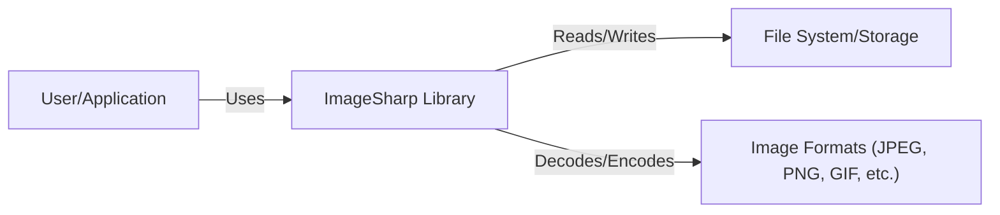
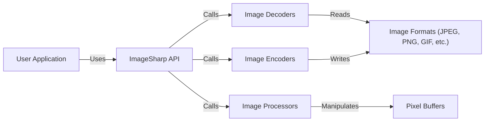
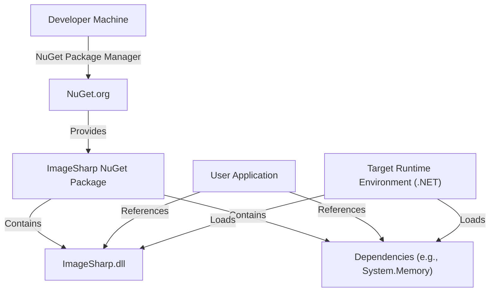
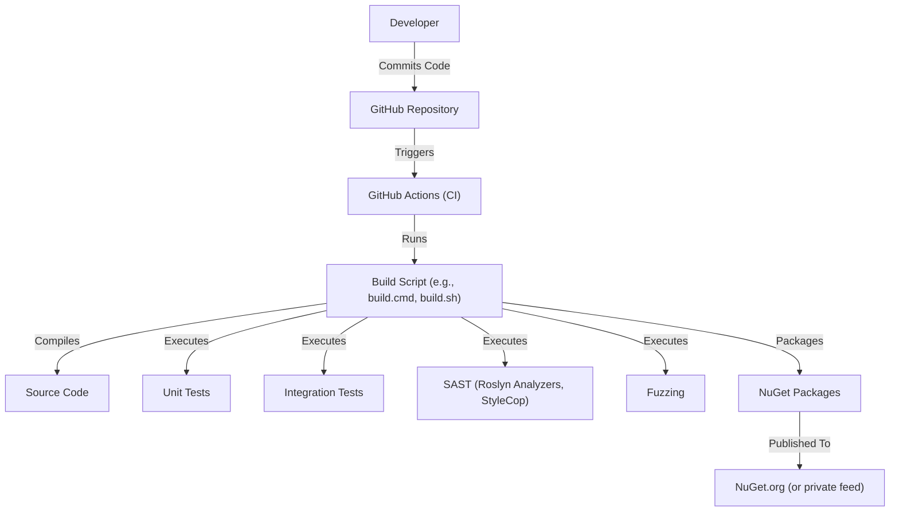

Okay, let's create a design document for the ImageSharp project.

# BUSINESS POSTURE

Business Priorities and Goals:

*   Provide a fully featured, cross-platform, high-performance image processing library for .NET.
*   Offer a modern, easy-to-use API that simplifies image manipulation tasks.
*   Maintain a permissive open-source license (Apache 2.0) to encourage broad adoption and community contributions.
*   Ensure high quality and reliability to be suitable for use in production environments.
*   Be a viable alternative to existing image processing libraries, including System.Drawing.

Business Risks:

*   Vulnerabilities in the library could lead to application-level security issues, such as denial of service, remote code execution, or information disclosure, especially in web applications that process user-uploaded images.
*   Performance bottlenecks could impact the performance of applications using the library, particularly those processing large images or performing complex operations.
*   Lack of support for specific image formats or features could limit adoption in certain use cases.
*   Bugs or compatibility issues could lead to application instability or incorrect image rendering.
*   Failure to keep up with .NET advancements and new image formats could lead to obsolescence.

# SECURITY POSTURE

Existing Security Controls:

*   security control: The project uses continuous integration (GitHub Actions) to automate builds and tests. (Visible in the .github/workflows directory)
*   security control: The project has a security policy. (SECURITY.md)
*   security control: The project uses static analysis security testing (SAST) tools, specifically Roslyn analyzers and StyleCop, to enforce coding standards and identify potential issues. (Visible in the .editorconfig and Directory.Build.props files)
*   security control: The project has extensive unit and integration tests to ensure code correctness and prevent regressions. (Visible in the tests directory)
*   security control: The project follows secure coding practices, such as input validation and avoiding unsafe code where possible. (Inferred from code review)
*   security control: Dependencies are managed through NuGet and are regularly updated. (Visible in the .csproj files)
*   security control: The project uses fuzz testing. (Visible in the tests/ImageSharp.Fuzzing directory)

Accepted Risks:

*   accepted risk: The library processes potentially untrusted image data, which inherently carries risks of vulnerabilities like buffer overflows or denial-of-service attacks. Mitigation relies on robust parsing and validation, but complete elimination of risk is difficult.
*   accepted risk: The library supports a wide range of image formats, some of which have complex specifications and may have undiscovered vulnerabilities in their implementations.
*   accepted risk: While efforts are made to avoid unsafe code, some performance-critical sections may use it, increasing the risk of memory safety issues.

Recommended Security Controls:

*   security control: Integrate a Software Composition Analysis (SCA) tool to automatically identify known vulnerabilities in third-party dependencies.
*   security control: Implement regular dynamic application security testing (DAST) on applications using ImageSharp, particularly web applications, to identify runtime vulnerabilities.
*   security control: Establish a process for handling security vulnerabilities reported by external researchers, including a clear communication channel and timely patching.
*   security control: Consider adding more fuzzing targets to improve coverage of different image formats and processing operations.

Security Requirements:

*   Authentication: Not directly applicable to the library itself, but applications using ImageSharp should implement appropriate authentication mechanisms to control access to image processing functionality.
*   Authorization: Not directly applicable to the library itself, but applications using ImageSharp should implement authorization checks to ensure users can only access and manipulate images they are permitted to.
*   Input Validation:
    *   The library *must* validate all image data inputs, including dimensions, pixel formats, and metadata, to prevent buffer overflows and other memory safety issues.
    *   The library *should* provide mechanisms for applications to sanitize or reject images based on content or format restrictions.
    *   The library *must* handle potentially malicious or malformed image data gracefully, without crashing or exposing the application to vulnerabilities.
*   Cryptography:
    *   If the library implements any cryptographic operations (e.g., for encrypted image formats), it *must* use strong, well-vetted cryptographic algorithms and libraries.
    *   Cryptographic keys *must* be managed securely, following best practices for key generation, storage, and usage.
*   Configuration:
    *   The library *should* provide secure default configurations.
    *   The library *should* allow configuration of resource limits (e.g., maximum image dimensions, memory usage) to prevent denial-of-service attacks.

# DESIGN

## C4 CONTEXT

Element Descriptions:

*   Element:
    *   Name: User/Application
    *   Type: User/External System
    *   Description: Represents a user or an application that utilizes the ImageSharp library for image processing.
    *   Responsibilities:
        *   Provides image data to ImageSharp.
        *   Receives processed image data from ImageSharp.
        *   Integrates ImageSharp into its workflow.
    *   Security controls:
        *   Implement appropriate authentication and authorization mechanisms.
        *   Validate user inputs before passing them to ImageSharp.
        *   Handle image data securely.

*   Element:
    *   Name: ImageSharp Library
    *   Type: System
    *   Description: The ImageSharp library itself, providing image processing functionalities.
    *   Responsibilities:
        *   Decoding image data from various formats.
        *   Encoding image data to various formats.
        *   Performing image manipulation operations (resizing, cropping, filtering, etc.).
        *   Providing an API for applications to interact with.
    *   Security controls:
        *   Input validation of image data.
        *   Secure coding practices.
        *   Regular security audits and testing.
        *   Dependency management.

*   Element:
    *   Name: File System/Storage
    *   Type: External System
    *   Description: Represents the storage location where images are read from and written to. This could be a local file system, cloud storage, or other storage mechanisms.
    *   Responsibilities:
        *   Storing image data.
        *   Providing access to image data.
    *   Security controls:
        *   Access controls to restrict unauthorized access to image files.
        *   Data encryption at rest and in transit.

*   Element:
    *   Name: Image Formats (JPEG, PNG, GIF, etc.)
    *   Type: External System
    *   Description: Represents the various image formats that ImageSharp supports.
    *   Responsibilities:
        *   Defining the structure and encoding of image data.
    *   Security controls:
        *   ImageSharp must implement robust parsing and validation for each supported format to mitigate vulnerabilities.

## C4 CONTAINER

Element Descriptions:

*   Element:
    *   Name: User Application
    *   Type: External System
    *   Description: Represents an application that utilizes the ImageSharp library.
    *   Responsibilities: Same as in C4 Context.
    *   Security controls: Same as in C4 Context.

*   Element:
    *   Name: ImageSharp API
    *   Type: Container
    *   Description: The public API of the ImageSharp library, providing a high-level interface for image manipulation.
    *   Responsibilities:
        *   Exposing image processing functions to user applications.
        *   Managing image loading and saving.
        *   Orchestrating the interaction between other internal components.
    *   Security controls:
        *   Input validation.
        *   Parameter sanitization.

*   Element:
    *   Name: Image Decoders
    *   Type: Container
    *   Description: Components responsible for decoding image data from various formats into a common internal representation (pixel buffers).
    *   Responsibilities:
        *   Parsing image file headers and data streams.
        *   Handling format-specific decoding logic.
        *   Creating pixel buffers from decoded image data.
    *   Security controls:
        *   Robust parsing and validation of image data to prevent vulnerabilities.
        *   Fuzz testing of decoders.

*   Element:
    *   Name: Image Encoders
    *   Type: Container
    *   Description: Components responsible for encoding image data from the internal representation (pixel buffers) into various image formats.
    *   Responsibilities:
        *   Creating image file headers and data streams.
        *   Handling format-specific encoding logic.
        *   Writing encoded image data to output streams.
    *   Security controls:
        *   Validation of input data before encoding.

*   Element:
    *   Name: Image Processors
    *   Type: Container
    *   Description: Components that perform image manipulation operations on pixel buffers.
    *   Responsibilities:
        *   Implementing image processing algorithms (resizing, cropping, filtering, etc.).
        *   Modifying pixel data in memory.
    *   Security controls:
        *   Bounds checking to prevent out-of-bounds memory access.

*   Element:
    *   Name: Pixel Buffers
    *   Type: Container
    *   Description: In-memory representation of image data, used for internal processing.
    *   Responsibilities:
        *   Storing pixel data in a structured format.
        *   Providing access to pixel data for manipulation.
    *   Security controls:
        *   Memory safety practices to prevent buffer overflows and other memory-related vulnerabilities.

*   Element:
    *   Name: Image Formats (JPEG, PNG, GIF, etc.)
    *   Type: External System
    *   Description: Represents the various image formats that ImageSharp supports.
    *   Responsibilities: Same as in C4 Context.
    *   Security controls: Same as in C4 Context.

## DEPLOYMENT

Possible Deployment Solutions:

1.  NuGet Package: The most common deployment method is via NuGet packages. Developers include ImageSharp as a dependency in their projects, and the NuGet package manager handles downloading and referencing the necessary assemblies.
2.  Self-Contained Deployment: For applications that require a self-contained deployment, ImageSharp can be included as part of the application's published output.
3.  Framework-Dependent Deployment: ImageSharp can also be used in framework-dependent deployments, where the .NET runtime is already installed on the target machine.

Chosen Deployment Solution (NuGet Package):

Element Descriptions:

*   Element:
    *   Name: Developer Machine
    *   Type: Node
    *   Description: The machine where the developer builds the application that uses ImageSharp.
    *   Responsibilities:
        *   Developing the application.
        *   Managing project dependencies.
        *   Building and publishing the application.
    *   Security controls:
        *   Secure development environment.

*   Element:
    *   Name: NuGet.org
    *   Type: Node
    *   Description: The public NuGet package repository.
    *   Responsibilities:
        *   Hosting NuGet packages.
        *   Providing a mechanism for developers to download packages.
    *   Security controls:
        *   Package signing.
        *   Vulnerability scanning of packages.

*   Element:
    *   Name: ImageSharp NuGet Package
    *   Type: Artifact
    *   Description: The NuGet package containing the ImageSharp library.
    *   Responsibilities:
        *   Providing the compiled ImageSharp assemblies.
        *   Specifying dependencies.
    *   Security controls:
        *   Package signing (if implemented).

*   Element:
    *   Name: ImageSharp.dll
    *   Type: Artifact
    *   Description: The main ImageSharp assembly.
    *   Responsibilities:
        *   Containing the ImageSharp code.
    *   Security controls:
        *   Secure coding practices.
        *   Regular security audits.

*   Element:
    *   Name: Dependencies
    *   Type: Artifact
    *   Description: Other NuGet packages that ImageSharp depends on.
    *   Responsibilities:
        *   Providing necessary functionalities for ImageSharp.
    *   Security controls:
        *   SCA to identify vulnerabilities in dependencies.

*   Element:
    *   Name: User Application
    *   Type: Application
    *   Description: The application that uses ImageSharp.
    *   Responsibilities:
        *   Utilizing ImageSharp for image processing.
    *   Security controls:
        *   Secure coding practices.
        *   Input validation.

*   Element:
    *   Name: Target Runtime Environment (.NET)
    *   Type: Node
    *   Description: The .NET runtime environment where the application is executed.
    *   Responsibilities:
        *   Loading and executing the application and its dependencies.
    *   Security controls:
        *   Security updates for the .NET runtime.

## BUILD

Build Process Description:

1.  Developers commit code changes to the GitHub repository.
2.  GitHub Actions is triggered by commits to specific branches (e.g., main, release).
3.  The GitHub Actions workflow executes a build script (e.g., `build.cmd` or `build.sh`).
4.  The build script performs the following steps:
    *   Compiles the source code.
    *   Executes unit tests.
    *   Executes integration tests.
    *   Runs SAST tools (Roslyn analyzers, StyleCop) to enforce coding standards and identify potential security issues.
    *   Executes fuzzing tests.
    *   Packages the compiled assemblies and dependencies into NuGet packages.
5.  The NuGet packages are published to NuGet.org (or a private NuGet feed).

Security Controls in Build Process:

*   Continuous Integration (GitHub Actions): Automates the build and testing process, ensuring consistency and repeatability.
*   SAST (Roslyn Analyzers, StyleCop): Enforces coding standards and identifies potential security issues during compilation.
*   Unit and Integration Tests: Verify the correctness of the code and prevent regressions.
*   Fuzzing: Tests the library with a variety of invalid and unexpected inputs to identify potential vulnerabilities.
*   Dependency Management (NuGet): Uses NuGet to manage dependencies, allowing for easier updates and vulnerability tracking.
*   Signed NuGet Packages: While not explicitly mentioned, signing NuGet packages is a recommended practice to ensure the integrity and authenticity of the library.

# RISK ASSESSMENT

Critical Business Processes:

*   Image processing within applications that rely on ImageSharp. This includes web applications, desktop applications, and services that handle image data. The availability and correct functioning of ImageSharp are critical for these applications.

Data to Protect and Sensitivity:

*   Image Data: The primary data being processed is image data. The sensitivity of this data varies greatly depending on the application. It can range from non-sensitive public images to highly sensitive personal photos, medical images, or confidential documents.
*   Metadata: Image metadata may also contain sensitive information, such as GPS coordinates, timestamps, or camera settings.
*   Application Data: While ImageSharp itself doesn't directly handle application-specific data, vulnerabilities in the library could potentially be exploited to gain access to other data within the application.

# QUESTIONS & ASSUMPTIONS

Questions:

*   Are there any specific compliance requirements (e.g., HIPAA, GDPR) that apply to applications using ImageSharp?
*   What are the expected performance requirements for ImageSharp (e.g., images per second, maximum image size)?
*   Are there any specific image formats that are of particular concern or require special handling?
*   Is there a budget allocated for security tools and services (e.g., SCA, DAST)?
*   What is the process for handling security vulnerabilities reported by external researchers?

Assumptions:

*   BUSINESS POSTURE: The primary goal is to provide a high-quality, reliable, and performant image processing library. Security is a high priority, but performance and usability should not be significantly compromised.
*   SECURITY POSTURE: The development team follows secure coding practices and is responsive to security issues. The project is actively maintained and updated.
*   DESIGN: The library is designed to be modular and extensible. The use of unsafe code is minimized but may be necessary in performance-critical sections. The library is primarily used in .NET applications.