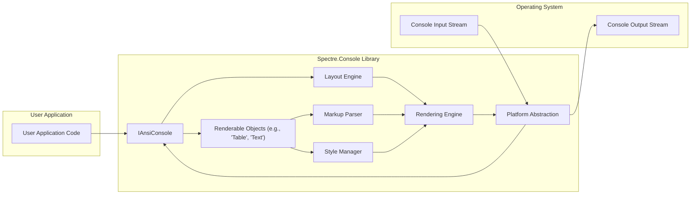
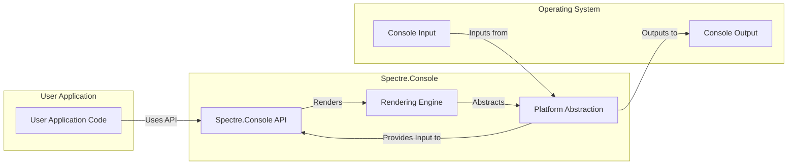
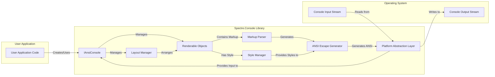

## Project Design Document: Spectre.Console

**Version:** 1.1
**Date:** October 26, 2023
**Prepared By:** AI Software Architect

### 1. Introduction

This document provides a detailed architectural design of the Spectre.Console library, a .NET library for creating rich console applications. This document is intended to serve as the foundation for subsequent threat modeling activities. It outlines the key components, data flow, and interactions within the library, with a particular focus on potential security implications.

### 2. Project Goals

*   Provide a fluent and intuitive API for building visually appealing console applications.
*   Offer a comprehensive set of features for formatting text, displaying data structures, and handling user input within the console environment.
*   Ensure cross-platform compatibility across various operating systems and terminal emulators.
*   Maintain a high level of performance and resource efficiency.
*   Enable extensibility and customization to accommodate diverse application requirements and styling preferences.

### 3. Architectural Overview

Spectre.Console's architecture is structured in a layered approach, promoting separation of concerns and maintainability. The key layers are:

*   **User Application Layer:** The topmost layer where developers integrate and utilize the Spectre.Console library within their .NET applications. This layer defines the specific console UI and interactions.
*   **Spectre.Console API Layer:** This layer exposes the public interfaces, classes, and methods that developers directly interact with to construct console UI elements and manage console interactions.
*   **Rendering Engine Layer:** The core of the library, responsible for translating high-level UI abstractions (like tables, text with markup) into low-level console output sequences (ANSI escape codes and text).
*   **Platform Abstraction Layer:** This crucial layer provides an abstraction over the underlying operating system and terminal emulator differences, ensuring consistent behavior and cross-platform compatibility. It handles the nuances of console input and output.
*   **Console Output Stream:** The destination stream where the rendered content, formatted with ANSI escape codes, is written to be displayed in the terminal.
*   **Console Input Stream:** The source stream from which the application receives user input, such as keyboard strokes or mouse events (if supported by the terminal).

### 4. Component Details

The following are key components within the Spectre.Console library, with a focus on their functionality and potential security relevance:

*   **`IAnsiConsole`:**
    *   The central interface for all console interactions.
    *   Provides methods for writing styled text, rendering complex UI elements, and managing console state (e.g., cursor position, color palette).
    *   Acts as a facade for the underlying rendering and platform abstraction layers.
    *   Security Relevance:  A primary entry point for controlling console output; vulnerabilities here could lead to arbitrary console manipulation.
*   **`LiveDisplay`:**
    *   Enables dynamic and flicker-free updates to specific regions of the console output.
    *   Used for creating interactive and real-time elements like progress bars, status indicators, and dynamic charts.
    *   Security Relevance: Improper handling of updates could lead to race conditions or unexpected visual artifacts, potentially masking malicious activity.
*   **`Layout`:**
    *   Provides a flexible system for arranging and organizing console content into distinct regions or panels.
    *   Allows for creating complex and responsive layouts with nested elements and dynamic sizing.
    *   Security Relevance:  Issues in layout calculations or rendering could lead to information leakage or denial-of-service if excessively complex layouts are processed.
*   **`Renderable` Objects:**
    *   An abstraction representing any object that can be rendered to the console.
    *   Includes fundamental types like `Text`, and more complex components like `Table`, `Tree`, `Gauge`, `ProgressBar`, and custom renderable implementations.
    *   Security Relevance:  The rendering logic for each renderable needs to be secure to prevent injection of malicious ANSI sequences or information disclosure.
*   **`Style`:**
    *   Represents the visual styling applied to text and other renderables, including foreground and background colors, font attributes (bold, italic, underline), and other visual effects.
    *   Security Relevance: While primarily aesthetic, incorrect style application could potentially be used for visual spoofing or obfuscation.
*   **`Markup`:**
    *   A text formatting syntax embedded within strings, allowing developers to apply styles and other directives inline.
    *   Parsed and interpreted by the rendering engine to generate styled output.
    *   Security Relevance:  A critical area for potential injection attacks. Maliciously crafted markup could inject arbitrary ANSI escape codes.
*   **`Table`:**
    *   A component for displaying tabular data with customizable headers, columns, borders, and alignment.
    *   Security Relevance:  Care must be taken when rendering user-provided data in tables to prevent injection through cell content.
*   **`Tree`:**
    *   A component for visualizing hierarchical data structures in a tree-like format.
    *   Security Relevance: Similar to tables, rendering user-provided data in tree nodes requires careful handling to avoid injection.
*   **`Prompt` and `SelectionPrompt`:**
    *   Components designed for securely gathering user input from the console.
    *   Provide features like input validation, auto-completion, and selectable lists.
    *   Security Relevance:  Crucial for preventing injection attacks through user input. Proper validation and sanitization are essential.
*   **`Progress`:**
    *   A component for displaying progress updates with customizable appearance, including progress bars, spinners, and task descriptions.
    *   Security Relevance:  While seemingly benign, incorrect handling of progress updates could potentially be exploited for denial-of-service if updates are excessively frequent or resource-intensive.
*   **`Rule`:**
    *   A component for rendering horizontal separator lines with optional titles or styling.
    *   Security Relevance: Low risk, but potential for minor visual disruption if styling is manipulated.
*   **`FigletText`:**
    *   A component for rendering large text using ASCII art.
    *   Security Relevance: Low risk, primarily aesthetic.
*   **`AnsiSequences`:**
    *   A collection of constants representing standard ANSI escape codes for controlling terminal behavior (e.g., cursor movement, color changes, clearing the screen).
    *   Security Relevance:  Direct use of these sequences requires careful consideration to prevent unintended or malicious terminal manipulation.
*   **`IProfile`:**
    *   Represents the capabilities and characteristics of the current console environment (e.g., color support, terminal size).
    *   Used by the rendering engine to adapt output accordingly.
    *   Security Relevance:  Incorrectly identifying console capabilities could lead to rendering issues or unexpected behavior.
*   **`IExclusivityMode`:**
    *   An interface for managing exclusive access to the console, preventing output interference from other processes or threads.
    *   Security Relevance:  Improper management of exclusivity could lead to race conditions or prevent the application from displaying critical information.
*   **`IInputReader`:**
    *   An abstraction for reading raw input from the console stream.
    *   Security Relevance:  A low-level component; vulnerabilities here could allow interception or manipulation of user input.
*   **`IOutput`:**
    *   An abstraction for writing output to the console stream.
    *   Security Relevance:  A low-level component; vulnerabilities here could allow bypassing the rendering engine and injecting arbitrary console commands.

### 5. Data Flow

The typical data flow within Spectre.Console involves the following steps:

1. **User Interaction:** The developer utilizes the `IAnsiConsole` interface and various `Renderable` objects to define the desired console output structure and content.
2. **Composition and Layout:** The `Layout Engine` (if utilized) arranges the `Renderable` objects according to the specified layout rules and constraints.
3. **Markup Processing:** If the content includes `Markup`, the `Markup Parser` interprets the embedded formatting directives.
4. **Style Application:** The `Style Manager` applies the defined styles to the text and other renderable elements.
5. **Rendering:** The `Rendering Engine` takes the styled `Renderable` objects and their layout and translates them into a sequence of ANSI escape codes and plain text. This involves determining the appropriate console commands for formatting, positioning, and displaying the content.
6. **Platform Abstraction:** The `Platform Abstraction` layer intercepts the generated ANSI sequences and adapts them to the specifics of the underlying operating system and terminal emulator, ensuring cross-platform compatibility. This might involve translating or filtering certain escape codes.
7. **Console Output:** The final formatted output is written to the `Console Output Stream`, which is then rendered in the terminal window.
8. **User Input:** When the application requires user input, components like `Prompt` or `SelectionPrompt` are used. Input from the `Console Input Stream` is processed by the `Platform Abstraction` layer, potentially sanitized or validated, and then made available to the application through the `IAnsiConsole` interface.

### 6. Security Considerations

This section details potential security considerations for Spectre.Console, categorized by potential threats:

*   **ANSI Escape Code Injection:**
    *   Threat: Maliciously crafted input, especially through `Markup`, could inject arbitrary ANSI escape sequences, potentially leading to:
        *   Arbitrary cursor manipulation.
        *   Reprogramming terminal keybindings.
        *   Displaying misleading or malicious content.
        *   Exploiting vulnerabilities in the terminal emulator itself.
    *   Mitigation:
        *   Strict sanitization and validation of user-provided input before rendering.
        *   Careful parsing and interpretation of `Markup` to prevent injection.
        *   Potentially limiting the set of supported ANSI escape codes.
*   **Denial of Service (DoS):**
    *   Threat:  Crafting excessively large or complex console output could overwhelm the terminal or the system, leading to performance degradation or crashes.
    *   Mitigation:
        *   Implementing safeguards against rendering excessively large amounts of data.
        *   Setting limits on the complexity of layouts or renderable structures.
        *   Resource management to prevent excessive memory or CPU usage during rendering.
*   **Input Validation Vulnerabilities:**
    *   Threat:  Insufficient input validation in `Prompt` and `SelectionPrompt` components could allow users to inject unexpected or malicious data, potentially leading to application errors or vulnerabilities if this input is used in subsequent processing.
    *   Mitigation:
        *   Enforce strict input validation rules for prompts.
        *   Provide mechanisms for developers to define custom validation logic.
        *   Sanitize user input before using it within the application.
*   **Dependency Vulnerabilities:**
    *   Threat:  Spectre.Console relies on other .NET libraries. Vulnerabilities in these dependencies could indirectly affect the security of applications using Spectre.Console.
    *   Mitigation:
        *   Regularly update dependencies to their latest secure versions.
        *   Perform security scanning of dependencies.
*   **Information Disclosure:**
    *   Threat:  Carelessly displaying sensitive information in the console output could lead to unintended disclosure.
    *   Mitigation:
        *   Educate developers on best practices for handling sensitive data in console applications.
        *   Provide tools or guidelines for masking or redacting sensitive information.
*   **Terminal Emulator Exploits:**
    *   Threat:  Certain terminal emulators might have vulnerabilities that could be exploited through carefully crafted ANSI escape sequences generated by Spectre.Console.
    *   Mitigation:
        *   Stay informed about known terminal emulator vulnerabilities.
        *   Consider providing options to disable or restrict the use of potentially risky ANSI escape codes.
*   **Visual Spoofing/Obfuscation:**
    *   Threat:  Manipulating styles or using specific ANSI escape sequences could be used to visually mislead users or obfuscate malicious output.
    *   Mitigation:
        *   Careful design of styling features to minimize the potential for abuse.
        *   Consider providing warnings or indicators for potentially suspicious output patterns.

### 7. Trust Boundaries

Understanding trust boundaries is crucial for threat modeling. In the context of Spectre.Console:

*   **Boundary 1: User Application Code <-> Spectre.Console API:** The user application code interacts with the Spectre.Console API. The API should carefully validate inputs from the user application to prevent misuse or injection attacks.
*   **Boundary 2: Spectre.Console API <-> Rendering Engine:** The API passes rendering instructions to the rendering engine. This boundary should ensure that only valid and safe rendering commands are processed.
*   **Boundary 3: Rendering Engine <-> Platform Abstraction:** The rendering engine generates ANSI sequences that are handled by the platform abstraction layer. This boundary needs to ensure that the generated sequences are within acceptable limits and do not contain malicious code.
*   **Boundary 4: Platform Abstraction <-> Console Output/Input Streams:** The platform abstraction layer interacts directly with the operating system's console streams. This is a critical boundary where vulnerabilities in the OS or terminal emulator could be exploited.

### 8. Diagrams

#### 8.1 High-Level Architecture

#### 8.2 Data Flow (Detailed)

### 9. Assumptions and Constraints

*   It is assumed that the underlying operating system and terminal emulator adhere to the ANSI escape code standard to a reasonable degree. However, variations and vulnerabilities in specific terminal implementations are acknowledged.
*   The performance of Spectre.Console is inherently linked to the performance characteristics of the underlying console output stream and the capabilities of the terminal emulator.
*   The security of applications utilizing Spectre.Console is also contingent upon the security awareness and best practices employed by the developers using the library.

### 10. Future Considerations

*   Explore further modularization of the rendering engine to enhance extensibility and maintainability.
*   Investigate and implement enhanced support for accessibility features in console applications.
*   Consider potential integrations with other UI frameworks or libraries to broaden its applicability.
*   Implement more granular control over ANSI escape code generation and handling, allowing developers to fine-tune security and compatibility.
*   Develop comprehensive security guidelines and best practices for developers using Spectre.Console.

This improved design document provides a more detailed and security-focused overview of the Spectre.Console architecture, making it a more robust foundation for subsequent threat modeling activities. The explicit identification of trust boundaries and detailed security considerations will aid in identifying potential attack vectors and developing effective mitigation strategies.