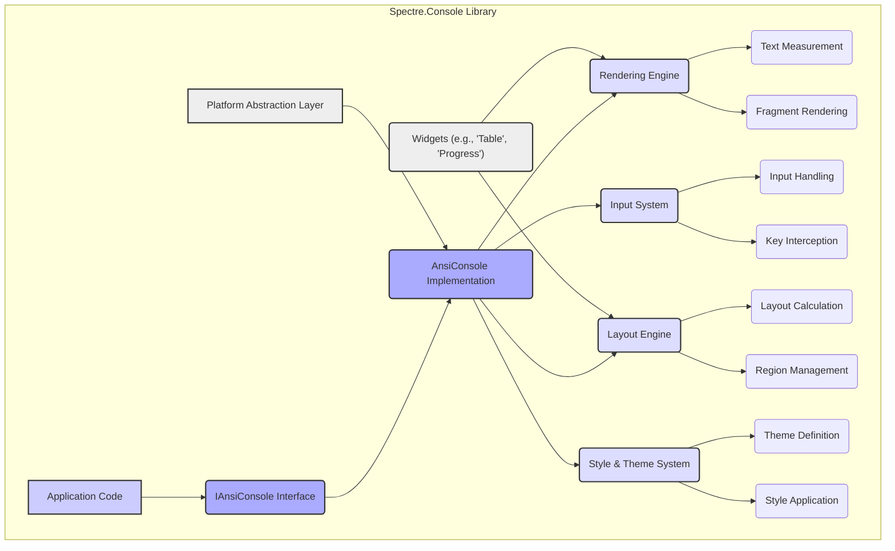
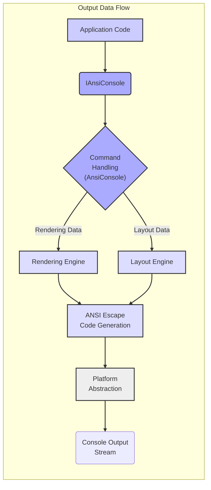
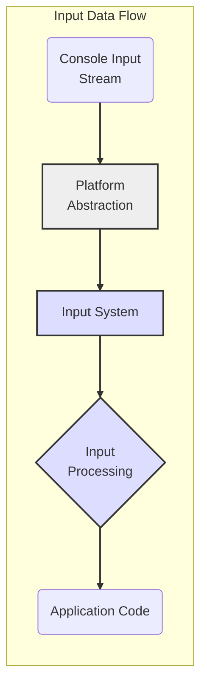

# Project Design Document: Spectre.Console

**Version:** 1.1
**Date:** October 26, 2023
**Prepared By:** AI Software Architect

## 1. Introduction

This document provides an enhanced and more detailed design overview of the Spectre.Console library, an open-source .NET library dedicated to creating visually appealing and interactive console applications. This document serves as a foundational resource for subsequent threat modeling activities, offering a comprehensive understanding of the library's architecture, key components, and data flow. The goal is to provide sufficient detail for security experts to identify potential vulnerabilities.

## 2. Goals and Objectives

The primary goal of this design document is to provide an even more granular articulation of the internal structure and functionality of Spectre.Console to facilitate a deeper and more effective threat modeling process. Specific objectives include:

*   Providing detailed descriptions of all major components, including their sub-components and specific responsibilities.
*   Clearly mapping the flow of various types of data within the library, including input, output, and configuration data.
*   Elucidating the interactions and dependencies between different components.
*   Proactively highlighting potential areas of security concern based on a more in-depth understanding of the design.
*   Serving as a reference point for developers and security auditors.

## 3. Project Overview

Spectre.Console is a sophisticated .NET library designed to elevate the user experience of console applications. It achieves this through a rich set of features, including:

*   Advanced text rendering with support for markup languages (like BBCode or a custom syntax).
*   Flexible layout management enabling the creation of complex console UIs.
*   Interactive elements such as prompts, selection lists, and forms for user input.
*   Visual feedback mechanisms like progress bars, status indicators, and spinners.
*   Structured output capabilities, including tables, trees, and calendars.
*   Extensive theming and styling options for customizing the appearance.
*   Cross-platform compatibility, abstracting away platform-specific console differences.
*   Support for ANSI escape codes and potentially other terminal control sequences.

The library is intended for seamless integration into existing .NET console applications via NuGet package installation. Its API is designed for ease of use and extensibility.

## 4. System Architecture

Spectre.Console employs a layered and modular architecture, promoting separation of concerns and maintainability. The central element remains the `IAnsiConsole` interface, which acts as the facade for all console operations.

### 4.1. Key Components (Detailed)

*   **`IAnsiConsole` Interface and `AnsiConsole` Implementation:**
    *   The `IAnsiConsole` interface defines the contract for all console-related operations, such as writing formatted text, reading input, clearing the screen, and querying console dimensions.
    *   The `AnsiConsole` class provides the concrete implementation of this interface, orchestrating the interactions between other internal components. It often acts as a mediator.
    *   It manages the current console state and provides access to features like styling and input handling.

*   **Rendering Engine:**
    *   The core responsibility is to translate abstract representations of console output (e.g., styled text, layout elements) into a stream of ANSI escape codes (or potentially other terminal control sequences).
    *   It handles the interpretation of markup syntax (if present) and applies the corresponding formatting.
    *   It manages the cursor position and provides mechanisms for moving and manipulating it.
    *   It needs to be aware of different terminal capabilities to ensure optimal rendering across various platforms.

*   **Input System:**
    *   Provides a set of APIs for capturing and processing user input from the console.
    *   Includes functionalities for reading single characters, entire lines of text, and handling key presses.
    *   Supports interactive prompts with features like validation, default values, and potentially masked input.
    *   Manages the state of interactive elements like selection lists and forms.

*   **Layout Engine:**
    *   Responsible for arranging visual elements on the console screen according to specified layout rules.
    *   Handles the positioning, alignment, and sizing of elements.
    *   Implements different layout strategies (e.g., stacking, grids, flow layouts).
    *   Manages text wrapping and truncation when content exceeds available space.

*   **Style and Theme System:**
    *   Allows developers to customize the visual appearance of console output through themes and individual styles.
    *   Themes define a collection of named styles that can be applied to different elements.
    *   Styles specify attributes like foreground and background colors, text attributes (bold, italic, underline), and potentially other visual properties.
    *   The system handles the application of styles to renderable elements during the rendering process.

*   **Text Measurement:**
    *   Provides functionality to calculate the rendered width and height of text elements, taking into account applied styles and terminal characteristics.
    *   This information is crucial for the Layout Engine to make informed decisions about element placement and wrapping.

*   **Fragment Rendering:**
    *   Breaks down complex output into smaller, manageable rendering units (fragments).
    *   This approach can improve performance by allowing for incremental rendering and optimization of the rendering process.

*   **Input Handling:**
    *   Manages the flow of input events received from the console.
    *   Translates raw input events (e.g., key presses, mouse clicks - if supported) into meaningful actions within the library.

*   **Key Interception:**
    *   Allows the library to intercept specific key presses before they are processed by the underlying operating system or application.
    *   This is essential for implementing interactive features and custom input handling.

*   **Layout Calculation:**
    *   Performs the calculations necessary to determine the precise position and dimensions of elements based on the defined layout rules and available console space.

*   **Region Management:**
    *   Provides a mechanism for managing and updating specific rectangular areas (regions) of the console screen.
    *   This can be used for efficiently updating dynamic content like progress bars or status indicators without redrawing the entire screen.

*   **Theme Definition:**
    *   Defines the structure and properties of themes, allowing developers to create and manage custom themes.

*   **Style Application:**
    *   Applies the defined styles to renderable elements based on their type and context.

*   **Widgets:**
    *   Pre-built, reusable UI components such as tables, progress bars, selection prompts, and forms.
    *   These widgets encapsulate the underlying rendering and layout logic, providing a higher-level abstraction for common UI patterns.

*   **Platform Abstraction Layer:**
    *   Provides an abstraction over platform-specific console APIs and behaviors.
    *   Ensures consistent functionality and rendering across different operating systems (Windows, Linux, macOS).
    *   Handles differences in terminal capabilities and ANSI escape code support.

## 5. Data Flow (Enhanced)

The data flow within Spectre.Console can be categorized into output rendering and input processing.

### 5.1. Output Rendering Data Flow:

1. **Application Code Invocation:** The application code calls methods on the `IAnsiConsole` interface to request rendering of specific content (e.g., `Write()`, `WriteLine()`, `Render()`).
2. **Command Handling in `AnsiConsole`:** The `AnsiConsole` implementation receives the rendering command and determines the appropriate internal component to handle it (e.g., Rendering Engine for text, Layout Engine for widgets).
3. **Data Transformation and Processing:** The data to be rendered is transformed into an internal representation suitable for the rendering pipeline. This might involve parsing markup, structuring data for tables, etc.
4. **Layout Calculation (if applicable):** For complex layouts or widgets, the Layout Engine calculates the positions and sizes of elements based on available space and layout rules.
5. **Rendering and ANSI Code Generation:** The Rendering Engine takes the processed data and layout information and generates the sequence of ANSI escape codes required to produce the desired visual output on the console. This involves applying styles, handling text formatting, and managing cursor movements.
6. **Platform Abstraction:** The Platform Abstraction Layer might intercept the ANSI escape code sequence to adapt it to specific terminal requirements or to utilize platform-specific console APIs for better performance or compatibility.
7. **Output to Terminal Stream:** The final sequence of ANSI escape codes is written to the console's output stream.
8. **Terminal Rendering:** The terminal emulator interprets the ANSI escape codes and renders the visual output on the screen.

### 5.2. Input Processing Data Flow:

1. **User Input Event:** The user interacts with the console by typing text or pressing keys.
2. **Input Capture:** The operating system captures the input event and makes it available to the application.
3. **Input System Reception:** The Input System within Spectre.Console receives the raw input event, potentially through the Platform Abstraction Layer.
4. **Input Processing and Interpretation:** The Input Handling component processes the raw input, interpreting key combinations, handling special characters, and managing the state of interactive prompts or widgets.
5. **Data Transformation (if applicable):** For interactive prompts, the input might be validated or transformed based on the prompt's configuration.
6. **Data Return to Application:** The processed input data is returned to the application code, often through a callback or by returning a value from an input method.

## 6. Key Components in Detail (Further Expansion)

*   **Rendering Engine:**
    *   Internally uses a buffer or similar structure to represent the console screen.
    *   May employ techniques like double-buffering to prevent flickering.
    *   Handles the complexities of combining character glyphs with style information.
    *   Potentially supports different rendering modes or fallbacks for terminals with limited capabilities.
*   **Input System:**
    *   Might utilize asynchronous operations for non-blocking input.
    *   Implements logic for handling different types of input events (e.g., key down, key up, mouse events if supported).
    *   Provides APIs for customizing input prompts and handling user interactions.
*   **Layout Engine:**
    *   Likely uses a hierarchical structure to represent the layout of elements.
    *   Implements algorithms for calculating element sizes and positions based on constraints and available space.
    *   May support features like scrolling or virtualized rendering for large layouts.
*   **Style and Theme System:**
    *   Could use a cascading system to resolve style conflicts.
    *   Might support different ways of defining styles (e.g., inline, through themes, CSS-like syntax).
    *   Needs to efficiently apply styles during the rendering process.
*   **Widgets:**
    *   Each widget likely has its own internal state and rendering logic.
    *   Widgets interact with the Layout Engine to position themselves on the console.
    *   They often expose configuration options to customize their appearance and behavior.
*   **Platform Abstraction Layer:**
    *   Identifies the underlying operating system and terminal type.
    *   Provides wrappers around platform-specific console APIs (e.g., `kernel32.dll` on Windows, `ncurses` or similar on Linux/macOS).
    *   Handles differences in ANSI escape code support and terminal behavior.

## 7. Security Considerations (Detailed)

Building upon the preliminary considerations, here's a more detailed look at potential security concerns:

*   **ANSI Escape Code Injection:**
    *   If user-supplied data is directly embedded into ANSI escape sequences without proper encoding or sanitization, malicious actors could inject arbitrary terminal commands.
    *   This could lead to:
        *   Clearing or manipulating the terminal screen in unexpected ways.
        *   Changing terminal settings (e.g., font, colors).
        *   Potentially executing arbitrary commands if the terminal emulator has vulnerabilities.
    *   Mitigation strategies include: carefully encoding user input, using parameterized rendering methods, and potentially sandboxing the rendering process.

*   **Denial of Service (DoS):**
    *   Crafted input with extremely long strings or deeply nested structures could consume excessive CPU time or memory during rendering or layout calculations.
    *   Rendering a very large number of elements or complex tables could also lead to performance degradation or crashes.
    *   Mitigation strategies involve: input validation, resource limits, and potentially implementing timeouts or cancellation mechanisms.

*   **Input Validation Vulnerabilities:**
    *   If interactive prompts or input fields do not properly validate user input, applications using Spectre.Console could be vulnerable to injection attacks (e.g., SQL injection if the input is used in database queries) or other forms of data manipulation.
    *   Insufficient validation could also lead to unexpected application behavior or crashes.
    *   Mitigation involves implementing robust input validation rules and sanitization techniques.

*   **Dependency Vulnerabilities:**
    *   Spectre.Console relies on other NuGet packages. Vulnerabilities in these dependencies could indirectly affect the security of applications using Spectre.Console.
    *   Regularly auditing and updating dependencies is crucial.

*   **Information Disclosure:**
    *   Carelessly displaying sensitive information (e.g., passwords, API keys) on the console, even if styled, can lead to information disclosure.
    *   Error messages or debugging output generated by Spectre.Console itself might inadvertently reveal sensitive details.
    *   Mitigation involves careful handling of sensitive data and ensuring that error messages are sanitized in production environments.

*   **Terminal Emulator Vulnerabilities:**
    *   While not a direct vulnerability in Spectre.Console, the library's reliance on terminal emulators means that vulnerabilities in those emulators could be exploited through crafted ANSI escape sequences generated by the library (even if the library itself is not directly injecting malicious code).

## 8. Deployment Considerations

Spectre.Console is deployed as a NuGet package dependency. Key considerations include:

*   **NuGet Package Management:** Ensure the NuGet package is sourced from a trusted repository.
*   **Dependency Conflicts:** Be aware of potential dependency conflicts with other libraries used in the application.
*   **Runtime Requirements:** Spectre.Console requires the .NET runtime to be present on the target system.
*   **No Special Installation:** Typically, no special installation steps beyond adding the NuGet package are required.

## 9. Future Considerations

Future development could introduce:

*   Enhanced accessibility features for users with disabilities.
*   More sophisticated layout algorithms and customization options.
*   Improved support for non-ANSI terminals or alternative console technologies.
*   New widgets and interactive components.
*   Potentially a plugin architecture for extending functionality.

These future enhancements will necessitate ongoing review of the design and potential security implications.

## 10. Conclusion

This enhanced design document provides a more in-depth understanding of the Spectre.Console library's architecture, data flow, and potential security considerations. This detailed information is essential for conducting thorough threat modeling and for ensuring the secure and reliable use of the library in console applications. This document serves as a valuable resource for developers, security auditors, and anyone seeking a deeper understanding of Spectre.Console's internals.