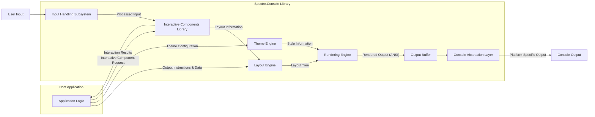

## Project Design Document: Spectre.Console

**Version:** 1.1
**Date:** October 26, 2023
**Author:** AI Software Architect

### 1. Introduction

This document provides an enhanced design overview of the Spectre.Console project, a .NET library designed to enrich the user experience of console applications. This detailed design serves as a crucial artifact for subsequent threat modeling activities, offering a comprehensive understanding of the library's internal structure, data pathways, and interactions with its hosting environment.

### 2. Goals

*   Deliver a refined and more detailed description of the Spectre.Console architecture, emphasizing security-relevant aspects.
*   Clearly define the responsibilities of each key component and their potential security implications.
*   Provide a more granular illustration of data flow within the library, highlighting potential points of vulnerability.
*   Proactively identify and elaborate on potential areas of interest for security analysis and threat modeling, offering concrete examples.

### 3. Project Overview

Spectre.Console empowers .NET developers to craft visually engaging and interactive console applications. Its core functionalities include:

*   **Sophisticated Layout Management:** Enables precise arrangement of console elements, contributing to a structured user interface.
*   **Rich Styling and Theming:** Allows customization of text and element appearance, enhancing visual appeal and potentially conveying information through styling.
*   **Interactive User Components:** Offers pre-built elements for user engagement, such as prompts for input, selection lists for choices, and confirmation dialogs.
*   **Informative Progress Indicators:** Provides visual feedback on long-running operations through progress bars and status displays.
*   **Structured Data Presentation:** Facilitates the display of data in organized formats like tables and trees, improving readability and comprehension.

Spectre.Console operates as a library integrated into existing .NET console applications. It is not a standalone executable but rather a set of tools and functionalities invoked by the host application to manage console output and interaction.

### 4. Architectural Design

Spectre.Console's architecture comprises several interconnected components, each playing a vital role in rendering and managing console interactions. Understanding these components is crucial for identifying potential security boundaries and vulnerabilities.

*   **Input Handling Subsystem:**
    *   **Responsibility:** Captures and processes raw user input from the console, including keyboard and potentially mouse events, depending on terminal capabilities.
    *   **Security Relevance:** This is a primary entry point for user-supplied data. Insufficient validation here could lead to vulnerabilities like command injection if input is later used in system calls by the host application, or manipulation of application logic.
    *   **Examples:** Handling of special characters in prompts, parsing of user-provided values.

*   **Layout Engine:**
    *   **Responsibility:** Determines the spatial arrangement of elements within the console window. It calculates the position and size of each rendered element based on provided data and layout rules.
    *   **Security Relevance:** While seemingly benign, vulnerabilities here could potentially lead to denial-of-service if malformed layout instructions cause excessive computation or memory allocation.
    *   **Examples:** Handling of extremely large or nested layout structures.

*   **Rendering Engine:**
    *   **Responsibility:** The core of Spectre.Console, responsible for translating the structured layout and styled content into a sequence of characters and ANSI escape codes that the console interprets. It directly interacts with the console output stream.
    *   **Security Relevance:** This component handles the generation of ANSI escape codes. A vulnerability here could allow an attacker to inject arbitrary escape sequences, potentially manipulating the terminal display in unexpected ways or even exploiting terminal vulnerabilities.
    *   **Examples:** Generation of color codes, cursor movement commands, and potentially terminal-specific control sequences.

*   **Interactive Components Library:**
    *   **Responsibility:** Provides a set of reusable UI elements for facilitating user interaction.
    *   **Security Relevance:** Each interactive component represents a potential point of interaction with the user and thus a potential entry point for malicious input. Proper input validation and sanitization within these components are critical.
    *   **Examples:**
        *   `Prompt<T>`:  Requires careful validation of the input string to ensure it conforms to the expected type and format, preventing type confusion or injection attacks.
        *   `SelectionPrompt<T>`:  Needs to ensure that the selected option is within the valid range and that the display of options doesn't introduce vulnerabilities.
        *   `TextEditor`: Handling of multi-line input requires careful consideration of potential injection attacks if the input is later processed by the host application.

*   **Theme Engine:**
    *   **Responsibility:** Manages the visual appearance of console output by allowing the definition and application of styles to different elements.
    *   **Security Relevance:** While primarily aesthetic, vulnerabilities in theme parsing or application could potentially lead to unexpected behavior or even denial-of-service if malformed themes cause errors.
    *   **Examples:** Handling of invalid color codes or style definitions.

*   **Output Buffer:**
    *   **Responsibility:** An internal memory structure that holds the rendered output before it is flushed to the console. This allows for efficient batching of output operations.
    *   **Security Relevance:** While not directly exposed, vulnerabilities in how data is written to or read from the buffer could potentially lead to information leakage or corruption.

*   **Console Abstraction Layer:**
    *   **Responsibility:** Provides an abstraction over the underlying platform-specific console implementation. This allows Spectre.Console to function consistently across different operating systems and terminal emulators.
    *   **Security Relevance:** This layer needs to handle differences in terminal capabilities securely. Incorrect handling of terminal-specific features could introduce vulnerabilities or unexpected behavior.

### 5. Data Flow

The interaction within Spectre.Console involves a flow of data initiated by the host application and potentially influenced by user input. Understanding this flow is crucial for identifying potential points of interception or manipulation.

**Detailed Data Flow Description:**

*   The **Host Application** (A) initiates the process by sending **Output Instructions & Data** to the **Layout Engine** (C), specifying what content needs to be displayed.
*   The **Host Application** (A) also provides **Theme Configuration** to the **Theme Engine** (F), defining the visual style of the output.
*   When user interaction is required, the **Host Application** (A) sends an **Interactive Component Request** to the **Interactive Components Library** (E).
*   The **User Input** (J) is captured by the **Input Handling Subsystem** (B).
*   The **Input Handling Subsystem** (B) sends the **Processed Input** to the relevant component in the **Interactive Components Library** (E).
*   The **Interactive Components Library** (E) processes the input and sends **Interaction Results** back to the **Host Application** (A). It may also send **Layout Information** to the **Layout Engine** (C) to update the display based on user interaction.
*   The **Layout Engine** (C) uses the received data and instructions to create a **Layout Tree**, representing the arrangement of elements.
*   The **Theme Engine** (F) provides **Style Information** to the **Rendering Engine** (D).
*   The **Rendering Engine** (D) combines the **Layout Tree** and **Style Information** to generate **Rendered Output (ANSI)**, which includes text content and ANSI escape codes for formatting.
*   The **Rendered Output (ANSI)** is stored in the **Output Buffer** (G).
*   The **Console Abstraction Layer** (H) retrieves the buffered output and translates it into **Platform-Specific Output** suitable for the underlying console.
*   Finally, the **Platform-Specific Output** is sent to the **Console Output** (I), making it visible to the user.

### 6. Security Considerations (Detailed for Threat Modeling)

This section expands on potential security concerns, providing more specific examples for threat modeling.

*   **Input Validation Vulnerabilities in Interactive Components:**
    *   **Threat:** Malicious users could provide unexpected or crafted input to interactive prompts (e.g., `Prompt<T>`) to bypass validation, inject commands, or cause application errors.
    *   **Example:** A `Prompt<int>` might not handle non-numeric input gracefully, leading to exceptions. A prompt expecting a filename could be exploited with path traversal characters (`../`) if not properly sanitized.
    *   **Mitigation:** Implement robust input validation within each interactive component, using type checking, regular expressions, and whitelisting of allowed characters.

*   **ANSI Escape Code Injection Attacks:**
    *   **Threat:** If the host application incorporates user-provided data directly into Spectre.Console output without proper sanitization, attackers could inject malicious ANSI escape codes.
    *   **Example:** Injecting escape codes to clear the screen, change text colors to be unreadable, or even attempt to exploit vulnerabilities in specific terminal emulators.
    *   **Mitigation:** Sanitize user-provided data before using it with Spectre.Console, potentially by stripping or escaping ANSI escape codes.

*   **Dependency Vulnerabilities:**
    *   **Threat:** Spectre.Console relies on other .NET libraries. Vulnerabilities in these dependencies could be indirectly exploitable.
    *   **Example:** A vulnerability in a JSON parsing library used for theme loading could allow an attacker to craft a malicious theme file.
    *   **Mitigation:** Regularly update dependencies to their latest secure versions and perform security audits of the dependency tree.

*   **Information Disclosure through Console Output:**
    *   **Threat:** Sensitive information might be inadvertently displayed on the console due to incorrect usage of Spectre.Console or lack of awareness of what data is being rendered.
    *   **Example:** Displaying database connection strings, API keys, or personally identifiable information in error messages or debugging output.
    *   **Mitigation:** Carefully review all console output and ensure that sensitive data is never directly displayed. Use logging mechanisms for sensitive information instead.

*   **Resource Exhaustion through Excessive Output:**
    *   **Threat:** A malicious application using Spectre.Console could intentionally generate a massive amount of console output, potentially causing performance issues or even crashing the application or the terminal.
    *   **Example:** Looping indefinitely and printing large amounts of text or complex tables.
    *   **Mitigation:** Implement safeguards in the host application to limit the amount of data being passed to Spectre.Console for rendering.

*   **Security of Custom Themes:**
    *   **Threat:** If users can provide custom themes, vulnerabilities in the theme parsing logic could be exploited by crafting malicious theme files.
    *   **Example:** A theme file could contain excessively large style definitions leading to memory exhaustion or trigger vulnerabilities in the parsing library.
    *   **Mitigation:** Implement robust validation and sanitization of custom theme files. Consider using a well-established and secure format for themes.

*   **Terminal Emulation Security Reliance:**
    *   **Threat:** Spectre.Console's security is partially dependent on the security of the underlying terminal emulator. Vulnerabilities in the terminal emulator itself could be exploited through crafted ANSI escape sequences generated by Spectre.Console (even if Spectre.Console itself is not directly vulnerable).
    *   **Mitigation:** Educate users about the importance of using up-to-date and reputable terminal emulators.

### 7. Dependencies

Spectre.Console likely relies on several core .NET libraries and potentially some third-party packages. A thorough analysis of the project's `csproj` file would be necessary for a definitive list. Common dependencies for such a library might include:

*   `System.Console`: Provides fundamental console interaction capabilities.
*   `System.ComponentModel.DataAnnotations`: Potentially used for input validation within interactive components.
*   `System.Text.Encodings.Web`: Could be used for encoding and decoding text for console output.
*   Potentially a library for handling ANSI escape code manipulation or parsing if not implemented directly.

### 8. Deployment

Spectre.Console is typically deployed as a NuGet package, integrated into the dependencies of a .NET console application. The security of the deployment process hinges on the integrity of the NuGet package source and the security practices of the developers consuming the package.

### 9. Future Considerations

Future enhancements to Spectre.Console might introduce new security considerations:

*   **Advanced Interactive Components (e.g., graphical elements):** Could introduce new attack surfaces related to rendering and event handling.
*   **Network Integration (if any):**  Would introduce network security concerns.
*   **Scripting or Plugin Capabilities:** Could allow for the execution of untrusted code.

### 10. Conclusion

This enhanced design document provides a more in-depth understanding of the Spectre.Console library, specifically tailored for threat modeling. By detailing the architecture, data flow, and potential security considerations with concrete examples, this document serves as a valuable resource for identifying and mitigating potential vulnerabilities. Continuous review and updates to this document are crucial as the library evolves.