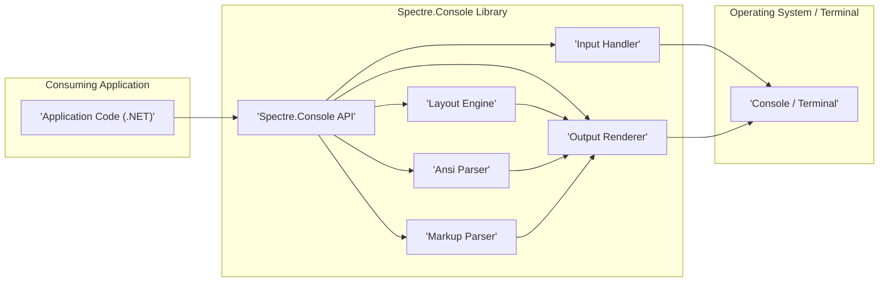
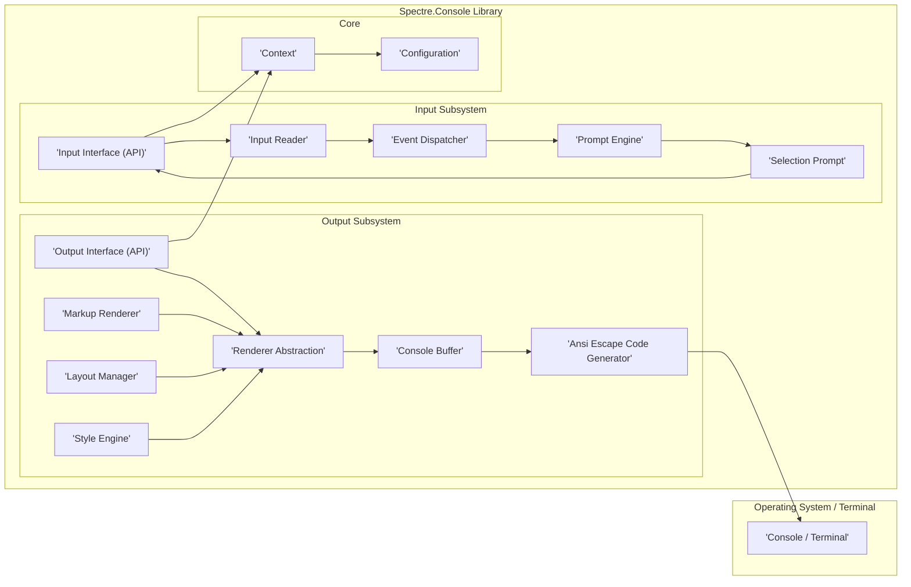
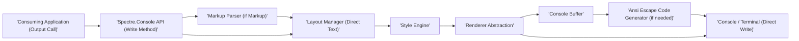
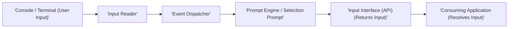

# Project Design Document: Spectre.Console (Improved)

**Project Name:** Spectre.Console

**Project Repository:** [https://github.com/spectreconsole/spectre.console](https://github.com/spectreconsole/spectre.console)

**Version:** 1.1 (Design Document - Improved Draft)

**Date:** October 26, 2023

**Author:** AI Expert (Based on Spectre.Console Public Information)

## 1. Introduction

This document provides an enhanced design overview of the Spectre.Console library, a .NET library designed to simplify the creation of visually appealing, cross-platform, and interactive console applications. This document is intended to serve as a robust foundation for threat modeling and security analysis of projects that integrate Spectre.Console. It comprehensively outlines the system architecture, detailing key components, data flow, technology stack, and security considerations. This document will be used as a basis for subsequent threat modeling activities.

## 2. Goals and Objectives

The primary goals of Spectre.Console are to empower developers to:

* **Simplify and Enhance Console UI Development:** Offer a developer-friendly, high-level API that abstracts away the complexities of console interaction.
* **Create Rich User Experiences in the Console:** Enable the development of visually engaging and interactive console applications by providing features such as:
    * **Rich Text Formatting:** Support for colors, styles (bold, italic, underline), and a declarative markup language for text styling.
    * **Sophisticated Layout Management:** Tools for structuring console output using grids, columns, panels, and other layout primitives.
    * **Interactive Elements:**  A suite of interactive components including prompts, selection lists, progress bars, tables, and forms to facilitate user interaction.
    * **Cross-Platform Compatibility:** Ensure consistent behavior and appearance across different operating systems (Windows, macOS, Linux) and terminal environments.
* **Boost Developer Productivity:** Minimize boilerplate code and streamline common console application development tasks, allowing developers to focus on application logic.
* **Promote Extensibility and Customization:** Design the library to be extensible, allowing developers to tailor and expand its functionality to meet specific project needs.

## 3. System Architecture

Spectre.Console is architected as a .NET class library that is directly embedded within a consuming .NET application. It operates within the application's process and does not function as a standalone service or application. The architecture is described at two levels of detail:

### 3.1. High-Level Architecture

This diagram illustrates the top-level components and their interactions within the Spectre.Console ecosystem.

**Detailed Component Descriptions (High-Level):**

* **"'Application Code (.NET)'":** This represents the user's .NET application code that utilizes the Spectre.Console library. It's the entry point for all Spectre.Console functionalities.
* **"'Spectre.Console API'":** This is the public-facing API of the library. It provides classes, interfaces, and methods that the consuming application uses to interact with Spectre.Console. This includes functionalities for writing formatted output, capturing user input, managing layouts, and creating interactive prompts.
* **"'Input Handler'":** This component is responsible for managing user input from the console. It captures keystrokes, mouse events (if supported by the terminal and Spectre.Console), and other input signals. It processes raw input and makes it available to other components, particularly the Prompt Engine and Selection Prompt.
* **"'Output Renderer'":** The core component responsible for rendering formatted output to the console. It takes processed output data from the Layout Engine, Ansi Parser, and Markup Parser and translates it into commands that the console/terminal can understand. This includes generating ANSI escape codes for styling and positioning text.
* **"'Layout Engine'":** This engine manages the spatial arrangement of elements on the console screen. It handles layout directives from the API and Markup Parser to organize output into grids, columns, panels, and other structured layouts. It ensures elements are positioned correctly within the console buffer.
* **"'Ansi Parser'":** This component is responsible for interpreting ANSI escape codes embedded within input strings or markup. It parses these codes to extract styling and formatting instructions (e.g., colors, text attributes) and passes these instructions to the Output Renderer.
* **"'Markup Parser'":** Spectre.Console uses a custom markup language to allow developers to declaratively style text and structure output. The Markup Parser interprets this markup, converting it into formatting instructions that are then used by the Layout Engine and Output Renderer.
* **"'Console / Terminal'":** This represents the actual terminal emulator or console window where the application's output is displayed and where user input is received. Spectre.Console interacts with this environment through standard input/output streams and potentially terminal-specific APIs.

### 3.2. Component-Level Architecture (Detailed)

This diagram provides a more granular view of the internal components within Spectre.Console, focusing on the input and output subsystems and their interactions with core library components.

**Detailed Component Descriptions (Component-Level):**

* **"Input Subsystem":**
    * **"'Input Interface (API)'":**  The entry point for the consuming application to initiate input operations. This includes methods for reading lines, prompting for specific types of input, and displaying selection prompts. Examples include `Console.ReadLine()`, `Prompt<T>()`, and `SelectionPrompt<T>()`.
    * **"'Input Reader'":**  Handles the low-level interaction with the console's input stream. It reads raw input data (bytes or characters) from the console, potentially buffering input and handling encoding.
    * **"'Event Dispatcher'":**  Processes the raw input stream from the Input Reader and translates it into meaningful input events. This might involve handling special keys (arrow keys, tab, enter), character input, and potentially mouse events if supported. It routes these events to the appropriate handlers, such as the Prompt Engine or Selection Prompt.
    * **"'Prompt Engine'":**  Manages the logic for displaying prompts to the user and validating their input. It handles different types of prompts (text, password, confirmation) and ensures that user input conforms to expected formats or criteria.
    * **"'Selection Prompt'":**  Implements interactive selection prompts, allowing users to choose from a list of options. This component handles displaying the selection list, navigating through it (using arrow keys, etc.), and capturing the user's selection.

* **"Output Subsystem":**
    * **"'Output Interface (API)'":** The entry point for the consuming application to write output to the console. This includes methods for writing plain text, formatted text using markup, and rendering complex UI elements like tables and progress bars. Examples include `Console.Write()`, `WriteMarkup()`, and methods for rendering tables and grids.
    * **"'Renderer Abstraction'":**  Provides an abstraction layer to handle differences between various console/terminal implementations. It isolates the rest of the Output Subsystem from terminal-specific details, allowing Spectre.Console to work consistently across different platforms and terminal types.
    * **"'Console Buffer'":**  An in-memory representation of the console display. Spectre.Console builds the output in this buffer before rendering it to the actual console. This allows for efficient layout management and rendering of complex UI elements.
    * **"'Ansi Escape Code Generator'":**  Generates ANSI escape codes to control text formatting (colors, styles, cursor positioning) in terminals that support them. This component translates styling instructions from the Style Engine and Markup Renderer into ANSI sequences.
    * **"'Markup Renderer'":**  Parses Spectre.Console's markup language and converts it into rendering instructions. It identifies markup tags, extracts styling information, and passes these instructions to the Style Engine and Layout Manager.
    * **"'Layout Manager'":**  Responsible for arranging elements within the Console Buffer according to layout specifications. It handles grids, columns, panels, and other layout structures, ensuring elements are positioned correctly and do not overlap unintentionally.
    * **"'Style Engine'":**  Manages styles and themes applied to console output. It defines default styles, allows customization of styles, and applies styles based on markup, themes, and context.

* **"Core":**
    * **"'Context'":**  A central object that holds global state and dependencies for the Spectre.Console library. It provides access to configuration, environment information, and other shared resources.
    * **"'Configuration'":**  Manages configuration settings for Spectre.Console, allowing developers to customize various aspects of the library's behavior, such as default styles, console encoding, and input/output settings.

## 4. Data Flow

The data flow within Spectre.Console is primarily concerned with processing output to be displayed on the console and handling user input.

### 4.1. Output Data Flow (Detailed)

**Detailed Data Flow Description (Output):**

1. **"'Consuming Application (Output Call)'":** The application initiates an output operation by calling a Spectre.Console API method, such as `Console.WriteMarkup()`, `WriteLine()`, or methods for rendering tables or progress bars.
2. **"'Spectre.Console API (Write Method)'":** The API method receives the output data, which could be plain text, markup strings, or objects representing UI elements.
3. **"'Markup Parser (if Markup)'":** If the output includes markup, the Markup Parser processes the markup string. It parses the markup tags to identify formatting and layout instructions embedded within the text.
4. **"'Layout Manager'":** The Layout Manager receives the parsed markup instructions (or direct text if no markup is used) and determines the positioning and arrangement of the output within the console buffer. It takes into account layout directives, current console state, and potentially previously rendered elements.
5. **"'Style Engine'":** The Style Engine applies styling to the output. It uses style information derived from markup, themes, and default settings to determine the visual appearance of text and UI elements (colors, fonts, text attributes).
6. **"'Renderer Abstraction'":** The Renderer Abstraction layer takes the styled and layout-managed output and prepares it for rendering on the target console. It handles terminal-specific differences and ensures compatibility across various console environments.
7. **"'Console Buffer'":** The formatted output is written into the Console Buffer. This buffer holds the complete representation of what will be displayed on the console.
8. **"'Ansi Escape Code Generator (if needed)'":** If the target terminal supports ANSI escape codes, the Ansi Escape Code Generator translates the styling information into ANSI escape sequences. These sequences are embedded within the output stream to control text formatting in the terminal.
9. **"'Console / Terminal'":** Finally, the content of the Console Buffer is rendered to the Console / Terminal. This might involve writing the output stream (potentially with ANSI codes) to the console's standard output stream. In some cases, the Renderer Abstraction might directly write to the console if ANSI codes are not needed or supported.

### 4.2. Input Data Flow (Detailed)

**Detailed Data Flow Description (Input):**

1. **"'Console / Terminal (User Input)'":** The user interacts with the console by providing input, such as typing text, pressing keys (including special keys like arrow keys or function keys), or potentially using mouse input if supported by the terminal and Spectre.Console.
2. **"'Input Reader'":** The Input Reader captures the raw input stream from the console. It reads bytes or characters as they are provided by the operating system's console input mechanism.
3. **"'Event Dispatcher'":** The Event Dispatcher processes the raw input stream. It interprets the input data to identify input events, such as key presses, key releases, special key sequences, and potentially mouse events. It translates raw input into higher-level input events that are meaningful to Spectre.Console.
4. **"'Prompt Engine / Selection Prompt'":** If an interactive prompt or selection prompt is active, the Event Dispatcher routes relevant input events to the Prompt Engine or Selection Prompt. These components process the input events in the context of the active prompt. For example, in a text prompt, they might accumulate typed characters; in a selection prompt, they might handle arrow key presses to navigate the selection list. Input validation might also occur at this stage.
5. **"'Input Interface (API) (Returns Input)'":** Once the Prompt Engine or Selection Prompt has processed the user input and determined that a complete input has been received (e.g., the user pressed Enter in a text prompt, or selected an item in a selection prompt), the processed input is returned to the Consuming Application through the Input Interface (API).
6. **"'Consuming Application (Receives Input)'":** The Consuming Application receives the processed user input from Spectre.Console. The application can then use this input to drive its logic and determine the next steps in its execution.

## 5. Technology Stack

* **Programming Language:** C#
* **.NET Framework/ .NET:**  Designed for modern .NET versions, including .NET 6, .NET 7, and later. Leverages the cross-platform capabilities of .NET to ensure compatibility across Windows, macOS, and Linux.
* **Cross-Platform Compatibility:** Achieved through .NET's cross-platform runtime and careful design to abstract away platform-specific console behaviors.
* **Dependencies:**  Relies primarily on standard .NET base class libraries. May utilize NuGet packages for specific functionalities such as:
    * **Terminal Detection:** Libraries to accurately identify the type of terminal being used to optimize rendering and feature support.
    * **ANSI Code Handling:** Libraries that assist in generating and potentially parsing ANSI escape codes, although Spectre.Console likely has significant internal logic for this.
    * **Potentially other utility libraries:**  For tasks like string manipulation, collections, and asynchronous operations. (A definitive list is available in the project's `csproj` file and NuGet package manifest).

## 6. Security Considerations (For Threat Modeling)

This section details security considerations relevant to Spectre.Console, providing a basis for threat modeling.

* **Input Validation Vulnerabilities:**
    * **Markup Injection:**  If user-provided input or data from external sources is incorporated into markup strings without proper sanitization, it can lead to markup injection. Attackers could inject malicious markup to:
        * **Manipulate Console Output:** Alter the intended display, potentially misleading users or hiding critical information.
        * **Cause Denial of Service:** Inject excessively complex markup that consumes rendering resources, leading to performance degradation or crashes.
        * **Potentially Exploit Rendering Engine Bugs:** Crafted markup might trigger vulnerabilities in the Markup Renderer or Output Renderer.
        * **Example:** Imagine a scenario where a username is displayed in a panel title using markup: `Console.WriteMarkup($"[bold blue]User Panel[/]: {userInput}");`. If `userInput` is not sanitized and contains markup like `[red on white]ATTACK![/]`, it could inject unexpected styling.
    * **Command Injection (Unlikely but worth considering in specific scenarios):** While Spectre.Console is primarily a UI library, if there are any indirect pathways where user input processed by Spectre.Console could influence system commands (e.g., through application logic that uses Spectre.Console input to construct commands), command injection could become a concern. This is less likely within Spectre.Console itself but could be a risk in consuming applications.

* **Output Encoding and Rendering Vulnerabilities:**
    * **ANSI Escape Code Injection:**  If an attacker can inject arbitrary ANSI escape codes into output streams (through user input or external data), they could:
        * **Manipulate Terminal Display:** Clear the screen, move the cursor to arbitrary positions, change colors to make output unreadable, or create misleading displays.
        * **Attempt to Exploit Terminal Emulator Vulnerabilities:** Some terminal emulators might have vulnerabilities related to the processing of specific ANSI escape sequences. Crafted sequences could potentially trigger these vulnerabilities.
        * **Example:** Injecting `\x1b[2J` (ANSI escape code to clear the screen) could disrupt the console display.
    * **Terminal Emulation Bugs:** Spectre.Console relies on the terminal emulator to correctly interpret ANSI escape codes. Bugs or inconsistencies in terminal emulators could lead to unexpected rendering behavior or potential security issues if exploited.

* **Dependency Management Risks:**
    * **Third-Party Dependency Vulnerabilities:** Spectre.Console depends on NuGet packages. Vulnerabilities in these dependencies could indirectly impact Spectre.Console and applications using it. This highlights the importance of:
        * **Regular Dependency Scanning:** Periodically scanning dependencies for known vulnerabilities using tools like vulnerability scanners.
        * **Dependency Updates:** Promptly updating to patched versions of dependencies when vulnerabilities are discovered.
        * **Supply Chain Security:**  Considering the security posture of upstream dependencies and their maintainers.

* **Information Disclosure Risks:**
    * **Verbose Error Messages:**  In development or debug builds, overly detailed error messages or debug output generated by Spectre.Console could inadvertently leak sensitive information (e.g., file paths, internal data structures, configuration details). Production environments should use minimal and sanitized error logging.
    * **Accidental Data Exposure in Console Output:**  Care must be taken in consuming applications to avoid accidentally displaying sensitive data (passwords, API keys, personal information) in console output rendered by Spectre.Console.

* **Denial of Service (DoS) Considerations:**
    * **Resource Exhaustion through Complex Rendering:**  While less likely to be a primary security concern, excessively complex layouts, deeply nested markup, or the generation of a very large number of ANSI escape codes could theoretically consume significant CPU or memory resources during rendering, potentially leading to a DoS if triggered by malicious input.
    * **Input Flooding:**  In interactive applications using Spectre.Console, excessive or rapid user input could potentially overwhelm the Input Subsystem or consuming application logic, leading to a DoS. Rate limiting or input validation in the consuming application might be necessary to mitigate this.

**Threat Model Scope:** This design document and the subsequent threat model primarily focus on security risks directly related to the Spectre.Console library itself and its interaction with consuming applications and the console/terminal environment. It will consider threats arising from:

* **Vulnerabilities within Spectre.Console's code:** Markup parsing, rendering logic, input handling, etc.
* **Misuse of Spectre.Console API by consuming applications:** Leading to vulnerabilities like markup injection.
* **Interaction with the underlying console/terminal environment:**  ANSI escape code handling, terminal emulation behavior.

The threat model will *not* deeply delve into broader application-level security concerns that are outside the direct scope of Spectre.Console, such as application authentication, authorization, business logic vulnerabilities, or database security, unless they are directly related to the use or misuse of Spectre.Console.

## 7. Assumptions and Constraints

* **Trusted Execution Environment (Relative Trust):**  It is assumed that Spectre.Console is used in environments where there is a reasonable level of trust between the application, the user running the application, and the operating system. Spectre.Console is not designed to operate in highly hostile or zero-trust environments without additional security measures implemented by the consuming application.
* **Console/Terminal Standard Compliance:**  Spectre.Console assumes a reasonably standards-compliant console or terminal environment that supports basic text output and a degree of ANSI escape code interpretation. Compatibility issues may arise with very old, highly customized, or non-standard terminals.
* **.NET Runtime Security:**  The security of Spectre.Console relies on the underlying security of the .NET runtime environment. Vulnerabilities in the .NET runtime itself could indirectly affect Spectre.Console.
* **No Built-in Sandboxing:** Spectre.Console does not implement any internal sandboxing or security isolation mechanisms. Security is primarily the responsibility of the consuming application and the underlying operating system. Spectre.Console provides tools for safe output and input handling, but it's up to the developer to use them correctly.
* **Focus on UI Security:** The primary security focus of Spectre.Console is on preventing UI-related vulnerabilities (markup injection, ANSI escape code injection, etc.) in console applications. It is not intended to be a general-purpose security library.

## 8. Future Considerations (Security Focused)

* **Regular Security Audits:**  Conduct periodic security audits of the Spectre.Console codebase by security experts to identify potential vulnerabilities and weaknesses.
* **Automated Security Testing:** Implement automated security testing as part of the CI/CD pipeline, including:
    * **Fuzzing:** Fuzz testing of markup parsing, ANSI code handling, and input processing components to uncover potential crash bugs or vulnerabilities.
    * **Static Analysis Security Testing (SAST):** Integrate SAST tools to automatically scan the codebase for common security vulnerabilities (e.g., code injection, insecure coding practices).
* **Input Sanitization and Encoding Utilities:**  Provide utility functions or guidelines within Spectre.Console to assist developers in safely sanitizing user input and encoding output to prevent markup injection and ANSI escape code injection vulnerabilities.
* **Content Security Policy (CSP) for Console Output (Conceptual):** Explore the feasibility of a conceptual "Content Security Policy" mechanism for console output. This might involve allowing developers to define rules about what types of markup or ANSI escape codes are permitted, providing an extra layer of defense against injection attacks. (This is a more research-oriented future consideration).
* **Dependency Security Monitoring:**  Implement automated monitoring of dependencies for newly disclosed vulnerabilities and proactively update dependencies to patched versions.
* **Community Security Engagement:** Encourage security researchers and the wider community to report potential security vulnerabilities through a responsible disclosure process.

This improved design document provides a more detailed and security-focused foundation for threat modeling Spectre.Console. The next step is to perform a structured threat modeling exercise using this document as a guide, applying methodologies like STRIDE to systematically identify, classify, and prioritize potential threats and vulnerabilities.