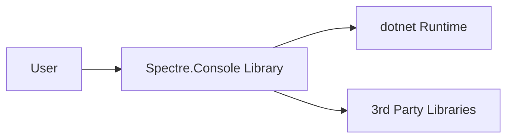
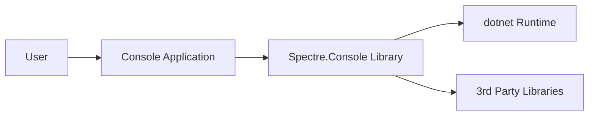
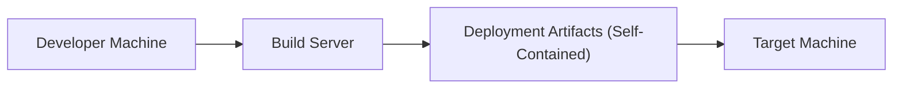
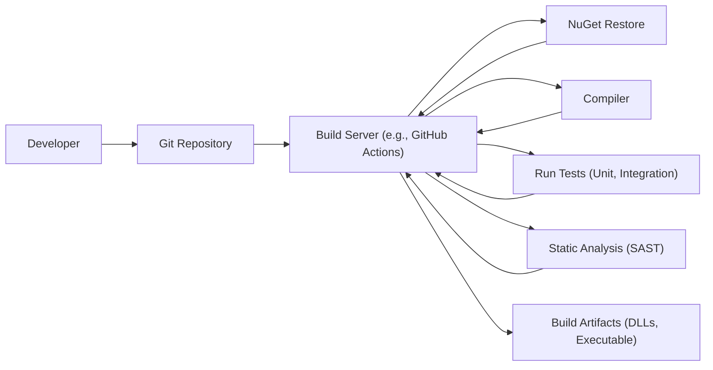

# BUSINESS POSTURE

Spectre.Console is a .NET library designed to simplify the creation of visually appealing console applications. It's an open-source project, suggesting a community-driven development model and a focus on providing a valuable tool for developers.

Priorities and Goals:

*   Provide a user-friendly API for creating rich console UI experiences.
*   Maintain a high level of code quality and stability.
*   Foster a welcoming and active open-source community.
*   Ensure the library is performant and doesn't introduce unnecessary overhead.
*   Support cross-platform compatibility where feasible.

Business Risks:

*   Malicious code injection: Given the library's ability to handle user input and format output, there's a risk of malicious code being injected if input isn't properly sanitized. This could lead to command execution or data exfiltration.
*   Denial of Service (DoS): Poorly optimized rendering or handling of large inputs could lead to excessive resource consumption, making applications using Spectre.Console vulnerable to DoS attacks.
*   Dependency vulnerabilities: Spectre.Console, like any software, may rely on third-party dependencies. Vulnerabilities in these dependencies could be exploited to compromise applications using the library.
*   Supply chain attacks: Compromise of the build or distribution pipeline could lead to malicious code being included in the released library.
*   Loss of maintainer interest/support: As an open-source project, the long-term viability of Spectre.Console depends on the continued involvement of maintainers. Loss of interest or resources could lead to security vulnerabilities not being addressed promptly.

# SECURITY POSTURE

Existing Security Controls:

*   security control: Input validation: The repository and documentation should be reviewed to determine the extent of input validation performed by the library.  This is crucial for preventing injection attacks.
*   security control: Dependency management: The project likely uses a package manager (e.g., NuGet) to manage dependencies.  The security of the supply chain depends on the practices of these package managers and the vigilance of the maintainers in updating dependencies.
*   security control: Code reviews:  As an open-source project, Spectre.Console benefits from community code reviews.  The effectiveness of this control depends on the rigor and frequency of reviews.
*   security control: Testing: The presence of unit and integration tests indicates a focus on code quality, which indirectly contributes to security by reducing the likelihood of vulnerabilities.
*   security control: Static analysis: The project may use static analysis tools to identify potential security vulnerabilities during development.

Accepted Risks:

*   accepted risk: Cross-platform inconsistencies: While aiming for cross-platform compatibility, there might be subtle differences in rendering or behavior across different operating systems and terminal emulators. This is often an accepted trade-off for broader compatibility.
*   accepted risk: Limited control over terminal environment: Spectre.Console operates within the constraints of the user's terminal environment.  It cannot control security settings or vulnerabilities within the terminal itself.
*   accepted risk: User-provided formatting: The library allows users to customize output formatting, which inherently carries some risk if user-provided input is not properly handled.

Recommended Security Controls:

*   security control: Fuzz testing: Implement fuzz testing to proactively identify vulnerabilities related to input handling and rendering.
*   security control: Security-focused code analysis: Integrate static analysis tools specifically designed to detect security vulnerabilities (e.g., SAST tools).
*   security control: Dependency vulnerability scanning: Regularly scan dependencies for known vulnerabilities and establish a process for promptly updating them.
*   security control: Supply chain security measures: Implement measures to secure the build and distribution pipeline, such as code signing and provenance verification.
*   security control: Content Security Policy (CSP) analogue: If applicable, explore mechanisms to restrict the capabilities of user-provided formatting, similar to how CSP works in web browsers.

Security Requirements:

*   Authentication: Not directly applicable, as Spectre.Console is a library for building console applications, not a system that manages user authentication itself. Authentication would be the responsibility of the application using the library.
*   Authorization: Not directly applicable, for the same reason as authentication. Authorization would be handled by the application using Spectre.Console.
*   Input Validation:
    *   All user input used in formatting or rendering must be strictly validated and sanitized to prevent injection attacks.
    *   Input length limits should be enforced to mitigate potential DoS vulnerabilities.
    *   Character sets should be restricted to the minimum necessary for the intended functionality.
*   Cryptography:
    *   If Spectre.Console handles sensitive data (which is unlikely given its primary purpose), appropriate cryptographic algorithms and key management practices must be used. This is more likely to be a concern for the application using the library.
*   Output Encoding:
    *   Proper encoding of output is crucial to prevent injection vulnerabilities, especially when dealing with user-provided input or data from external sources.

# DESIGN

## C4 CONTEXT

*   Elements:
    *   User:
        *   Name: User
        *   Type: Person
        *   Description: A person who interacts with a console application built using Spectre.Console.
        *   Responsibilities: Provides input to the application, views the output rendered by the application.
        *   Security controls: None (the user is external to the system).
    *   Spectre.Console Library:
        *   Name: Spectre.Console Library
        *   Type: Software System
        *   Description: The .NET library for creating rich console UI experiences.
        *   Responsibilities: Provides an API for formatting text, creating tables, progress bars, and other UI elements. Handles user input and renders output to the console.
        *   Security controls: Input validation, output encoding (to be implemented/verified).
    *   dotnet Runtime:
        *   Name: dotnet Runtime
        *   Type: Software System
        *   Description: The runtime environment for executing .NET applications.
        *   Responsibilities: Provides core services like memory management, garbage collection, and just-in-time compilation.
        *   Security controls: Built-in security features of the .NET runtime, such as code access security (CAS) and sandboxing (though CAS is largely deprecated).
    *   3rd Party Libraries:
        *   Name: 3rd Party Libraries
        *   Type: Software System
        *   Description: External libraries that Spectre.Console depends on.
        *   Responsibilities: Provide specific functionalities used by Spectre.Console.
        *   Security controls: Reliant on the security practices of the third-party library developers and the Spectre.Console maintainers' diligence in updating dependencies.

## C4 CONTAINER

*   Elements:
    *   User:
        *   Name: User
        *   Type: Person
        *   Description: A person who interacts with a console application built using Spectre.Console.
        *   Responsibilities: Provides input to the application, views the output rendered by the application.
        *   Security controls: None (the user is external to the system).
    *   Console Application:
        *   Name: Console Application
        *   Type: Container
        *   Description: Application that is using Spectre.Console library.
        *   Responsibilities: Provides business logic.
        *   Security controls: Implements business logic security controls.
    *   Spectre.Console Library:
        *   Name: Spectre.Console Library
        *   Type: Container
        *   Description: The .NET library for creating rich console UI experiences.
        *   Responsibilities: Provides an API for formatting text, creating tables, progress bars, and other UI elements. Handles user input and renders output to the console.
        *   Security controls: Input validation, output encoding (to be implemented/verified).
    *   dotnet Runtime:
        *   Name: dotnet Runtime
        *   Type: Container
        *   Description: The runtime environment for executing .NET applications.
        *   Responsibilities: Provides core services like memory management, garbage collection, and just-in-time compilation.
        *   Security controls: Built-in security features of the .NET runtime, such as code access security (CAS) and sandboxing (though CAS is largely deprecated).
    *   3rd Party Libraries:
        *   Name: 3rd Party Libraries
        *   Type: Container
        *   Description: External libraries that Spectre.Console depends on.
        *   Responsibilities: Provide specific functionalities used by Spectre.Console.
        *   Security controls: Reliant on the security practices of the third-party library developers and the Spectre.Console maintainers' diligence in updating dependencies.

## DEPLOYMENT

Spectre.Console is a library, not a standalone application. Therefore, deployment is inherently tied to the application that uses it. Here are a few common deployment scenarios:

1.  **Self-Contained Deployment:** The application and all its dependencies, including Spectre.Console and the .NET runtime, are packaged together into a single executable or directory. This provides maximum portability and isolation.
2.  **Framework-Dependent Deployment:** The application relies on a pre-installed .NET runtime on the target machine. Spectre.Console would be deployed as a DLL alongside the application.
3.  **NuGet Package:** Spectre.Console is primarily distributed as a NuGet package. Developers add it as a dependency to their projects, and the NuGet package manager handles downloading and referencing the library.

We'll describe the *Self-Contained Deployment* in detail, as it represents the most complete and isolated deployment scenario.

*   Elements:
    *   Developer Machine:
        *   Name: Developer Machine
        *   Type: Infrastructure Node
        *   Description: The machine where the application code (which uses Spectre.Console) is written and compiled.
        *   Responsibilities: Code development, unit testing, local builds.
        *   Security controls: Developer workstation security best practices (e.g., up-to-date OS, antivirus, firewall).
    *   Build Server:
        *   Name: Build Server
        *   Type: Infrastructure Node
        *   Description: A server (or service) responsible for building the application and its dependencies. This could be a CI/CD server like Jenkins, Azure DevOps, GitHub Actions, etc.
        *   Responsibilities: Compiling code, running tests, packaging the application and its dependencies.
        *   Security controls: Hardened operating system, restricted access, secure build environment, dependency vulnerability scanning, static analysis.
    *   Deployment Artifacts (Self-Contained):
        *   Name: Deployment Artifacts (Self-Contained)
        *   Type: Artifact
        *   Description: The output of the build process, containing the application executable, Spectre.Console DLL, the .NET runtime, and any other required dependencies.
        *   Responsibilities: Contains all necessary components for the application to run.
        *   Security controls: Code signing, integrity checks.
    *   Target Machine:
        *   Name: Target Machine
        *   Type: Infrastructure Node
        *   Description: The machine where the application will be executed.
        *   Responsibilities: Running the application.
        *   Security controls: Operating system security best practices (e.g., up-to-date OS, antivirus, firewall, least privilege user accounts).

## BUILD

The build process for an application using Spectre.Console typically involves the following steps:

1.  **Code Checkout:** The source code of the application (and potentially Spectre.Console if building from source) is retrieved from a version control system (e.g., Git).
2.  **Dependency Resolution:** The NuGet package manager restores Spectre.Console and any other dependencies.
3.  **Compilation:** The application code and Spectre.Console (if building from source) are compiled into executable code.
4.  **Testing:** Unit and integration tests are executed.
5.  **Packaging:** The application and its dependencies are packaged into a deployable artifact (e.g., a self-contained executable or a set of DLLs).

Security Controls in the Build Process:

*   **Version Control (Git):** Provides an audit trail of code changes and allows for collaboration and code review.
*   **Dependency Management (NuGet):** Uses a package manager to manage dependencies, but requires careful monitoring for vulnerabilities in third-party packages.
*   **Automated Build Server (e.g., GitHub Actions):** Enforces consistent build processes and reduces the risk of manual errors.
*   **Static Analysis (SAST):** Integrates static analysis tools to identify potential security vulnerabilities in the code.
*   **Tests:** Unit and integration tests help ensure code quality and can indirectly detect security issues.
*   **Code Signing:** The build artifacts (especially executables) should be digitally signed to ensure their authenticity and integrity.

# RISK ASSESSMENT

*   Critical Business Processes:
    *   Providing a reliable and user-friendly library for developers to create console applications.
    *   Maintaining the reputation and trust of the Spectre.Console project and its community.

*   Data to Protect:
    *   Source code: The source code of Spectre.Console itself is publicly available, but protecting it from unauthorized modification is crucial.
    *   User input (within applications using Spectre.Console): Applications built with Spectre.Console may handle sensitive user input. The library itself needs to provide mechanisms (like input validation helpers) to help developers protect this data.  The sensitivity of this data depends entirely on the application.
    *   Build artifacts: Protecting the integrity of released builds is critical to prevent supply chain attacks.

# QUESTIONS & ASSUMPTIONS

*   Questions:
    *   What specific static analysis tools are currently used (if any)?
    *   What is the process for handling reported security vulnerabilities?
    *   Are there any existing guidelines or best practices for developers using Spectre.Console to build secure applications?
    *   Are there plans to implement fuzz testing or other advanced security testing techniques?
    *   What is the current process for reviewing and updating dependencies?
    *   Is code signing currently used for released builds?

*   Assumptions:
    *   BUSINESS POSTURE: The project prioritizes community contributions and open-source principles.
    *   SECURITY POSTURE: The project maintainers are aware of basic security best practices and strive to incorporate them.
    *   DESIGN: The library is primarily used for enhancing the visual aspects of console applications and does not directly handle highly sensitive data or critical system operations. The primary security concerns are related to input validation and preventing injection attacks.
    *   DESIGN: Developers using Spectre.Console are responsible for implementing appropriate security measures within their own applications.
    *   DESIGN: Build process is automated.