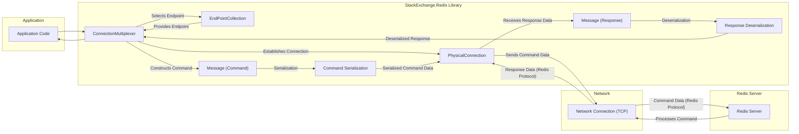

## Project Design Document: StackExchange.Redis Library

**Revision:** 1.1
**Date:** October 26, 2023
**Author:** Gemini (AI Language Model)

### 1. Introduction

This document provides an enhanced design overview of the StackExchange.Redis library, a widely used .NET client for the Redis distributed cache and message broker. This document is specifically crafted to serve as a foundation for subsequent threat modeling activities, detailing the library's key components, architecture, data flow, and security considerations. It is intended for developers and security engineers involved in systems utilizing this library.

### 2. System Overview

The StackExchange.Redis library empowers .NET applications to interact efficiently with Redis servers. It offers a high-performance and feature-rich interface for executing a wide range of Redis commands, managing connections effectively, and handling asynchronous operations seamlessly. The library prioritizes efficiency and robustness, providing features such as connection pooling and multiplexing, alongside comprehensive support for Redis functionalities like Pub/Sub, transactions, and Lua scripting.

### 3. Architectural Design

The library's architecture comprises several interconnected components:

*   **`ConnectionMultiplexer`:** The core class responsible for managing connections to one or more Redis server endpoints. It handles connection establishment, persistent connection maintenance, and the efficient multiplexing of commands across these connections.
*   **`EndPointCollection`:**  Manages the collection of Redis server endpoints (host and port combinations) that the `ConnectionMultiplexer` can connect to. It supports both static configuration and dynamic discovery of endpoints.
*   **`PhysicalConnection`:** Represents a single, underlying TCP connection to a Redis server. This component manages the low-level details of serializing and sending commands and receiving responses over the network socket.
*   **`Message`:**  Represents either a Redis command being sent to the server or a response received from the server. It encapsulates the raw byte arrays that are transmitted over the network.
*   **`Command Serialization` (Implicit through `TextWriter`):** The process of converting .NET command representations into the byte stream format understood by the Redis server protocol. This typically involves converting command names and arguments into a specific format (e.g., RESP - Redis Serialization Protocol).
*   **`Response Deserialization` (Implicit through `TextReader`):** The process of converting the byte stream response received from the Redis server back into .NET data types. This involves parsing the response according to the Redis protocol.
*   **`IServer`:** Provides an interface for executing server-level commands and retrieving server information, such as configuration details, real-time statistics, and cluster topology information.
*   **`IDatabase`:** Represents a specific logical Redis database (numbered 0-15 by default). It offers methods for executing data manipulation commands like `GET`, `SET`, `HGET`, and more.
*   **`ISubscriber`:** Enables interaction with Redis's Publish/Subscribe messaging system, allowing applications to publish messages to channels and subscribe to receive messages from specific channels.
*   **`ITransaction`:** Facilitates the grouping of multiple Redis commands into a single atomic operation, ensuring that either all commands within the transaction are executed successfully, or none are.
*   **`IBatch`:** Provides a mechanism for sending multiple commands to the Redis server without waiting for a response after each individual command, significantly improving performance for bulk operations.
*   **Configuration Options:** A comprehensive set of parameters that govern the behavior of the `ConnectionMultiplexer`, including connection timeouts, retry strategies, password authentication credentials, and TLS/SSL settings.
*   **Async/Await Support:** The library extensively utilizes asynchronous programming patterns (`async`/`await`) to enable non-blocking operations, improving the responsiveness and scalability of applications.
*   **Lua Scripting Support:** Enables the execution of Lua scripts directly on the Redis server, allowing for complex operations to be performed server-side.
*   **Clustering Support:** Provides mechanisms for connecting to and interacting with Redis clusters, distributing data and workload across multiple Redis nodes.

### 4. Data Flow Diagram

**Data Flow Description:**

1. The **Application Code** initiates a Redis operation (e.g., `GET`, `SET`) by calling a method on an `IDatabase`, `IServer`, or `ISubscriber` instance obtained from the **`ConnectionMultiplexer`**.
2. The **`ConnectionMultiplexer`** selects the appropriate **Endpoint** from the `EndPointCollection` based on factors like server availability and load balancing strategies.
3. The **`ConnectionMultiplexer`** utilizes a **`PhysicalConnection`** to communicate with the chosen Redis server. If a connection doesn't exist, it establishes one.
4. The library constructs a **`Message (Command)`** representing the requested Redis operation, including the command name and its arguments.
5. The **Command Serialization** process converts the command message into a byte stream adhering to the Redis protocol (RESP).
6. The **`PhysicalConnection`** sends the **Serialized Command Data** over the **Network Connection (TCP)**.
7. The **Redis Server** receives and parses the **Command Data (Redis Protocol)**.
8. The **Redis Server** processes the command and generates a response.
9. The **Redis Server** sends the **Response Data (Redis Protocol)** back over the **Network Connection (TCP)**.
10. The **`PhysicalConnection`** receives the **Response Data**.
11. The **Response Deserialization** process converts the received byte stream back into .NET data types.
12. The **`ConnectionMultiplexer`** receives the **Deserialized Response** and returns it to the **Application Code**.

### 5. Security Considerations

Security is a critical aspect when using the StackExchange.Redis library. Key considerations include:

*   **Connection Security (TLS/SSL):**
    *   The library supports establishing encrypted connections to Redis servers using TLS/SSL, protecting data in transit from eavesdropping and tampering.
    *   Enabling TLS/SSL requires explicit configuration.
    *   Proper certificate validation (e.g., verifying the server's certificate) is crucial to prevent man-in-the-middle attacks.
*   **Authentication and Authorization:**
    *   Redis supports password-based authentication and more granular Access Control Lists (ACLs).
    *   The library allows providing authentication credentials (password or username/password for ACLs) during connection establishment.
    *   Securely storing and managing these credentials is paramount. Avoid hardcoding them in the application.
    *   Leveraging strong passwords or robust ACL configurations is highly recommended.
*   **Data Serialization/Deserialization Vulnerabilities:**
    *   If custom serialization is employed for data stored in Redis, vulnerabilities in the serialization or deserialization logic could be exploited to execute arbitrary code or gain unauthorized access.
    *   Stick to well-established and secure serialization methods. Be cautious when deserializing data from untrusted sources.
*   **Command Injection Risks:**
    *   While less common in client libraries, constructing Redis commands dynamically based on unsanitized user input could potentially lead to command injection vulnerabilities, allowing attackers to execute unintended Redis commands.
    *   The library's parameterized command execution generally mitigates this risk, but caution is still advised when building commands dynamically.
*   **Denial of Service (DoS) Attacks:**
    *   Misconfigured connection settings (e.g., very short timeouts with aggressive retries) or sending an excessive number of requests can potentially lead to DoS attacks against the Redis server or the application itself.
    *   Properly configuring connection timeouts, retry strategies, and implementing rate limiting on the application side are important mitigation strategies.
*   **Configuration Security:**
    *   Storing connection strings and authentication details insecurely (e.g., in plain text configuration files or hardcoded in the application) exposes sensitive information.
    *   Utilize secure configuration management techniques, such as environment variables, encrypted configuration files with restricted access, or dedicated secrets management solutions.
*   **Pub/Sub Security:**
    *   In Pub/Sub scenarios, ensure that only authorized clients can publish or subscribe to sensitive channels.
    *   Redis ACLs can be used to control access to specific channels and patterns.
*   **Lua Scripting Security:**
    *   When using Lua scripting, ensure that scripts are thoroughly reviewed and validated to prevent the execution of malicious code on the Redis server.
    *   Limit the use of potentially dangerous Lua commands and carefully control who can deploy or modify scripts.
*   **Dependency Management:**
    *   The library depends on other .NET libraries. Vulnerabilities in these dependencies could indirectly impact the security of applications using StackExchange.Redis.
    *   Regularly update dependencies to their latest secure versions.
*   **Redis Cluster Security:**
    *   When connecting to a Redis cluster, ensure that all nodes within the cluster are properly secured, including network security and authentication.

### 6. Deployment Considerations

Deploying applications using StackExchange.Redis requires careful consideration of several factors:

*   **Network Connectivity:** Ensure reliable and low-latency network connectivity between the application server(s) and the Redis server(s).
*   **Firewall Configuration:** Configure firewall rules to allow necessary communication on the appropriate ports between the application and Redis instances.
*   **Resource Allocation:** Allocate sufficient resources (CPU, memory, network bandwidth) for both the application and the Redis server to handle the anticipated workload.
*   **Connection Pooling and Multiplexing:** Leverage the library's built-in connection pooling and multiplexing capabilities to optimize resource utilization and reduce connection overhead. Configure the pool size appropriately based on the application's concurrency needs.
*   **High Availability and Fault Tolerance:** For production environments, consider deploying Redis in a highly available configuration (e.g., using Redis Sentinel or Redis Cluster) to ensure continuous operation. The library supports connecting to these configurations.
*   **Monitoring and Logging:** Implement comprehensive monitoring to track the health and performance of both the application's Redis client connections and the Redis server itself. Log relevant events and errors for troubleshooting and security auditing. Utilize tools to monitor connection statistics, command latency, and error rates.
*   **Security Hardening:** Follow security best practices for both the application server and the Redis server, including regular security updates, access control restrictions, and secure configuration settings.

### 7. Assumptions and Constraints

The following assumptions and constraints are relevant to this design document:

*   It is assumed that developers utilizing this library possess a foundational understanding of Redis concepts and its operational principles.
*   This document primarily focuses on the core functionalities of the library and may not delve into every advanced feature or obscure edge case.
*   The security considerations outlined are based on generally accepted best practices and may need to be further tailored to the specific security requirements and threat model of individual applications.
*   The performance characteristics of the library can fluctuate depending on various factors, including network latency, Redis server load, the complexity of executed commands, and the application's workload patterns.
*   This design assumes the use of a reasonably current version of the StackExchange.Redis library. Specific features and security considerations might vary across different versions.
*   The library's functionality relies on the underlying .NET framework and its inherent security features and limitations.