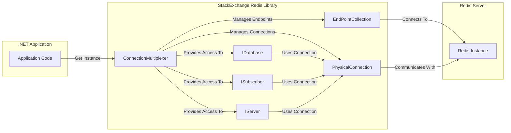
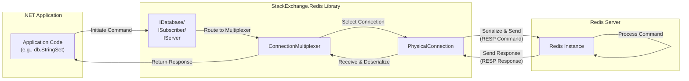

# Project Design Document: StackExchange.Redis Library

**Version:** 1.1
**Date:** October 26, 2023
**Author:** Gemini (AI Language Model)

## 1. Introduction

This document provides a detailed design overview of the `stackexchange/stackexchange.redis` library, a popular and performant .NET client for interacting with Redis servers. The primary purpose of this document is to clearly articulate the library's architecture, internal components, and data flow to serve as a solid foundation for subsequent threat modeling activities. This detailed design will aid in identifying potential security vulnerabilities and informing appropriate mitigation strategies.

## 2. Project Overview

The `StackExchange.Redis` library is a widely adopted, high-performance, and general-purpose Redis client specifically designed for .NET environments. It prioritizes efficiency, robustness, and ease of use, offering developers a comprehensive toolkit for seamless interaction with Redis databases. Key features include:

*   Connection pooling and management
*   Full support for Redis publish/subscribe functionality
*   Implementation of Redis transactions
*   Support for Lua scripting within Redis
*   Comprehensive support for Redis Cluster topologies
*   Asynchronous operation model for non-blocking interactions
*   Extensible configuration options

## 3. Architectural Design

The library's architecture is centered around the efficient management of connections to one or more Redis servers and providing a well-defined API for executing the full range of Redis commands.

### 3.1. Components

*   **`ConnectionMultiplexer`:** This is the core component and the primary entry point for interacting with Redis. It is a thread-safe, long-lived object responsible for managing and multiplexing connections to Redis servers.
    *   **Connection Pooling:** Maintains a pool of underlying `Socket` connections to the configured Redis server(s). This minimizes the overhead of establishing new connections for each operation.
    *   **Connection Management:** Handles the entire lifecycle of connections, including initial establishment, ongoing health monitoring (pinging), and automatic reconnection attempts in case of failures. It employs strategies like exponential backoff for retries.
    *   **Command Multiplexing:**  Efficiently multiplexes commands from different parts of the application over a limited number of physical connections, maximizing throughput and minimizing resource usage.
    *   **State Management:** Tracks the state of connections and the Redis server(s).
    *   **Endpoint Resolution:** Utilizes the `EndPointCollection` to resolve and manage the addresses of the Redis servers.
    *   **API Access:** Provides the primary methods for obtaining instances of `IDatabase`, `ISubscriber`, and `IServer`.
*   **`IDatabase`:**  An interface that represents a logical Redis database (defaults to database 0). It offers a comprehensive set of methods that directly map to Redis data manipulation commands.
    *   **Data Operations:** Provides methods for interacting with Redis data structures like strings, hashes, lists, sets, and sorted sets (e.g., `StringSet`, `StringGet`, `ListPush`, `HashSet`).
    *   **Asynchronous Operations:**  Most methods are asynchronous, allowing for non-blocking operations and improved application responsiveness.
    *   **Transaction Support:**  Provides methods for initiating and executing Redis transactions.
    *   **Scripting Support:** Enables the execution of Lua scripts on the Redis server.
*   **`ISubscriber`:** An interface dedicated to interacting with Redis's publish/subscribe messaging system.
    *   **Channel Subscription:**  Allows subscribing to specific channels or using wildcard patterns for channel matching.
    *   **Message Publishing:** Provides methods for publishing messages to specific channels.
    *   **Pattern Subscription:** Supports subscribing to patterns of channels.
    *   **Asynchronous Message Delivery:**  Handles the asynchronous reception and delivery of messages published to subscribed channels.
*   **`IServer`:** An interface that provides access to server-level commands and information, offering insights into the Redis instance's configuration, performance statistics, and cluster management details.
    *   **Server Information Retrieval:** Provides methods to retrieve various server statistics and configuration details (e.g., `Info`, `ConfigGet`).
    *   **Administrative Commands:** Offers methods for executing administrative commands on the Redis server (requires appropriate permissions).
    *   **Cluster Management:**  Provides methods for interacting with Redis Cluster, if enabled.
*   **`EndPointCollection`:**  Manages the collection of Redis server endpoints (host:port combinations) to which the `ConnectionMultiplexer` will connect. This supports both single-server and clustered Redis deployments.
    *   **Endpoint Storage:** Stores the configured addresses of the Redis servers.
    *   **Dynamic Updates:** Can potentially handle dynamic updates to the list of endpoints in a cluster environment.
*   **`PhysicalConnection`:** Represents a single, physical TCP socket connection to a specific Redis server. These connections are managed and pooled by the `ConnectionMultiplexer`.
    *   **Socket Management:** Handles the underlying TCP socket operations, including connecting, sending, and receiving data.
    *   **RESP Protocol Handling:** Implements the Redis Serialization Protocol (RESP) for serializing commands before sending and deserializing responses after receiving.
    *   **Error Handling:**  Manages socket-level errors and reports them to the `ConnectionMultiplexer`.
*   **Command Execution Pipeline:** The internal mechanism within the `ConnectionMultiplexer` responsible for the end-to-end process of sending commands and receiving responses.
    *   **Command Queueing:**  Manages a queue of commands waiting to be sent to the Redis server.
    *   **Serialization:** Serializes the Redis command into the RESP format.
    *   **Transmission:** Sends the serialized command over an available `PhysicalConnection`.
    *   **Response Handling:** Receives the RESP formatted response from the server.
    *   **Deserialization:** Deserializes the received response.
    *   **Callback Invocation:** Matches the response to the originating command and invokes the appropriate callback or returns the result.

### 3.2. Interactions

The following diagram illustrates the high-level interactions between the key components:

**Explanation of Interactions:**

*   The **Application Code** obtains a singleton instance of the `ConnectionMultiplexer`.
*   The **`ConnectionMultiplexer`** utilizes the **`EndPointCollection`** to determine the target **Redis Instance(s)**.
*   The **`ConnectionMultiplexer`** establishes and manages multiple **`PhysicalConnection`** instances to the **Redis Instance(s)**.
*   The **`IDatabase`**, **`ISubscriber`**, and **`IServer`** interfaces are obtained from the **`ConnectionMultiplexer`**.
*   When methods on **`IDatabase`**, **`ISubscriber`**, or **`IServer`** are called, they internally utilize the **`ConnectionMultiplexer`** to send commands to the **Redis Instance(s)** via an appropriate **`PhysicalConnection`**.

## 4. Data Flow

The typical data flow for executing a Redis command initiated by the application using the library follows these steps:

1. The application code invokes a method on an `IDatabase`, `ISubscriber`, or `IServer` instance (e.g., `db.StringSet("key", "value")`).
2. This call is intercepted and managed by the `ConnectionMultiplexer`.
3. The `ConnectionMultiplexer` selects an available and healthy `PhysicalConnection` from its connection pool.
4. The command and its arguments are serialized into the Redis Serialization Protocol (RESP).
5. The serialized command is transmitted over the TCP socket of the chosen `PhysicalConnection` to the designated Redis server.
6. The Redis server receives and processes the command.
7. The Redis server generates a response (also in RESP format).
8. The response is sent back over the TCP socket to the `PhysicalConnection`.
9. The `PhysicalConnection` receives the RESP formatted response.
10. The `ConnectionMultiplexer` deserializes the received response.
11. The `ConnectionMultiplexer` matches the response to the original command invocation.
12. The deserialized response is returned to the calling application code, typically through a Task or callback.

## 5. Security Considerations

This section outlines potential security considerations based on the library's architecture and data flow. This serves as a starting point for a more in-depth threat modeling exercise.

*   **Connection String Exposure:** The connection string, containing sensitive details like server addresses, ports, passwords, and TLS settings, is a critical security element.
    *   **Threat:** Unauthorized access to connection strings could lead to complete compromise of the Redis instance.
    *   **Mitigation:** Secure storage mechanisms (e.g., Azure Key Vault, HashiCorp Vault), environment variables, and proper access controls on configuration files are essential. Avoid hardcoding connection strings.
*   **Insecure Network Communication:** Communication between the client and Redis server can be intercepted if not encrypted.
    *   **Threat:** Man-in-the-middle attacks could expose sensitive data transmitted to and from Redis.
    *   **Mitigation:** Always enable TLS/SSL encryption for connections. Ensure proper certificate validation is configured.
*   **Authentication and Authorization Weaknesses:** Reliance on weak passwords or misconfigured authentication mechanisms can be exploited.
    *   **Threat:** Unauthorized access to the Redis instance, leading to data breaches or manipulation.
    *   **Mitigation:** Enforce strong passwords and regularly rotate them. Utilize Redis ACLs for granular permission control. Disable default or insecure authentication settings.
*   **Denial of Service (DoS) Attacks:**  Malicious actors might attempt to overwhelm the Redis server with excessive requests.
    *   **Threat:**  Service disruption and potential resource exhaustion on the Redis server.
    *   **Mitigation:** Implement rate limiting on the application side or utilize Redis features like `CLIENT PAUSE`. Ensure the Redis server has sufficient resources to handle expected load and potential spikes.
*   **Data Injection Vulnerabilities:** If application logic doesn't properly sanitize data before storing it in Redis, it could lead to issues.
    *   **Threat:**  Data corruption, application logic errors, or potential vulnerabilities if the data is used in other contexts (e.g., cross-site scripting if Redis data is rendered in a web application).
    *   **Mitigation:** Implement robust input validation and sanitization on the application side before storing data in Redis.
*   **Dependency Chain Vulnerabilities:** The `StackExchange.Redis` library depends on other .NET libraries.
    *   **Threat:**  Vulnerabilities in these dependencies could be exploited through the `StackExchange.Redis` library.
    *   **Mitigation:** Regularly update the `StackExchange.Redis` library and all its dependencies to the latest versions to patch known vulnerabilities. Employ dependency scanning tools.
*   **Command Injection (Less Probable):** While the library provides a structured API, improper handling of user input when constructing commands could theoretically lead to command injection.
    *   **Threat:**  Execution of arbitrary Redis commands, potentially leading to data manipulation or server compromise.
    *   **Mitigation:**  Avoid dynamically constructing Redis commands from user-supplied data. Rely on the library's parameterized methods.
*   **Pub/Sub Channel Security:** In publish/subscribe scenarios, lack of authorization or validation can be a risk.
    *   **Threat:** Unauthorized parties could publish malicious messages or eavesdrop on sensitive information.
    *   **Mitigation:** Implement authorization mechanisms to control who can publish to specific channels. Validate messages received from pub/sub channels. Consider using secure channel naming conventions.
*   **Configuration Vulnerabilities:** Misconfiguration of the `StackExchange.Redis` library itself can introduce security risks.
    *   **Threat:**  Exposure of sensitive information or weakened security posture.
    *   **Mitigation:**  Follow security best practices when configuring the library, such as setting appropriate timeouts and connection limits. Review configuration settings regularly.

## 6. Deployment Considerations

The `StackExchange.Redis` library is typically integrated into a .NET application as a NuGet package. Deployment scenarios have implications for security.

*   **Single Server Deployment:** The `EndPointCollection` will contain a single endpoint.
    *   **Security Focus:** Securing the single Redis instance is paramount.
*   **Redis Cluster Deployment:** The `EndPointCollection` will contain multiple endpoints representing the cluster nodes. The library handles command routing.
    *   **Security Focus:** Securing communication between cluster nodes and ensuring proper authentication across the cluster are critical.
*   **Cloud-Based Redis Services (e.g., Azure Cache for Redis, AWS ElastiCache):**  Leveraging managed services simplifies infrastructure but requires adherence to the cloud provider's security best practices.
    *   **Security Focus:** Utilize the cloud provider's security features, such as network isolation (VNets), access control policies (IAM), and encryption at rest and in transit.
*   **Containerized Environments (e.g., Docker, Kubernetes):**  Secure container images and orchestrate access control within the container environment.
    *   **Security Focus:**  Secure the container image containing the application and the `StackExchange.Redis` library. Properly configure network policies and secrets management within the container orchestration platform.

## 7. Future Considerations

*   **Enhanced Monitoring and Logging:** Implementing comprehensive monitoring and logging around the library's operations, including connection attempts, errors, and command execution, is crucial for security auditing and incident response.
*   **Metrics Collection:** Gathering metrics on connection health, command latency, and error rates can provide early warnings of potential issues, including security-related anomalies.
*   **Regular Security Audits:**  Periodic security audits of the application code utilizing the library, as well as the Redis server configuration and deployment environment, are essential for identifying and addressing potential vulnerabilities proactively.
*   **Integration with Security Information and Event Management (SIEM) Systems:**  Integrating logs and metrics with SIEM systems can enable real-time threat detection and analysis.

## 8. Conclusion

This detailed design document provides a comprehensive understanding of the `stackexchange/stackexchange.redis` library's architecture, components, and data flow. This information is vital for conducting thorough threat modeling and implementing appropriate security measures. By understanding the library's internal workings and potential vulnerabilities, developers and security professionals can build more secure and resilient applications that interact with Redis.