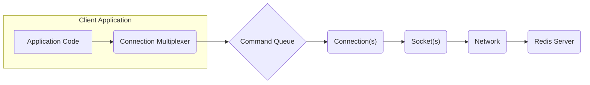

# Project Design Document: StackExchange.Redis .NET Client

**Version:** 1.1
**Date:** October 26, 2023
**Author:** AI Software Architect

## 1. Introduction

This document provides an enhanced and more detailed design overview of the `StackExchange.Redis` .NET client library. Building upon the previous version, this document further elaborates on the library's architecture, components, and data flow, with a strong emphasis on aspects relevant to security threat modeling. The information presented aims to equip security professionals with a comprehensive understanding necessary to identify potential vulnerabilities and design effective mitigation strategies.

## 2. Goals

*   Provide a comprehensive and refined architectural overview of the `StackExchange.Redis` library.
*   Offer more detailed descriptions of key components and their interactions.
*   Elaborate on the data flow within the library and between the client and the Redis server, highlighting potential interception points.
*   Serve as a robust and detailed foundation for subsequent threat modeling activities.

## 3. Scope

This document covers the core architecture and functionality of the `StackExchange.Redis` library with an increased level of detail. It maintains a focus on aspects directly relevant to security and data flow, providing a deeper understanding of the library's internal workings without delving into every single implementation detail.

## 4. Target Audience

*   Security Engineers and Architects responsible for threat modeling and security assessments.
*   Software Developers utilizing the `StackExchange.Redis` library who need a deeper understanding of its architecture for secure implementation.
*   Cloud Architects deploying and managing applications using this library in various environments.
*   Anyone involved in the threat modeling process for applications integrating `StackExchange.Redis`.

## 5. High-Level Overview

The `StackExchange.Redis` library is a highly performant and versatile .NET client designed for seamless interaction with Redis servers. It empowers .NET applications to efficiently establish connections, execute a wide range of Redis commands, and process responses from both standalone Redis instances and clustered deployments. Key strengths include its sophisticated connection multiplexing capabilities, comprehensive support for Redis features like pub/sub, scripting, and transactions, and its extensible design.

## 6. Architectural Design

### 6.1. System Diagram

### 6.2. Component Description

*   **Application Code:** The custom .NET application code that leverages the `StackExchange.Redis` library to communicate with Redis. This code initiates Redis commands and processes the returned data.
*   **Connection Multiplexer:** This is the central and most critical component within the library. It manages a pool of network connections to one or more Redis servers. Its primary responsibilities include:
    *   Multiplexing multiple logical requests from the application over a limited number of physical connections, optimizing resource utilization.
    *   Maintaining connection state and handling connection failures and reconnections.
    *   Load balancing requests across available Redis servers in a cluster environment.
    *   Managing command queues and ensuring efficient command dispatch.
*   **Command Queue:**  An internal queue within the `Connection Multiplexer` where commands from the application are temporarily stored before being dispatched to an active connection. This helps manage asynchronous operations and optimize command processing.
*   **Connection(s):** Represents an individual, logical connection to a specific Redis server. The `Connection Multiplexer` manages the lifecycle of these connections, opening and closing them as needed. Each connection is associated with one or more underlying sockets.
*   **Socket(s):** The underlying TCP sockets that facilitate the actual network communication between the client application and the Redis server. These sockets handle the transmission of serialized Redis commands and the reception of responses.
*   **Network:** The underlying network infrastructure that enables communication between the client application and the Redis server. This includes physical network cables, switches, routers, and potentially cloud networking components.
*   **Redis Server:** The target Redis instance or cluster responsible for storing and managing data. It receives commands from the client, executes them, and sends back responses.

### 6.3. Data Flow

The typical data flow for executing a Redis command involves the following steps:

1. The **Application Code** initiates a Redis command (e.g., `StringSet`, `StringGet`) by calling a method on the `ConnectionMultiplexer` or an `IDatabase` instance obtained from it.
2. The command is received by the **Connection Multiplexer**.
3. The **Connection Multiplexer** places the command into its internal **Command Queue**.
4. The **Connection Multiplexer** selects an appropriate **Connection** to send the command through. This selection process considers factors such as server availability, current load, and connection health. In a cluster environment, the target server is determined based on the key being accessed.
5. The command is serialized into the Redis Serialization Protocol (RESP) format.
6. The serialized command is transmitted over the associated **Socket**.
7. The command traverses the **Network** to reach the designated **Redis Server**.
8. The **Redis Server** receives the command, parses it, and executes the requested operation.
9. The **Redis Server** generates a response, also formatted using RESP.
10. The response travels back through the **Network** to the client.
11. The **Socket** receives the RESP response.
12. The **Connection** receives the raw response data and parses it according to the RESP specification.
13. The **Connection Multiplexer** receives the parsed response and routes it back to the originating call in the **Application Code**.

For Pub/Sub operations, the data flow differs slightly:

1. The **Application Code** subscribes to specific channels or patterns using the `ISubscriber` interface obtained from the `ConnectionMultiplexer`.
2. The subscription request is sent to the **Redis Server** via a dedicated **Connection** managed by the **Connection Multiplexer**. This connection is typically reserved for pub/sub operations.
3. When a message is published to a subscribed channel on the **Redis Server**, the server pushes the message to all connected clients subscribed to that channel.
4. The published message travels through the **Network** and is received by the dedicated pub/sub **Connection**.
5. The **Connection Multiplexer** identifies the recipient based on the subscription and routes the message to the appropriate handler within the **Application Code**.

## 7. Security Considerations

This section provides a more detailed examination of security aspects relevant to the `StackExchange.Redis` library, crucial for effective threat modeling.

### 7.1. Authentication and Authorization

*   The library facilitates authentication with Redis servers requiring passwords through the connection string. This password is used during the initial connection handshake.
*   Authorization is entirely managed by the Redis server. `StackExchange.Redis` relies on Redis's Access Control Lists (ACLs) or the legacy `requirepass` setting to control access to commands and data.
*   **Threats:**
    *   **Credential Exposure:**  Storing connection strings with passwords in insecure locations (e.g., hardcoded in code, in version control) can lead to unauthorized access.
    *   **Insufficient Authorization:** If Redis ACLs are not properly configured, clients might have excessive permissions, potentially leading to data breaches or manipulation.
*   **Mitigations:**
    *   Store connection strings securely using environment variables, secrets management systems (e.g., Azure Key Vault, AWS Secrets Manager), or configuration providers designed for sensitive data.
    *   Implement robust Redis ACL configurations to enforce the principle of least privilege, granting only necessary permissions to client applications.

### 7.2. Data Protection

*   **Encryption in Transit:** `StackExchange.Redis` strongly supports TLS/SSL encryption for all communication with Redis servers. Enabling TLS ensures the confidentiality and integrity of data transmitted over the network, preventing eavesdropping and tampering.
*   **Encryption at Rest:** The library itself does not handle data encryption at rest. This is the responsibility of the Redis server and the underlying storage mechanisms.
*   **Threats:**
    *   **Man-in-the-Middle Attacks:** Without TLS, network traffic is vulnerable to interception, allowing attackers to read or modify sensitive data.
    *   **Data Tampering:**  Without encryption, attackers could potentially alter data in transit.
*   **Mitigations:**
    *   Always enable TLS in the connection string when connecting to Redis servers, especially in production environments.
    *   Ensure the Redis server is configured to enforce TLS connections.
    *   Consider using network-level encryption (e.g., VPNs) for added security, especially in untrusted network environments.

### 7.3. Network Security

*   Securing the network infrastructure between the client application and the Redis server is paramount.
*   **Threats:**
    *   **Unauthorized Access:**  Open network access to the Redis server can allow unauthorized clients to connect and potentially exploit vulnerabilities.
    *   **Network Sniffing:**  Attackers on the same network could potentially capture unencrypted traffic.
    *   **Denial of Service (DoS):**  Network-level attacks can disrupt communication with the Redis server.
*   **Mitigations:**
    *   Implement firewalls to restrict access to the Redis server to only authorized clients.
    *   Utilize network segmentation to isolate the Redis server within a secure network zone.
    *   Consider using private network connections or VPNs for communication between the client and server.

### 7.4. Input Validation and Output Encoding

*   While `StackExchange.Redis` handles the serialization and deserialization of Redis commands and responses, developers must be cautious about incorporating user-provided data directly into commands.
*   **Threats:**
    *   **Redis Command Injection:**  Improperly sanitized user input could be used to inject malicious Redis commands, potentially leading to data breaches or server compromise.
*   **Mitigations:**
    *   Sanitize and validate all user-provided input before incorporating it into Redis commands.
    *   Use parameterized commands or the library's built-in methods to construct commands safely.
    *   Be mindful of the data types returned from Redis and handle them appropriately to prevent unexpected behavior.

### 7.5. Connection Management

*   The efficient connection management provided by the `ConnectionMultiplexer` is crucial for performance but also has security implications.
*   **Threats:**
    *   **Resource Exhaustion:** Improper disposal of `ConnectionMultiplexer` instances can lead to resource leaks and potentially denial of service.
    *   **Connection Hijacking (less likely with TLS):** Although mitigated by TLS, vulnerabilities in connection handling could theoretically be exploited.
*   **Mitigations:**
    *   Follow best practices for managing the `ConnectionMultiplexer` lifecycle, typically using a single, shared instance per application.
    *   Configure appropriate connection timeouts and retry mechanisms to handle transient network issues gracefully.

### 7.6. Logging and Auditing

*   The diagnostic logging capabilities of `StackExchange.Redis` can be valuable for security monitoring and incident response.
*   **Threats:**
    *   **Insufficient Logging:** Lack of adequate logging can hinder the detection and investigation of security incidents.
    *   **Sensitive Data in Logs:**  Care must be taken to avoid logging sensitive information (e.g., passwords, application data).
*   **Mitigations:**
    *   Enable and configure appropriate logging levels to capture relevant security events.
    *   Implement application-level logging to track Redis interactions for auditing purposes.
    *   Ensure that logs are stored securely and access is restricted.

### 7.7. Dependencies

*   The security of `StackExchange.Redis` is also dependent on the security of its underlying dependencies and the .NET runtime environment.
*   **Threats:**
    *   **Vulnerable Dependencies:**  Security vulnerabilities in dependent libraries can indirectly affect the security of `StackExchange.Redis`.
*   **Mitigations:**
    *   Regularly update the `StackExchange.Redis` library and its dependencies to the latest versions to patch known vulnerabilities.
    *   Implement a robust dependency management strategy to track and manage dependencies effectively.
    *   Consider using tools that scan for known vulnerabilities in project dependencies.

### 7.8. Redis Scripting

*   `StackExchange.Redis` allows the execution of Lua scripts on the Redis server. While powerful, this feature introduces potential security risks.
*   **Threats:**
    *   **Malicious Scripts:**  Attackers could potentially inject or execute malicious Lua scripts that could compromise the Redis server or access sensitive data.
*   **Mitigations:**
    *   Carefully review and audit all Lua scripts before deploying them to production.
    *   Restrict the ability to execute arbitrary scripts in production environments.
    *   Consider using prepared scripts or script caching to limit the attack surface.

## 8. Deployment Considerations

*   `StackExchange.Redis` can be deployed in various environments, each with its own security considerations.
    *   **On-Premises:** Requires careful management of network security, physical security of servers, and access control.
    *   **Virtual Machines:**  Security depends on the underlying hypervisor and network configuration.
    *   **Cloud Platforms (Azure, AWS, GCP):** Leverage cloud-provided security services (e.g., network security groups, firewalls, identity and access management).
*   **Threats:**
    *   **Misconfigured Cloud Resources:**  Incorrectly configured security groups or access policies can expose the Redis server.
    *   **Compromised Infrastructure:**  Vulnerabilities in the underlying infrastructure can be exploited.
*   **Mitigations:**
    *   Follow security best practices for the chosen deployment environment.
    *   Utilize cloud-native security services to protect the Redis server and client applications.
    *   Regularly review and audit deployment configurations.

## 9. Future Considerations

*   Potential future enhancements could include more fine-grained control over TLS configuration options, improved integration with security monitoring and auditing frameworks, and features to further mitigate command injection risks.

## 10. Conclusion

This enhanced design document provides a more in-depth understanding of the `StackExchange.Redis` .NET client library's architecture and security considerations. This detailed information is crucial for conducting thorough threat modeling exercises and for developing secure applications that utilize this powerful library. By carefully considering the components, data flow, and potential security threats outlined in this document, developers and security professionals can build more resilient and secure systems leveraging the capabilities of Redis.