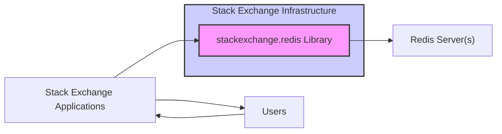
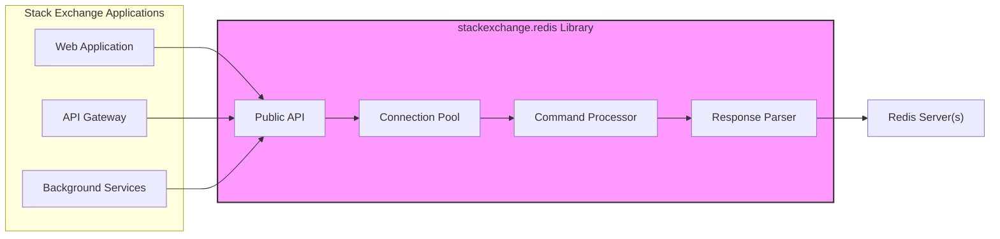
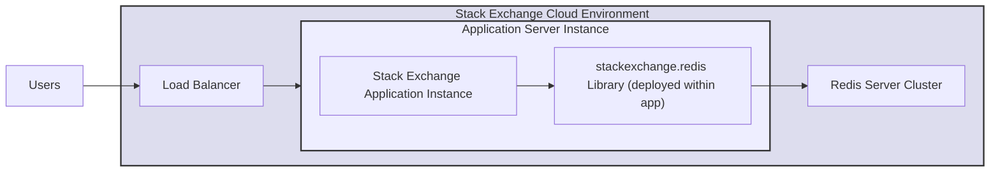
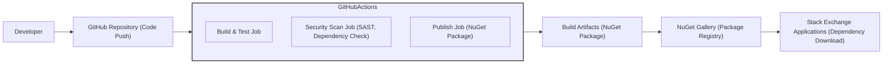

# BUSINESS POSTURE

This project is the `stackexchange.redis` library, a .NET client for Redis.  The primary business goal of this project is to provide a robust, efficient, and reliable way for Stack Exchange applications to interact with Redis servers. Redis is likely used for caching, session management, real-time data processing, and other performance-critical operations within Stack Exchange's infrastructure. The success of this library directly impacts the performance and availability of Stack Exchange's services.

Business priorities for this project are:
- Reliability: The library must be stable and handle errors gracefully to avoid disruptions to Stack Exchange services.
- Performance: The library should be highly performant to minimize latency and maximize throughput for Redis operations.
- Maintainability: The codebase should be well-structured and easy to maintain to ensure long-term stability and allow for future enhancements.
- Security: The library must be secure to prevent vulnerabilities that could compromise Stack Exchange's infrastructure or data.

Key business risks associated with this project:
- Availability risk: Bugs or instability in the library could lead to outages or performance degradation of Stack Exchange services.
- Data integrity risk: Errors in data handling or communication with Redis could lead to data corruption or loss.
- Security risk: Vulnerabilities in the library could be exploited to gain unauthorized access to Redis servers or Stack Exchange applications.
- Performance risk: Inefficient code or poor design could lead to performance bottlenecks and impact user experience.

# SECURITY POSTURE

Existing security controls:
- security control: GitHub repository with version control and access management (assumed based on standard GitHub practices). Implemented in: GitHub platform.
- security control: Publicly accessible repository for code review and community contributions (inferred from public GitHub repo). Implemented in: GitHub platform.
- security control: Code review process (assumed best practice for open-source projects, but not explicitly stated in the repository). Implemented in: Development workflow.
- security control: Unit and integration tests (present in the repository). Implemented in: CI pipeline and development workflow.

Accepted risks:
- accepted risk: Reliance on community contributions for security vulnerability identification and patching.
- accepted risk: Potential delay in security patch deployment due to open-source development lifecycle.
- accepted risk: Public disclosure of potential vulnerabilities due to the open nature of the repository.

Recommended security controls:
- recommended security control: Implement automated static application security testing (SAST) in the CI/CD pipeline to identify potential code vulnerabilities.
- recommended security control: Implement dependency scanning to identify and manage vulnerable dependencies.
- recommended security control: Conduct regular security code reviews, focusing on areas that handle data input, network communication, and authentication.
- recommended security control: Establish a clear vulnerability reporting and response process.
- recommended security control: Consider signing releases to ensure authenticity and integrity of the library.

Security requirements:
- Authentication:
  - security requirement: The library should securely handle Redis authentication credentials if provided by the application.
  - security requirement: The library should support different Redis authentication methods as needed (e.g., password, ACL).
- Authorization:
  - security requirement: The library itself does not enforce authorization, but it should facilitate the application's ability to implement Redis authorization by correctly passing through commands and handling responses.
  - security requirement: The library should not inadvertently grant broader permissions than intended when interacting with Redis.
- Input Validation:
  - security requirement: The library must properly sanitize and validate inputs when constructing Redis commands to prevent command injection vulnerabilities.
  - security requirement: The library should handle potentially malicious responses from the Redis server gracefully without causing crashes or unexpected behavior.
- Cryptography:
  - security requirement: The library should support secure communication with Redis servers using TLS/SSL encryption.
  - security requirement: If the library handles sensitive data in memory (e.g., authentication credentials), consider in-memory encryption or secure memory management practices.

# DESIGN

## C4 CONTEXT

Context Diagram Elements:

- Element:
  - Name: Stack Exchange Applications
  - Type: Software System
  - Description:  Various web applications, APIs, and background services that constitute the Stack Exchange platform. These applications require data storage, caching, and real-time communication capabilities.
  - Responsibilities:  Utilize the `stackexchange.redis` library to interact with Redis servers for data operations. Implement application-level security controls and business logic.
  - Security controls: Application-level authentication and authorization, input validation for application logic, session management, secure data handling within applications.

- Element:
  - Name: `stackexchange.redis` Library
  - Type: Software System / Library
  - Description: A .NET client library that provides an interface for Stack Exchange applications to communicate with Redis servers. It handles connection management, command serialization/deserialization, and response parsing.
  - Responsibilities:  Establish and manage connections to Redis servers. Send commands to Redis and receive responses. Provide a user-friendly API for applications to interact with Redis. Implement client-side security measures like input sanitization for command construction and TLS/SSL support.
  - Security controls: Input validation for command construction, TLS/SSL encryption for communication, secure handling of connection credentials in memory, protection against vulnerabilities in library code.

- Element:
  - Name: Redis Server(s)
  - Type: Software System
  - Description: One or more Redis server instances providing in-memory data storage, caching, and messaging capabilities.
  - Responsibilities: Store and manage data. Process commands from clients. Enforce server-side security controls.
  - Security controls: Redis authentication and authorization mechanisms (e.g., passwords, ACLs), network security (firewalls, network segmentation), data persistence and backup strategies, TLS/SSL encryption for communication.

- Element:
  - Name: Users
  - Type: Person
  - Description: End-users who interact with Stack Exchange applications through web browsers or other clients.
  - Responsibilities:  Use Stack Exchange applications to access information and perform actions.
  - Security controls: User authentication to Stack Exchange applications, authorization based on user roles and permissions, secure handling of user data by Stack Exchange applications.

## C4 CONTAINER

Container Diagram Elements:

- Element:
  - Name: Public API
  - Type: Library Component
  - Description: The public interface of the `stackexchange.redis` library, providing methods for applications to interact with Redis (e.g., `StringSet`, `StringGet`, `Publish`, `Subscribe`).
  - Responsibilities: Expose a user-friendly API. Translate application requests into Redis commands. Route commands to the Command Processor.
  - Security controls: Input validation on API parameters to prevent command injection, logging of API calls for auditing.

- Element:
  - Name: Connection Pool
  - Type: Library Component
  - Description: Manages a pool of connections to Redis servers to improve performance by reusing connections.
  - Responsibilities: Establish and maintain connections to Redis. Provide connections to the Command Processor. Handle connection failures and reconnection logic.
  - Security controls: Secure storage and handling of connection credentials, connection timeout management, limiting connection pool size to prevent resource exhaustion.

- Element:
  - Name: Command Processor
  - Type: Library Component
  - Description:  Serializes Redis commands into the Redis protocol format and sends them to the Redis server through a connection from the Connection Pool.
  - Responsibilities: Command serialization, sending commands to Redis, handling network communication.
  - Security controls: Input sanitization before command serialization to prevent injection, error handling for network communication failures, TLS/SSL encryption for network traffic.

- Element:
  - Name: Response Parser
  - Type: Library Component
  - Description: Parses responses received from the Redis server according to the Redis protocol and returns them to the application.
  - Responsibilities: Response parsing, error handling for invalid responses, data deserialization.
  - Security controls: Input validation of responses from Redis to prevent unexpected behavior or vulnerabilities due to malicious responses, error handling for parsing failures.

- Element:
  - Name: Web Application, API Gateway, Background Services
  - Type: Software System Containers
  - Description:  Represent different types of Stack Exchange applications that utilize the Redis client.
  - Responsibilities: Implement Stack Exchange business logic, interact with users and other systems, use the Redis client for data operations.
  - Security controls: Application-specific security controls (authentication, authorization, input validation, etc.).

- Element:
  - Name: Redis Server(s)
  - Type: Infrastructure Container
  - Description: Redis server instances.
  - Responsibilities: Data storage and retrieval, command processing.
  - Security controls: Redis server security configurations (authentication, authorization, networking, etc.).

## DEPLOYMENT

Deployment Architecture: Library Dependency within Stack Exchange Applications

The `stackexchange.redis` library is deployed as a dependency within Stack Exchange applications.  Each application instance will include the library and use it to connect to Redis servers.

Deployment Diagram Elements:

- Element:
  - Name: Stack Exchange Cloud Environment
  - Type: Environment
  - Description: The cloud infrastructure where Stack Exchange applications and Redis servers are deployed (e.g., AWS, Azure, GCP).
  - Responsibilities: Provide the underlying infrastructure for applications and data storage. Ensure availability, scalability, and security of the environment.
  - Security controls: Cloud provider security controls (physical security, network security, access management), network segmentation, infrastructure monitoring, security patching.

- Element:
  - Name: Application Server Instance
  - Type: Infrastructure Node
  - Description: A virtual machine or container instance running a Stack Exchange application.
  - Responsibilities: Host and execute Stack Exchange application code. Run the `stackexchange.redis` library.
  - Security controls: Operating system security hardening, application isolation, security monitoring, intrusion detection, access control to the server instance.

- Element:
  - Name: Stack Exchange Application Instance
  - Type: Software Instance
  - Description: A running instance of a Stack Exchange web application, API gateway, or background service.
  - Responsibilities: Serve user requests, execute business logic, interact with Redis using the `stackexchange.redis` library.
  - Security controls: Application-level security controls (authentication, authorization, input validation, session management), secure configuration management, application monitoring and logging.

- Element:
  - Name: `stackexchange.redis` Library (deployed within app)
  - Type: Software Instance
  - Description: The `stackexchange.redis` library deployed as a dependency within each application instance.
  - Responsibilities: Provide Redis client functionality to the application instance. Manage connections to Redis servers.
  - Security controls: Security controls inherent in the library code (input validation, TLS/SSL support, etc.).

- Element:
  - Name: Redis Server Cluster
  - Type: Infrastructure Node
  - Description: A cluster of Redis server instances providing high availability and scalability.
  - Responsibilities: Store and manage data. Process commands from clients. Ensure data replication and failover.
  - Security controls: Redis server security configurations (authentication, authorization, networking, data persistence), cluster security management, monitoring of cluster health and performance.

- Element:
  - Name: Load Balancer
  - Type: Infrastructure Node
  - Description: Distributes incoming user traffic across multiple application server instances.
  - Responsibilities: Traffic distribution, load balancing, health checks of application instances.
  - Security controls: DDoS protection, TLS/SSL termination, access control to the load balancer, security monitoring.

- Element:
  - Name: Users
  - Type: External Actor
  - Description: End-users accessing Stack Exchange applications.
  - Responsibilities: Initiate requests to Stack Exchange applications.
  - Security controls: User-side security practices (strong passwords, avoiding phishing attacks, etc.).

## BUILD

Build Process: GitHub Actions with Security Checks

The build process for the `stackexchange.redis` library likely uses GitHub Actions for CI/CD.  It involves compiling the code, running tests, performing security checks, and publishing NuGet packages.

Build Diagram Elements:

- Element:
  - Name: Developer
  - Type: Person
  - Description: Software developers contributing to the `stackexchange.redis` project.
  - Responsibilities: Write code, commit changes to the GitHub repository, participate in code reviews.
  - Security controls: Secure development practices, code review process, access control to the GitHub repository.

- Element:
  - Name: GitHub Repository (Code Push)
  - Type: Code Repository
  - Description: The GitHub repository hosting the source code of the `stackexchange.redis` library.
  - Responsibilities: Version control, code storage, collaboration platform.
  - Security controls: Access control (authentication and authorization for developers), branch protection, audit logging of code changes.

- Element:
  - Name: GitHub Actions (CI/CD Pipeline)
  - Type: CI/CD System
  - Description: GitHub's CI/CD platform used to automate the build, test, and release process.
  - Responsibilities: Automated build, testing, security scanning, and publishing of the library.
  - Security controls: Secure pipeline configuration, access control to CI/CD workflows, secret management for credentials, audit logging of pipeline executions.

- Element:
  - Name: Build & Test Job
  - Type: CI/CD Job
  - Description: A job within the GitHub Actions pipeline that compiles the code, runs unit tests and integration tests.
  - Responsibilities: Code compilation, unit testing, integration testing, generating build artifacts.
  - Security controls: Secure build environment, dependency management, test case security considerations.

- Element:
  - Name: Security Scan Job (SAST, Dependency Check)
  - Type: CI/CD Job
  - Description: A job within the GitHub Actions pipeline that performs static application security testing (SAST) and dependency vulnerability scanning.
  - Responsibilities: Identify potential code vulnerabilities and vulnerable dependencies. Generate security reports.
  - Security controls: SAST tool configuration, dependency scanning tool configuration, vulnerability reporting and management.

- Element:
  - Name: Publish Job (NuGet Package)
  - Type: CI/CD Job
  - Description: A job within the GitHub Actions pipeline that packages the build artifacts as a NuGet package and publishes it to the NuGet Gallery.
  - Responsibilities: Package creation, signing (optional), publishing to NuGet Gallery.
  - Security controls: Secure credential management for NuGet Gallery access, package signing to ensure integrity, access control to publishing workflows.

- Element:
  - Name: Build Artifacts (NuGet Package)
  - Type: Package Artifact
  - Description: The compiled and packaged `stackexchange.redis` library in NuGet package format.
  - Responsibilities: Distribution of the library.
  - Security controls: Package signing, integrity checks during download and installation.

- Element:
  - Name: NuGet Gallery (Package Registry)
  - Type: Package Registry
  - Description: The public NuGet package registry where the `stackexchange.redis` library is published.
  - Responsibilities: Package hosting and distribution, version management, package metadata storage.
  - Security controls: Package integrity verification, malware scanning (by NuGet Gallery), access control to package management.

- Element:
  - Name: Stack Exchange Applications (Dependency Download)
  - Type: Software System
  - Description: Stack Exchange applications downloading and using the `stackexchange.redis` NuGet package as a dependency.
  - Responsibilities: Download and integrate the library into applications, use the library for Redis interactions.
  - Security controls: Dependency management practices, vulnerability scanning of dependencies, secure package download and installation processes.

# RISK ASSESSMENT

Critical business processes protected by this project:
- Caching of frequently accessed data to improve website performance and reduce database load.
- Session management to maintain user sessions and personalize user experience.
- Real-time features like chat, notifications, and updates that rely on Redis's pub/sub capabilities.
- Rate limiting and abuse prevention mechanisms that may use Redis for tracking request counts.
- Feature flags and A/B testing configurations potentially stored in Redis.

Data being protected:
- Cached data: Varies in sensitivity, can include publicly available content, personalized content, or aggregated user data. Sensitivity: Low to Medium.
- Session data: User session identifiers, potentially user preferences and temporary authentication tokens. Sensitivity: Medium.
- Real-time data: Messages, notifications, updates. Sensitivity: Low to Medium.
- Rate limiting counters: Request counts, IP addresses. Sensitivity: Low.
- Feature flags: Configuration data. Sensitivity: Low.

Sensitivity of data depends on the specific use case within Stack Exchange applications. Some cached data might be publicly accessible, while session data requires confidentiality and integrity.  Compromise of Redis or the client library could lead to data breaches, service disruption, or manipulation of application behavior.

# QUESTIONS & ASSUMPTIONS

Questions:
- What are the specific security requirements and compliance standards that Stack Exchange needs to adhere to?
- What is the threat model for Stack Exchange's infrastructure and applications that use Redis?
- Are there any specific security concerns or past incidents related to Redis usage within Stack Exchange?
- What is the process for reporting and responding to security vulnerabilities in the `stackexchange.redis` library?
- What are the performance requirements and latency SLAs for Redis interactions?
- Is TLS/SSL encryption currently enabled for communication between Stack Exchange applications and Redis servers?
- Are there any specific authentication or authorization mechanisms used for Redis access within Stack Exchange?

Assumptions:
- BUSINESS POSTURE: Stack Exchange relies heavily on Redis for performance and availability of its services. Reliability, performance, and security are top priorities.
- SECURITY POSTURE: Standard security practices are followed for open-source projects, but there is room for improvement in automated security checks and vulnerability management. The library is intended for use within Stack Exchange's controlled environment.
- DESIGN: The library is deployed as a dependency within Stack Exchange applications. Communication with Redis servers is assumed to be within a trusted network environment, but TLS/SSL encryption is still a recommended security control. The build process uses GitHub Actions and includes basic CI/CD practices.