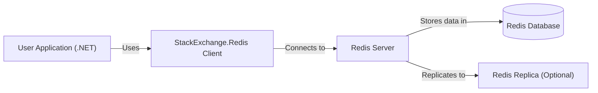
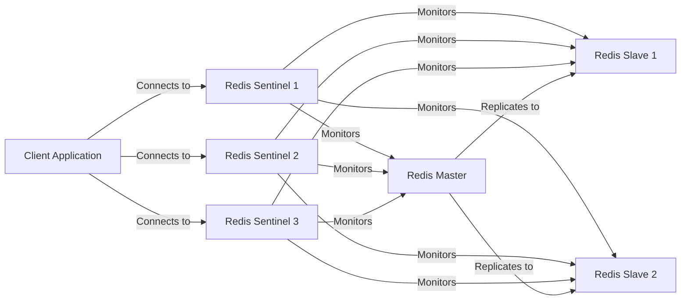
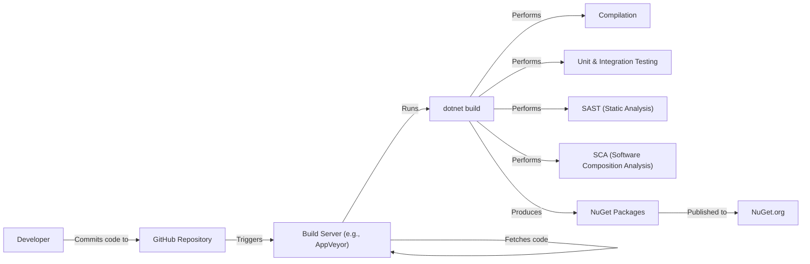

Okay, let's create a design document for the StackExchange.Redis project.

# BUSINESS POSTURE

Business Priorities and Goals:

*   Provide a high-performance, robust, and reliable Redis client for .NET applications.
*   Enable efficient interaction with Redis servers for caching, session management, pub/sub messaging, and other Redis-based features.
*   Offer a user-friendly API that simplifies Redis usage for developers.
*   Maintain compatibility with various Redis server versions and configurations.
*   Ensure high availability and fault tolerance in Redis interactions.
*   Support synchronous and asynchronous operations for flexibility.
*   Provide comprehensive documentation and support to users.

Most Important Business Risks:

*   Data Breaches: Unauthorized access to sensitive data stored in Redis instances.
*   Service Disruptions: Outages or performance degradation of Redis-dependent applications due to client issues.
*   Data Loss: Loss of cached or persisted data due to client misconfiguration or errors.
*   Compatibility Issues: Inability to connect to or interact with specific Redis server versions or configurations.
*   Security Vulnerabilities: Exploitable weaknesses in the client library that could compromise Redis servers or applications.
*   Supply Chain Attacks: Malicious code introduced into the client library through compromised dependencies or build processes.

# SECURITY POSTURE

Existing Security Controls:

*   security control: TLS/SSL Support: The library supports encrypted connections to Redis servers using TLS/SSL, protecting data in transit. (Described in documentation and implemented in the connection management logic).
*   security control: Authentication: Supports Redis authentication mechanisms (passwords, ACLs) to control access to Redis instances. (Described in documentation and implemented in the connection establishment process).
*   security control: Connection Pooling: Manages a pool of connections to Redis servers, reducing the overhead of establishing new connections and improving performance. (Implemented in the connection management logic).
*   security control: Asynchronous Operations: Provides asynchronous methods for most operations, preventing blocking calls and improving application responsiveness. (Implemented throughout the library).
*   security control: Command Flags: Allows developers to specify command flags to control behavior, such as `CommandFlags.NoRedirect` to prevent automatic redirection to different Redis nodes. (Implemented in the command execution logic).
*   security control: Open Source: The library is open source, allowing for community review and contributions, which can help identify and address security vulnerabilities. (Available on GitHub).
*   security control: Regular Updates: The library is actively maintained, with regular updates and bug fixes, including security patches. (Available on NuGet).

Accepted Risks:

*   accepted risk: Limited Input Validation: The library primarily focuses on providing a low-level interface to Redis. While it performs some basic checks, it relies on developers to validate data sent to Redis.
*   accepted risk: Dependency on Third-Party Libraries: The library may depend on other third-party libraries, which could introduce their own security vulnerabilities.

Recommended Security Controls:

*   security control: Implement robust input sanitization and validation mechanisms within the library to mitigate the risk of command injection attacks.
*   security control: Integrate with security scanning tools (SAST, DAST, SCA) in the CI/CD pipeline to identify and address vulnerabilities early in the development lifecycle.
*   security control: Provide clear guidance and best practices for secure usage of the library, including recommendations for data encryption, access control, and input validation.
*   security control: Implement a mechanism for reporting security vulnerabilities and a process for timely patching and disclosure.
*   security control: Consider adding support for more advanced security features, such as client-side field-level encryption.

Security Requirements:

*   Authentication:
    *   Support Redis password authentication.
    *   Support Redis ACLs (Access Control Lists).
    *   Support TLS/SSL for secure connections.
    *   Provide options for configuring connection timeouts and retries.

*   Authorization:
    *   Leverage Redis's built-in authorization mechanisms (ACLs).
    *   Provide guidance on configuring appropriate permissions for different users and applications.

*   Input Validation:
    *   Sanitize user inputs to prevent command injection vulnerabilities.
    *   Validate data types and formats to ensure they are compatible with Redis commands.

*   Cryptography:
    *   Support TLS/SSL for encrypting data in transit.
    *   Provide options for configuring cipher suites and TLS versions.
    *   Consider supporting client-side encryption for sensitive data stored in Redis.

# DESIGN

## C4 CONTEXT

Context Diagram Element List:

*   Element:
    *   Name: User Application (.NET)
    *   Type: Software System
    *   Description: A .NET application that utilizes the StackExchange.Redis client library to interact with Redis.
    *   Responsibilities: Initiates requests to Redis, processes responses, handles data serialization/deserialization.
    *   Security controls: Implements application-level security controls, such as input validation, authentication, and authorization.

*   Element:
    *   Name: StackExchange.Redis Client
    *   Type: Library
    *   Description: The .NET client library for interacting with Redis.
    *   Responsibilities: Provides an API for connecting to Redis, sending commands, receiving responses, managing connections, and handling errors.
    *   Security controls: Supports TLS/SSL, authentication, connection pooling.

*   Element:
    *   Name: Redis Server
    *   Type: Software System
    *   Description: The Redis server instance.
    *   Responsibilities: Stores data, processes commands, manages replication, and handles client connections.
    *   Security controls: Implements Redis security features, such as password authentication, ACLs, and TLS/SSL.

*   Element:
    *   Name: Redis Database
    *   Type: Database
    *   Description: The in-memory data store within the Redis server.
    *   Responsibilities: Stores data in various data structures (strings, lists, sets, hashes, etc.).
    *   Security controls: Data is protected by Redis server security controls.

*   Element:
    *   Name: Redis Replica (Optional)
    *   Type: Software System
    *   Description: A replica of the Redis server for high availability and read scaling.
    *   Responsibilities: Replicates data from the primary Redis server, handles read requests.
    *   Security controls: Inherits security controls from the primary Redis server.

## C4 CONTAINER

```mermaid
graph LR
    UserApp["User Application (.NET)"] -- Uses --> SE.Redis["StackExchange.Redis"]
    SE.Redis -- Connects to --> ConnectionMultiplexer["ConnectionMultiplexer"]
    ConnectionMultiplexer -- Manages --> ConnectionPool["Connection Pool"]
    ConnectionPool -- Creates --> RedisConnection["Redis Connection"]
    RedisConnection -- Sends/Receives --> RedisServer["Redis Server"]

```

Container Diagram Element List:

*   Element:
    *   Name: User Application (.NET)
    *   Type: Software System
    *   Description: A .NET application that utilizes the StackExchange.Redis client library.
    *   Responsibilities: Initiates requests to Redis, processes responses, handles data serialization/deserialization.
    *   Security controls: Implements application-level security controls.

*   Element:
    *   Name: StackExchange.Redis
    *   Type: Library
    *   Description: The .NET client library for interacting with Redis.
    *   Responsibilities: Provides an API for connecting to Redis, sending commands, receiving responses.
    *   Security controls: Supports TLS/SSL, authentication.

*   Element:
    *   Name: ConnectionMultiplexer
    *   Type: Class
    *   Description: The core class in StackExchange.Redis that manages connections to Redis servers.
    *   Responsibilities: Handles connection pooling, multiplexing requests, and managing failover.
    *   Security controls: Implements TLS/SSL negotiation, authentication handling.

*   Element:
    *   Name: Connection Pool
    *   Type: Component
    *   Description: A pool of connections to Redis servers managed by the ConnectionMultiplexer.
    *   Responsibilities: Maintains a set of active connections, reuses connections to reduce overhead.
    *   Security controls: Connections within the pool inherit security settings from the ConnectionMultiplexer.

*   Element:
    *   Name: Redis Connection
    *   Type: Class
    *   Description: Represents a single connection to a Redis server.
    *   Responsibilities: Sends commands to Redis, receives responses, handles network communication.
    *   Security controls: Uses TLS/SSL if configured, performs authentication.

*   Element:
    *   Name: Redis Server
    *   Type: Software System
    *   Description: The Redis server instance.
    *   Responsibilities: Stores data, processes commands, manages replication, and handles client connections.
    *   Security controls: Implements Redis security features.

## DEPLOYMENT

Possible Deployment Solutions:

1.  Standalone Redis Server: A single Redis server instance running on a dedicated machine or virtual machine.
2.  Redis Sentinel: A distributed system that monitors Redis instances and automatically performs failover if the primary server goes down.
3.  Redis Cluster: A distributed system that shards data across multiple Redis nodes, providing high availability and scalability.
4.  Cloud-Based Redis Services: Managed Redis services offered by cloud providers like AWS (ElastiCache), Azure (Cache for Redis), and GCP (Memorystore).

Chosen Deployment Solution (Example: Redis Sentinel):

Deployment Diagram Element List:

*   Element:
    *   Name: Client Application
    *   Type: Software System
    *   Description: The application using StackExchange.Redis to connect to Redis.
    *   Responsibilities: Initiates connections, sends commands, processes responses.
    *   Security controls: Application-level security controls.

*   Element:
    *   Name: Redis Sentinel 1, 2, 3
    *   Type: Software System
    *   Description: Redis Sentinel instances that monitor the Redis master and slaves.
    *   Responsibilities: Monitors Redis instances, performs automatic failover, provides service discovery.
    *   Security controls: Can be configured with TLS/SSL and authentication.

*   Element:
    *   Name: Redis Master
    *   Type: Software System
    *   Description: The primary Redis server instance.
    *   Responsibilities: Handles read and write requests, replicates data to slaves.
    *   Security controls: Redis server security features (password, ACLs, TLS/SSL).

*   Element:
    *   Name: Redis Slave 1, 2
    *   Type: Software System
    *   Description: Redis slave instances that replicate data from the master.
    *   Responsibilities: Replicates data, handles read requests (if configured).
    *   Security controls: Inherits security controls from the master.

## BUILD

The StackExchange.Redis project uses a standard .NET build process.

Build Process Diagram:

Build Process Description:

1.  Developers commit code changes to the GitHub repository.
2.  A build server (e.g., AppVeyor, GitHub Actions) is triggered by the commit.
3.  The build server fetches the latest code from the repository.
4.  The `dotnet build` command is executed.
5.  Compilation: The .NET compiler compiles the code into assemblies.
6.  Testing: Unit and integration tests are executed to verify the functionality of the code.
7.  SAST (Static Analysis): A static analysis tool (e.g., SonarQube) is run to identify potential security vulnerabilities and code quality issues.
8.  SCA (Software Composition Analysis): A SCA tool is run to identify vulnerabilities in third-party dependencies.
9.  NuGet Packages: The build process creates NuGet packages containing the compiled assemblies and other necessary files.
10. NuGet Packages are published to NuGet.org.

Security Controls in Build Process:

*   security control: SAST (Static Application Security Testing): Static analysis tools are used to scan the code for potential security vulnerabilities.
*   security control: SCA (Software Composition Analysis): Scans are performed to identify known vulnerabilities in third-party dependencies.
*   security control: Automated Build: The build process is automated, ensuring consistency and reducing the risk of manual errors.
*   security control: Code Reviews: Code changes are reviewed by other developers before being merged into the main branch.
*   security control: Signed NuGet Packages: NuGet packages can be digitally signed to ensure their integrity and authenticity.

# RISK ASSESSMENT

Critical Business Processes:

*   Caching: Storing frequently accessed data in Redis to improve application performance and reduce database load.
*   Session Management: Storing user session data in Redis to maintain state across multiple web servers.
*   Pub/Sub Messaging: Using Redis as a message broker for real-time communication between different parts of an application or between different applications.
*   Real-time Analytics: Using Redis data structures to store and process real-time data for analytics and reporting.
*   Distributed Locking: Using Redis to implement distributed locks to coordinate access to shared resources.

Data Sensitivity:

*   Session Data: May contain sensitive user information, such as authentication tokens, user IDs, and personal preferences. (Sensitivity: High)
*   Cached Data: May contain sensitive business data, such as product catalogs, pricing information, or customer data. (Sensitivity: Variable, depending on the data being cached)
*   Pub/Sub Messages: May contain sensitive data being exchanged between different parts of an application. (Sensitivity: Variable, depending on the message content)
*   Analytics Data: May contain sensitive information about user behavior or business operations. (Sensitivity: Variable, depending on the data being analyzed)

# QUESTIONS & ASSUMPTIONS

Questions:

*   What specific Redis deployment architecture(s) are most commonly used by users of StackExchange.Redis? (This will help prioritize security considerations for different deployment scenarios.)
*   What are the most common use cases for StackExchange.Redis? (This will help focus on the security requirements for those specific use cases.)
*   Are there any specific compliance requirements (e.g., PCI DSS, HIPAA) that users of StackExchange.Redis need to adhere to?
*   What level of security expertise can be assumed for the average user of StackExchange.Redis? (This will influence the level of detail and guidance provided in security documentation.)
*   What is the current process for handling security vulnerabilities reported in StackExchange.Redis?

Assumptions:

*   BUSINESS POSTURE: Users of StackExchange.Redis prioritize performance and reliability, but also require a reasonable level of security.
*   SECURITY POSTURE: Users are responsible for securing their Redis servers and the data stored within them. StackExchange.Redis provides the necessary tools (TLS/SSL, authentication) to enable secure communication, but it is the user's responsibility to configure and use them correctly.
*   DESIGN: The primary deployment model is a managed Redis service or a Redis Sentinel setup for high availability. Users are familiar with basic Redis concepts and security best practices. The build process is secure and includes static analysis and dependency scanning.